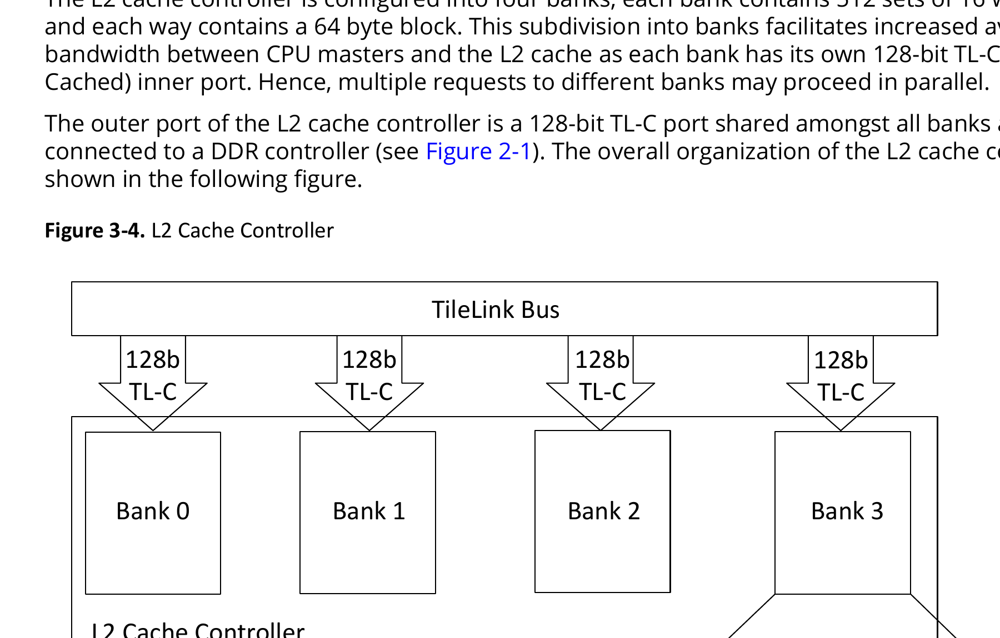
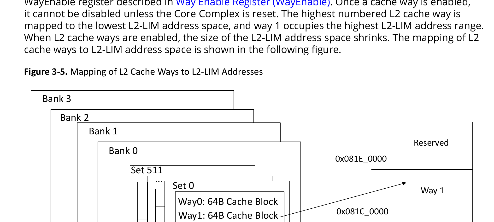
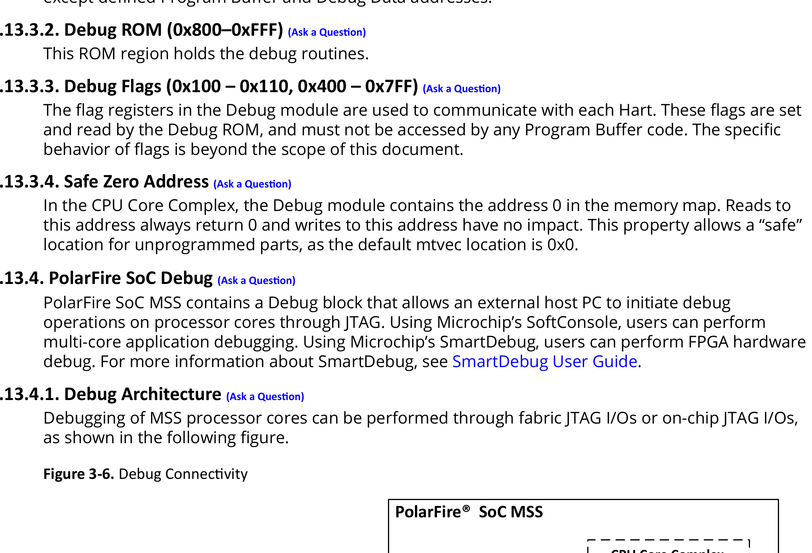
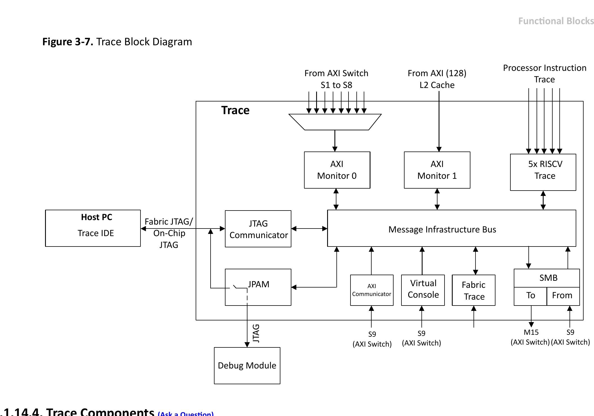
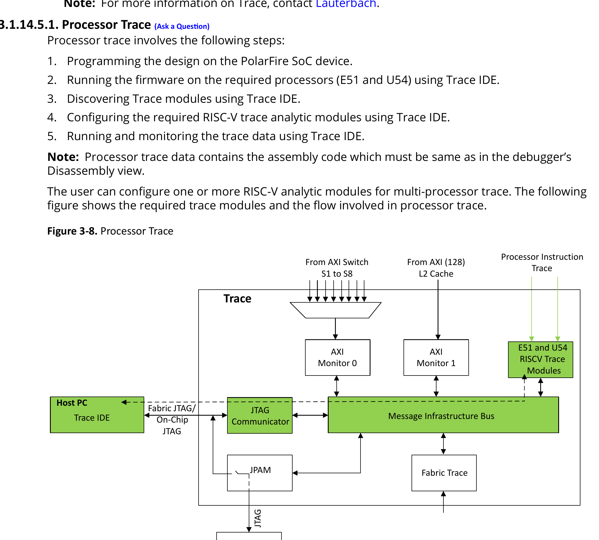
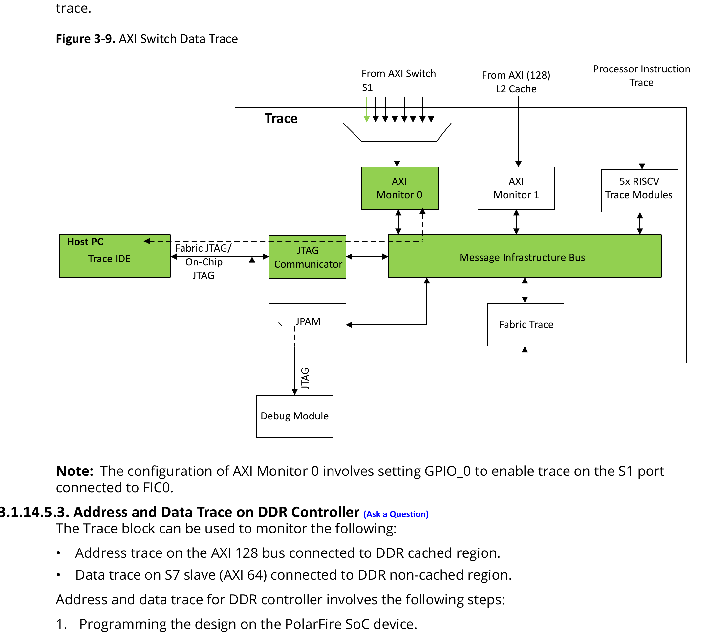
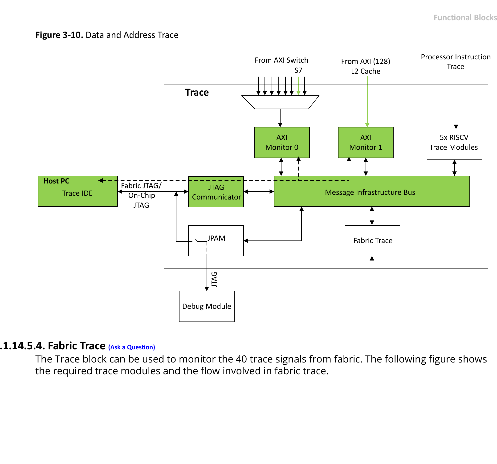
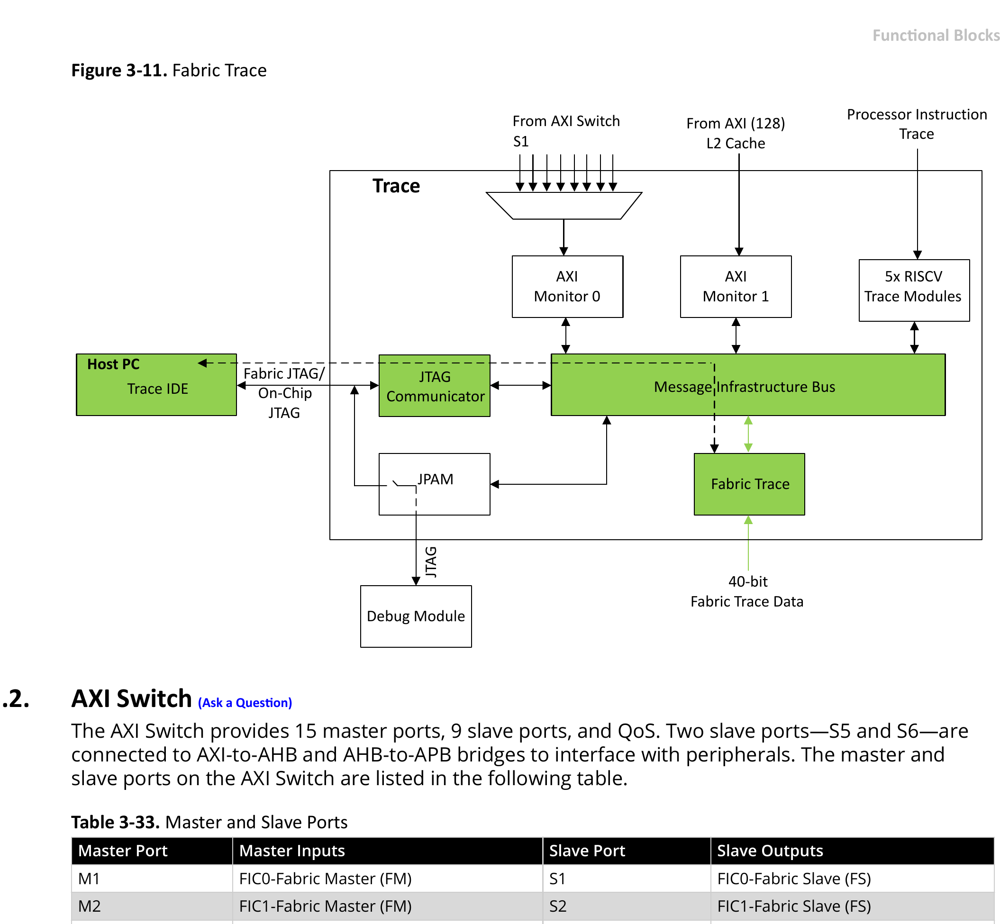
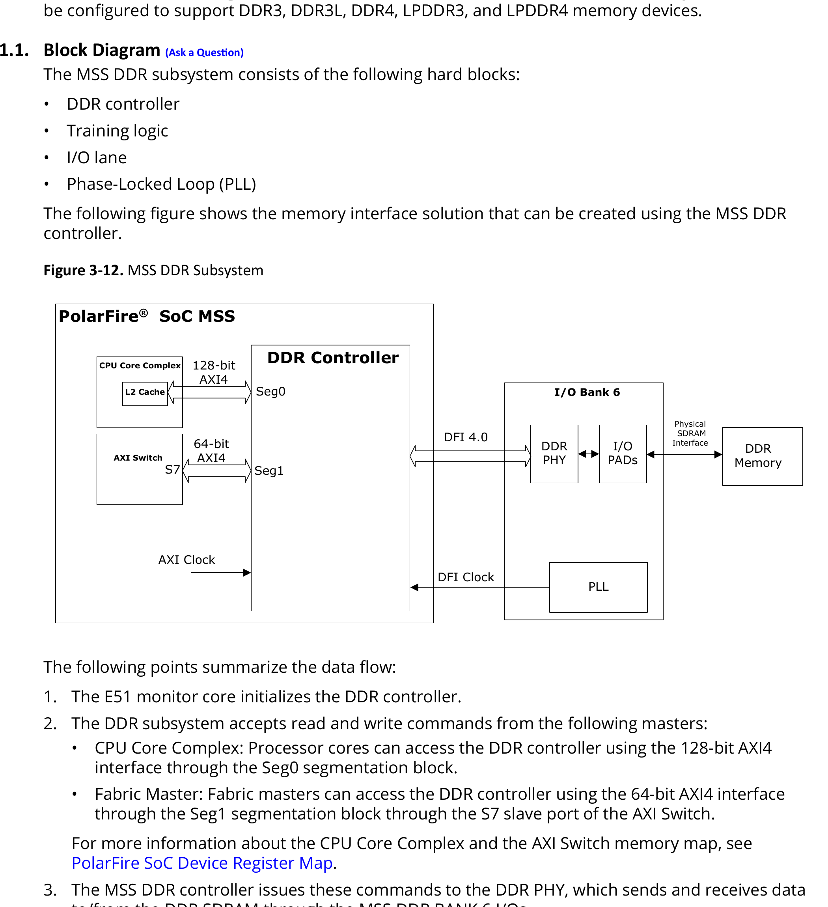

# 3. Functional Blocks
<!-- page 9 -->
Functional Blocks

3.         Functional Blocks (Ask a Question)
           This section describes functional blocks of PolarFire SoC MSS.

3.1.       CPU Core Complex (Ask a Question)
3.1.1.     E51 RISC-V ® Monitor Core (Ask a Question)
           The following table describes the features of E51.

           Table 3-1. E51 RISC-V Monitor Core Features
           Feature                                  Description
           ISA                                      RV64IMAC
           iCache/ITIM                              16 KB 2-way set-associative/8 KB ITIM
           DTIM                                     8 KB
           ECC Support                              Single-Error Correction and Double-Error Detection (SECDED) on iCache and
                                                    DTIM.
           Modes                                    Machine Mode, User Mode

           Typically, in a system, the E51 is used to execute the following:
           •   Bootloader to boot the operating system on U54 cores
           •   Bare-metal user applications
           •   Monitoring user applications on U54 cores
           Note: Load-Reserved and Store-Conditional atomic instructions (lr, sc) are not supported on the E51
           processor core.
3.1.1.1. Instruction Fetch Unit (Ask a Question)
           The instruction fetch unit consists of a 2-way set-associative 16 KB instruction cache that supports
           64-byte cache line size with an access latency of one clock cycle. The instruction cache is
           asynchronous with the data cache. Writes to memory can be synchronized with the instruction
           fetch stream using the FENCE.I instruction.
3.1.1.2. Execution Pipeline (Ask a Question)
           The E51 execution unit is a single-issue, in-order core with 5-stage execution pipeline. The pipeline
           comprises following five stages:
           1. Instruction fetch
           2. Instruction decode and register fetch
           3. Execution
           4. Data memory access
           5. Register write back.
           The pipeline has a peak execution rate of one instruction per clock cycle.
3.1.1.3. ITIM (Ask a Question)
           The 16 KB iCache can be partially reconfigured into 8 KB ITIM. The 8 KB ITIM address range is listed
           in Table 10-1. ITIM is allocated in quantities of cache blocks, so it is not necessary to use the entire 8
           KB as ITIM. Based on the requirement, part of the iCache can be configured as 2-way set associative
           and part of the cache can be configured as ITIM.
3.1.1.4. DTIM (Ask a Question)
           E51 includes an 8 KB DTIM, the address range of the DTIM is listed in Table 10-1. The DTIM has an
           access latency of two clock cycles for full words and three clock cycles for smaller words. Misaligned
           accesses are not supported in hardware and result in a trap.

                                                     Technical Reference Manual                                      DS60001702Q - 9
                                         © 2025 Microchip Technology Inc. and its subsidiaries

---

<!-- page 10 -->
Functional Blocks

3.1.1.5. Hardware Performance Monitor (Ask a Question)
         The CSRs described in the following table implement the hardware performance monitoring
         scheme.

         Table 3-2. Hardware Performance Monitoring CSRs
         CSR                       Function
         mcycle                    Holds a count of the number of clock cycles executed by a Hart since some arbitrary time in the
                                   past. The arbitrary time is the time since power-up.
         minstret                  Holds a count of the number of instructions retired by a Hart since some arbitrary time in the
                                   past. The arbitrary time is the time since power-up.
         mhpmevent3 and            Event Selectors: Selects the events as described in Table 3-3, and increments the corresponding
         mhpmevent4                mhpmcounter3 and mhpmcounter4 counters.
                                   The event selector register mhpmevent3 and mhpmevent4 are partitioned into two fields: event
                                   class and event mask as shown in Table 3-3.
                                   The lower 8 bits select an event class, and the upper bits form a mask of events in that class. The
                                   counter increments if the event corresponding to any set mask bit occurs.
                                   For example, if mhpmevent3 is set to 0x4200, mhpmcounter3 increments when either a load
                                   instruction or a conditional branch instruction retires.
                                   Note: In-flight and recently retired instructions may or may not be reflected when reading or
                                   writing the performance counters, or writing the event selectors.

         mhpmcounter3 and          40-bit event counters
         mhpmcounter4

         Table 3-3. mhpmeventx Register
         Event Class                                                      mhpmeventx[8:18] Bit Field Description Events
         mhpmeventx[7:0] = 0: Instruction Commit Events                   8: Exception taken
                                                                          9: Integer load instruction retired
                                                                          10: Integer store instruction retired
                                                                          11: Atomic memory operation retired
                                                                          12: System instruction retired
                                                                          13: Integer arithmetic instruction retired
                                                                          14: Conditional branch retired
                                                                          15: JAL instruction retired
                                                                          16: JALR instruction retired
                                                                          17: Integer multiplication instruction retired
                                                                          18: Integer division instruction retired

         mhpmeventx[7:0] = 1: Micro-architectural Events                  8: Load-use interlock
                                                                          9: Long-latency interlock
                                                                          10: CSR read interlock
                                                                          11: Instruction cache/ITIM busy
                                                                          12: Data cache/DTIM busy
                                                                          13: Branch direction misprediction
                                                                          14: Branch/jump target misprediction
                                                                          15: Pipeline flush from CSR write
                                                                          16: Pipeline flush from other event
                                                                          17: Integer multiplication interlock

                                                      Technical Reference Manual                                           DS60001702Q - 10
                                         © 2025 Microchip Technology Inc. and its subsidiaries

---

<!-- page 11 -->
Functional Blocks

           Table 3-3. mhpmeventx Register (continued)
           Event Class                                                      mhpmeventx[8:18] Bit Field Description Events
           mhpmeventx[7:0] = 2: Memory System Events                        8: Instruction cache miss
                                                                            9: Memory-mapped I/O access
                                                                            10: Data cache write back
                                                                            11: Instruction TLB miss
                                                                            12: Data TLB miss
                                                                            Note: Only L1 cache performance monitoring is
                                                                            supported.

3.1.1.6. ECC (Ask a Question)
           By default, the E51 iCache and DTIM implement SECDED for ECC. The granularity at which this
           protection is applied (the codeword) is 32-bit (with an ECC overhead of 7 bits per codeword). The
           ECC feature of L1 cache is handled internally, user control is not supported.
           When a single-bit error is detected in the L1 iCache, the error is corrected automatically, and the
           cache line is flushed and written back to the next level of memory hierarchy. When a single bit error
           is detected in the L1 DTIM, the error is corrected automatically and written back to L1 DTIM.
3.1.1.6.1. ECC Reporting (Ask a Question)
           ECC events are reported by the BEU block for a given core. The BEU can be configured to generate
           interrupts either globally through the Platform-Level Interrupt Controller (PLIC) or locally to the
           specific Hart where the ECC event occurred. When BEU interrupts are enabled, software can be used
           to monitor and count ECC events.
           To detect uncorrectable ECC errors in the L1 cache memories, interrupts must be enabled in the
           BEU. The BEU must be configured to generate a local interrupt to halt the execution of a Hart when
           an uncorrectable instruction is detected. For more information about configuring ECC reporting, see
           Bus Error Unit (BEU).

3.1.2.     U54 RISC-V Application Cores (Ask a Question)
           The following table describes the features of the U54 application cores.

           Table 3-4. U54 RISC-V Application Cores Features
           Feature                                            Description
           ISA                                                RV64GC (1)
           iCache/ITIM                                        32 KB 8-way set-associative/28 KB ITIM
           dCache                                             32 KB 8-way set-associative
           ECC Support                                        ECC on iCache, ITIM, and dCache
           MMU                                                40-bit MMU compliant with Sv39
           Modes                                              Machine mode, Supervisor mode, and User mode

           Note:
           1. In RV64GC, “G” = “IMAFD”.
           Typically, in a system, the U54 cores are used to execute any of the following:
           •   Bare-metal user applications
           •   Operating systems
           Note: Load-Reserved and Store-Conditional atomic instructions (lr, sc) are supported on U54
           processor cores.

                                                       Technical Reference Manual                                    DS60001702Q - 11
                                         © 2025 Microchip Technology Inc. and its subsidiaries

---

<!-- page 12 -->
Functional Blocks

3.1.2.1. Instruction Fetch Unit (Ask a Question)
           The instruction fetch unit consists of an 8-way set-associative 32 KB iCache/28 KB ITIM that supports
           64-byte cache line size with an access latency of one clock cycle. The U54s implement the standard
           Compressed (C) extension of the RISC-V architecture which allows 16-bit RISC-V instructions.
3.1.2.2. Execution Pipeline (Ask a Question)
           The U54 execution unit is a single-issue, in-order core with 5-stage execution pipeline. The pipeline
           comprises following five stages:
           1. Instruction fetch
           2. Instruction decode and register fetch
           3. Execution
           4. Data memory access
           5. Register write back.
           The pipeline has a peak execution rate of one instruction per clock cycle, and is fully bypassed so
           that most instructions have a one-cycle result latency.
           Most CSR writes result in a pipeline flush with a five-cycle latency.
3.1.2.3. Instruction Cache (Ask a Question)
           The iCache memory consists of a dedicated 32 KB 8-way set-associative, Virtually Indexed Physically
           Tagged (VIPT) instruction cache memory with a line size of 64 bytes. The access latency of any
           block in the iCache is one clock cycle. iCache is not coherent with the platform memory system.
           Writes to iCache must be synchronized with the instruction fetch stream by executing the FENCE.I
           instruction.
           A cache line fill triggers a burst access outside the CPU Core Complex. The U54 processor core
           caches instructions from executable addresses, with the exception of ITIM. See CPU Memory Map
           for all executable address regions, which are denoted by the attribute X. Trying to execute an
           instruction from a non-executable address results in a trap.
3.1.2.4. ITIM (Ask a Question)
           iCache can be partially configured as ITIM, which occupies a 28 KB of address range in CPU Memory
           Map. ITIM provides high-performance, predictable instruction delivery. Fetching an instruction from
           ITIM is as fast as an iCache hit, without any cache misses. ITIM can hold data and instructions. Load
           and store operations to ITIM are not as efficient as load and store operations to E51 DTIM.
           The iCache can be configured as ITIM for any ways in units of cache lines (64 B bytes). A single
           iCache way must remain as instruction cache. ITIM is allocated simply by storing to it. A store to the
           nth byte of the ITIM memory map reallocates the first (n + 1) bytes of iCache as ITIM, rounded up to
           the next cache line.
           ITIM can be deallocated by storing zero to the first byte after the ITIM region, that is 28 KB after the
           base address of ITIM as indicated in CPU Memory Map. The deallocated ITIM space is automatically
           returned to iCache.
           Software must clear the contents of ITIM after allocating it. It is unpredictable whether ITIM contents
           are preserved between deallocation and allocation.
3.1.2.5. Data Cache (Ask a Question)
           The U54 dCache has an 8-way set-associative 32 KB write-back, VIPT data cache memory with a line
           size of 64 bytes. Access latency is two clock cycles for words and double-words, and three clock
           cycles for smaller quantities. Misaligned accesses are not supported in hardware and result in a
           trap. dCache is kept coherent with a directory-based cache coherence manager, which resides in the
           L2 cache.
           Stores are pipelined and committed on cycles where the data memory system is otherwise idle.
           Loads to addresses currently in the store pipeline result in a five-cycle latency.

                                                    Technical Reference Manual                           DS60001702Q - 12
                                        © 2025 Microchip Technology Inc. and its subsidiaries

---

<!-- page 13 -->
Functional Blocks

3.1.2.6. Atomic Memory Operations (Ask a Question)
           The U54 core supports the RISC-V standard Atomic (A) extension on regions of the Memory Map
           denoted by the attribute A in CPU Memory Map. Atomic memory operations to regions that do not
           support them generate an access exception precisely at the core.
           The load-reserved and store-conditional instructions are only supported on cached regions, hence
           generate an access exception on DTIM and other uncached memory regions.
           See The RISC-V Instruction Set Manual, Volume I: User-Level ISA, Version 2.1 for more information
           on the instructions added by this extension.
3.1.2.7. Floating Point Unit (Ask a Question)
           The U54 FPU provides full hardware support for the IEEE ® 754-2008 floating-point standard for
           32-bit single-precision and 64-bit double-precision arithmetic. The FPU includes a fully pipelined
           fused-multiply-add unit and an iterative divide and square-root unit, magnitude comparators, and
           float-to-integer conversion units, all with full hardware support for subnormals and all IEEE default
           values.
3.1.2.8. MMU (Ask a Question)
           The U54 has support for virtual memory using a Memory Management Unit (MMU). The MMU
           supports the Bare and Sv39 modes as described in The RISC-V Instruction Set Manual, Volume II:
           Privileged Architecture, Version 1.10.
           The U54 MMU has a 39-bit virtual address space mapped to a 48-bit physical address space. A
           hardware page-table walker refills the address translation caches. Both instruction and data address
           translation caches are fully associative, and have 32 entries. The MMU supports 2 MB megapages
           and 1 GB gigapages to reduce translation overheads for large contiguous regions of virtual and
           physical address space.
           U54 cores do not automatically set the Accessed (A) and Dirty (D) bits in a Sv39 PTE. The U54 MMU
           raises a page fault exception for a read to a page with PTE.A=0 or a write to a page with PTE.D=0.
3.1.2.9. ECC (Ask a Question)
           By default, the iCache, ITIM, and dCache implement SECDED for ECC. ECC is applied at the 32-bit
           codeword level, with an ECC overhead of 7 bits per codeword. The ECC feature of L1 cache is
           handled internally, user control is not supported.
           When a single-bit error is detected in the ITIM, the error is corrected automatically and written back
           to the SRAM. When a single-bit error is detected in the L1 instruction cache, the error is corrected
           automatically and the cache line is flushed. When a single-bit error is detected in the L1 data cache,
           the data cache automatically implements the following sequence of operations:
           1. Corrects the error.
           2. Invalidates the cache line.
           3. Writes the line back to the next level of the memory hierarchy.
           The ECC reporting scheme is same as described in ECC Reporting.
3.1.2.10. Hardware Performance Monitor (Ask a Question)
           The scheme is same as described in Hardware Performance Monitor.

3.1.3.     CPU Memory Map (Ask a Question)
           The overall physical memory map of the CPU Core Complex is shown in MSS Memory Map. The CPU
           Core Complex is configured with a 38-bit physical address space.

3.1.4.     Physical Memory Protection (Ask a Question)
           Exclusive access to memory regions for a processor core (Hart) can be enabled by configuring its
           PMP registers. Each Hart supports a Physical Memory Protection (PMP) unit with 16 PMP regions.

                                                    Technical Reference Manual                        DS60001702Q - 13
                                        © 2025 Microchip Technology Inc. and its subsidiaries

---

<!-- page 14 -->
Functional Blocks

         The PMP unit in each processor core includes the following control and status registers (CSRs) to
         enable the PMP:
         •    PMP Configuration Register (pmpcfg)– used for setting privileges (R, W, and X) for each PMP
              region.
         •    PMP Address Register (pmpaddr)– used for setting the address range for each PMP region.

                 Important: For more information on configuring PMP, see the example project in
                 GitHub.

3.1.4.1. PMP Configuration Register (pmpcfg) (Ask a Question)
         pmpcfg0 and pmpcfg2 support eight PMP regions each as shown in Figure 3-1. These two registers
         hold the configurations for the 16 PMP regions. Each PMP region is referred as pmpicfg. In
         pmpicfg, i ranges from 0 to 15 (pmp0cfg, pmp1cfg … pmp15cfg). PolarFire SoC supports RV64.
         For RV64, pmpcfg1 and pmpcfg3 are not used.

         Figure 3-1. RV64 PMP Configuration CSR Layout

         Figure 3-2 shows the layout of a pmpicfg register. The R, W, and X bits, when set, indicate that
         the PMP entry permits read, write, and instruction execution, respectively. When one of these bits
         is cleared, the corresponding access type is denied. The Address-Matching (A) field encodes the
         Address-Matching mode of the associated PMP address register. The Locking and Privilege mode (L)
         bit indicates that the PMP entry is locked.

         Figure 3-2. PMP Configuration Register Format

         The A field in a PMP entry's configuration register encodes the address-matching mode of the
         associated PMP address register. When A=0, this PMP entry is disabled and matches no addresses.
         Three address-matching modes are supported—Top of Range (TOR), naturally aligned four-byte
         regions (NA4), naturally aligned power-of-two regions (NAPOT) as listed in the following table.

         Table 3-5. Encoding of A field in PMP Configuration Registers
          Address Matching   Name                              Description
          0                  OFF                               No region (disabled)
          1                  TOR                               Top of range
          2                  NA4                               Naturally aligned four-byte region
          3                  NAPOT                             Naturally aligned power-of-two region, ≥ 8 bytes

         NAPOT ranges make use of the low-order bits of the associated address register to encode the size
         of the range, as listed in Table 3-6.

                                                    Technical Reference Manual                                      DS60001702Q - 14
                                        © 2025 Microchip Technology Inc. and its subsidiaries

---

<!-- page 15 -->
Functional Blocks

         Table 3-6. NAPOT Range Encoding
          pmpaddr                    pmpcfg.A Value                   Match Type and Size
          (Binary)

          aaaa…aaaa                  NA4                              4-byte NAPOT range
          aaaa…aaa0                  NAPOT                            8-byte NAPOT range
          aaaa…aa01                  NAPOT                            16-byte NAPOT range
          aaaa…a011                  NAPOT                            32-byte NAPOT range
          ...                        ...                              ...
          aa01…1111                  NAPOT                            2XLEN-byte NAPOT range
          a011…1111                  NAPOT                            2XLEN+1byte NAPOT range
          0111…1111                  NAPOT                            2XLEN+2byte NAPOT range

3.1.4.1.1. Locking and Privilege Mode (Ask a Question)
         The L bit indicates that the PMP entry is locked, that is, writes to the Configuration register (pmpicfg)
         and associated address registers (pmpaddr) are ignored. Locked PMP entries can only be unlocked
         with a system reset. In addition to locking the PMP entry, the L bit indicates whether the R/W/X
         permissions are enforced on Machine (M) mode accesses. When the L bit is set, these permissions
         are enforced for all privilege modes. When the L bit is clear, any M-mode access matching the PMP
         entry succeeds; the R/W/X permissions apply only to Supervisor (S) and User (U) modes.
3.1.4.2. PMP Address Register (pmpaddr) (Ask a Question)
         The PMP address registers are CSRs named from pmpaddr0 to pmpaddr15. Each PMP address
         register encodes the bits [55:2] of a 56-bit physical address as shown in the following figure.

         Figure 3-3. RV64 PMP Address Register Format

         Note: Bits [1:0] of PMP address region are not considered because minimum granularity is four
         bytes.
         For more information about the RISC-V physical memory protection, see The RISC-V Instruction Set
         Manual, Volume II: Privileged Architecture, Version 1.10.

3.1.5.   L2 Cache (Ask a Question)
         The shared 2 MB L2 cache is divided into four address-interleaved banks to improve performance.
         Each bank is 512 KB in size, and is a 16-way set-associative cache. The L2 also supports runtime
         reconfiguration between cache and scratchpad RAM.

3.1.6.   L2 Cache Controller (Ask a Question)
         The L2 cache controller offers extensive flexibility as it allows for several features in addition to
         the Level 2 cache functionality such as memory-mapped access to L2 cache RAM for disabled
         cache ways, scratchpad functionality, way masking and locking, and ECC support with error tracking
         statistics, error injection, and interrupt signaling capabilities.

                Important: L2 cache controller supports single-bit ECC through ECC registers.
                Dual-bit ECC is implemented by default and is not visible to the user.

                                                       Technical Reference Manual                     DS60001702Q - 15
                                           © 2025 Microchip Technology Inc. and its subsidiaries

---

<!-- page 16 -->
Functional Blocks

3.1.6.1. Functional Description (Ask a Question)
         The L2 cache controller is configured into four banks, each bank contains 512 sets of 16 ways
         and each way contains a 64 byte block. This subdivision into banks facilitates increased available
         bandwidth between CPU masters and the L2 cache as each bank has its own 128-bit TL-C (TileLink
         Cached) inner port. Hence, multiple requests to different banks may proceed in parallel.
         The outer port of the L2 cache controller is a 128-bit TL-C port shared amongst all banks and
         connected to a DDR controller (see Figure 2-1). The overall organization of the L2 cache controller is
         shown in the following figure.

         Figure 3-4. L2 Cache Controller

                                                     TileLink Bus
                  128b                     128b                       128b                         128b
                  TL-C                     TL-C                       TL-C                         TL-C

                 Bank 0                Bank 1                        Bank 2                        Bank 3

              L2 Cache Controller
                                              128b
                                              TL-C

                                                                          Bank 3

                                                                           Set 511
                                                                                ...
                                                                                       Set 0
                                                                                        Way0: 64B Cache Block
                                                                                                      ...
                                                                                        Way14: 64B Cache Block
                                                                                        Way15: 64B Cache Block

3.1.6.1.1. Way Enable and the L2 LIM (Ask a Question)
         Similar to ITIM, L2 cache can be configured as LIM, or as a cache which is controlled by the L2 cache
         controller to contain a copy of any cacheable address.
         When cache ways are disabled, they are addressable in the L2-LIM address space in MSS Memory
         Map. Fetching instructions or data from the L2-LIM provides deterministic behavior equivalent to an
         L2 cache hit, with no possibility of a cache miss. Accesses to L2-LIM are always given priority over
         cache way accesses which target the same L2 cache bank.

                                                       Technical Reference Manual                                DS60001702Q - 16
                                           © 2025 Microchip Technology Inc. and its subsidiaries

---

<!-- page 17 -->
Functional Blocks

         After reset, all ways are disabled, except way0. Cache ways can be enabled by writing to the
         WayEnable register described in Way Enable Register (WayEnable). Once a cache way is enabled,
         it cannot be disabled unless the Core Complex is reset. The highest numbered L2 cache way is
         mapped to the lowest L2-LIM address space, and way 1 occupies the highest L2-LIM address range.
         When L2 cache ways are enabled, the size of the L2-LIM address space shrinks. The mapping of L2
         cache ways to L2-LIM address space is shown in the following figure.

         Figure 3-5. Mapping of L2 Cache Ways to L2-LIM Addresses

             Bank 3
                  Bank 2
                        Bank 1
                                                                                                           Reserved
                             Bank 0
                                                                                       0x081E_0000
                                   Set 511
                                        ...
                                              Set 0                                                          Way 1
                                               Way0: 64B Cache Block
                                               Way1: 64B Cache Block                    0x081C_0000

                                                        ...
                                              Way14: 64B Cache Block                                           ….

                                              Way15: 64B Cache Block                    0x0804_0000

                                                                                                           Way 14
                                                                                        0x0802_0000

                                                                                                            Way 15
                                                                                       0x0800_0000

3.1.6.1.2. Way Masking and Locking (Ask a Question)
         The L2 cache controller controls the amount of cache allocated to a CPU master using the WayMaskX
         register described in Way Mask Registers (WayMaskX). WayMaskX registers only affect allocations
         and reads can still occur to ways which are masked. To lock down specific cache ways, mask them
         in all WayMaskX registers. In this scenario, all masters will be able to read data in the locked cache
         ways but not be able to evict.
3.1.6.1.3. L2 Cache Power Control (Ask a Question)
         Shutdown controls are provided for the 2 MB L2 cache memory with configuration support for
         either 512 KB, 1 MB, or 1,512 KB of L2 cache. This enables less static power consumption. The
         following 4-bit control register is provided for shutting down L2 cache blocks.

         Table 3-7. L2 Cache Power Down
                        Register                                 Bits                                 Description
                L2_SHUTDOWN_CR (0x174)                           [3:0]                  Configured to shutdown L2 cache blocks
                                                                                                     of Bank 0 to 3

         The preceding 4-bit control register powers down L2 cache blocks as per the physical RAM
         construction represented in the following table. Each bank contains 512 KB, constructed from thirty
         two 2048x64 RAMs (cc_ram_x), where the size of each RAM is 16 KB.

                                                     Technical Reference Manual                                     DS60001702Q - 17
                                       © 2025 Microchip Technology Inc. and its subsidiaries

---

<!-- page 18 -->
Functional Blocks

                 Important: Actual RAM width is 72 bits as an additional 8 ECC bits are used per
                 64-bit word.

          Table 3-8. L2 RAM Shutdown
                      L2_SHUTDOWN_CR[3]          L2_SHUTDOWN_CR[2]           L2_SHUTDOWN_CR[1]   L2_SHUTDOWN_CR [0]
                            cc_ram_24                  cc_ram_16                   cc_ram_8           cc_ram_0
                            cc_ram_25                  cc_ram_17                   cc_ram_9           cc_ram_1
                            cc_ram_26                  cc_ram_18                   cc_ram_10          cc_ram_2
                            cc_ram_27                  cc_ram_19                   cc_ram_11          cc_ram_3
            Bank 0
                            cc_ram_28                  cc_ram_20                   cc_ram_12          cc_ram_4
                            cc_ram_29                  cc_ram_21                   cc_ram_13          cc_ram_5
                            cc_ram_30                  cc_ram_22                   cc_ram_14          cc_ram_6
                            cc_ram_31                  cc_ram_23                   cc_ram_15          cc_ram_7
                            cc_ram_24                  cc_ram_16                   cc_ram_8           cc_ram_0
                            cc_ram_25                  cc_ram_17                   cc_ram_9           cc_ram_1
                            cc_ram_26                  cc_ram_18                   cc_ram_10          cc_ram_2
                            cc_ram_27                  cc_ram_19                   cc_ram_11          cc_ram_3
            Bank 1
                            cc_ram_28                  cc_ram_20                   cc_ram_12          cc_ram_4
                            cc_ram_29                  cc_ram_21                   cc_ram_13          cc_ram_5
                            cc_ram_30                  cc_ram_22                   cc_ram_14          cc_ram_6
                            cc_ram_31                  cc_ram_23                   cc_ram_15          cc_ram_7
                            cc_ram_24                  cc_ram_16                   cc_ram_8           cc_ram_0
                            cc_ram_25                  cc_ram_17                   cc_ram_9           cc_ram_1
                            cc_ram_26                  cc_ram_18                   cc_ram_10          cc_ram_2
                            cc_ram_27                  cc_ram_19                   cc_ram_11          cc_ram_3
            Bank 2
                            cc_ram_28                  cc_ram_20                   cc_ram_12          cc_ram_4
                            cc_ram_29                  cc_ram_21                   cc_ram_13          cc_ram_5
                            cc_ram_30                  cc_ram_22                   cc_ram_14          cc_ram_6
                            cc_ram_31                  cc_ram_23                   cc_ram_15          cc_ram_7
                            cc_ram_24                  cc_ram_16                   cc_ram_8           cc_ram_0
                            cc_ram_25                  cc_ram_17                   cc_ram_9           cc_ram_1
                            cc_ram_26                  cc_ram_18                   cc_ram_10          cc_ram_2
                            cc_ram_27                  cc_ram_19                   cc_ram_11          cc_ram_3
            Bank 3
                            cc_ram_28                  cc_ram_20                   cc_ram_12          cc_ram_4
                            cc_ram_29                  cc_ram_21                   cc_ram_13          cc_ram_5
                            cc_ram_30                  cc_ram_22                   cc_ram_14          cc_ram_6
                            cc_ram_31                  cc_ram_23                   cc_ram_15          cc_ram_7

3.1.6.1.4. Scratchpad (Ask a Question)
          The L2 cache controller has a dedicated scratchpad address region which allows for allocation into
          the cache using an address range which is not memory backed. This address region is denoted as
          the L2 Zero Device in MSS Memory Map. Writes to the scratchpad region will allocate into cache
          ways which are enabled and not masked. Care must be taken with the scratchpad, as there is no
          memory backing this address space. Cache evictions from addresses in the scratchpad results in
          data loss.
          The main advantage of the L2 scratchpad over the L2-LIM is that it is a cacheable region allowing
          for data stored to the scratchpad to also be cached in a master’s L1 data cache resulting in faster
          access.

                                                     Technical Reference Manual                           DS60001702Q - 18
                                         © 2025 Microchip Technology Inc. and its subsidiaries

---

<!-- page 19 -->
Functional Blocks

          The recommended procedure for using the L2 Scratchpad is as follows:
          1. Use the WayEnable register to enable the desired cache ways.
          2. Designate a single master which will be allocated into the scratchpad. For this procedure,
             designate the master as Master S. All other masters (CPU and non-CPU) will be denoted as
             Masters X.
          3. Masters X: write to the WayMaskX register to mask all ways which are to be used for the
             scratchpad. This will prevent Masters X from evicting cache lines in the designated scratchpad
             ways.
          4. Master S: write to the WayMaskX register to mask all ways except the ways which are to be used
             for the scratchpad. At this point, Master S should only be able to allocate into the cache ways
             meant to be used as a scratchpad.
          5. Master S: write scratchpad data into the L2 Scratchpad address range (L2 Zero Device).
          6. Master S: Repeat steps 4 and 5 for each way to be used as scratchpad.
          7. Master S: Use the WayMaskX register to mask the scratchpad ways for Master S so that it cannot
             evict cache lines from the designated scratchpad ways.
          8. At this point, the scratchpad ways must contain the scratchpad data, with all masters able to
             read, write, and execute from this address space, and no masters able to evict the scratchpad
             contents.
3.1.6.1.5. L2 ECC (Ask a Question)
          The L2 cache controller supports ECC for Single-Error Correction and Double-Error Detection
          (SECDED). The cache controller also supports ECC for meta-data information (index and tag
          information) and can perform SECDED. The single-bit error injection is available for the user to
          control. Dual-bit error injection is handled internally without user control.
          Whenever a correctable error is detected, the caches immediately repair the corrupted bit and
          write it back to SRAM. This corrective procedure is completely invisible to the application software.
          However, the automatic write-back of the corrected data only occurs when the L2 is configured and
          used as L2 cache memory or scratchpad memory. In LIM mode, although SECDED occurs upon read,
          the automatic write-back of the single-bit corrected data is not supported.
          To support diagnostics, the cache records the address of the most recently corrected meta-data
          and data errors. Whenever a new error is corrected, a counter is incremented and an interrupt is
          raised. There are independent addresses, counters, and interrupts for correctable meta-data and
          data errors.
          DirError, DirFail, DataError, and DataFail signals are used to indicate that an L2 meta-data, data, or
          un-correctable L2 data error has occurred respectively. These signals are connected to the PLIC as
          described in Interrupt Sources and are cleared upon reading their respective count registers.
3.1.6.2. Register Map (Ask a Question)
          The L2 cache controller register map is described in the following table.

          Table 3-9. L2 Cache Controller Register Map
           Offset            Width       Attributes   Register Name                    Notes
           0x000             4B          RO           Config                           Information on the configuration of the L2 cache
           0x008             1B          RW           WayEnable                        Way enable register

                                                       Technical Reference Manual                                    DS60001702Q - 19
                                          © 2025 Microchip Technology Inc. and its subsidiaries

---

<!-- page 20 -->
Functional Blocks

          Table 3-9. L2 Cache Controller Register Map (continued)
          Offset             Width    Attributes    Register Name                      Notes
          0x040              4B       RW            ECCInjectError                     ECC error injection register
          0x100              8B       RO            ECCDirFixAddr                      Address of most recently corrected metadata error
          0x108              4B       RO            ECCDirFixCount                     Count of corrected metadata errors
          0x120              8B       RO            ECCDirFailAddr                     Address of most recent uncorrectable metadata error
          0x128              8B       RO            ECCDirFailCount                    Count of uncorrectable metadata errors
          0x140              8B       RO            ECCDataFixAddr                     Address of most recently corrected data error
          0x148              4B       RO            ECCDataFixCount                    Count of corrected data errors
          0x160              8B       RO            ECCDataFailAddr                    Address of most recent uncorrectable data error
          0x168              4B       RO            ECCDataFailCount                   Count of uncorrectable data errors

          0x200              8B       WO            Flush64                            Flush cache block, 64-bit address
          0x240              4B       WO            Flush32                            Flush cache block, 32-bit address

          0x800              8B       RW            Master 0 way mask register         DMA
          0x808              8B       RW            Master 1 way mask register         AXI4_front_port ID#0
          0x810              8B       RW            Master 2 way mask register         AXI4_front_port ID#1
          0x818              8B       RW            Master 3 way mask register         AXI4_front_port ID#2
          0x820              8B       RW            Master 4 way mask register         AXI4_front_port ID#3
          0x828              8B       RW            Master 5 way mask register         Hart 0 dCache MMIO
          0x830              8B       RW            Master 6 way mask register         Hart 0 iCache
          0x838              8B       RW            Master 7 way mask register         Hart 1 dCache
          0x840              8B       RW            Master 8 way mask register         Hart 1 iCache
          0x848              8B       RW            Master 9 way mask register         Hart 2 dCache
          0x850              8B       RW            Master 10 way mask register        Hart 2 iCache
          0x858              8B       RW            Master 11 way mask register        Hart 3 dCache
          0x860              8B       RW            Master 12 way mask register        Hart 3 iCache
          0x868              8B       RW            Master 13 way mask register        Hart 4 dCache
          0x870              8B       RW            Master 14 way mask register        Hart 4 ICache

3.1.6.3. Register Descriptions (Ask a Question)
          This section describes registers of the L2 cache controller. For more information, see PolarFire SoC
          Device Register Map.

3.1.6.3.1. Cache Configuration Register (Config) (Ask a Question)
          The Config register can be used to programmatically determine information regarding the cache.

          Table 3-10. Cache Configuration Register (Config)
          Register Offset              0x000
          Bits        Field Name       Attributes   Reset         Description
          [7:0]       Banks            RO           4             Return the number of banks in the cache
          [15:8]      Ways             RO           16            Return the total number of enabled ways in the cache
          [23:16]     Sets             RO           9             Return the Base-2 logarithm of the number of sets in a cache bank
          [31:24]     Bytes            RO           6             Return the Base-2 logarithm of the number of bytes in a cache
                                                                  blocks

3.1.6.3.2. Way Enable Register (WayEnable) (Ask a Question)
          The WayEnable register determines which ways of the L2 cache controller are enabled as cache.
          Cache ways which are not enabled, are mapped into the L2-LIM as described in MSS Memory Map.
          This register is initialized to 0 on reset and may only be increased. This means that, out of Reset,
          only a single L2 cache way is enabled as one cache way must always remain enabled. Once a cache
          way is enabled, the only way to map it back into the L2-LIM address space is by a Reset.

                                                        Technical Reference Manual                                      DS60001702Q - 20
                                        © 2025 Microchip Technology Inc. and its subsidiaries

---

<!-- page 21 -->
Functional Blocks

         Table 3-11. Way Enable Register(WayEnable)
          Register Offset                0x008
          Bits       Field Name          Attributes       Reset     Description
          [7:0]      Way Enable          RW               0         Way indexes less than or equal to this register value may be
                                                                    used by the cache
          [63:8]     Reserved            RW               —         —

3.1.6.3.3. ECC Error Injection Register (ECCInjectError) (Ask a Question)
         The ECCInjectError register can be used to insert an ECC error into either the backing data
         or meta-data SRAM. This function can be used to test error correction logic, measurement, and
         recovery.
         The ECC Error injection system works only during writes, which means that the stored data and ECC
         bits are modified on a write. ECC error is not injected or detected until a write occurs. Hence, a read
         will complete without ECC errors being detected if a write is not carried out after enabling the ECC
         error injection register.

         Table 3-12. ECC Error Injection Register (ECCInjectError)
          Register Offset              0x040
          Bits          Field Name     Attributes     Reset        Description
          [7:0]         Bit Position   RW             0            Specifies a bit position to toggle, within an SRAM. The width is
                                                                   SRAM width depends on the micro architecture, but is typically
                                                                   72 bits for data SRAMs and ≈ 24 bits for Directory SRAM.
          [15:8]        Reserved       RW                          —
          16            Target         RW             0            Setting this bit means the error injection will target the
                                                                   metadata SRAMs. Otherwise, the error injection targets the
                                                                   data SRAMs.
          [31:17]       Reserved       RW             —            —

3.1.6.3.4. ECC Directory Fix Address (ECCDirFixAddr) (Ask a Question)
         The ECCDirFixAddr register is a Read-Only register which contains the address of the most
         recently corrected metadata error. This field only supplies the portions of the address which
         correspond to the affected set and bank, because all ways are corrected together.
3.1.6.3.5. ECC Directory Fix Count (ECCDirFixCount) (Ask a Question)
         The ECCDirFixCount register is a Read Only register which contains the number of corrected L2
         meta-data errors. Reading this register clears the DirError interrupt signal described in L2 ECC.
3.1.6.3.6. ECC Directory Fail Address (ECCDirFailAddr) (Ask a Question)
         The ECCDirFailAddr register is a Read-Only register which contains the address of the most recent
         uncorrected L2 metadata error.
3.1.6.3.7. ECC Directory Fail Count (ECCDirFailCount) (Ask a Question)
         The ECCDirFailCount register is a Read-Only register which contains the number of uncorrected
         L2 metadata errors.
3.1.6.3.8. ECC Data Fix Address (ECCDataFixAddr) (Ask a Question)
         The ECCDataFixAddr register is a Read-Only register which contains the address of the most
         recently corrected L2 data error.
3.1.6.3.9. ECC Data Fix Count (ECCDataFixCount) (Ask a Question)
         The ECCDataFixCount register is a Read Only register which contains the number of corrected data
         errors. Reading this register clears the DataError interrupt signal described in L2 ECC.
3.1.6.3.10. ECC Data Fail Address (ECCDataFailAddr) (Ask a Question)
         The ECCDataFailAddr register is a Read-Only register which contains the address of the most
         recent uncorrected L2 data error.

                                                      Technical Reference Manual                                      DS60001702Q - 21
                                       © 2025 Microchip Technology Inc. and its subsidiaries

---

<!-- page 22 -->
Functional Blocks

3.1.6.3.11. ECC Data Fail Count (ECCDataFailCount) (Ask a Question)
          The ECCDataFailCount register is a Read-Only register which contains the number of uncorrected
          data errors. Reading this register clears the DataFail interrupt signal described in L2 ECC.
3.1.6.3.12. Cache Flush Registers (Ask a Question)
          The L2 cache controller provides two registers which can be used for flushing specific cache blocks.
          Flush64 is a 64-bit write only register that will flush the cache block containing the address written.
          Flush32 is a 32-bit write only register that will flush a cache block containing the written address left
          shifted by 4 bytes. In both registers, all bits must be written in a single access for the flush to take
          effect.
3.1.6.3.13. Way Mask Registers (WayMaskX) (Ask a Question)
          The WayMaskX register allows a master connected to the L2 cache controller to specify which
          L2 cache ways can be evicted by master ‘X’ as specified in the WayMaskX register. Masters can
          still access memory cached in masked ways. At least one cache way must be enabled. It is
          recommended to set/clear bits in this register using atomic operations.

          Table 3-13. Way MaskX Register(WayMaskX)
          Register Offset         0x800 + (8 x Master ID)
          Bits                    Field Name           Attributes   Reset          Description
          0                       Way0 Mask            RW           1              Clearing this bit masks L2 Cache Way 0
          1                       Way1 Mask            RW           1              Clearing this bit masks L2 Cache Way 1
          ...
          15                      Way15 Mask           RW           1              Clearing this bit masks L2 Cache Way 15
          [63:16]                 Reserved             RW           1              —

                   Important: For Master ID, see Master 0 to 15 in Table 3-9.

          Front Port Way Masks
          The CPU Core Complex front port passes through an AXI to TileLink interface. This interface
          maps incoming transactions to the four internal TileLink IDs, which are referred in the preceding
          WayMaskX table. These IDs are not related to the incoming AXI transaction IDs. The allocation of the
          TileLink IDs is dependent on the number of outstanding AXI transactions, the arrival rate relative to
          the transaction completion cycle, and previous events. It is not possible to predict which internal ID
          will be allocated to each AXI transaction and therefore which set of way masks will apply to that AXI
          transaction. Hence, it is recommended that all four front port way masks are configured identically.
          See Table 3-9 for front port WayMaskX registers.

3.1.7.    Branch Prediction (Ask a Question)
          Branch prediction is supported by all the processor cores. The branch prediction block includes the
          following components:
          • A 28-entry branch target buffer (BTB), for predicting the target of taken branches.
          •     A 512-entry branch history table (BHT), for predicting the direction of conditional branches.
          •     A 6-entry return address stack (RAS), for predicting the target of procedure returns.
          The branch prediction incurs a one-cycle latency, such that correctly predicted control-flow
          instructions result in no penalty. Mispredicted control-flow instructions incur a three-cycle latency.
          The Branch Prediction Mode (bpm) M-mode CSR at 0x7C0 is used to customize the current branch
          prediction behavior for predictable execution time. The following table lists the bpm CSR.

                                                      Technical Reference Manual                                    DS60001702Q - 22
                                         © 2025 Microchip Technology Inc. and its subsidiaries

---

<!-- page 23 -->
Functional Blocks

         Table 3-14. Branch Prediction Mode (bpm) CSR
          Branch Prediction Mode (0x7C0)
          Bits   Field Name Attribute Description
          0      bdp          WARL    Branch Direction Prediction. Determines the value returned by the BHT component of the
                                      branch prediction system.
                                      •    A zero value indicates the dynamic direction prediction
                                      •    a non-zero value indicates the static-taken direction prediction.
                                      The BTB is cleared on any write to bdp, and the RAS is unaffected by writes to bdp.
          [63:1] Reserved     RO      —

3.1.8.   TileLink (Ask a Question)
         TileLink is a chip-scale interconnect which provides multiple initiators with coherent access to
         memory and other target peripherals for low-latency and high throughput transfers. The TileLink
         arbitration is fixed as a round-robin scheme and there are no specific registers or parameters
         for adjusting the arbitration behaviour. The round-robin arbitration scheme is used when multiple
         initiators access the shared resources like the PLIC or CLINT. This scheme ensures that requests
         are serviced in a cyclic order, giving each initiator a chance to access the shared resource. The
         arbitration rotates through initiators sequentially, and if an initiator does not have a pending
         request during its turn, the next initiators in line gets the opportunity.
         For more information, see TileLink Specification v1.7.1.

3.1.9.   External Bus Interfaces (Ask a Question)
         The following six AMBA AXI4 compliant external ports enable the CPU Core Complex to access main
         memory and peripherals (see Figure 2-1).
         •    AXI 128 to DDR Controller
         •    D0 (Datapath0)
         •    D1 (Datapath1)
         •    F0 (FIFO0)
         •    F1 (FIFO1)
         •    NC (Non-Cached)
              To enable non-CPU masters to access the CPU Core Complex, there is an AMBA AXI4 compliant
              master bus port (S8 on the AXI Switch).

3.1.10. DMA Engine (Ask a Question)
         The DMA Engine supports the following:
         •    Independent concurrent DMA transfers using four DMA channels.
         •    Generation of PLIC interrupts on various conditions during DMA execution.
         The memory-mapped control registers of the DMA engine can be accessed over the TileLink slave
         interface. This interface enables the software to initiate DMA transfers. The DMA engine also
         includes a master port which goes into the TileLink bus. This interface enables the DMA engine
         to independently transfer data between slave devices and main memory, or to rapidly copy data
         between two locations in the main memory.
         The DMA engine includes four independent DMA channels capable of operating in parallel to enable
         multiple concurrent transfers. Each channel supports an independent set of control registers and
         two interrupts which are described in the next sections.
         The DMA engine supports two interrupts per channel to signal a transfer completion or a transfer
         error. The channel's interrupts are configured using its Control register described in the next

                                                       Technical Reference Manual                                      DS60001702Q - 23
                                          © 2025 Microchip Technology Inc. and its subsidiaries

---

<!-- page 24 -->
Functional Blocks

          section. The mapping of the CPU Core Complex DMA interrupt signals to the PLIC is described
          in Platform Level Interrupt Controller.
3.1.10.1. DMA Memory Map (Ask a Question)
          The DMA engine contains an independent set of registers for each channel. Each channel’s registers
          start at the offset 0x1000 so that the base address for any DMA channel is:
          DMA Base Address + (0x1000 × Channel ID). For information about the start and end address of
          the DMA Controller, see DMA Controller address space in Table 10-1. The register map of a DMA
          channel is described in the following table.

          Table 3-15. DMA Register Map
           DMA Memory Map per channel
           Channel Base Address                            DMA Controller Base Address + (0x1000 × Channel ID)
           Offset              Width          Attributes   Register Name                Description
           0x000               4B             RW           Control                      Channel control register
           0x004               4B             RW           NextConfig                   Next transfer type
           0x008               8B             RW           NextBytes                    Number of bytes to move
           0x010               8B             RW           NextDestination              Destination start address
           0x018               8B             RW           NextSource                   Source start address
           0x104               4B             R            ExecConfig                   Active transfer type
           0x108               8B             R            ExecBytes                    Number of bytes remaining
           0x110               8B             R            ExecDestination              Destination current address
           0x118               8B             R            ExecSource                   Source current address

          The following sections describe the Control and Status registers of a channel.
3.1.10.2. Control Register (Ask a Question)
          The Control register stores the current status of the channel. It can be used to claim a DMA channel,
          initiate a transfer, enable interrupts, and to check for the completion of a transfer. The following
          table defines the bit fields of the Control register.

          Table 3-16. Control Register (Control)
           Register Offset               0x000 + (0x1000 × Channel ID)
           Bits        Field Name        Attributes   Reset              Description
           0           claim             RW           0                  Indicates that the channel is in use. Setting this bit clears
                                                                         all of the channel’s Next registers (NextConfig, NextBytes,
                                                                         NextDestination, and NextSource). This bit can only be
                                                                         cleared when run (CR bit 0) is low.
           1           run               RW           0                  Setting this bit starts a DMA transfer by copying the Next
                                                                         registers into their Exec counterparts
           [13:2]      Reserved          —            0                  —
           14          doneIE            RW           0                  Setting this bit will trigger the channel’s Done interrupt
                                                                         once a transfer is complete
           15          errorIE           RW           0                  Setting this bit will trigger the channel’s Error interrupt
                                                                         upon receiving a bus error
           [28:16]     Reserved          —            0                  —
           29          Reserved          —            0                  —
           30          done              RW           0                  Indicates that a transfer has completed since the channel
                                                                         was claimed
           31          error             RW           0                  Indicates that a transfer error has occurred since the
                                                                         channel was claimed

                                                      Technical Reference Manual                                          DS60001702Q - 24
                                         © 2025 Microchip Technology Inc. and its subsidiaries

---

<!-- page 25 -->
Functional Blocks

3.1.10.3. Channel Next Configuration Register (NextConfig) (Ask a Question)
         The read-write NextConfig register holds the transfer request type. The wsize and rsize fields
         are used to determine the size and alignment of individual DMA transactions as a single DMA
         transfer may require multiple transactions. There is an upper bound of 64B on a transaction size
         (read and write).
         Note: The DMA engine supports the transfer of only a single contiguous block at a time. Supports
         byte-aligned source and destination size (rsize and wsize) because the granularity is at the byte level
         in terms of only the base 2 Logarithm (1 byte ,8 byte , 32 byte).
         These fields are WARL (Write-Any Read-Legal), so the actual size used can be determined by
         reading the field after writing the requested size. The DMA can be programmed to automatically
         repeat a transfer by setting the repeat bit field. If this bit is set, once the transfer completes,
         the Next registers are automatically copied to the Exec registers and a new transfer is initiated.
         The Control.run bit remains set during “repeated” transactions so that the channel can not be
         claimed. To stop repeating transfers, a master can monitor the channel’s Done interrupt and lower
         the repeat bit accordingly.

         Table 3-17. Channel Next Configuration Register
          Register Offset                0x004 + (0x1000 × Channel ID)
          Bits              Field Name   Attributes        Reset            Description
          [1:0]             Reserved            —                  —                                    —
          2                 repeat       RW                0                If set, the Exec registers are reloaded from the Next
                                                                            registers once a transfer is complete. The repeat bit
                                                                            must be cleared by software for the sequence to stop.
          3                 order        RW                0                Enforces strict ordering by only allowing one of each
                                                                            transfer type in-flight at a time.
          [23:4]            Reserved            —                  —                                    —
          [27:24]           wsize        WARL              0                Base 2 Logarithm of DMA transaction sizes.
                                                                            Example: 0 is 1 byte, 3 is 8 bytes, 5 is 32 bytes

          [31:28]           rsize        WARL              0                Base 2 Logarithm of DMA transaction sizes.
                                                                            Example: 0 is 1 byte, 3 is 8 bytes, 5 is 32 bytes

3.1.10.4. Channel Next Bytes Register (NextBytes) (Ask a Question)
         The read-write NextBytes register holds the number of bytes to be transferred by the channel. The
         NextConfig.xsize fields are used to determine the size of the individual transactions which will be
         used to transfer the number of bytes specified in this register. The NextBytes register is a WARL
         register with a maximum count that can be much smaller than the physical address size of the
         machine.

3.1.10.5. Channel Next Destination Register (NextDestination) (Ask a Question)
         The read-write NextDestination register holds the physical address of the destination for the
         transfer.

3.1.10.6. Channel Next Source Address (NextSource) (Ask a Question)
         The read-write NextSource register holds the physical address of the source data for the transfer.

3.1.10.7. Channel Exec Registers (Ask a Question)
         Each DMA channel contains a set of Exec registers which hold the information about the currently
         executing transfer. These registers are Read-Only and initialized when the Control.run bit is set.
         Upon initialization, all of the Next registers are copied into the Exec registers and a transfer begins.
         The status of the transfer can be monitored by reading the following Exec registers.
         •    ExecBytes: Indicates the number of bytes remaining in a transfer
         •    ExecSource: Indicates the current source address

                                                      Technical Reference Manual                                         DS60001702Q - 25
                                         © 2025 Microchip Technology Inc. and its subsidiaries

---

<!-- page 26 -->
Functional Blocks

          •   ExecDestination: Indicates the current destination address
          The base addresses of the preceding registers are listed in Table 3-15.

3.1.11. Write Combining Buffer (WCB) (Ask a Question)
          WCB combines multiple consecutive writes to a given address range into a TileLink burst to increase
          the efficiency of Write transactions. Read Transactions are bypassed by WCB. WCB accesses the 256
          MB of non-cached DDR region through system port 4 AXI-NC as shown in the following table.

          Table 3-18. WCB Address Range
          WCB Address Range
          Base Address                      Top                                           Port
          0xD000_0000                       0xDFFF_FFFF                                   System Port 4 (AXI4-NC)
          0x18_0000_0000                    0x1B_FFFF_FFFF                                System Port 4 (AXI4-NC)

          WCB manages its internal buffers efficiently based on the incoming Write/Read transaction
          addresses. The key properties of WCB are as follows:
          •   The WCB supports all single byte, multi-byte, and word writes (any single beat writes).
          •   Multi-beat transactions bypass WCB
          •   If all internal buffers are in use, and a write to a different base address occurs, the WCB may
              insert idle cycles while it empties a buffer.
              A buffer in WCB is also emptied under the following conditions:
                – All bytes in the buffer have been written.
                  – The buffer is not written for idle cycles.
                  – A write to WCB address range followed by a read of the same address will cause a buffer to
                    flush. The read is not allowed to pass through the WCB until the write has completed.
                  – A write from a different master that matches a buffer’s base address.
                  – A write from the same master to an already written byte(s) in the buffer.
3.1.11.1. Idle Configuration Register (idle) (Ask a Question)
          The idle register specifies the number of idle cycles before a buffer is automatically emptied. WCB
          can be configured to be idle for up to 255 cycles.
          When idle is set to 0, WCB is disabled and writes to the WCB address range bypass WCB.

          Table 3-19. Idle Configuration Register
          Idle Configuration Register (idle)
          Register Offset               0
          Bits          Field Name      Attribute Reset       Description
                                        s
          [7:0]         idle            RW          16        Number of idle cycles before flushing a buffer. Setting to 0 disables WCB
                                                              and all buffers are emptied.
          [31:8]        Reserved        RW          X         —

3.1.12. Bus Error Unit (BEU) (Ask a Question)
          There is a Bus Error Unit (BEU) for each processor core. The address range of BEU 0, BEU 1, BEU
          2, BEU 3, and BEU 4 is given in CPU Memory Map. BEUs record erroneous events in L1 instruction
          and data caches, and report them using the global and local interrupts. Each BEU can be configured
          to generate interrupts on L1 correctable and uncorrectable memory errors, including TileLink bus
          errors.
3.1.12.1. BEU Register Map (Ask a Question)
          The register map of a BEU is listed in the following table.

                                                          Technical Reference Manual                                      DS60001702Q - 26
                                             © 2025 Microchip Technology Inc. and its subsidiaries

---

<!-- page 27 -->
Functional Blocks

          Table 3-20. BEU Register Map
          Offset       Width      Attribut Register Name                 Description
                                  es
          0x000        1B         RW        cause                        Cause of error event based on mhpmevent register (see
                                                                         Table 3-21).
          0x008        1B         RW        value                        Physical address of the error event
          0x010        1B         RW        enable                       Event enable mask
          0x018        1B         RW        plic_interrupt               Platform level interrupt enable mask
          0x020        1B         RW        accrued                      Accrued event mask
          0x028        1B         RW        local_interrupt              Local interrupt enable mask

3.1.12.2. Functional Description (Ask a Question)
          The following table lists the mhpmevent[7:0] register bit fields which correspond to BEU events that
          can be reported.

          Table 3-21. mhpmevent[7:0]
          Cause                               Meaning
          0                                   No Error
          1                                   Reserved
          2                                   Instruction cache or ITIM correctable ECC error
          3                                   ITIM uncorrectable error
          4                                   Reserved
          5                                   Load or store TileLink bus error
          6                                   Data cache correctable ECC error
          7                                   Data cache uncorrectable ECC error

          When one of the events listed in Table 3-21 occurs, the BEU can record information about that event
          and can generate a global or local interrupt to the Hart. The enable register (Table 3-20) contains a
          mask of the events that can be recorded by the BEU. Each bit in the enable register corresponds to
          an event in Table 3-21. For example, if enable[3] is set, the BEU records uncorrectable ITIM errors.
          The cause register indicates the event recorded most recently by the BEU. For example, a value of 3
          indicates an uncorrectable ITIM error. The cause value 0 is reserved to indicate no error. The cause
          register is only written for events enabled in the enable register. The cause register is written when
          its current value is 0; that is, if multiple events occur, only the first one is latched, until software
          clears the cause register.
          The value register holds the physical address that caused the event, or 0 if the address is unknown.
          The BEU writes to the value register whenever it writes the cause register. For example, when an
          event is enabled in the enable register and when the cause register contains 0.
          The accrued register indicates all the events that occurred since the register was cleared by the
          software. Its format is the same as the enable register. The BEU sets bits in the accrued register
          whether or not they are enabled in the enable register.
          The plic_interrupt register indicates the accrued events for which an interrupt must be generated
          through the PLIC. An interrupt is generated when any bit is set in accrued and plic_interrupt register.
          For example, when accrued and plic_interrupt is not 0.
          The local_interrupt register indicates the accrued events for which an interrupt must be generated
          directly to the Hart. An interrupt is generated when any bit is set in both accrued and local_interrupt
          registers. For example, when accrued and local_interrupt is not 0.
          The interrupt cause is 128; it does not have a bit in the mie CSR, so it is always enabled; nor does it
          have a bit in the mideleg CSR, so it cannot be delegated to a mode less privileged than M-mode.

                                                      Technical Reference Manual                                    DS60001702Q - 27
                                         © 2025 Microchip Technology Inc. and its subsidiaries

---

<!-- page 28 -->
Functional Blocks

3.1.13. Debug (Ask a Question)
          The MSS includes a JTAG debug port that enables an external system to initiate debug operations
          on all of the processor cores. For example, a Host PC through a JTAG probe. The JTAG interface
          conforms to the RISC-V External Debug Support Version 0.13.
          The Debug interface uses an 8-bit instruction register (IR) and supports JTAG instructions. The JTAG
          port within the MSS operates at 50 MHz and the JTAG pins operate at 25 MHz.
3.1.13.1. Debug CSRs (Ask a Question)
          The per-Hart Trace and Debug Registers (TDRs) are listed in the following table.

          Table 3-22. Trace and Debug CSRs
          CSR Name                            Description                                          Allowed Access Modes
          tselect                             Trace and debug register select                      D, M
          tdata1                              First field of selected TDR                          D, M
          tdata2                              Second field of selected TDR                         D, M
          tdata3                              Third field of selected TDR                          D, M
          dcsr                                Debug control and status register                    D
          dpc                                 Debug PC                                             D
          dscratch                            Debug scratch register                               D

          The dcsr, dpc, and dscratch registers are accessible only in the Debug mode. The tselect and
          tdata1–3 registers are accessible in the Debug mode or Machine mode.
3.1.13.1.1. Trace and Debug Register Select (tselect) (Ask a Question)
          The tselect register selects which bank of the three tdata1–3 registers are accessed through the
          other three addresses. The tselect register format is as follows:
          The index field is a WARL field that does not hold indices of the unimplemented TDRs. Even if the
          index can hold a TDR index, it does not ensure the TDR exists. The type field of tdata1 must be
          inspected to determine whether the TDR exists.

          Table 3-23. tselect CSR
          Trace and Debug Select Register
          CSR            tselect
          Bits           Field Name                             Attributes          Description
          [31:0]         index                                  WARL                Selection index of trace and debug registers

3.1.13.1.2. Trace and Debug Data Registers (tdata1–3) (Ask a Question)
          The tdata1–3 registers are XLEN-bit read/write registers that are selected from a larger underlying
          bank of TDR registers by the tselect register.

          Table 3-24. tdata1 CSR
          Trace and Debug Data Register 1
          CSR             tdata1
          Bits            Field Name                     Attributes         Description
          [27:0]          TDR-Specific Data              —                  —
          [31:28]         type                           RO                 Type of the trace and debug register selected by tselect

                                                          Technical Reference Manual                                         DS60001702Q - 28
                                         © 2025 Microchip Technology Inc. and its subsidiaries

---

<!-- page 29 -->
Functional Blocks

          Table 3-25. tdata2-3 CSRs
           Trace and Debug Data Registers 2-3
           CSR                  tdata2-3
           Bits                 Field Name                          Attributes        Description
           [31:0]               type                                —                 TDR-Specific Data

          The high nibble of tdata1 contains a 4-bit type code that is used to identify the type of TDR selected
          by tselect. The currently defined types are shown as follows.

          Table 3-26. TDR Types
           Type                              Description
           0                                 No such TDR register
           1                                 Reserved
           2                                 Address/Data Match Trigger
           ≥3                                Reserved

          The dmode bit of the Breakpoint Match Control Register (mcontrol) selects between the Debug mode
          (dmode=1) and Machine mode (dmode=1) views of the registers, where only the Debug mode code
          can access the Debug mode view of the TDRs. Any attempt to read/write the tdata1–3 registers in
          the Machine mode when dmode=1 raises an illegal instruction exception.
3.1.13.1.3. Debug Control and STATUS Register (dcsr) (Ask a Question)
          dcsr gives information about debug capabilities and status. Its detailed functionality is described in
          RISC-V Debug Specification.
3.1.13.1.4. Debug PC (dpc) (Ask a Question)
          dpc stores the current PC value when the execution switches to the Debug Mode. When the Debug
          mode is exited, the execution resumes at this PC.
3.1.13.1.5. Debug Scratch (dscratch) (Ask a Question)
          dscratch is reserved for Debug ROM to save registers needed by the code in Debug ROM. The
          debugger may use it as described in RISC-V Debug Specification.
3.1.13.2. Breakpoints (Ask a Question)
          The CPU Core Complex supports two hardware breakpoint registers, which can be flexibly shared
          between Debug mode and Machine mode.
          When a breakpoint register is selected with tselect, the other CSRs access the following information
          for the selected breakpoint:

          Table 3-27. Breakpoint Registers
           TDR CSRs when used as Breakpoints
           CSR Name                    Breakpoint Alias                    Description
           tselect                     tselect                             Breakpoint selection index
           tdata1                      mcontrol                            Breakpoint Match control
           tdata2                      maddress                            Breakpoint Match address
           tdata3                      N/A                                 Reserved

3.1.13.2.1. Breakpoint Match Control Register (mcontrol) (Ask a Question)
          Each breakpoint control register is a read/write register laid out as follows.

                                                           Technical Reference Manual                       DS60001702Q - 29
                                             © 2025 Microchip Technology Inc. and its subsidiaries

---

<!-- page 30 -->
Functional Blocks

Table 3-28. Test and Debug Data Register 1
Breakpoint Control Register (mcontrol)
Register Offset                 CSR
Bits         Field Name         Attributes      Reset        Description
0            R                  WARL            X            Address match on LOAD
1            W                  WARL            X            Address match on STORE
2            X                  WARL            X            Address match on Instruction FETCH
3            U                  WARL            X            Address match on User mode
4            S                  WARL            X            Address match on Supervisor mode
5            H                  WARL            X            Address match on Hypervisor mode
6            M                  WARL            X            Address match on Machine mode
[10:7]       match              WARL            X            Breakpoint Address Match type
11           chain              WARL            0            Chain adjacent conditions
[17:12]      action             WARL            0            Breakpoint action to take. 0 or 1.
18           timing             WARL            0            Timing of the breakpoint. Always 0
19           select             WARL            0            Perform match on address or data. Always 0
20           Reserved           WARL            X            Reserved
[26:21]      maskmax            RO              4            Largest supported NAPOT range
27           dmode              RW              0            Debug-Only Access mode
[31:28]      type               RO              2            Address/Data match type, always 2

The type field is a 4-bit read-only field holding the value 2 to indicate that this is a breakpoint
containing address match logic.
The bpaction field is an 8-bit read-write WARL field that specifies the available actions when the
address match is successful. The value 0 generates a breakpoint exception, and the value 1 enters
Debug mode. Other actions are unimplemented.
The R/W/X bits are individual WARL fields. If they are set, it indicates an address match must only
be successful for loads/stores/instruction fetches respectively. All combinations of implemented bits
must be supported.
The M/H/S/U bits are individual WARL fields. If they are set, it indicates an address match must only
be successful in the Machine/Hypervisor/Supervisor/User modes respectively. All combinations of
implemented bits must be supported.
The match field is a 4-bit read-write WARL field that encodes the type of address range for
breakpoint address matching. Three different match settings are currently supported: exact, NAPOT,
and arbitrary range. A single breakpoint register supports both exact address matches and matches
with address ranges that are Naturally Aligned Powers-Of-Two (NAPOT) in size. Breakpoint registers
can be paired to specify arbitrary exact ranges, with the lower-numbered breakpoint register giving
the byte address at the bottom of the range, the higher-numbered breakpoint register giving the
address one byte above the breakpoint range, and using the chain bit to indicate both must match
for the action to be taken.
NAPOT ranges make use of low-order bits of the associated breakpoint address register to encode
the size of the range as listed in the following table.

                                             Technical Reference Manual                                   DS60001702Q - 30
                               © 2025 Microchip Technology Inc. and its subsidiaries

---

<!-- page 31 -->
Functional Blocks

         Table 3-29. NAPOT Ranges
          NAPOT Size Encoding
          maddress                         Match type and size
          a...aaaaaa                       Exact 1 byte
          a...aaaaa0                       2-byte NAPOT range
          a...aaaa01                       4-byte NAPOT range
          a...aaa011                       8-byte NAPOT range
          a...aa0111                       16-byte NAPOT range
          a...a01111                       32-byte NAPOT range
          ...                              ...
          a01...1111                       231-byte NAPOT range

         The maskmax field is a 6-bit read-only field that specifies the largest supported NAPOT range. The
         value is the logarithm base 2 of the number of bytes in the largest supported NAPOT range. A
         value of 0 indicates that only exact address matches are supported (one-byte range). A value of 31
         corresponds to the maximum NAPOT range, which is 231 bytes in size. The largest range is encoded
         in maddress with the 30 least-significant bits set to 1, bit 30 set to 0, and bit 31 holding the only
         address bit considered in the address comparison.

                Important: The unary encoding of NAPOT ranges was chosen to reduce the
                hardware cost of storing and generating the corresponding address mask value.

         To provide breakpoints on an exact range, two neighboring breakpoints can be combined with the
         chain bit. The first breakpoint can be set to match on an address using the action of greater than
         or equal to two. The second breakpoint can be set to match on address using the action of less
         than three. Setting the chain bit on the first breakpoint will then cause it to prevent the second
         breakpoint from firing unless they both match.
3.1.13.2.2. Breakpoint Match Address Register (maddress) (Ask a Question)
         Each breakpoint match address register is an XLEN-bit read/write register used to hold significant
         address bits for address matching, and the unary-encoded address masking information for NAPOT
         ranges.
3.1.13.2.3. Breakpoint Execution (Ask a Question)
         Breakpoint traps are taken precisely. Implementations that emulate misaligned accesses in the
         software will generate a breakpoint trap when either half of the emulated access falls within the
         address range. Implementations that support misaligned accesses in hardware must trap if any byte
         of access falls within the matching range.
         Debug mode breakpoint traps jump to the debug trap vector without altering Machine mode
         registers.
         Machine mode breakpoint traps jump to the exception vector with “Breakpoint” set in the mcause
         register, and with badaddr holding the instruction or data address that caused the trap.
3.1.13.2.4. Sharing Breakpoints between Debug and Machine mode (Ask a Question)
         When Debug mode uses a breakpoint register, it is no longer visible to Machine mode (that is, the
         tdrtype will be 0). Usually, the debugger will grab the breakpoints it needs before entering Machine
         mode, so Machine mode will operate with the remaining breakpoint registers.
3.1.13.3. Debug Memory Map (Ask a Question)
         This section describes the debug module’s memory map when accessed through the regular system
         interconnect. The debug module is only accessible to the debug code running in the Debug mode on
         a Hart (or through a debug transport module).

                                                    Technical Reference Manual                     DS60001702Q - 31
                                       © 2025 Microchip Technology Inc. and its subsidiaries

---

<!-- page 32 -->
Functional Blocks

3.1.13.3.1. Debug RAM and Program Buffer (0x300–0x3FF) (Ask a Question)
          The CPU Core Complex has 16 32-bit words of Program Buffer for the debugger to direct a Hart
          to execute an arbitrary RISC-V code. Its location in memory can be determined by executing aiupc
          instructions and storing the result into the Program Buffer.
          The CPU Core Complex has one 32-bit word of Debug Data RAM. Its location can be determined
          by reading the DMHARTINFO register as described in the RISC-V Debug Specification. This RAM
          space is used to pass data for the Access Register abstract command described in the RISC-V Debug
          Specification. The CPU Core Complex supports only GPR register access when Harts are halted. All
          other commands must be implemented by executing from the Debug Program Buffer.
          In the CPU Core Complex, both the Program Buffer and Debug Data RAM are general purpose RAM
          and are mapped contiguously in the CPU Core Complex’s memory space. Therefore, additional data
          can be passed in the Program Buffer, and additional instructions can be stored in the Debug Data
          RAM.
          Debuggers must not execute Program Buffer programs that access any Debug Module memory
          except defined Program Buffer and Debug Data addresses.

3.1.13.3.2. Debug ROM (0x800–0xFFF) (Ask a Question)
          This ROM region holds the debug routines.

3.1.13.3.3. Debug Flags (0x100 – 0x110, 0x400 – 0x7FF) (Ask a Question)
          The flag registers in the Debug module are used to communicate with each Hart. These flags are set
          and read by the Debug ROM, and must not be accessed by any Program Buffer code. The specific
          behavior of flags is beyond the scope of this document.

3.1.13.3.4. Safe Zero Address (Ask a Question)
          In the CPU Core Complex, the Debug module contains the address 0 in the memory map. Reads to
          this address always return 0 and writes to this address have no impact. This property allows a “safe”
          location for unprogrammed parts, as the default mtvec location is 0x0.

3.1.13.4. PolarFire SoC Debug (Ask a Question)
          PolarFire SoC MSS contains a Debug block that allows an external host PC to initiate debug
          operations on processor cores through JTAG. Using Microchip’s SoftConsole, users can perform
          multi-core application debugging. Using Microchip’s SmartDebug, users can perform FPGA hardware
          debug. For more information about SmartDebug, see SmartDebug User Guide.

3.1.13.4.1. Debug Architecture (Ask a Question)
          Debugging of MSS processor cores can be performed through fabric JTAG I/Os or on-chip JTAG I/Os,
          as shown in the following figure.

          Figure 3-6. Debug Connectivity

                                                                    PolarFire® SoC MSS

                                                                                                   CPU Core Complex
                  Host PC
                                JTAG    Fabric JTAG Pins
               SoftConsole                     Or                          Trace Block               Debug Block
                                       On Chip JTAG Pins

          The Debug options can be configured using the Standalone MSS Configurator. For more information
          see, Standalone MSS Configurator User Guide for PolarFire SoC.

                                                           Technical Reference Manual                                DS60001702Q - 32
                                           © 2025 Microchip Technology Inc. and its subsidiaries

---

<!-- page 33 -->
Functional Blocks

3.1.13.4.2. Multi-Core Application Debug (Ask a Question)
          SoftConsole enables debugging of multi-core applications. At any given time, a single core is
          debugged. For information about multi-core application debug, see SoftConsole User Guide (to be
          published).

3.1.14. Trace (Ask a Question)
          The MSS includes a Trace block to enable an external system to run trace functionalities through the
          JTAG interface. The Trace block supports the following features:
          •   Instruction trace of all five processor cores.
          •   Full AXI trace of a selectable slave interface on the main AXI switch.
          •   Trace of AXI transactions (address only) on L2 cache in the CPU Core Complex.
          •   Trace of 40-fabric signals through the Electrical Interconnect and Package (EIP) interface (40 data
              plus clock and valid signal).
          •   Interfaced through an external JTAG interface.
          •   An AXI communicator module is implemented allowing the firmware running on the CPU Core
              Complex to configure the trace system
          •   A Virtual Console is implemented allowing message passing between the processor cores and an
              external trace system.
          For more information and support on the Trace functionality, contact Lauterbach.

3.1.14.1. Instruction Trace Interface (Ask a Question)
          This section describes the interface between a core and its RISC-V trace module (see Figure 3-7). The
          trace interface conveys information about instruction-retirement and exception events.
          Table 3-30 lists the fields of an instruction trace packet. The valid signal is 1 if and only if an
          instruction retires or traps (either by generating a synchronous exception or taking an interrupt).
          The remaining fields in the packet are only defined when valid is 1.
          The iaddr field holds the address of the instruction that was retired or trapped. If address
          translation is enabled, it is a virtual address else it is a physical address. Virtual addresses
          narrower than XLEN bits are sign-extended, and physical addresses narrower than XLEN bits are
          zero-extended.
          The insn field holds the instruction that was retired or trapped. For instructions narrower than
          the maximum width, for example, those in the RISC-V C extension, the unused high-order bits are
          zero-filled. The length of the instruction can be determined by examining the low-order bits of the
          instruction, as described in The RISC-V Instruction Set Manual, Volume I: User-Level ISA, Version 2.1.
          The width of the insn field, ILEN, is 32 bits for current implementations.
          The priv field indicates the Privilege mode at the time of instruction execution. (On an exception, the
          next valid trace packet’s priv field gives the Privilege mode of the activated trap handler.) The width
          of the priv field, PRIVLEN, is 3, and it is encoded as shown in Table 3-30.
          The exception field is 0 if this packet corresponds to a retired instruction, or 1 if it corresponds to an
          exception or interrupt. In the former case, the cause and interrupt fields are undefined, and the tval
          field is zero. In the latter case, the fields are set as follows:
          •   Interrupt is 0 for synchronous exceptions and 1 for interrupts.
          •   Cause supplies the exception or interrupt cause, as would be written to the lower CAUSELEN bits
              of the mcause CSR. For current implementations, CAUSELEN = log2XLEN.
          •   tval supplies the associated trap value, for example, the faulting virtual address for address
              exceptions, as would be written to the mtval CSR.
              Future optional extensions may define tval to provide ancillary information in cases where it
              currently supplies zero.

                                                    Technical Reference Manual                          DS60001702Q - 33
                                        © 2025 Microchip Technology Inc. and its subsidiaries

---

<!-- page 34 -->
Functional Blocks

              For cores that can retire N instructions per clock cycle, this interface is replicated N times. Lower
              numbered entries correspond to older instructions. If fewer than N instructions retire, the valid
              packets need not be consecutive, that is, there may be invalid packets between two valid packets.
              If one of the instructions is an exception, no recent instruction is valid.

          Table 3-30. Fields of an Instruction Trace Packet
           Name                                 Description
           valid                                Indicates an instruction has retired or trapped.

           iaddr[XLEN-1:0]                      The address of the instruction.

           insn[ILEN-1:0]                       The instruction.

           priv[PRIVLEN-1:0]                    Privilege mode during execution.
                                                Encoding of the priv field is as follows:

                                               Table 3-31. Encoding of priv Field
                                                                    Value                               Description
                                                                     000                                User mode

                                                                     001                              Supervisor mode

                                                                     011                              Machine mode

                                                                     111                               Debug mode

                                                Note: Unspecified values are reserved.

           exception                            0 if the instruction retired; 1 if it trapped.

           interrupt                            0 if the exception was synchronous; 1 if interrupt.

           cause[CAUSELEN-1:0]                  Exception cause.
           tval[XLEN-1:0]                       Exception data.

3.1.14.2. Trace Features (Ask a Question)
          The Trace block implements a message-based protocol between a Trace Integrated Development
          Environment (IDE) and the Trace block through JTAG. The Trace block provides the following
          features:
          •   Instruction trace per processor core
          •   Full AXI (64) trace of a selectable single slave interface on the AXI Switch
          •   AXI transaction (no-data) trace of AXI (128) bus between L2 cache to DDR
          •   Status monitoring of up to 40 fabric signals
          The Trace block collects the trace data and sends it to a Trace IDE running on a Host PC. The trace
          data can be used to identify performance and fault points during program execution.
3.1.14.3. Trace Architecture (Ask a Question)
          The following figure shows the high-level architecture and components of the Trace block.

                                                         Technical Reference Manual                                   DS60001702Q - 34
                                            © 2025 Microchip Technology Inc. and its subsidiaries

---

<!-- page 35 -->
Functional Blocks

          Figure 3-7. Trace Block Diagram

                                                                                                                       Processor Instruction
                                                                    From AXI Switch            From AXI (128)
                                                                                                                              Trace
                                                                       S1 to S8                   L2 Cache

                                                 Trace

                                                                         AXI                        AXI                      5x RISCV
                                                                       Monitor 0                  Monitor 1                   Trace

                  Host PC       Fabric JTAG/          JTAG
                  Trace IDE       On-Chip                                                 Message Infrastructure Bus
                                                   Communicator
                                   JTAG

                                                                                                                                 SMB
                                                       JPAM                        AXI         Virtual        Fabric
                                                                               Communicator    Console         Trace        To      From
                                                        JTAG

                                                                                    S9             S9                       M15           S9
                                                                               (AXI Switch)   (AXI Switch)              (AXI Switch) (AXI Switch)

                                                 Debug Module

3.1.14.4. Trace Components (Ask a Question)
          The Trace contains the following components:
          •   JTAG Communicator
          •   JPAM
          •   Message Infrastructure Bus
          •   AXI Monitor 0
          •   AXI Monitor 1
          •   Virtual Console
          •   AXI Communicator
          •   System Memory Buffer (SMB)
          •   RISC-V Trace
          •   Fabric Trace
3.1.14.4.1. JTAG Communicator (Ask a Question)
          JTAG Communicator connects a Host to the Trace block through JTAG. The JTAG Communicator Test
          Access Point (TAP) contains an 8-bit instruction register (IR) and supports the JTAG instructions.
3.1.14.4.2. JPAM (Ask a Question)
          JTAG Processor Analytic Module (JPAM) provides access to the JTAG debug module of the CPU Core
          Complex. This debug module enables the debugging of processor cores. JPAM can connect to the
          fabric JTAG controller or the On-Chip JTAG controller.
3.1.14.4.3. Message Infrastructure Bus (Ask a Question)
          The message infrastructure bus provides a basic message and event routing function. This
          component enables message exchange between JTAG Communicator and analytic modules, and
          vice versa.

                                                       Technical Reference Manual                                             DS60001702Q - 35
                                           © 2025 Microchip Technology Inc. and its subsidiaries

---

<!-- page 36 -->
Functional Blocks

          The message infrastructure bus contains the following:
          •   A 32-bit bus configured for downstream messages for data trace
          •   An 8-bit bus for upstream messages (control)
          These two buses operate using the MSS AXI clock.
3.1.14.4.4. AXI Monitor 0 (Ask a Question)
          AXI Monitor 0 is an analytic module that provides full address and data trace on a selectable single
          slave interface of the AXI Switch (S1 to S8). This module also provides an 3-bit GPIO control unit to
          enable the trace of slave port from S1:S8. For example, setting GPIO_0 enables the trace of S1 port
          on the AXI switch.
3.1.14.4.5. AXI Monitor 1 (Ask a Question)
          AXI Monitor 1 is an analytic module that provides full address trace on the AXI4-128 bus between
          the CPU Core Complex L2 Cache and DDR. AXI Monitor 1 does not provide data trace ability. This
          component enables the trace of effectiveness of the L2 Cache and DDR response rates.
3.1.14.4.6. Virtual Console (Ask a Question)
          Virtual Console is an analytic module that provides an AXI4 interface to enable communication
          between the Debug module and the Trace IDE. This peripheral interface enables the software to
          communicate with the Debug module through the Message Infrastructure Bus sub-block of Trace.
3.1.14.4.7. AXI Communicator (Ask a Question)
          The AXI Communicator module provides an AXI4 interface for the system software to communicate
          with any analytic module in the Trace block.
3.1.14.4.8. System Memory Buffer (SMB) (Ask a Question)
          System Memory Buffer (SMB) is a communicator module that provides buffering and storing of
          messages in a region of shared system memory. The SMB connects to the system memory through
          AXI Switch and to the Message Infrastructure Bus sub-block through input and output message
          interfaces.
3.1.14.4.9. RISC-V Trace (Ask a Question)
          RISC-V trace module is a processor analytic module that provides instruction trace from a processor
          core. Optional statistics counters are also available. The five identical RISC-V trace modules support
          the RISC-V ISA enabling the trace of E51 and four U54 processor cores. These modules support
          filtering which can be used to specify the attributes to be traced and when to be traced.
3.1.14.4.10. Fabric Trace (Ask a Question)
          Fabric Trace is a status monitoring analytic module that provides a 40 channel logic analyzer
          required for hardware tracing of the FPGA fabric design concurrently with CPU and AXI trace
          functions. It also provides an 8-bit GPIO control unit enabling the Trace block to control internal
          FPGA fabric functions. One of these GPIO connections can be used to control a 2:1 MUX allowing
          greater than 32 channels to be traced (32 at a time) without reprogramming the PolarFire SoC
          device.
          The following table lists the interfaces ports of Fabric Trace.

          Table 3-32. Fabric Trace IO Ports
           EIP Connection                                     MSS Direction           Function
           USOC_TRACE_CLOCK_F2M                               Input                   Clock input to Fabric Trace
           USOC_TRACE_VALID_F2M                               Input                   Valid input to Fabric Trace
           USOC_TRACE_DATA_F2M[39:0]                          Input                   40-bit trace input to Fabric Trace
           USOC_CONTROL_DATA_M2F[7:0]                         Output                  8-bit GPIO to the fabric

3.1.14.5. Functional Examples (Ask a Question)
          This section describes the following functional examples of the Trace block:

                                                        Technical Reference Manual                                         DS60001702Q - 36
                                            © 2025 Microchip Technology Inc. and its subsidiaries

---

<!-- page 37 -->
Functional Blocks

          •    Processor Trace
          •    Data Trace on AXI Switch Slave Port
          •    Address and Data Trace on DDR Controller
          •    Fabric Trace
               Note: For more information on Trace, contact Lauterbach.
3.1.14.5.1. Processor Trace (Ask a Question)
          Processor trace involves the following steps:
          1. Programming the design on the PolarFire SoC device.
          2. Running the firmware on the required processors (E51 and U54) using Trace IDE.
          3. Discovering Trace modules using Trace IDE.
          4. Configuring the required RISC-V trace analytic modules using Trace IDE.
          5. Running and monitoring the trace data using Trace IDE.
          Note: Processor trace data contains the assembly code which must be same as in the debugger’s
          Disassembly view.
          The user can configure one or more RISC-V analytic modules for multi-processor trace. The following
          figure shows the required trace modules and the flow involved in processor trace.

          Figure 3-8. Processor Trace

                                                                                                                   Processor Instruction
                                                                   From AXI Switch        From AXI (128)
                                                                                                                          Trace
                                                                      S1 to S8               L2 Cache

                                                Trace

                                                                        AXI                    AXI                     E51 and U54
                                                                      Monitor 0              Monitor 1                 RISCV Trace
                                                                                                                         Modules

              Host PC
                               Fabric JTAG/          JTAG
                 Trace IDE       On-Chip                                              Message Infrastructure Bus
                                                  Communicator
                                  JTAG

                                                      JPAM                                    Fabric Trace
                                                       JTAG

                                                Debug Module

3.1.14.5.2. Data Trace on AXI Switch Slave Port (Ask a Question)
          Data trace on a slave port involves the following steps:
          1. Programming the design on the PolarFire SoC device.
          2. Running the firmware to create traffic on S1 slave port using Trace IDE.
          3. Discovering Trace modules using Trace IDE.

                                                      Technical Reference Manual                                         DS60001702Q - 37
                                          © 2025 Microchip Technology Inc. and its subsidiaries

---

<!-- page 38 -->
Functional Blocks

         4. Configuring the AXI Monitor 0 bus monitor using Trace IDE.
         5. Running and monitoring the AXI(64) trace data using Trace IDE.
         Note: The monitored trace data must match with the data sent/received on S1 slave.
         The following figure shows the required trace modules and the flow involved in AXI Switch data
         trace.

         Figure 3-9. AXI Switch Data Trace

                                                                  From AXI Switch                                 Processor Instruction
                                                                                         From AXI (128)
                                                                  S1                                                     Trace
                                                                                            L2 Cache

                                               Trace

                                                                       AXI                    AXI                      5x RISCV
                                                                     Monitor 0              Monitor 1               Trace Modules

             Host PC
                              Fabric JTAG/          JTAG
                 Trace IDE      On-Chip                                              Message Infrastructure Bus
                                                 Communicator
                                 JTAG

                                                     JPAM                                    Fabric Trace
                                                      JTAG

                                               Debug Module

         Note: The configuration of AXI Monitor 0 involves setting GPIO_0 to enable trace on the S1 port
         connected to FIC0.
3.1.14.5.3. Address and Data Trace on DDR Controller (Ask a Question)
         The Trace block can be used to monitor the following:
         •    Address trace on the AXI 128 bus connected to DDR cached region.
         •    Data trace on S7 slave (AXI 64) connected to DDR non-cached region.
         Address and data trace for DDR controller involves the following steps:
         1. Programming the design on the PolarFire SoC device.
         2. Running the firmware to create traffic on S7 (AXI 64) and AXI (128) buses using Trace IDE.
         3. Discovering the required Trace modules using Trace IDE.
         4. Configuring the AXI Monitor 0 and AXI Monitor 1 using Trace IDE.
         5. Running and monitoring the data and address trace data using Trace IDE.
         Note: The monitored address trace from AXI Monitor 1 module must match with the addresses
         used in the firmware. Also, the monitored data trace from AXI Monitor 0 module must match with
         the data sent or received on S7.
         The following figure shows the required trace modules and the flow involved in DDR controller data
         and address trace.

                                                     Technical Reference Manual                                         DS60001702Q - 38
                                         © 2025 Microchip Technology Inc. and its subsidiaries

---

<!-- page 39 -->
Functional Blocks

          Figure 3-10. Data and Address Trace

                                                                     From AXI Switch                                 Processor Instruction
                                                                                            From AXI (128)
                                                                                S7                                          Trace
                                                                                               L2 Cache

                                                  Trace

                                                                          AXI                    AXI                      5x RISCV
                                                                        Monitor 0              Monitor 1               Trace Modules

            Host PC
                                Fabric JTAG/           JTAG
                 Trace IDE        On-Chip                                               Message Infrastructure Bus
                                                    Communicator
                                   JTAG

                                                        JPAM                                    Fabric Trace
                                                         JTAG

                                                  Debug Module

3.1.14.5.4. Fabric Trace (Ask a Question)
          The Trace block can be used to monitor the 40 trace signals from fabric. The following figure shows
          the required trace modules and the flow involved in fabric trace.

                                                        Technical Reference Manual                                         DS60001702Q - 39
                                            © 2025 Microchip Technology Inc. and its subsidiaries

---

<!-- page 40 -->
Functional Blocks

       Figure 3-11. Fabric Trace

                                                                  From AXI Switch                                    Processor Instruction
                                                                                            From AXI (128)
                                                                  S1                                                        Trace
                                                                                               L2 Cache

                                               Trace

                                                                       AXI                      AXI                         5x RISCV
                                                                     Monitor 0                Monitor 1                  Trace Modules

         Host PC
                            Fabric JTAG/            JTAG
               Trace IDE      On-Chip                                                   Message Infrastructure Bus
                                                 Communicator
                               JTAG

                                                      JPAM                                      Fabric Trace
                                                      JTAG

                                                                                                   40-bit
                                                                                             Fabric Trace Data
                                               Debug Module

3.2.   AXI Switch (Ask a Question)
       The AXI Switch provides 15 master ports, 9 slave ports, and QoS. Two slave ports—S5 and S6—are
       connected to AXI-to-AHB and AHB-to-APB bridges to interface with peripherals. The master and
       slave ports on the AXI Switch are listed in the following table.

       Table 3-33. Master and Slave Ports
       Master Port          Master Inputs                              Slave Port                Slave Outputs
       M1                   FIC0-Fabric Master (FM)                    S1                        FIC0-Fabric Slave (FS)
       M2                   FIC1-Fabric Master (FM)                    S2                        FIC1-Fabric Slave (FS)
       M3                   FIC2-Fabric Master (FM)                    S3                        FIC3-Fabric Slave (FS)
       M4                   Crypto Processor                           S4                        Crypto Processor
       M5                   GEM0                                       S5                        AHB0
       M6                   GEM1                                       S6                        AHB1
       M7                   USB                                        S7                        DDR-Non Cacheable (NC)
       M8                   eMMC                                       S8                        CPU Core Complex - MMIO
       M9                   SCB Bridge                                 S9                        Trace Module
       M10                  CPU Core Complex - D0                                   —                                —
       M11                  CPU Core Complex - D1                                   —                                —
       M12                  CPU Core Complex - F0                                   —                                —
       M13                  CPU Core Complex - F1                                   —                                —
       M14                  CPU Core Complex - NC                                   —                                —
       M15                  Trace Module                                            —                                —

       The following table lists the Master and Slave connectivity on the AXI switch.

                                                      Technical Reference Manual                                            DS60001702Q - 40
                                         © 2025 Microchip Technology Inc. and its subsidiaries

---

<!-- page 41 -->
Functional Blocks

         Table 3-34. Master and Slave Connectivity
                      S1            S2       S3              S4         S5           S6          S7        S8            S9
         M1           ✓             ✓        ✓               ✓          ✓            ✓           ✓         ✓             —
         M2           ✓             ✓        ✓               ✓          ✓            ✓           ✓         ✓             —
         M3           —             —        —               —          —            —           ✓         ✓             —
         M4           ✓             ✓        ✓               —          ✓            —           ✓         ✓             —
         M5           ✓             ✓        —               ✓          —            —           ✓         ✓             —
         M6           ✓             ✓        —               ✓          —            —           ✓         ✓             —
         M7           ✓             ✓        —               ✓          —            —           ✓         ✓             —
         M8           ✓             ✓        —               ✓          —            —           ✓         ✓             —
         M9           ✓             ✓        ✓               ✓          ✓            ✓           ✓         ✓             ✓
         M10          —             —        ✓               ✓          ✓            —           —         —             ✓
         M11          —             —        —               —          —            ✓           —         —             —
         M12          ✓             —        —               —          —            —           —         —             —
         M13          —             ✓        —               —          —            —           —         —             —
         M14          —             —        —               —          —            —           ✓         —             —
         M15          ✓             ✓        —               —          —            —           ✓         —             —

         The following table lists address ranges of each slave port on the AXI switch.

         Table 3-35. Address Ranges of Slaves
         Slave Port Number of Regions Region 1                               Region 2                  Region 3
                                         Start               End             Start         End         Start          End
         S1           2                  0x20_0000_0000 0x2F_FFFF_FFFF 0x6000_0000 0x7FFF_FFFF —                      —
         S2           2                  0x30_0000_0000 0x3F_FFFF_FFFF 0xE000_0000 0xFFFF_FFFF —                      —
         S3           1                  0x4000_0000         0x5FFF_FFFF     —             —           —              —
         S4           1                  0x2200_0000         0x2201_FFFF     —             —           —              —
         S5           2                  0x2000_0000         0x21FF_FFFF     0x3000_0000 0x3FFF_FFFF —                —
         S6           1                  0x2800_0000         0x2FFF_FFFF     —             —           —              —
         S7           2                  0x14_0000_0000 0x1B_FFFF_FFFF 0xC000_0000 0xDFFF_FFFF —                      —
         S8           3                  0x10_0000_0000 0x13_FFFF_FFFF 0x8000_0000 0xBFFF_FFFF 0x0000_0000 0x1FFF_FFFF
         S9           1                  0x2300_0000         0x2303_FFFF     —             —           —              —

3.2.1.   AXI Switch Arbitration (Ask a Question)
         The AXI Switch arbitration is configured as listed in the following tables.

         Table 3-36. Arbitration of Slave Ports
         Slave port   Slave                       Arbitration type           Arbitration type          Description
                                                  Write and Read Address     Write Data

         0            Default Slave               First come first served    First come first served   This is the default slave
                                                                                                       that responds to illegal
                                                                                                       addresses
         1-8          Others                      QoS Arbiter                Fair Among equals                       —
         9            Trace Slave                 Priority                   Priority                                —

         Table 3-37. Arbitration of Master Ports
         Master       Master                      Arbitration type           Arbitration type          Description
         port                                     Write and Read Address     Write Data

         1-8          Others                      Fair among equals          Fair among equals                       —

                                                       Technical Reference Manual                                    DS60001702Q - 41
                                         © 2025 Microchip Technology Inc. and its subsidiaries

---

<!-- page 42 -->
Functional Blocks

         Table 3-37. Arbitration of Master Ports (continued)
         Master       Master                    Arbitration type            Arbitration type             Description
         port                                   Write and Read Address      Write Data

         9            SCB/System Controller     Priority                    Priority                     System Controller comes
                      Master                                                                             with the highest priority
         10-14        Others                    Fair among equals           Fair among equals                          —
         15           Trace Master              Priority                    Priority                     Trace comes with the
                                                                                                         highest priority

         The following rules are applicable:
         • Priority: Highest priority and the lowest number client with the same priority wins.
         •    First Come First Serve: Clients are granted in the order they request, longer waiting client has the
              highest priority.
         •    Fair Among Equals: Two-tier arbitration. First tier is dynamic priority, second tier shares equally
              between clients of the same highest requesting priority on a cycle-by- cycle basis.

3.2.2.   Quality of Service (Ask a Question)
         The AXI switch uses a QoS scheme to control priorities in the switch and the DDR controller. The QoS
         is a 4-bit value and a higher QoS value represents a higher priority.
         Each master generates a QoS as listed in the following table.

         Table 3-38. AXI Switch QoS
         Port      Master                        Master Directly supports QoS Source
                                                 QoS (Yes/No)
         1         FIC0-FM                       Yes                        Sourced from fabric
         2         FIC1-FM                       Yes                        Sourced from fabric
         3         FIC2-FM                       Yes                        Sourced from fabric
         4         Crypto Processor              No                         Set by System register, the value is fixed once set
         5         GEM0                          Yes                        Set by Ethernet MAC
         6         GEM1                          Yes                        Set by Ethernet MAC
         7         USB                           No                         Set by System register, the value is fixed once set
         8         MMC                           No                         Set by System register, the value is fixed once set
         9         SCB Bridge                    Yes                        Set in System Controller SCB interface
         10        CPLEX-D0                      No                         Set by System register, the value is fixed once set
         11        CPLEX-D1                      No                         Set by System register, the value is fixed once set
         12        CPLEX-F0                      No                         Set by System register, the value is fixed once set
         13        CPLEX-F1                      No                         Set by System register, the value is fixed once set
         14        CPLEX-NC                      No                         Set by System register, the value is fixed once set
         15        TRACE                         Yes                        Set by Trace SMB

3.2.3.   AXI Atomic Operations (Ask a Question)
         The CPU Core Complex or other masters within the MSS do not generate AXI-Locked or exclusive
         transactions. The Ax_LOCK signal is not used, except for FIC to FIC transfers.
         •    Any exclusive transactions generated by the FIC masters are treated as normal transactions and
              generate an OKAY response.
         •    If exclusive access is generated on FICx with FICy as a destination, for compliance the same
              exclusive access appears on FICy (the Ax_LOCK is asserted).

                                                       Technical Reference Manual                                      DS60001702Q - 42
                                         © 2025 Microchip Technology Inc. and its subsidiaries

---

<!-- page 43 -->
Functional Blocks

3.3.   Fabric Interface Controllers (FICs) (Ask a Question)
       The MSS includes the following fabric interfaces for interfacing FPGA fabric with the CPU Core
       Complex:
       •   Three 64-bit AXI4 FICs:
            – FIC0: For data transfers to/from the fabric. FIC0 is connected as both master and slave (on
               the AXI Switch).
            – FIC1: For data transfers to/from the fabric and PCIe Controller Hard block in the FPGA. FIC1 is
              also connected as both master and slave.
            – FIC2: For interfacing with the DDR Controller inside the MSS block. FIC2 provides a slave
              interface to the MSS, FIC2 must be connected to a master in the fabric.
       •   One APB 32-bit FIC3 to provide APB interface to the FPGA fabric. FIC3 provides a master interface
           to the MSS, FIC3 must be connected to a slave in the fabric.
       •   The AHB 32-bit User Crypto Processor interface is called FIC4.
           For more information about FICs, see Fabric Interface Controller.

3.4.   Memory Protection Unit (Ask a Question)
       Random access to memory regions by any non-CPU master can corrupt the memory and the overall
       system. To avoid random access to memory, the PolarFire SoC MSS includes a built-in Memory
       Protection Unit (MPU) for each master. The GEM0, GEM1, eMMC, USB, SCB, Crypto Processor, Trace,
       FIC0, FIC1, and FIC2 master blocks interface with an MPU. The MPU can be used to create access
       regions in memories for a particular master and define privileges to those access regions. The
       access regions are created by setting the Physical Memory Protection (PMP) registers inside an MPU.
       The privileges are also defined by setting particular bits of the PMP registers.
       At Reset, access to the MSS is not provided until the access regions of the required MPUs are
       created. Only the SCB can bypass the MPU protection and access the MSS in System mode. MPUs
       monitor transactions on the AXI read and write channels and only legal accesses pass through.
       Illegal transactions are not allowed to pass from MPU to the AXI switch, and the MPU initiates AXI
       response transaction.
       MPUs are connected to the APB bus and accessible from the offset 0x20005000. The address bits
       [11:8] select the MPU block and bits [7:0] the register within the MPU. The following table lists the
       MPU, the master block it belongs to, address offset of the MPU, and the number of PMP registers
       inside that MPU. The number of PMP registers represent the number of access regions that can be
       created for that master. For example, MPU1 belongs to FIC0 and 16 access regions can be created
       and privileged using the 16 PMP registers.

       Table 3-39. MPU Address Range
       MPU          Master Block                               Address Offset                No. of PMP Registers
       MPU1         FIC0                                       0x0000                        16
       MPU2         FIC1                                       0x0100                        16
       MPU3         FIC2                                       0x0200                        8
       MPU4         User Crypto Processor                      0x0300                        4
       MPU5         Ethernet 0                                 0x0400                        8
       MPU6         Ethernet 1                                 0x0500                        8
       MPU7         USB                                        0x0600                        4
       MPU8         MMC                                        0x0700                        4
       MPU9         SCB                                        0x0800                        8
       MPU10        TRACE                                      0x0900                        2
       MPUX         SEG0                                       0x0d00                        NA
       MPUX         SEG1                                       0x0e00                        NA

                                                 Technical Reference Manual                                     DS60001702Q - 43
                                     © 2025 Microchip Technology Inc. and its subsidiaries

---

<!-- page 44 -->
Functional Blocks

         Note: Segmentation Blocks (SEG0 and SEG1) are listed in this table because their base address lies
         in the address space of MPUs, but have a different register map/bit field definition.

3.4.1.   PMPCFG Register Map (Ask a Question)
         Each MPU contains 64-bit long PMP configuration registers (PMPCFG) and a STATUS Register as per
         the following register map.

         Table 3-40. PMPCFG Register Map
         Offset                                     Type                                Register
         0x00                                       RWC                                 PMPCFG0
         0x08                                       RWC                                 PMPCFG1
         .....
         0x70                                       RWC                                 PMPCFG14
         0x78                                       RWC                                 PMPCFG15
         0x80                                       RO                                  STATUS

3.4.2.   PMPCFG Bit Fields (Ask a Question)
         The bit fields of the PMPCFG register are defined in the following table.

         Table 3-41. PMPCFG Bit Fields Register
         PMPCFG             Bits                Default          Description
         PMP                35:0                0x1FF            The PMP value, bits 8:0 are hardwired to 9’h1ff forcing a minimum
                                                                 block size of 4K bytes.
                                                                 Note: 38-bit system address is shifted by 2 when loaded in this
                                                                 register, hence 35:0.

         Reserved           55:36               0                —
         MODE               63:56               0x00             PMP Mode

         The bit fields of the MODE register (bits [63:56] of PMPCFG) are defined in the following table.

         Table 3-42. MODE Bit Fields
         MODE Bit Field             Privilege                      Description
         63                         LOCKED                         When set to ‘1’ the configuration cannot be changed until a reset
                                                                   occurs.
         62:61                      Reserved                       —
         60:59                      Match                          00=OFF
                                                                   01=TOR
                                                                   10=NA4
                                                                   11=NAPOT
                                                                   Only 00 and 11 are supported, TOR and NAT settings are equivalent
                                                                   to off

         58                         Execute Enable                 —
         57                         Write Enable                   —
         56                         Read Enable                    —

3.4.3.   STATUS Register (Ask a Question)
         When an illegal transaction occurs, MPU performs the following events:
         •       The AXI transaction to the main AXI switch is suppressed and stored internally. An interrupt
                 is generated to inform the processor that a violation occurred. The processor can ignore this
                 interrupt.
         •       After the completion of all outstanding AXI transactions queued in the AXI switch, the MPU
                 terminates the illegal transaction by initiating decode error response (DECERR=2’b11) on the

                                                           Technical Reference Manual                                      DS60001702Q - 44
                                            © 2025 Microchip Technology Inc. and its subsidiaries

---

<!-- page 45 -->
Functional Blocks

            read/write response bus. This response is required to maintain the AXI ordering rules. The read
            and write channels are independent of each other.
            The 64-bit long status register captures a denied address. Once a failure is captured, subsequent
            denied accesses are not captured until the register is cleared by the MPU status clear system
            register. On the APB bus, this 64-bit register is read as two 32-bit values. The bit field definitions
            of the STATUS Register are given in the following table.

       Table 3-43. STATUS Register
       Bits                Field                   Description
       37:0                Address                 38-bit failed address
       38                  Write                   0=Read 1=Write
       42:39               ID                      AXI ID of failure (4-bits)
       43                  Failed                  Indicates Failure occurred, cleared through a system register bit

       The MPU9 block, between the SCB and the AXI Switch, is configured so that AXI transaction with ID=1
       bypass the MPU protection. The SCB only initiates AXI=1 ID messages when the SCB bus request
       is a system request (non-user) indicating that the AXI command was initiated by the secure System
       Controller firmware and must be given access.

3.5.   Segmentation Blocks (Ask a Question)
       The MSS includes two Segmentation blocks (SEG0 and SEG1) to enable the allocation of cached,
       non-cached, and trace regions in the DDR memory. This allocation depends on the amount of DDR
       memory physically connected. To point at a base address in the DDR memory, an address offset is
       added or subtracted from the DDR address provided by the CPU Core Complex. The AXI bus simply
       passes through the segmentation block, and the address is modified.
       SEG0 and SEG1 are grouped into the address range of the MPU blocks (Table 3-39). SEG0 and
       SEG1 blocks have eight 32-bit segmentation registers. Five registers in SEG0 are reserved and three
       registers in SEG1 are reserved. The APB interface is used to access these segmentation registers.
       The following table lists the register map of SEG0 and SEG1.

       Table 3-44. Segmentation Register Description
       Register       Function                                                            SEG0                 SEG1
       0              Cached access at 0x00_8000_0000                                     Configurable         Reserved
       1              Cached access at 0x10_0000_0000                                     Configurable         Reserved
       2              Non-Cached access at 0x00_c000_0000                                 Reserved             Configurable
       3              Non-Cached access at 0x14_0000_000                                  Reserved             Configurable
       4              Non-Cached WCB access at 0x00_d000_0000                             Reserved             Configurable
       5              Non-Cached WCB access at 0x18_0000_000                              Reserved             Configurable
       6              Trace access                                                        Reserved             Configurable
       7              DDRC Blocker Control (Table 3-46)                                   Configurable         Reserved

       The register format of SEG0 and SEG1 is same and the bit fields are described in the following table.

       Table 3-45. SEG0 and SEG1 Bit Field Definitions
       Bit Fields            Function                                           Description
       31                    LOCKED                                             When set to '1' the configuration cannot be
                                                                                changed until a Reset occurs
       [30:15]               Reserved                                           —
       [14:0]                Address Offset                                     This field is used to set the offset that is added
                                                                                to address bits [37:24] to convert the CPU Core
                                                                                Complex address to DDR base address.
                                                                                Value is two’s complement allowing the value to
                                                                                be decremented.

                                                    Technical Reference Manual                                         DS60001702Q - 45
                                        © 2025 Microchip Technology Inc. and its subsidiaries

---

<!-- page 46 -->
Functional Blocks

       The following table describes the DDRC Blocker Control register.

       Table 3-46. DDRC Blocker Control Register
       SEG0 Reg      Bit               Type               Field              Description
       7 (0x1c)      0                 RW                 UNBLOCK            It is cleared at Reset. When set to '1', disables the
                                                                             blocker function allowing the L2 cache controller to
                                                                             access the MSS DDR Controller.
                                                                             Once written to '1' the register cannot be written
                                                                             to 0, only an MSS Reset will clear the register

3.6.   AXI-to-AHB (Ask a Question)
       The MSS supports AHB peripherals (QSPI, USB, eNVM, IOSCB) through Slave slot 5 (S5) of the
       AXI Switch, S5 is converted to AHB-Lite. S6 is also converted to AHB-Lite. These AHB buses are
       connected to a 5:1 AHB multiplexer to allow connection to the five AHB slaves in the system. The
       AHB clock is synchronous to the AXI clock, but the AHB clock is /2, /4, or /8 of the AXI clock. The MSS
       supports APB peripherals (CAN, MMUART, SPI, and I2C) and APB slaves.

              Important: The AHB clock required for driving eNVM, must be greater than or
              equal to 1 MHz.

       The following table lists the AHB address range.

       Table 3-47. AHB Slots and Address Map
       Slot          Device            Address Range                                              AXI Switch Interface
       0             APB Slaves        0x20000000-0x201FFFFF                                      AXI-D0 (AHB0)
                                       0x28000000 to 0x281FFFFF                                   AXI-D1 (AHB1)

       1             QSPI              0x21000000-0x21FFFFFF                                      AXI-D0 (AHB0)
       2             eNVM              0x20200000-0x20200FFF (C-Bus)                              AXI-D0 (AHB0)
                                       0x20220000-0x2023FFFF (R-Bus)

       3             IOSCB             0x30000000-0x3FFFFFFF                                      AXI-D0 (AHB0)
       4             USB               0x20201000-0x20201FFF                                      AXI-D0 (AHB0)

3.7.   AHB-to-APB (Ask a Question)
       The MSS supports APB peripherals (CAN, MMUART, SPI, I2C) and configuration interfaces to other
       blocks (DDRC, AXI-SWITCH, ETHERNET) through the AHB-Lite bus generated from S5 of the AXI
       Switch, S5 is converted to APB using an AHB-to-APB bridge. The APB clock is synchronous (identical)
       to the AHB clock, and consequently to the AXI clock.
       By default, the AHB-to-APB bridge operates in the non-posted Write mode, so the APB write cycle
       must complete (PREADY asserted) before HREADY is generated. In this mode, a slow responding APB
       device stalls the AHB bus and therefore, the AXI buses.
       The System register bit SR_AHBAPB_CR.APBx_POSTED can be used to switch the AHB-to-APB bridge
       to the posted Write mode. In this mode, the AHB-to-APB bridge asserts the HREADY before the APB
       write cycle completes. This allows the CPU to move on before the slow peripheral completes the
       write. In the posted Write mode, CPU may start the next operation before the actual write completes
       leading to unexpected results. The APB slots and its address map is listed in the following table.

       Table 3-48. APB Slots and Address Map
       From                To               Function                     MSS Bus Slot                    Dual AHB        Size
                                                                                                                         (KB)
       20000000            20000FFF         MMUART0                      5         0          0          Yes             4
       20001000            20001FFF         WDOG0                        5         0          1          Yes             4
       20002000            20002FFF         SYSREG-PRIV                  5         0          2          No              4

                                                    Technical Reference Manual                                       DS60001702Q - 46
                                      © 2025 Microchip Technology Inc. and its subsidiaries

---

<!-- page 47 -->
Functional Blocks

       Table 3-48. APB Slots and Address Map (continued)
       From              To              Function                       MSS Bus Slot             Dual AHB    Size
                                                                                                             (KB)
       20003000          20003FFF        SYSREG-SCB                     5        0          3    No          4
       20004000          20004FFF        AXISW-CFG                      5        0          4    No          4
       20005000          20005FFF        MPUCFG                         5        0          5    No          4
       20006000          20006FFF        FRQ METER                      5        0          6    No          4
       20007000          20007FFF        DFI-CFG                        5        0          7    No          4
       20008000          20009FFF        MMC-CFG                        5        0          8    No          8
       20080000          200FFFFF        DDRC-CFG                       5        0          9    No          512
       20100000          20100FFF        MMUART1                        5        0          10   Yes         4
       20101000          20101FFF        WDOG1                          5        0          11   Yes         4
       20102000          20102FFF        MMUART2                        5        0          12   Yes         4
       20103000          20103FFF        WDOG2                          5        0          13   Yes         4
       20104000          20104FFF        MMUART3                        5        0          14   Yes         4
       20105000          20105FFF        WDOG3                          5        0          15   Yes         4
       20106000          20106FFF        MMUART4                        5        0          16   Yes         4
       20107000          20107FFF        WDOG4                          5        0          17   Yes         4
       20108000          20108FFF        SPI0                           5        0          18   Yes         4
       20109000          20109FFF        SPI1                           5        0          19   Yes         4
       2010A000          2010AFFF        I2C0                           5        0          20   Yes         4
       2010B000          2010BFFF        I2C1                           5        0          21   Yes         4
       2010C000          2010CFFF        CAN0                           5        0          22   Yes         4
       2010D000          2010DFFF        CAN1                           5        0          23   Yes         4
       20110000          20111FFF        MAC0-CFG                       5        0          24   Yes         8
       20112000          20113FFF        MAC1-CFG                       5        0          25   Yes         8
       20120000          20120FFF        GPIO0                          5        0          26   Yes         4
       20121000          20121FFF        GPIO1                          5        0          27   Yes         4
       20122000          20122FFF        GPIO2                          5        0          28   Yes         4
       20124000          20124FFF        MSRTC                          5        0          29   Yes         4
       20125000          20125FFF        MSTIMER                        5        0          30   Yes         4
       20126000          20126FFF        M2FINT                         5        0          31   Yes         4

3.8.   Asymmetric Multi-Processing (AMP) APB Bus (Ask a Question)
       All APB peripherals are connected to S5 slave port of the AXI Switch using the AXI-to-AHB and
       AHB-to-APB bridges as shown in Figure 2-1. Multiple processor cores and fabric interfaces arbitrate
       for access to the APB slaves resulting in a variable access latency based on system activity. This may
       cause system issues when the CPU Core Complex operates in the AMP mode with two separate
       operating systems running on different processor cores.
       The AMP APB bus system is used to connect to the S6 slave port of the AXI Switch using system
       addresses 0x2800_0000-0x2FFF_FFFF (Figure 2-1). Each APB peripheral can be configured at device
       start-up to be connected to the main APB bus (0x2000_0000-0x203F_FFFF) or to the secondary AMP
       APB bus (0x2800_0000-0x2FFF_FFFF). For more information about the default base addresses and
       alternate base addresses of peripherals, see MSS Memory Map. This allows two independent access
       systems from the CPU Core Complex to peripherals. Devices specified as DUAL in Table 3-48 may be
       mapped to the AMP APB bus structure.
       In normal system operation, per-processor PMP blocks must be programmed to allow only the
       appropriate processor regions to which the APB peripherals are mapped. If the PMP blocks are

                                                   Technical Reference Manual                               DS60001702Q - 47
                                    © 2025 Microchip Technology Inc. and its subsidiaries

---

<!-- page 48 -->
Functional Blocks

       incorrectly configured and a device is accessed in the wrong region, the hardware generates a
       PSLVERR response which is reported to the processor core as an AXI response error.

3.9.   MSS I/Os (Ask a Question)
       There are 38 general purpose I/O pads called as MSS I/Os, to support the peripherals listed in Table
       1-1. System registers select the signals connected to the I/O pads. The MSS I/Os are in addition to
       the SGMII I/O for the Ethernet MACs, two I/Os for an external reference clock source, and DDR I/Os.
       All of these I/Os and MSS I/Os are bonded out to pins in all PolarFire SoC packages. The MSS I/Os
       can be configured as the I/Os of any of the following MSS peripherals using MSS I/O Bank 2 and
       Bank 4:
       •   eMMC/SD/SDIO
       •   USB
       •   QSPI-XIP
       •   Two CAN
       •   Five UARTs
       •   Two SPI
       •   Two I2C
       •   MSS GPIO
       Due to the limited number of MSS I/Os, only certain combinations of these peripherals are
       simultaneously available. The USB, eMMC, and SD/SDIO are fixed peripherals. They are only mapped
       to one possible set of MSS I/O and cannot connect to the fabric I/O. The other peripherals are
       mapped to multiple MSS I/Os, through an I/O MUX block (see Figure 2-1). The peripherals that do
       not have a connection available to MSS I/Os in a given configuration, can be connected to fabric I/Os
       through the I/O MUX to fabric.
       There are two voltage banks within MSSIO. This allows interfacing to different voltage standard
       components external to the device.

             Important: The I/Os of MSS peripherals can be grouped across MSS I/O Bank 2
             and Bank 4, if both Banks are configured to the same I/O standard. The following
             rules apply while selecting I/Os of MSS peripherals:
             • eMMC and SD peripherals are mutually exclusive and it can be connected to
                either Bank 2 or Bank 4.
             •   eMMC, SD, and USB cannot be connected to fabric I/Os.
             •   If MSS I/O Bank 2 and Bank 4 are configured to the same I/O standard, MSS
                 peripherals can be split across Bank 2 and Bank 4, or they can be split across
                 both MSS I/O Banks and the fabric.
             •   If MSS I/O Bank 2 and Bank 4 are configured to different I/O standards, I/Os of
                 MSS peripherals can be connected to a specific MSS I/O Bank, or they can be
                 connected to fabric I/Os.
             •   If multiple I/O standards are required for all MSS peripherals, I/Os of MSS
                 peripherals must be connected to fabric I/Os.
             •   MSS I/Os can be directly connected to external Flash devices. See the following
                 driver example projects:
                  – QSPI Example 1
                     – QSPI Example 2

                                               Technical Reference Manual                            DS60001702Q - 48
                                   © 2025 Microchip Technology Inc. and its subsidiaries

---

<!-- page 49 -->
Functional Blocks

3.10. User Crypto Processor (Ask a Question)
         For more information, see PolarFire Family Security User Guide.

3.11. MSS DDR Memory Controller (Ask a Question)
         The PolarFire SoC MSS includes a hardened DDR controller to address the memory solution
         requirements for a wide range of applications with varying power consumption and efficiency levels.
         The DDR controller along with other blocks external to MSS form the MSS DDR subsystem that can
         be configured to support DDR3, DDR3L, DDR4, LPDDR3, and LPDDR4 memory devices.

3.11.1. Block Diagram (Ask a Question)
         The MSS DDR subsystem consists of the following hard blocks:
         •   DDR controller
         •   Training logic
         •   I/O lane
         •   Phase-Locked Loop (PLL)
         The following figure shows the memory interface solution that can be created using the MSS DDR
         controller.

         Figure 3-12. MSS DDR Subsystem

             PolarFire® SoC MSS

                  CPU Core Complex    128-bit
                                                  DDR Controller
                                       AXI4
                       L2 Cache                 Seg0                                            I/O Bank 6

                                                                                                                  Physical
                                                                                                                   SDRAM
                                                                              DFI 4.0
                                      64-bit                                                  DDR          I/O   Interface
                                                                                                                                 DDR
                    AXI Switch        AXI4                                                    PHY         PADs                  Memory
                                 S7             Seg1

                             AXI Clock
                                                                             DFI Clock
                                                                                                        PLL

         The following points summarize the data flow:
         1. The E51 monitor core initializes the DDR controller.
         2. The DDR subsystem accepts read and write commands from the following masters:
            • CPU Core Complex: Processor cores can access the DDR controller using the 128-bit AXI4
              interface through the Seg0 segmentation block.
              •   Fabric Master: Fabric masters can access the DDR controller using the 64-bit AXI4 interface
                  through the Seg1 segmentation block through the S7 slave port of the AXI Switch.
              For more information about the CPU Core Complex and the AXI Switch memory map, see
              PolarFire SoC Device Register Map.
         3. The MSS DDR controller issues these commands to the DDR PHY, which sends and receives data
            to/from the DDR SDRAM through the MSS DDR BANK 6 I/Os.

                                                            Technical Reference Manual                                         DS60001702Q - 49
                                                © 2025 Microchip Technology Inc. and its subsidiaries

---

<!-- page 50 -->
Functional Blocks

         The MSS DDR subsystem is configured using the standalone MSS Configurator. The standalone
         MSS Configurator includes the required DDR configuration tabs that enable manual configuration of
         topology, memory initialization, and timing parameters. For more information about configuring the
         MSS DDR subsystem, see Standalone MSS Configurator User Guide for PolarFire SoC.

                Important: The PHY and the DFI interface logic is external to the MSS within the
                MSS DDR I/O system.

3.11.2. MSS DDR Controller Features (Ask a Question)
         The following table lists the MSS DDR controller features.

         Table 3-49. MSS DDR Controller Features
          Feature                          Description
          Supported Devices                DDR3, DDR3L, DDR4, LPDDR3, and LPDDR4.
                                           Note: When a device starts its boot process, it must perform a memory test to ensure
                                           proper functioning. This occurs after the initial setup phase. The boot loader software,
                                           Hart Software Services (HSS), includes all the required tests. It is crucial to adhere to
                                           the predefined test patterns and their sequence. If the memory test is conducted with
                                           the cache enabled, it may fail initially due to the presence of outdated data in the
                                           cache. However, after the first attempt, the cache is cleared, and subsequent memory
                                           tests should pass smoothly.

          ECC                              ECC is supported for DDR3 and DDR4.1
          Memory Initialization            Automatic Memory initialization by the E51 monitor core.
          PHY                              DFI 4.0 compliant PHY.
          Interfaces                       AXI 128-bit interface for processor cores in the CPU Core Complex.
                                           AXI 64-bit interface from the AXI Switch through Fabric Interface Controller (FIC0) for
                                           masters in the fabric.

          Periodic Functions               Automatic refresh and ZQ calibration functions.
          Operational Modes                Single read/write and multi-burst capability.
                                           Half-Rate Controller Frequency mode.
                                           Additive Latency modes (0, CL-1, CL-2).
                                           Two cycle timing (2T) timing on the SDRAM address and control signals.

          Supported Configurations         16/32 data I/Os (18/36 data I/Os with ECC). See Supported Configurations.
          Supported Device Packages        Single and Dual Rank Components
                                           Dual Die Components
                                           Single and Dual Rank DIMMs

         Note:
         1. PolarFire SoC FCSG325 device packages do not support ECC and only support 16-bit DDR bus
            width.

3.11.3. Performance (Ask a Question)
         For information about the MSS DDR performance, see the “MSS DDR Speed Grades” table in the
         PolarFire SoC FPGA Datasheet.

3.11.4. Supported Configurations (Ask a Question)
         The following table lists the supported memory configurations per DDR I/O lane for 16-bit and 32-bit
         data widths with and without ECC. Data lanes 0 to 3 each contain eight data bits and lane 4 contains
         2 or 4 ECC bits when ECC is enabled.

                                                   Technical Reference Manual                                         DS60001702Q - 50
                                       © 2025 Microchip Technology Inc. and its subsidiaries

---
