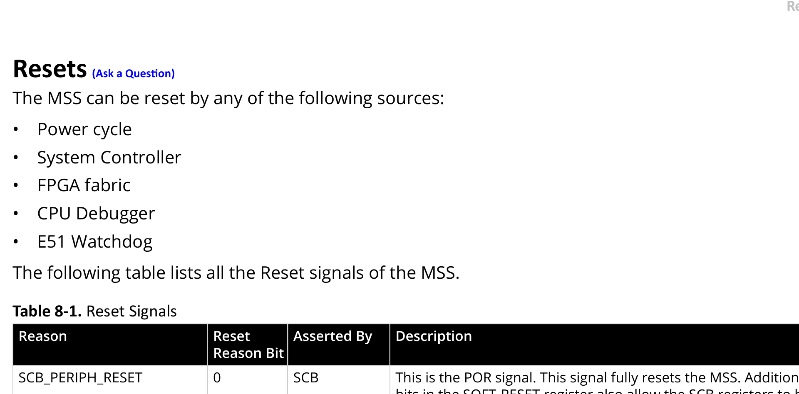

# 3.12.13 USB OTG Controller

<!-- page 1 -->
Functional Blocks
 Technical Reference Manual
© 2025 Microchip Technology Inc. and its subsidiaries
DS60001702Q - 101
• An OTG device that can dynamically switch roles between the host and the device
In all cases (USB host, USB device, or USB OTG), USB OTG controller supports control, bulk, ISO, and
interrupt transactions in all three modes.
3.12.13.2. Functional Description  (Ask a Question)
The following block diagram highlights the main blocks in the USB OTG controller. The USB OTG
controller is interfaced through the AMBA interconnect in the MSS. The USB OTG controller provides
an ULPI interface to connect to the external PHY. Following are the main component blocks in the
USB OTG controller:
• AHB Master and Slave Interfaces
• CPU Interface
• Endpoints (EP) Control Logic and RAM Control Logic
• Packet Encoding, Decoding, and CRC Block
• PHY Interfaces
Figure 3-37. USB OTG Controller

PHY 
Interface
Endpoint and RAM Control
Packet 
Encode/Decode
CPU 
Interface
DMA Controller
PolarFire ®  SoC USB OTG Controller
ULPI Interface 
through MSS
AHB Slave Interfacce
Interrupts
AHB Master Interface
3.12.13.2.1. AHB Master and Slave Interfaces (Ask a Question)
The USB OTG controller functions as both AHB master and AHB slave on the AMBA interconnect.
The AHB master interface is used by the DMA engine, which is built into the USB OTG controller, for
data transfer between memory in the USB OTG controller and the system memory. The AHB slave
interface is used by other masters, such as the processor or Fabric masters in the FPGA fabric, to
configure registers in the USB OTG controller.
3.12.13.2.2. CPU Interface (Ask a Question)
USB OTG controller send interrupts to the processor using the CPU interface. The USB OTG
controller send interrupts for the following events:
• When packets are transmitted or received
• When the USB OTG controller enters Suspend mode
• When USB OTG controller resumes from Suspend mode
The CPU interface block contains the common configuration registers and the interrupt control logic
for configuring the OTG controller.
