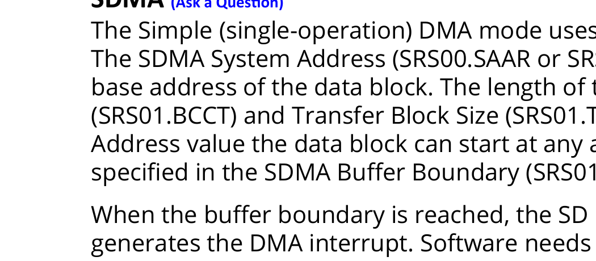
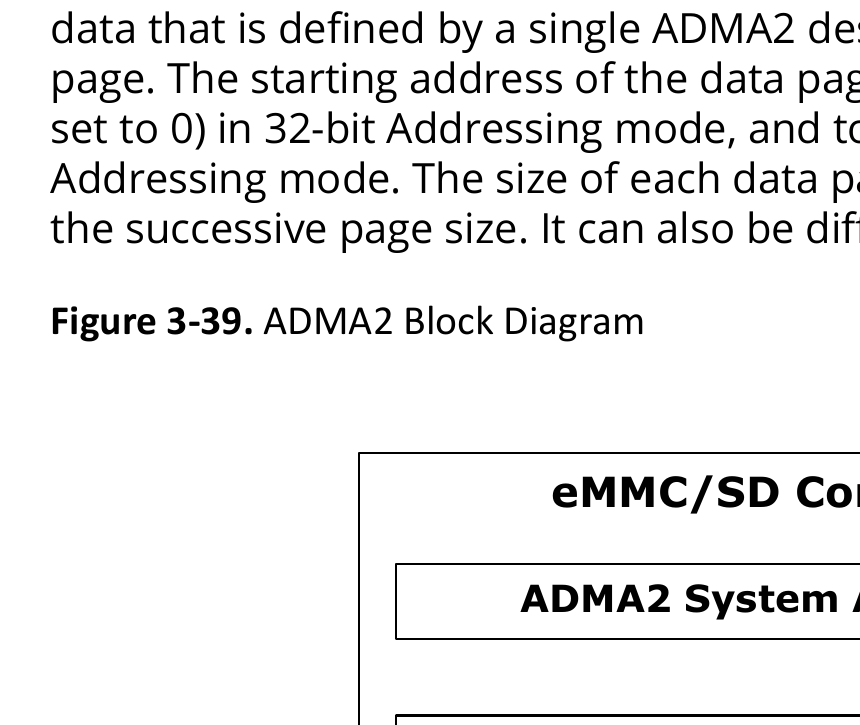

# 3.12.14 eMMC SD/SDIO

<!-- page 2 -->
Functional Blocks
 Technical Reference Manual
© 2025 Microchip Technology Inc. and its subsidiaries
DS60001702Q - 102
3.12.13.2.3. Endpoints (EP) Control Logic and RAM Control Logic (Ask a Question)
These two blocks constitute buffer management for the data buffers in Host mode and in Device
mode. This block manages endpoint buffers and their properties, called pipes, which are defined
by control, bulk, interrupt, and ISO data transfers. Data buffers in Device mode (endpoints) and in
Host mode are supported by the SECDED block, which automatically takes care of single-bit error
correction and dual-bit error detection. This SECDED block maintains the counters for the number
of single-bit corrections made and the number of detections of dual-bit errors. The SECDED block
is provided with the interrupt generation logic. If enabled, this block generates the corresponding
interrupts to the processor.
3.12.13.2.4. Packet Encoding, Decoding, and CRC Block (Ask a Question)
This block generates the CRC for packets to be transmitted and checks the CRC on received packets.
This block generates the headers for the packets to be transmitted and decodes the headers on
received packets. There is a CRC 16-bit for the data packets and a 5-bit CRC for control and status
packets.
3.12.13.2.5. PHY Interfaces (Ask a Question)
The USB OTG controller supports Universal Low Pin Count Interface (ULPI) at the link side. For ULPI
interface, the I/Os are routed through the MSS onto multi-standard I/Os (MSIOs).
3.12.13.3. Register Map (Ask a Question)
For information about USB OTG controller register map, see PolarFire SoC Device Register Map.
3.12.14. eMMC SD/SDIO  (Ask a Question)
The PolarFire SoC contains an eMMC/SD host controller and PHY. The MSS is capable of supporting
multiple eMMC/SD standards.
3.12.14.1. Features (Ask a Question)
eMMC and SD/SDIO supports the following features:
• eMMC Standards
– Default Speed (or Standard Speed)
– High Speed
– High Speed DDR
– High Speed 200
– High Speed 400
– High Speed 400 Enhanced Strobe (ES)
Important: Standard Speed, High Speed, and HS200 speed modes support
Single Data Rate (SDR) signaling. High Speed DDR, HS400, and HS400 ES speed
modes support Double Data Rate (DDR) signaling.
• SD Card Standards
– Default Speed (DS)
– Low Speed
– Full Speed
– High Speed
– UHS-I SDR12
– UHS-I SDR25
– UHS-I SDR50

<!-- page 3 -->
Functional Blocks
 Technical Reference Manual
© 2025 Microchip Technology Inc. and its subsidiaries
DS60001702Q - 103
– UHS-I SDR104
– UHS-I DDR50
• Non-Supported SD Card Standards
– UHS-II
• Integrated DMA engines for data transfers
Important: The DDR50 speed mode supports Double Data Rate (DDR) signaling.
The following speed modes support Single Data Rate (SDR) signaling.
• SDR104
• SDR50
• SDR25
• SDR12
• High Speed
• Default Speed
• Full Speed
3.12.14.2. Functional Description  (Ask a Question)
The eMMC/SD controller interfaces to the MSSIO through an IOMUX block. Depending on the
interface standard, the user may decide to only connect a subset of data lines to I/Os. However,
it is not possible to connect the eMMC/SD controller to the FPGA fabric. The eMMC/SD controller
supports two DMA modes—SDMA and ADMA2. The DMA supports 64-bit and 32-bit addressing
modes. The DMA mode for current transfer is selected through SRS10.DMASEL register and can be
different for each consecutive data transfer. The Host driver can change DMA mode when neither
the Write Transfer Active (SRS09.WTA) nor the Read Transfer Active (SRS09.RTA) status bit are set.
3.12.14.2.1. Integrated DMA (Ask a Question)
The SD Host controller supports two DMA modes:
• SDMA: Uses the (simple/single-operation) DMA algorithm for data transfers.
• ADMA2: Uses Advanced DMA2 algorithm for data transfers.
The following table shows how to select the DMA engine and Addressing mode by setting
SRS10.DMASEL, SRS15.HV4E and SRS16.A64S register fields.
Table 3-68. DMA Mode
SRS10.DMASEL SRS15.HV4E SRS16.A64S DMA Mode
0 0 0 SDMA 32-bit
1 Reserved
1 0 SDMA 32-bit
1 SDMA 64-bit
1 0 0 Reserved
1 Reserved
1 0 Reserved
1 Reserved
2 0 0 ADMA2 32-bit
1 Reserved
1 0 ADMA2 32-bit
1 ADMA2 64-bit

<!-- page 4 -->
Functional Blocks
 Technical Reference Manual
© 2025 Microchip Technology Inc. and its subsidiaries
DS60001702Q - 104
Table 3-68. DMA Mode (continued)
SRS10.DMASEL SRS15.HV4E SRS16.A64S DMA Mode
3 0 0 Reserved
1 ADMA2 64-bit
1 0 Reserved
1 Reserved
The DMA transfer in each mode can be stopped by setting Stop at the Block Gap Request
bit (SRS10.SBGR). The DMA transfers can be restarted only by setting Continue Request bit
(SRS10.CREQ). If an error occurs, the Host Driver can abort the DMA transfer in each mode by
setting Software Reset for DAT Line (SRS11.SRDAT) and issuing Abort command (if a multiple block
transfer is executing).
SDMA  (Ask a Question)
The Simple (single-operation) DMA mode uses SD Host registers to describe the data transfer.
The SDMA System Address (SRS00.SAAR or SRS22.DMASA1 / SRS23.DMASA2) register defines the
base address of the data block. The length of the data transfer is defined by the Block Count
(SRS01.BCCT) and Transfer Block Size (SRS01.TBS) values. There is no limitation on the SDMA System
Address value the data block can start at any address. The SDMA engine waits at every boundary
specified in the SDMA Buffer Boundary (SRS01.SDMABB) register.
When the buffer boundary is reached, the SD Host Controller stops the current transfer and
generates the DMA interrupt. Software needs to update the SDMA System Address register to
continue the transfer.
When the SDMA engine stops at the buffer boundary, the SDMA System Address register points
the next system address of the next data position to be transferred. The SDMA engine restarts the
transfer when the uppermost byte of the SDMA System Address register is written.
Figure 3-38. SDMA Block Diagram

eMMC/SD Controller
System Memory
SDMA System Address
Transfer Block Size
Block Count
SDMA Buffer Boundary
SDMA 
Engine
Transfer Complete
DMA Interrupt

<!-- page 5 -->
Functional Blocks
 Technical Reference Manual
© 2025 Microchip Technology Inc. and its subsidiaries
DS60001702Q - 105
ADMA2  (Ask a Question)
The Advanced DMA Mode Version 2 (ADMA2) uses the Descriptors List to describe data transfers.
The SD Host registers only define the base address of the Descriptors List. The base addresses and
sizes of the data pages are defined inside the descriptors. The SD Host supports ADMA2 in 64-bit or
32-bit Addressing mode.
When in ADMA2 mode, the SD Host transfers data from the data pages. Page is a block of valid
data that is defined by a single ADMA2 descriptor. Each ADMA2 descriptor can define only one data
page. The starting address of the data page must be aligned to the 4 byte boundary (the 2 LSbs
set to 0) in 32-bit Addressing mode, and to the 8 byte boundary (the 3 LSbs are set to 0) in 64-bit
Addressing mode. The size of each data page is arbitrary and it depends on neither the previous nor
the successive page size. It can also be different from the SD card transfer block size (SRS01.TBS).
Figure 3-39. ADMA2 Block Diagram

eMMC/SD Controller
Page Length
ADMA2 Engine
Transfer Complete
Page Address
ADMA Error Interrupt
DMA Interrupt
System 
Memory
ADMA2 System Address
The ADMA2 engine transfers are configured in a Descriptor List. The base address of the list is set
in the ADMA System Address register (SRS22.DMASA1, SRS23.DMASA2), regardless of whether it is
a read or write transfer. The ADMA2 Descriptor List consists of a number of 64-bit / 96-bit / 128-bit
descriptors of different functions. Each descriptor can:
• Perform transfer of a data page of specified size
• Link next descriptor address to an arbitrary memory location
Table 3-69. ADMA2 Descriptor Fields
Bit Symbol Description
[95:32]/[63:32] ADDRESS The field contains data page address or next Descriptor List address depending on the
descriptor type. When the descriptor is type TRAN, the field contains the page address.
When the descriptor type is LINK, the field contains address for the next Descriptor List.
[31:16] LENGTH The field contains data page length in bytes. If this field is 0, the page length is 64 Kbytes.

<!-- page 6 -->
Functional Blocks
 Technical Reference Manual
© 2025 Microchip Technology Inc. and its subsidiaries
DS60001702Q - 106
Table 3-69. ADMA2 Descriptor Fields (continued)
Bit Symbol Description
[5:4] ACT The field defines the type of the descriptor.
2’b00 (NOP) – no operation, go to next descriptor on the list
2’b01 (Reserved) – behavior identical to NOP
2’b10 (TRAN) – transfer data from the pointed page and go to the next descriptor on the
list
2’b11 (LINK) – go to the next Descriptor List pointed by ADDRESS field of this descriptor.
2 INT When this bit is set, the DMA Interrupt (SRS12.DMAINT) is generated when the ADMA2
engine completes processing of the descriptor.
1 END When this bit is set, it signals termination of the transfer and generates Transfer
Complete Interrupt when this transfer is completed.
0 VAL When this bit is set, it indicates the valid descriptor on a list.
When this bit is cleared, the ADMA Error Interrupt is generated and the ADMA2 engine
stops processing the Descriptor List. This bit prevents ADMA2 engine runaway due to
improper descriptors.
3.12.14.3. eMMC/SD Controller External Signals (Ask a Question)
The following table lists the eMMC/SD Controller external and optional signals, respectively. These
signals enhance the management and operation of the eMMC and SD card controller.
Table 3-70. eMMC/SD External Signals
Signal Function Description
SD_WP (SD Write Protect) Indicates whether the SD
card is write-protected.
• Connected to a switch on the SD card socket.
• Activated when the write-protect mechanism on the SD card
is in the locked position.
• A high signal indicates that the SD card is write-protected,
preventing write operations.
SD_POW (SD Power) Controls the power supply
to the SD card.
• Enables the host controller to turn the power on or off for
the SD card.
• Helps in power management when the SD card is not in use.
SD_VOLT_SEL (SD Voltage
Select)
Selects the operating voltage
for the SD card.
• Allows switching between different voltage levels required
by the SD card (for example,1.8V and 3.3V).
• Ensures compatibility with various SD card use cases.
SD_VOLT_EN (SD Voltage
Enable)
Enables or disables the
voltage supply to the SD
card.
• Works in conjunction with SD_VOLT_SEL.
• Ensures the correct voltage is supplied to the SD card when
enabled.
SD_VOLT_CMD_DIR (SD
Voltage Command
Direction)
Controls the direction of the
command signals to the SD
card.
Manages the communication direction (input/output) for
command signals between the host controller and the SD card.
SD_VOLT_DIR_0 (SD Voltage
Direction 0)
Controls the direction of
data signals to the SD card.
Manages the data flow direction (input/output) for data signals
between the host controller and the SD card.
SD_VOLT_DIR_1_3 (SD
Voltage Direction 1 to 3)
Controls the direction of
additional data signals to
the SD card.
• Similar to SD_VOLT_DIR_0 but used for additional data lines.
• Ensures proper data flow direction for multi-bit data
transfers.

<!-- page 7 -->
Functional Blocks
 Technical Reference Manual
© 2025 Microchip Technology Inc. and its subsidiaries
DS60001702Q - 107
Table 3-71. eMMC/SD Controller Optional Signals
Signal Function Description
SD_CLE (SD Card Lock
Enable)
Controls the lock mechanism of
the SD card.
• Used to enable or disable the lock mechanism of the SD
card.
• Prevents the SD card from being removed or tampered with
while in use.
SD_LED (SD Card
Activity LED)
Indicates the activity status of
the SD card.
• Drives an LED to show the activity status of the SD card.
• Blinks or stays on during read/write operations to provide a
visual indication of ongoing processes.
SD_VOLT_0 (SD Voltage
Level 0)
Represents a specific voltage
level for the SD card.
• Sets or indicates a specific voltage level for the SD card.
• Works with other voltage level signals to ensure correct
operating voltage.
SD_VOLT_1 (SD Voltage
Level 1)
Represents another specific
voltage level for the SD card.
Similar to SD_VOLT_0, used for managing the voltage
requirements of the SD card.
SD_VOLT_2 (SD Voltage
Level 2)
Represents yet another specific
voltage level for the SD card.
Ensures the SD card operates at the correct voltage level as
required.
3.12.14.4. Register Map (Ask a Question)
For information about eMMC/SD register map, see PolarFire SoC Device Register Map.
3.12.15. FRQ Meter (Ask a Question)
The PolarFire SoC FPGA has a frequency meter (FRQ meter) interfaced to the APB bus within the
controller. The frequency meter can be configured to Time mode or Frequency mode. Time mode
allows measurement such as PLL lock time, Frequency mode allows measurement of the internal
oscillator frequencies.
3.12.15.1. Features (Ask a Question)
The FRQ meter supports the following features:
• Number of counters and clock inputs configurable
– Configurable for one to eight counters
– Configurable for one to eight inputs per counter
– Allows up to 64 clock inputs
• APB Interface
– Supports byte operation
– Supports single cycle operations for non-APB interfacing
• Reference clock
– Reference clock selectable from JTAG or MSS Reference Clock Input Source (100 MHz or
125MHz)
• Dual Mode operation
– Frequency mode allows measurement of frequency
– Time mode allows measurement of a time, for example PLL lock time
• Maximum input frequency
– Driven by synthesis constraints
– The counter supports up to 625 MHz of operation
Following are list of clocks that can be measured using FRQ meter:
• MSS reference clock
