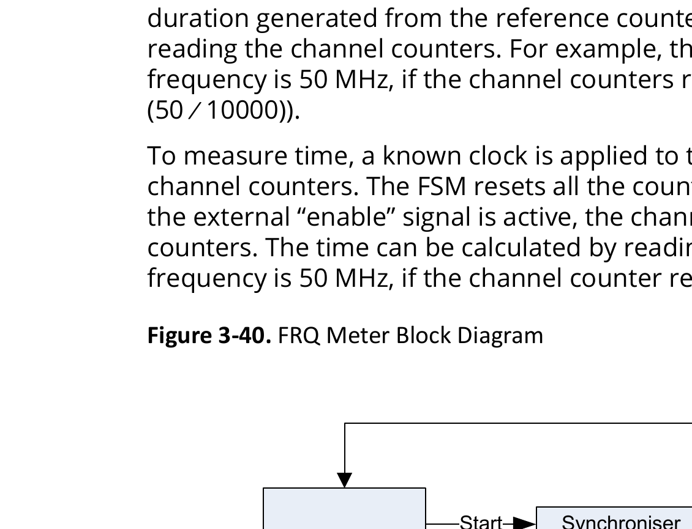

# 3.12.15 FRQ Meter

<!-- page 7 -->
Functional Blocks
 Technical Reference Manual
© 2025 Microchip Technology Inc. and its subsidiaries
DS60001702Q - 107
Table 3-71. eMMC/SD Controller Optional Signals
Signal Function Description
SD_CLE (SD Card Lock
Enable)
Controls the lock mechanism of
the SD card.
• Used to enable or disable the lock mechanism of the SD
card.
• Prevents the SD card from being removed or tampered with
while in use.
SD_LED (SD Card
Activity LED)
Indicates the activity status of
the SD card.
• Drives an LED to show the activity status of the SD card.
• Blinks or stays on during read/write operations to provide a
visual indication of ongoing processes.
SD_VOLT_0 (SD Voltage
Level 0)
Represents a specific voltage
level for the SD card.
• Sets or indicates a specific voltage level for the SD card.
• Works with other voltage level signals to ensure correct
operating voltage.
SD_VOLT_1 (SD Voltage
Level 1)
Represents another specific
voltage level for the SD card.
Similar to SD_VOLT_0, used for managing the voltage
requirements of the SD card.
SD_VOLT_2 (SD Voltage
Level 2)
Represents yet another specific
voltage level for the SD card.
Ensures the SD card operates at the correct voltage level as
required.
3.12.14.4. Register Map (Ask a Question)
For information about eMMC/SD register map, see PolarFire SoC Device Register Map.
3.12.15. FRQ Meter (Ask a Question)
The PolarFire SoC FPGA has a frequency meter (FRQ meter) interfaced to the APB bus within the
controller. The frequency meter can be configured to Time mode or Frequency mode. Time mode
allows measurement such as PLL lock time, Frequency mode allows measurement of the internal
oscillator frequencies.
3.12.15.1. Features (Ask a Question)
The FRQ meter supports the following features:
• Number of counters and clock inputs configurable
– Configurable for one to eight counters
– Configurable for one to eight inputs per counter
– Allows up to 64 clock inputs
• APB Interface
– Supports byte operation
– Supports single cycle operations for non-APB interfacing
• Reference clock
– Reference clock selectable from JTAG or MSS Reference Clock Input Source (100 MHz or
125MHz)
• Dual Mode operation
– Frequency mode allows measurement of frequency
– Time mode allows measurement of a time, for example PLL lock time
• Maximum input frequency
– Driven by synthesis constraints
– The counter supports up to 625 MHz of operation
Following are list of clocks that can be measured using FRQ meter:
• MSS reference clock

<!-- page 8 -->
Functional Blocks
 Technical Reference Manual
© 2025 Microchip Technology Inc. and its subsidiaries
DS60001702Q - 108
• MSS CPU cores clock
• MSS AXI clock
• MSS AHB/APB clock
• MSS Peripheral clocks
3.12.15.2. Functional Description  (Ask a Question)
Figure 3-40 shows the block diagram of FRQ meter. To measure the frequency, a known clock

is applied as a reference clock input. The input clock to be measured is applied to the channel
counters. The FSM resets all the counters and enables the channel counters for a predefined
duration generated from the reference counter. Now, the clock frequency can be calculated by
reading the channel counters. For example, the reference counter is set to 10,000 and reference
frequency is 50 MHz, if the channel counters return 20,000, the measured clock is 100 MHz (20000 ×
(50 ∕ 10000)).
To measure time, a known clock is applied to the reference clock input, this is multiplexed to the
channel counters. The FSM resets all the counters and then enables the channel counters. When
the external “enable” signal is active, the channel counter increments and stops all the channel
counters. The time can be calculated by reading the channel counters. For example, the reference
frequency is 50 MHz, if the channel counter returns 20,000, the measured time is 400,000 ns.
Figure 3-40. FRQ Meter Block Diagram
APB
Interface
FSM
Reference Counter
SynchroniserStart
SynchroniserAbort
Synchroniser
Clock
Counters 
0 to 5
Clock
Counters 
0 to 7
Clock
Counters 
0 to 7
Channel Clock
Counters 
0 to 7
Reset
Synchroniser
Enable
clksel
Count Values
PCLK
APB
Input
Clocks
SynchroniserBusy
Reference 
Clock
Reference 
Clock
Frequency/
Time Mode
3.12.15.2.1. Measurable Clocks (Ask a Question)
The measurable clocks can be selected from a group of channels. Each group has 8 channels with
corresponding COUNTx register (x takes values from 0 to 7). The following table provides a list of
all the measurable clocks in PolarFire SoC devices. Groups and channels, that are not listed in the
following table, are not implemented. For more information on MSS clocks, see PolarFire Family
Clocking Resources User Guide.

<!-- page 9 -->
Functional Blocks
 Technical Reference Manual
© 2025 Microchip Technology Inc. and its subsidiaries
DS60001702Q - 109
Table 3-72. Measurable Clocks
Clock Name Description Channel / Group
clk_cpu MSS CPU cores 0 / B
clk_axi MSS AXI clock 1 / B
clk_ahb MSS AHB and APB 2 / B
clk_reference REFCLK for MSS PLL 3 / B
clk_dfi DDR PHY interface 4 / B
clk_in_mac_tx MSS MAC transmit 0 / C
clk_in_mac_tsu MSS MAC timestamp 1 / C
clk_in_mac0_rx GEM0 MAC receive synchronization 2 / C
clk_in_mac1_rx GEM1 MAC receive synchronization 3 / C
sgmii_clko_c_out Test clock from SGMII DLL 4 / C
clk_in_crypto Cryptoprocessor clock in MSS mode 0 / D
clk_in _usb MSS USB controller 1 / D
clk_in_emmc MSS eMMC/SD/SDIO controller 2 / D
clk_in_can (_clk) MSS CAN controller 3 / D
sgmii_pll_clkout_0 SGMII PLL clock of frequency 625 MHz with phase 0 used to Clock and Data Recovery 0 / E
sgmii_pll_clkout_1 SGMII PLL clock of frequency 625 MHz with phase 90 used to Clock and Data Recovery 1 / E
sgmii_pll_clkout_2 SGMII PLL clock of frequency 625 MHz with phase 180 used to Clock and Data
Recovery
2 / E
sgmii_pll_clkout_3 SGMII PLL clock of frequency 625 MHz with phase 270 used to Clock and Data
Recovery
3 / E
sgmii_dll_clk_out0 SGMII DLL output 4 / E
fab_mac0_tsu_clk Timestamp clock sourced from fabric for GEM0 MAC 2 / F
fab_mac1_tsu_clk Timestamp clock sourced from fabric for GEM1 MAC 3 / F
The clocks mentioned in the preceding table can be measured by configuring the registers of the
FRQ Meter. See the FRQMETER register map in the PolarFire SoC Device Register Map.
Use the following steps to measure the frequency:
1. Set the main clock selection register FRQMETER : CLKSEL  as follows:
a. Select the group using clock selection register bit fields FRQMETER : CLKSEL[2:0]  , F, E,
D, C, B. These groups in descending order control the MUXing to the COUNTx registers. Each
group has 8 channels with dedicated COUNTx register.
b. The next bit field FRQMETER : CLKSEL[4]  controls the reference clock input source and is
defaulted to the system controller’s dedicated JTAG controller TCK (bit field value = “0”). An
alternate reference is the MSS PLL reference clock (bit field value = “1”), which is 100 or 125
MHz based on the user selection in the PolarFire SoC MSS Configurator.
c. Select the channel that drives the clock monitor output 0 to 7 using clock selection register
bit fields FRQMETER : CLKSEL[10:8] .
2. Enable the clock monitor output using clock selection register bit field FRQMETER :
CLKSEL[11].
3. Set the run time reference clock cycles in the register FRQMETER : RUNTIME . By default, this is
set to a value of 10000. This value is used as a reference while calculating the frequency. This
value specifies the number of run time clock cycles for which the time and frequency must be
measured.
4. The FRQMETER : MODE  selects the measurement method. There are 3 options of operation
for each individual channel between 7 – 0, using bits [15:0]. The settings are disabled “00”,
Frequency Mode “01”, Time Mode “11”, Reserved “10”. If the value “10” (Reserved) is selected,

<!-- page 10 -->
Functional Blocks
 Technical Reference Manual
© 2025 Microchip Technology Inc. and its subsidiaries
DS60001702Q - 110
the clock measurement returns zero. For description of the modes, see PolarFire SoC Device
Register Map.
5. The FRQMETER: CONTROL[0]  register bit starts the clock measurements with a “1” and
transitions to “0” when the measurement is complete. This bit must be activated for each
measurement.
6. Once the measurement is complete by reading FRQMETER: CONTROL[0] , read the register
FRQMETER : COUNTx(s) . The COUNTx registers correspond to configured channel mode and
group that were set earlier. The COUNTx register holds the measured mode value for that
channel with respect to the reference clock.
Follow these steps to see the FRQMETER peripheral drivers:
1. Go to GitHub.
2. Browse to mpfs_hal/common/nwc.
3. The Frequency Meter (FRQMETER) bare metal driver is defined in mss_cfm.c and mss_cfm.h
files.
4. To see the usage of Frequency Meter driver, follow these steps:
a. Go to Bare Metal Examples.
b. Browse to driver-examples/mss/mpfs-hal/mpfs-hal-ddr-demo/src/application/
hart0
c. See the display_clocks() function in the e51.c file.
3.12.15.3. Register Map (Ask a Question)
For information about FRQ meter register map, see PolarFire SoC Device Register Map.
3.12.16. M2F Interrupt Controller (Ask a Question)
The M2F interrupt controller block facilitates the generation of the interrupt signals between the
MSS and the fabric. This block is used to route MSS interrupts to the fabric and fabric interrupts
to the MSS. The M2F interrupt controller module has an APB slave interface that can be used
to configure interrupt processing. Some of the MSS interrupts can be used as potential interrupt
sources to the FPGA fabric.
3.12.16.1. Features (Ask a Question)
The M2F Interrupt Controller supports the following features:
• 43 interrupts from the MSS as inputs
• 16 individually configurable MSS to fabric interrupt ports (MSS_INT_M2F[15:0])
• 64 individually configurable fabric to MSS interrupt ports (MSS_INT_F2M[63:0])
3.12.16.2. Functional Description  (Ask a Question)
M2F controller has 43 interrupt lines from the MSS interrupt sources. These MSS interrupts are
combined to produce 16 MSS to Fabric interrupts (MSS_INT_M2F[15:0]). These interrupts are level
sensitive with active-high polarity. The following figure shows the block diagram of M2F interrupt
controller.
