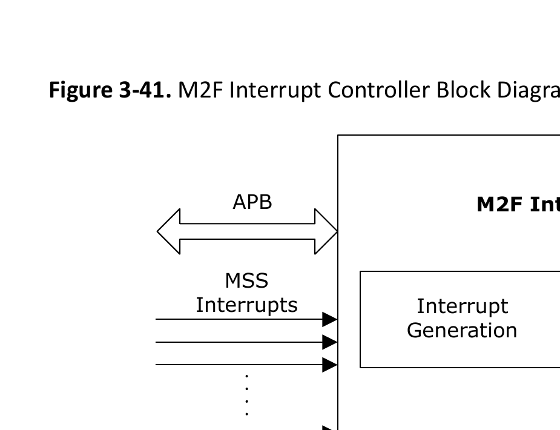

# 3.12.16 M2F Interrupt Controller

<!-- page 10 -->
Functional Blocks
 Technical Reference Manual
© 2025 Microchip Technology Inc. and its subsidiaries
DS60001702Q - 110
the clock measurement returns zero. For description of the modes, see PolarFire SoC Device
Register Map.
5. The FRQMETER: CONTROL[0]  register bit starts the clock measurements with a “1” and
transitions to “0” when the measurement is complete. This bit must be activated for each
measurement.
6. Once the measurement is complete by reading FRQMETER: CONTROL[0] , read the register
FRQMETER : COUNTx(s) . The COUNTx registers correspond to configured channel mode and
group that were set earlier. The COUNTx register holds the measured mode value for that
channel with respect to the reference clock.
Follow these steps to see the FRQMETER peripheral drivers:
1. Go to GitHub.
2. Browse to mpfs_hal/common/nwc.
3. The Frequency Meter (FRQMETER) bare metal driver is defined in mss_cfm.c and mss_cfm.h
files.
4. To see the usage of Frequency Meter driver, follow these steps:
a. Go to Bare Metal Examples.
b. Browse to driver-examples/mss/mpfs-hal/mpfs-hal-ddr-demo/src/application/
hart0
c. See the display_clocks() function in the e51.c file.
3.12.15.3. Register Map (Ask a Question)
For information about FRQ meter register map, see PolarFire SoC Device Register Map.
3.12.16. M2F Interrupt Controller (Ask a Question)
The M2F interrupt controller block facilitates the generation of the interrupt signals between the
MSS and the fabric. This block is used to route MSS interrupts to the fabric and fabric interrupts
to the MSS. The M2F interrupt controller module has an APB slave interface that can be used
to configure interrupt processing. Some of the MSS interrupts can be used as potential interrupt
sources to the FPGA fabric.
3.12.16.1. Features (Ask a Question)
The M2F Interrupt Controller supports the following features:
• 43 interrupts from the MSS as inputs
• 16 individually configurable MSS to fabric interrupt ports (MSS_INT_M2F[15:0])
• 64 individually configurable fabric to MSS interrupt ports (MSS_INT_F2M[63:0])
3.12.16.2. Functional Description  (Ask a Question)
M2F controller has 43 interrupt lines from the MSS interrupt sources. These MSS interrupts are
combined to produce 16 MSS to Fabric interrupts (MSS_INT_M2F[15:0]). These interrupts are level
sensitive with active-high polarity. The following figure shows the block diagram of M2F interrupt
controller.

<!-- page 11 -->
Functional Blocks
 Technical Reference Manual
© 2025 Microchip Technology Inc. and its subsidiaries
DS60001702Q - 111
Figure 3-41. M2F Interrupt Controller Block Diagram

M2F Interrupt Controller
Interrupt EnableInterrupt 
Generation
APB
MSS_INT_M2F[15:0]
MSS_INT_F2M[63:0]
MSS 
Interrupts
The peripherals driving the M2F interrupt source inputs must ensure that their interrupts remain
asserted until peripherals are serviced.
As shown in the preceding figure, MSS_INT_F2M[63:0] interrupts are from fabric to MSS.
• These are level-triggered interrupts (active-high).
• The assert time should be more than Platform Level Interrupt Controller (PLIC) clock frequency.
• If these interrupts are enabled and the interrupt handler is assigned, whenever the interrupt
occurs, the interrupt handler is executed.
• In the interrupt handler, the user can read the status and clear the interrupt through APB
interface in the PLIC register map. The fabric interrupt source can be cleared through APB/AXI
interface.
3.12.16.3. Register Map (Ask a Question)
For information about M2F Interrupt Controller register map, see PolarFire SoC Device Register Map.
