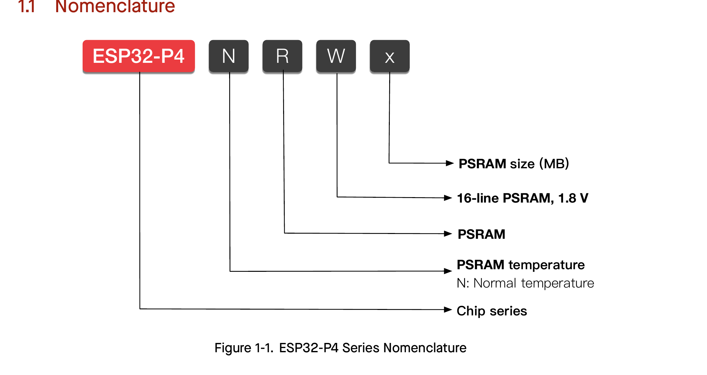

# 1 ESP32-P4 Series Comparison

## 1.1 Nomenclature

## 1.2 Comparison

Table 1-1. ESP32-P4 Series Comparison

| Part Number^1 | In-Package PSRAM | Ambient Temp.^2 (°C) | VDD_PSRAM_0/1 Voltage^3 |
|---|---|---|---|
| ESP32-P4NRW16 (NRND) | 16 MB (OPI/HPI)^4 | −40 ~ 85 | 1.8 V |
| ESP32-P4NRW32 (NRND) | 32 MB (OPI/HPI)^4 | −40 ~ 85 | 1.8 V |

^1 For details on chip marking and packing, see Section 6 Packaging.

^2 Ambient temperature specifies the recommended temperature range of the environment immediately outside an Espressif chip.

^3 For more information on VDD_PSRAM_0/1, see Section 2.6 Power Supply.

^4 OPI of PSRAM supports transferring eight-bit commands, addresses, and data; HPI supports transferring eight-bit commands and addresses as well as 16-bit data. For details about SPI modes, see Section 2.7 Pin Mapping Between Chip and Flash.
