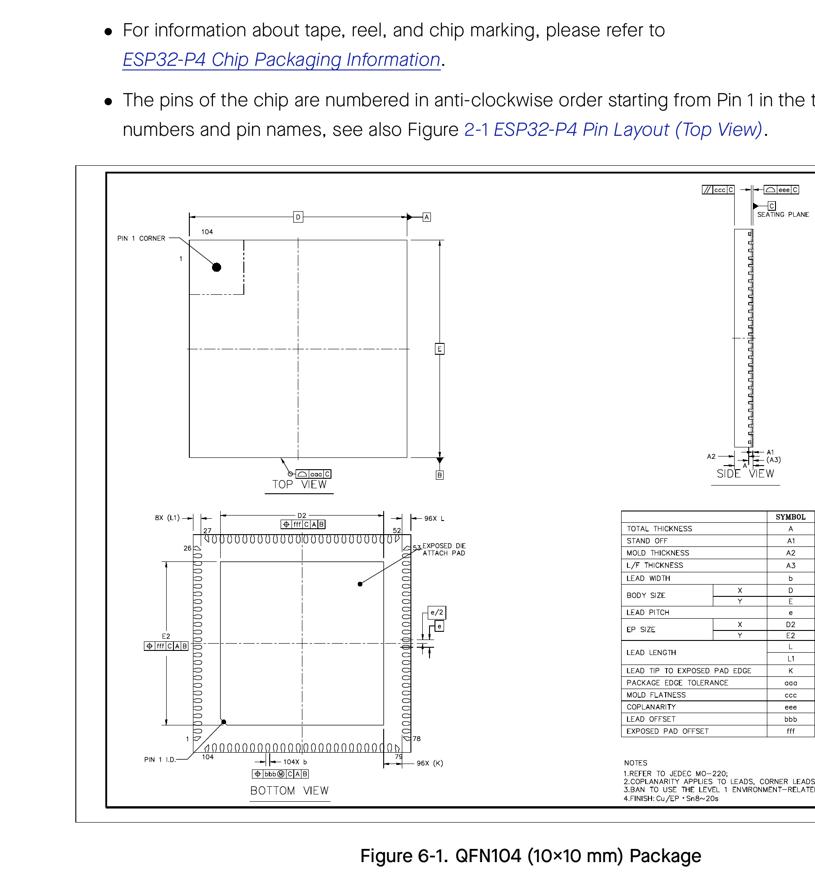

# 6 Packaging

- For information about tape, reel, and chip marking, please refer to ESP32-P4 Chip Packaging Information.
- The pins of the chip are numbered in anti-clockwise order starting from Pin 1 in the top view. For pin numbers and pin names, see also Figure 2-1 ESP32-P4 Pin Layout (Top View).

