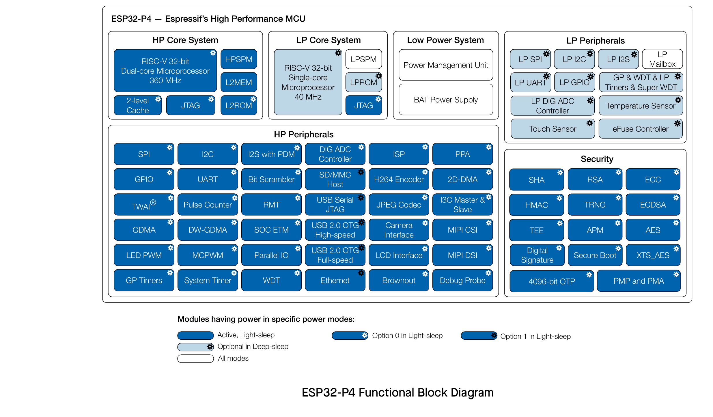

# Product Overview

ESP32-P4 is a high-performance MCU that supports large internal memory and has powerful image and voice processing capabilities. The MCU consists of a High Performance (HP) system and a Low Power (LP) system. The HP system contains a RISC-V dual-core CPU and rich peripherals, while the LP system contains a low-power RISC-V single-core CPU and various peripherals optimized for low-power applications.

The functional block diagram of the SoC is shown below. For more information on power consumption, see Section 4.1.4.6 Low-Power Management.

## Features

### CPU and Memory

- 32-bit RISC-V dual-core processor up to 360 MHz for HP system (The default clock frequency is configured to 360 MHz. If you require a higher clock frequency of 400 MHz, please contact us.)
- 32-bit RISC-V single-core processor up to 40 MHz for LP system
- CoreMark® Score (dual-core):
  - at 360 MHz: 2489.62 CoreMark; 6.92 CoreMark/MHz
- 128 KB HP ROM
- 16 KB LP ROM
- 768 KB HP L2MEM
- 32 KB LP SRAM
- 8 KB system SPM (Scratchpad Memory)
- Multiple high-speed external memory interfaces
- Two-level high-speed cache

### System DMA

- GDMA Controller
- VDMA Controller
- 2D-DMA Controller

### Advanced Peripheral Interfaces and Sensors

- 55 programmable GPIOs
  - Five strapping GPIOs
- Image processing subsystem:
  - JPEG Codec
  - Image Signal Processor (ISP)
  - Pixel-Processing Accelerator (PPA)
  - LCD and Camera controller
  - H264 encoder
  - MIPI CSI
  - MIPI DSI
- Digital interfaces and peripherals:
  - Five UARTs
  - LP UART
  - Four SPIs
  - LP SPI
  - Two I2Cs
  - LP I2C
  - Analog I2C
  - I3C
  - Three I2Ss
  - LP I2S
  - Pulse Count Controller (PCNT)
  - USB 2.0 High-Speed OTG
  - USB 2.0 Full-Speed OTG
  - USB Serial/JTAG Controller
  - Ethernet Media Access Controller (EMAC)
  - Two-Wire Automotive Interface (TWAI)
  - SD/MMC Host Controller (SDHOST)
  - LED PWM Controller (LEDC)
  - Motor Control PWM (MCPWM)
  - Remote Control Peripheral (RMT)
  - Parallel IO Controller (PARLIO)
  - BitScrambler
  - Voice Activity Detection (VAD)
- Analog peripherals and sensors:
  - Touch sensor
  - Temperature sensor
  - Two ADC Controllers
  - Analog voltage comparator
- Timers:
  - Two 52-bit HP system timers
  - Four 54-bit HP general-purpose timers
  - Two 32-bit HP watchdog timers (MWDT)
  - 32-bit LP watchdog timer (RWDT)
  - Analog super watchdog timer (SWD)
  - 48-bit LP general-purpose timer (RTC Timer)

### Security

- Secure boot
- One-time writing security ensured by eFuse OTP
- Cryptography/Security Components:
  - AES Accelerator
  - ECC Accelerator
  - HMAC Accelerator
  - RSA Accelerator
  - SHA Accelerator
  - Digital Signature Algorithm
  - Elliptic Curve Digital Signature Algorithm (ECDSA)
  - External Memory Encryption and Decryption (XTS_AES)
  - True Random Number Generator (TRNG)
- Permission Control (PMS)

### Applications

With low power consumption, ESP32-P4 is an ideal choice for IoT devices in the following areas:

- Smart Home
- Industrial Automation
- Health Care
- Consumer Electronics
- Smart Agriculture
- Retail Self-Service Terminals (POS, Vending Machines)
- Service Robot
- Multimedia Player
- Cameras for Video Streaming
- High-Speed USB Host and Device
- Smart Voice Interaction Terminal
- Edge Vision AI Processor
- HMI Control Panel
