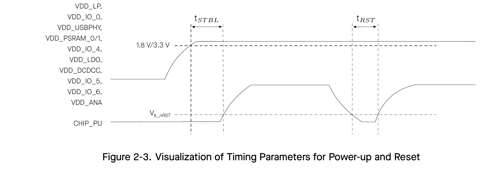

# 2 Pins

## 2.3.2 LP IO MUX Functions

When the chip is in Deep-sleep mode, the IO MUX described in Section 2.3.1 *IO MUX Functions* will not work. That is where the LP IO MUX comes in. It allows multiple input/output signals to be a single input/output pin in Deep-sleep mode, as the pin is connected to the LP system and powered by VDD_LP or VDD_BAT.

LP IO pins can be assigned to **LP IO MUX functions**. They can

- Either work as LP GPIOs (LP_GPIO0, LP_GPIO1, etc.), connected to the LP CPU
- Or connect to LP peripheral signals (LP_UART_TXD_PAD, LP_UART_RXD_PAD) - see Table 2-4 *LP IO MUX Functions*

### Table 2-4. LP Peripheral Signals Routed via LP IO MUX

| Pin Function | Signal | Description |
| --- | --- | --- |
| LP_UART_TXD_PAD | Transmit data | LP UART interface |
| LP_UART_RXD_PAD | Receive data | LP UART interface |

Table 2-5 *LP IO MUX Functions* shows the LP functions of LP IO pins.

### Table 2-5. LP IO MUX Functions

| Pin No. | LP IO Name1,2 | F0 | Type | F1 | Type |
| --- | --- | --- | --- | --- | --- |
| 1 | LP_GPIO1 | LP_GPIO1 | I/O/T | LP_GPIO1 | I/O/T |
| 2 | LP_GPIO2 | LP_GPIO2 | I/O/T | LP_GPIO2 | I/O/T |
| 3 | LP_GPIO3 | LP_GPIO3 | I/O/T | LP_GPIO3 | I/O/T |
| 4 | LP_GPIO4 | LP_GPIO4 | I/O/T | LP_GPIO4 | I/O/T |
| 5 | LP_GPIO5 | LP_GPIO5 | I/O/T | LP_GPIO5 | I/O/T |
| 6 | LP_GPIO6 | LP_GPIO6 | I/O/T | LP_GPIO6 | I/O/T |
| 7 | LP_GPIO7 | LP_GPIO7 | I/O/T | LP_GPIO7 | I/O/T |
| 8 | LP_GPIO8 | LP_GPIO8 | I/O/T | LP_GPIO8 | I/O/T |
| 10 | LP_GPIO9 | LP_GPIO9 | I/O/T | LP_GPIO9 | I/O/T |
| 11 | LP_GPIO10 | LP_GPIO10 | I/O/T | LP_GPIO10 | I/O/T |
| 12 | LP_GPIO11 | LP_GPIO11 | I/O/T | LP_GPIO11 | I/O/T |
| 13 | LP_GPIO12 | LP_GPIO12 | I/O/T | LP_GPIO12 | I/O/T |
| 14 | LP_GPIO13 | LP_GPIO13 | I/O/T | LP_GPIO13 | I/O/T |
| 15 | LP_UART_TXD_PAD | LP_UART_TXD_PAD | O | LP_GPIO14 | I/O/T |
| 16 | LP_UART_RXD_PAD | LP_UART_RXD_PAD | I | LP_GPIO15 | I/O/T |
| 104 | LP_GPIO0 | LP_GPIO0 | I/O/T | LP_GPIO0 | I/O/T |

1 This column lists the LP GPIO names, since LP functions are configured with LP GPIO registers that use LP GPIO numbering.

## 2.3.3 Analog Functions

Some IO pins also have **analog functions**, for analog peripherals (such as touch sensor and ADC) in any power mode. Internal analog signals are routed to these analog functions, see Table 2-6 *Analog Functions*.

### Table 2-6. Analog Signals Routed to Analog Functions

| Pin Function | Signal | Description |
| --- | --- | --- |
| XTAL_32K_N | Negative clock signal | 32 kHz external clock input/output connected to the oscillator |
| XTAL_32K_P | Positive clock signal | 32 kHz external clock input/output connected to the oscillator |
| TOUCH_CHANNEL... | Touch sensor channel signal | Touch sensor interface |
| ADC..._CHANNEL... | ADC1/2 channel signal | ADC1/2 interface |
| USB1P1_N... | USB D- | USB 2.0 full-speed OTG interface and USB Serial/JTAG function |
| USB1P1_P... | USB D+ | USB 2.0 full-speed OTG interface and USB Serial/JTAG function |
| ANA_COMP... | Voltage of P0/P1 | Analog voltage comparator O/1 interface |

Table 2-7 *Analog Functions* shows the analog functions of IO pins.

### Table 2-7. Analog Functions

| Pin No. | Analog IO Name | F0 | F1 |
| --- | --- | --- | --- |
| 1 | GPIO1 | XTAL_32K_P | - |
| 2 | GPIO2 | TOUCH_CHANNEL1 | - |
| 3 | GPIO3 | TOUCH_CHANNEL2 | - |
| 4 | GPIO4 | TOUCH_CHANNEL3 | - |
| 5 | GPIO5 | TOUCH_CHANNEL4 | - |
| 6 | GPIO6 | TOUCH_CHANNEL5 | - |
| 7 | GPIO7 | TOUCH_CHANNEL6 | - |
| 8 | GPIO8 | TOUCH_CHANNEL7 | - |
| 10 | GPIO9 | TOUCH_CHANNEL8 | - |
| 11 | GPIO10 | TOUCH_CHANNEL9 | - |
| 12 | GPIO11 | TOUCH_CHANNEL10 | - |
| 13 | GPIO12 | TOUCH_CHANNEL11 | - |
| 14 | GPIO13 | TOUCH_CHANNEL12 | - |
| 15 | GPIO14 | TOUCH_CHANNEL13 | - |
| 16 | GPIO15 | TOUCH_CHANNEL14 | - |
| 17 | GPIO16 | ADC1_CHANNEL0 | - |
| 18 | GPIO17 | ADC1_CHANNEL1 | - |
| 19 | GPIO18 | ADC1_CHANNEL2 | - |
| 20 | GPIO19 | ADC1_CHANNEL3 | - |
| 22 | GPIO20 | ADC1_CHANNEL4 | - |
| 23 | GPIO21 | ADC1_CHANNEL5 | - |
| 24 | GPIO22 | ADC1_CHANNEL6 | - |

Table 2-7 - cont’d from previous page

| Pin No. | Analog IO Name | F0 | F1 |
| --- | --- | --- | --- |
| 25 | GPIO23 | ADC1_CHANNEL7 | - |
| 52 | GPIO24 | USB1P1_N0 | - |
| 53 | GPIO25 | USB1P1_P0 | - |
| 55 | GPIO26 | USB1P1_N1 | - |
| 56 | GPIO27 | USB1P1_P1 | - |
| 92 | GPIO49 | ADC2_CHANNEL0 | - |
| 93 | GPIO50 | ADC2_CHANNEL1 | - |
| 94 | GPIO51 | ADC2_CHANNEL2 | ANA_COMP0 |
| 95 | GPIO52 | ADC2_CHANNEL3 | ANA_COMP0 |
| 97 | GPIO53 | ADC2_CHANNEL4 | ANA_COMP1 |
| 98 | GPIO54 | ADC2_CHANNEL5 | ANA_COMP1 |
| 104 | GPIO0 | XTAL_32K_N | - |

1 Bold marks the default pin functions in the default boot mode. See Section 3.1 *Chip Boot Mode Control*.

2 Regarding highlighted cells, see Section 2.3.4 *Restrictions for GPIOs and LP GPIOs*.

## 2.3.4 Restrictions for GPIOs and LP GPIOs

All IO pins of ESP32-P4 have GPIO pin functions, and some have LP GPIO pin functions. However, the IO pins are multiplexed and can be configured for different purposes based on the requirements. Some IOs have restrictions for usage. It is essential to consider the multiplexed nature and the limitations when using these IO pins.

In tables of this chapter, some pin functions are highlighted. The non-highlighted GPIO or LP_GPIO pins are recommended for use first. If more pins are needed, the highlighted GPIOs or LP_GPIOs should be chosen carefully to avoid conflicts with important pin functions.

The highlighted IO pins have one of the following important functions:

- **Strapping pins** - need to be at certain logic levels at startup. See Section 3 *Boot Configurations*.
- **USB1P1_N0/P0** - by default, connected to the USB Serial/JTAG Controller. To function as GPIOs, these pins need to be reconfigured.
- **JTAG interface** - often used for debugging. See Table 2-2 *IO MUX Functions*. To free these pins up, the pin functions USB1P1_N/P of the USB Serial/JTAG Controller can be used instead. See also Section 3.4 *JTAG Signal Source Control*.
- **UART interface** - often used for debugging. See Table 2-2 *IO MUX Functions*.

See also Appendix A - ESP32-P4 Consolidated Pin Overview.

## 2.4 Dedicated Interface Pins

Some pins are dedicated to a few important peripherals, such as MIPI DSI and MIPI CSI.

### Table 2-8. Peripheral-Dedicated Signals

| Pin Function | Signal | Description |
| --- | --- | --- |
| FLASH_CS | Chip select | Flash connection |
| FLASH_Q | Data output | Flash connection |
| FLASH_WP | Write protect | Flash connection |
| FLASH_HOLD | Hold | Flash connection |
| FLASH_CK | Clock | Flash connection |
| FLASH_D | Data in | Flash connection |
| MIPI DSI PHY 4.02 kΩ EXTERNAL RESISTOR | External resistor 4.02 kΩ | MIPI DSI connection |
| MIPI DSI PHY DATAP... | Data positive channel 0/1 | MIPI DSI connection |
| MIPI DSI PHY DATAN... | Data negative channel 0/1 | MIPI DSI connection |
| MIPI DSI PHY CLKN | Clock negative channel | MIPI DSI connection |
| MIPI DSI PHY CLKP | Clock positive channel | MIPI DSI connection |
| MIPI CSI PHY 4.02 kΩ EXTERNAL RESISTOR | External resistor 4.02 kΩ | MIPI CSI connection |
| MIPI CSI PHY DATAP... | Data positive channel 0/1 | MIPI CSI connection |
| MIPI CSI PHY DATAN... | Data negative channel 0/1 | MIPI CSI connection |
| MIPI CSI PHY CLKN | Clock negative channel | MIPI CSI connection |
| MIPI CSI PHY CLKP | Clock positive channel | MIPI CSI connection |
| USB2 OTG PHY DM | USB D- | USB 2.0 high-speed OTG connection |
| USB2 OTG PHY DP | USB D+ | USB 2.0 high-speed OTG connection |

Table 2-9 *Dedicated Interface Pins* lists the peripheral-dedicated functions of pins.

### Table 2-9. Dedicated Interface Pins

| Pin No. | Dedicated Interface Pin | F0 | Type |
| --- | --- | --- | --- |
| 27 | FLASH_CS | FLASH_CS | O |
| 28 | FLASH_Q | FLASH_Q | I/O/T |
| 29 | FLASH_WP | FLASH_WP | I/O/T |
| 31 | FLASH_HOLD | FLASH_HOLD | I/O/T |
| 32 | FLASH_CK | FLASH_CK | O |
| 33 | FLASH_D | FLASH_D | I/O/T |
| 34 | DSI_REXT | MIPI DSI PHY 4.02 KΩ EXTERNAL RESISTOR | I/O/T |
| 35 | DSI_DATAP1 | MIPI DSI PHY DATAP1 | I/O/T |
| 36 | DSI_DATAN1 | MIPI DSI PHY DATAN1 | I/O/T |
| 37 | DSI_CLKN | MIPI DSI PHY CLKN | I/O/T |
| 38 | DSI_CLKP | MIPI DSI PHY CLKP | I/O/T |
| 39 | DSI_DATAP0 | MIPI DSI PHY DATAP0 | I/O/T |

Table 2-9 - cont’d from previous page

| Pin No. | Dedicated Interface Pin | F0 | Type |
| --- | --- | --- | --- |
| 40 | DSI_DATAN0 | MIPI DSI PHY DATAN0 | I/O/T |
| 42 | CSI_DATAN0 | MIPI CSI PHY DATAN0 | I/O/T |
| 43 | CSI_DATAP0 | MIPI CSI PHY DATAP0 | I/O/T |
| 44 | CSI_CLKP | MIPI CSI PHY CLKP | I/O/T |
| 45 | CSI_CLKN | MIPI CSI PHY CLKN | I/O/T |
| 46 | CSI_DATAN1 | MIPI CSI PHY DATAN1 | I/O/T |
| 47 | CSI_DATAP1 | MIPI CSI PHY DATAP1 | I/O/T |
| 48 | CSI_REXT | MIPI CSI PHY 4.02 kΩ EXTERNAL RESISTOR | I/O/T |
| 49 | USB_DM | USB2 OTG PHY DM | I/O/T |
| 50 | USB_DP | USB2 OTG PHY DP | I/O/T |

## 2.5 Analog Pins

### Table 2-10. Analog Pins

| Pin No. | Pin Name | Pin Type | Pin Function |
| --- | --- | --- | --- |
| 78 | FB_DCDC | - | Feedback pin of power supply for external DC/DC. It regulates the voltage of VDD_HP_0/2/3 together with feedback resistors of external DC/DC |
| 79 | EN_DCDC | O | Enable pin of external DC/DC |
| 99 | XTAL_N | - | External clock input/output connected to chip's crystal or oscillator. |
| 100 | XTAL_P | - | P/N means differential clock positive/negative. |
| 103 | CHIP_PU | I | High: on, enables the chip (powered up). Low: off, disables the chip (powered down). Note: Do not leave the CHIP_PU pin floating. |

## 2.6 Power Supply

### 2.6.1 Power Pins

The chip is powered via the power pins described in Table 2-11 *Power Pins*.

### Table 2-11. Power Pins

| Pin No. | Pin Name | Direction | Power Domain / Other3 | IO Pins |
| --- | --- | --- | --- | --- |
| 9 | VDD_LP | Input | LP power domain | LP IO4 |
| 21 | VDD_IO_0 | Input | Digital power domain | HP IO |
| 26 | VDD_HP_0 | Input | Digital power domain |  |
| 30 | VDD_FLASHIO2 | Input | Flash | flash IO |
| 41 | VDD_MIPI_DPHY | Input | MIPI PHY | MIPI IO |
| 51 | VDD_USBPHY | Input | USB PHY | High-speed USB IO |
| 59 | VDD_PSRAM_0 | Input | PSRAM | PSRAM IO |
| 62 | VDD_IO_4 | Input | Digital power domain | HP IO |
| 67 | VDD_PSRAM_1 | Input | PSRAM | PSRAM IO |
| 71 | VDDO_FLASH | Output | Off-package flash, output 50 mA current at the maximum |  |
| 72 | VDDO_PSRAM | Output | In-package and off-package PSRAM, output 50 mA current at the maximum |  |
| 73 | VDDO_3 | Output | Output 50 mA current at the maximum |  |
| 74 | VDDO_4 | Output | Output 50 mA current at the maximum |  |
| 75 | VDD_LDO | Input | Analog power domain, providing power for LDOs |  |
| 76 | VDD_HP_2 | Input | Digital power domain |  |
| 77 | VDD_DCDCC | Input | Analog power domain, providing power for DC/DC control |  |
| 85 | VDD_IO_5 | Input | Digital power domain | HP IO |
| 91 | VDD_HP_3 | Input | Digital power domain |  |
| 96 | VDD_IO_6 | Input | Digital power domain | HP IO |
| 101 | VDD_ANA | Input | Analog power domain |  |
| 102 | VDD_BAT | Input | Analog power domain, connecting to external batteries optionally |  |
| 105 | GND | - | External ground connection |  |

1 See in conjunction with Section 2.6.2 *Power Scheme*.

2 VDD_FLASHIO provides power for flash IO, and the voltage should be adjusted according to the specific flash model. In this document, all related descriptions are based on a 3.3 V flash as an example.

3 For recommended and maximum voltage and current, see Section 5.1 *Absolute Maximum Ratings* and Section 5.2 *Recommended Operating Conditions*.

4 LP IO pins are those powered by VDD_LP or VDD_BAT, as shown in Figure 2-2 *ESP32-P4 Power Scheme*. See also Table 2-1 *Pin Overview* &gt; Column *Pin Providing Power*.

### 2.6.2 Power Scheme

The power scheme is shown in Figure 2-2 *ESP32-P4 Power Scheme*.

The components on the chip are powered via voltage regulators.

### Table 2-12. Voltage Regulators

| Voltage Regulator | Output | Power Supply |
| --- | --- | --- |
| HP LDO | 1.1 V | HP power domain |
| LP LDO | 1.1 V | LP power domain |
| Flash LDO | 1.8 V/3.3 V | Can be configured to power off-package flash |
| VDD_PSRAM LDO | 1.9 V | Can be configured to power in-package PSRAM |
| VO3 LDO | 0.5 ~ 2.7 V/3.3 V | Can be configured to power external devices |
| VO4 LDO | 0.5 ~ 2.7 V/3.3 V | Can be configured to power external devices |

### 2.6.3 Chip Power-up and Reset

Once the power is supplied to the chip, its power rails need a short time to stabilize. After that, CHIP_PU - the pin used for power-up and reset - is pulled high to activate the chip. For information on CHIP_PU as well as power-up and reset timing, see Figure 2-3 and Table 2-13.

### Table 2-13. Description of Timing Parameters for Power-up and Reset

| Parameter | Description | Min (µs) |
| --- | --- | --- |
| t_STBL | Time reserved for the power rails of VDD_LP, VDD_IO_0, VDD_USBPHY, VDD_PSRAM_0/1, VDD_IO_4, VDD_LDO, VDD_DCDCC, VDD_IO_5, VDD_IO_6 and VDD_ANA to stabilize before the CHIP_PU pin is pulled high to activate the chip | 50 |
| t_RST | Time reserved for CHIP_PU to stay below V_IL_nRST to reset the chip (see Table 5-4) | 1000 |
