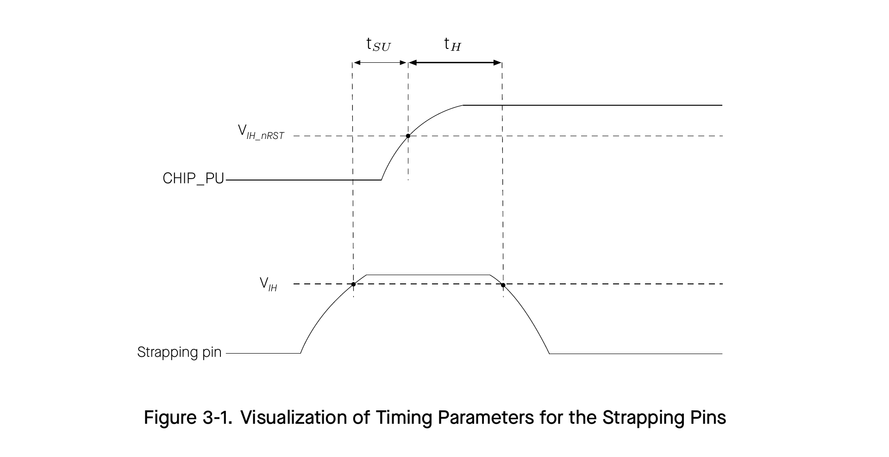

# 3 Boot Configurations

The chip allows for configuring the following boot parameters through strapping pins and eFuse bits at power-up or a hardware reset, without microcontroller interaction.

- Chip boot mode
  - Strapping pin: GPIO35, GPIO36, GPIO37 and GPIO38
- VDDO_FLASH Voltage
  - eFuse bit: EFUSE_OPXA_TIEH_SEL_O
- ROM message printing
  - Strapping pin: GPIO36
  - eFuse bit: EFUSE_UART_PRINT_CONTROL
- JTAG signal source
  - Strapping pin: GPIO34
  - eFuse bit: EFUSE_DIS_PAD_JTAG, EFUSE_DIS_USB_JTAG, and EFUSE_JTAG_SEL_ENABLE

The default values of all the above eFuse bits are 0, which means that they are not burnt. Given that eFuse is one-time programmable, once an eFuse bit is programmed to 1, it can never be reverted to 0.

The default values of the strapping pins, namely the logic levels, are determined by pins’ internal weak pull-up/pull-down resistors at reset if the pins are not connected to any circuit, or connected to an external high-impedance circuit.

Table 3-1. Default Configuration of Strapping Pins

| Strapping Pin | Default Configuration | Bit Value |
| --- | --- | --- |
| GPIO34 | Floating | – |
| GPIO35 | Weak pull-up | 1 |
| GPIO36 | Floating | – |
| GPIO37 | Floating | – |
| GPIO38 | Floating | – |

To change the bit values, the strapping pins should be connected to external pull-down/pull-up resistors. If the ESP32-P4 is used as a device by a host MCU, the strapping pin voltage levels can also be controlled by the host MCU.

All strapping pins have latches. At chip reset, the latches sample the bit values of their respective strapping pins and store them until the chip is powered down or shut down. The states of latches cannot be changed in any other way. It makes the strapping pin values available during the entire chip operation, and the pins are freed up to be used as regular IO pins after reset.

The timing of signals connected to the strapping pins should adhere to the setup time and hold time specifications in Table 3-2 and Figure 3-1.

Table 3-2. Description of Timing Parameters for the Strapping Pins

| Parameter | Description | Min (ms) |
| --- | --- | --- |
| tSU | Setup time is the time reserved for the power rails to stabilize before the CHIP_PU pin is pulled high to activate the chip. | 0 |
| tH | Hold time is the time reserved for the chip to read the strapping pin values after CHIP_PU is already high and before these pins start operating as regular IO pins. | 3 |

## 3.1 Chip Boot Mode Control

GPIO35–GPIO38 control the boot mode after the reset is released. See Table 3-3 Chip Boot Mode Control.

Table 3-3. Boot Mode Control

| Boot Mode | GPIO35 | GPIO36 | GPIO37^3 | GPIO38^3 |
| --- | --- | --- | --- | --- |
| SPI Boot | 1 | Any value | Any value | Any value |
| Joint Download Boot^2 | 0 | 1 | Any value | Any value |

1 Bold marks the default value and configuration.

2 Joint Download Boot mode supports the following download methods:

- USB Download Boot:
  - USB-Serial-JTAG Download Boot
  - USB 2.0 OTG Download Boot (only the USB OTG HS controller can be used for flashing at FS speed; the USB OTG FS controller does not support device firmware upgrade)
- UART Download Boot
- SPI Slave Download Boot

3 For details about the functionalities of GPIO37 and GPIO38, see ESP32-P4 Technical Reference Manual > Chapter Chip Boot Control.

In SPI Boot mode, the ROM bootloader loads and executes the program from SPI flash to boot the system.

In Joint Download Boot mode, users can download binary files into flash using USB, UART0, or SPI slave interface. It is also possible to download binary files into L2MEM and execute them from L2MEM.

In addition to SPI Boot and Joint Download Boot modes, ESP32-P4 also supports SPI Download Boot mode. For details, please see ESP32-P4 Technical Reference Manual > Chapter Chip Boot Control.

## 3.2 VDDO_FLASH Voltage Control

ESP32-P4 supplies power to flash via VDDO_FLASH, which outputs 3.3 V by default. After burning EFUSE_OPXA_TIEH_SEL_O, the output changes to 1.8 V.

Table 3-4. VDDO_FLASH Voltage Control

| VDDO_FLASH power source^2 | EFUSE_OPXA_TIEH_SEL_O | Voltage |
| --- | --- | --- |
| Flash LDO | 0 | 3.3 V |
| Flash LDO | 2 | 1.8 V |

1 Bold marks the default value and configuration.

2 See Section 2.6.2 Power Scheme.

## 3.3 ROM Messages Printing Control

During the boot process, the messages by the ROM code can be printed to:

- (Default) UART0 and USB Serial/JTAG controller
- USB Serial/JTAG controller
- UART0

EFUSE_UART_PRINT_CONTROL and GPIO36 control ROM messages printing to UART0 as shown in Table 3-5 UART0 ROM Message Printing Control.

Table 3-5. UART0 ROM Message Printing Control

| UART0 ROM Code Printing | EFUSE_UART_PRINT_CONTROL | GPIO36 |
| --- | --- | --- |
| Enabled | 0 | Ignored |
| Enabled | 1 | 0 |
| Enabled | 2 | 1 |
| Disabled | 1 | 1 |
| Disabled | 2 | 0 |
| Disabled | 3 | Ignored |

1 Bold marks the default value and configuration.

EFUSE_DIS_USB_SERIAL_JTAG_ROM_PRINT controls the printing to USB Serial/JTAG controller as shown in Table 3-6 USB Serial/JTAG ROM Message Printing Control.

Table 3-6. USB Serial/JTAG ROM Message Printing Control

| USB Serial/JTAG ROM Code Printing | EFUSE_DIS_USB_SERIAL_JTAG_ROM_PRINT |
| --- | --- |
| Enabled | 0 |
| Disabled | 1 |

1 Bold marks the default value and configuration.

## 3.4 JTAG Signal Source Control

The strapping pin GPIO34 can be used to control the source of JTAG signals during the early boot process. This pin does not have any internal pull resistors and the strapping value must be controlled by the external circuit that cannot be in a high impedance state.

As Table 3-7 JTAG Signal Source Control shows, GPIO34 is used in combination with EFUSE_DIS_PAD_JTAG, EFUSE_DIS_USB_JTAG, and EFUSE_JTAG_SEL_ENABLE.

Table 3-7. JTAG Signal Source Control

| JTAG Signal Source | EFUSE_DIS_PAD_JTAG | EFUSE_DIS_USB_JTAG | EFUSE_JTAG_SEL_ENABLE | GPIO34 |
| --- | --- | --- | --- | --- |
| USB Serial/JTAG Controller | 0 | 0 | 0 | Ignored |
| USB Serial/JTAG Controller | 0 | 0 | 1 | 1 |
| USB Serial/JTAG Controller | 1 | 0 | Ignored | Ignored |
| JTAG pins^2 | 0 | 0 | 1 | 0 |
| JTAG pins^2 | 0 | 1 | Ignored | Ignored |
| JTAG is disabled | 1 | 1 | Ignored | Ignored |

1 Bold marks the default value and configuration.

2 JTAG pins refer to MTDI, MTCK, MTMS, and MTDO.
