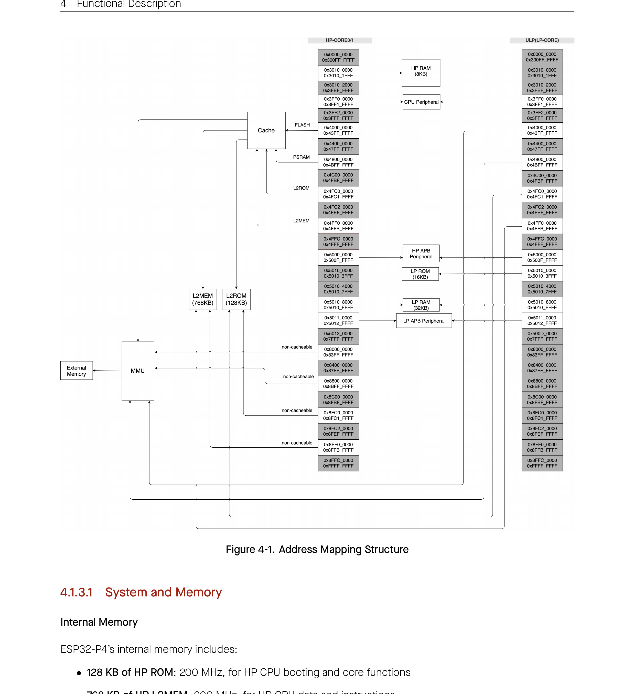

# 4 Functional Description

## 4.1.3.1 System and Memory

### Internal Memory

ESP32-P4’s internal memory includes:

- 128 KB of HP ROM: 200 MHz, for HP CPU booting and core functions
- 768 KB of HP L2MEM: 200 MHz, for HP CPU data and instructions
- 16 KB of LP ROM: 40 MHz, for LP CPU booting and core functions
- 32 KB of LP SRAM: 40 MHz, for LP CPU data and instructions
- 4 Kbit of eFuse: 1792 bits are reserved for user data, such as encryption key and device ID
- 8 KB of SPM (Scratchpad Memory): 360 MHz, for HP CPU fast access

### In-package PSRAM

- The size of PSRAM is detailed in Section 1 *ESP32-P4 Series Comparison*
- Maximum clock frequency: 200 MHz
- Supports up to 64 MB storage
- Supports hardware XTS-AES encryption/decryption, protecting programs and data stored in PSRAM
- Through a cache, it can map 64 KB blocks into a 64 MB instruction or data space, supporting 8-bit, 16-bit, 32-bit, and 128-bit read and write operations

### External Memory

ESP32-P4 allows connection to memories outside the chip’s package via the SPI, Dual SPI, Quad SPI, and QPI interfaces. The maximum clock frequency is 120 MHz.

The external flash can be mapped into the CPU instruction memory space and read-only data memory space. ESP32-P4 supports up to 64 MB of external flash, and hardware encryption/decryption based on XTS-AES to protect users’ programs and data in flash.

Through high-speed caches, ESP32-P4 can support at a time up to:

- External flash mapped into 64 MB instruction space as individual blocks of 64 KB
- External flash can also be mapped into 64 MB data space as individual blocks of 64 KB, supporting 8-bit, 16-bit, 32-bit, and 128-bit reads.

> **Note:**
> After ESP32-P4 is initialized, firmware can customize the mapping of external flash into the CPU address space.

## 4.1.3.2 eFuse Controller

ESP32-P4 contains a 4096-bit eFuse memory to store parameters and user data. The parameters include control parameters for some hardware modules, system data parameters and keys used for the encryption/decryption module. Once an eFuse bit is programmed to 1, it can never be reverted to 0.

### Feature List

- 4096-bit one-time programmable memory (including up to 1792 bits reserved for custom use)
- Configurable write protection
- Configurable read protection
- Various hardware encoding schemes against data corruption

## 4.1.3.3 Cache

ESP32-P4 employs the two-level cache structure.

### Feature List

- 16 KB of L1 instruction cache, 64 B of block size, four-way set associative
- 64 KB of L1 data cache, 64 B of block size, two-way set associative, supporting two writing strategies write-through and write-back
- 128 KB/256 KB/512 KB of L2 cache, 64 B/128 B of block size, eight-way set associative
- Cacheable and non-cacheable access
- Pre-load function
- Lock function
- Critical word first and early restart

## 4.1.4 System Components

This subsection describes the essential components that contribute to the overall functionality and control of the system.

### 4.1.4.1 GPIO Matrix and IO MUX

The ESP32-P4 chip features 55 GPIO pins, including 16 low-power (LP) GPIO pins and 39 high-performance (HP) GPIO pins. Each pin can be used as a general-purpose I/O, or be connected to an internal peripheral signal.

- Through HP GPIO matrix and HP IO MUX, HP peripheral input signals can be from any GPIO pins, and HP peripheral output signals can be routed to any GPIO pins.
- Through LP GPIO matrix and LP IO MUX, LP peripheral input signals can be from any LP GPIO pins, and LP peripheral output signals can be routed to any LP GPIO pins.

Together these modules provide highly configurable I/O. The 55 GPIO pins are numbered from GPIO0 to GPIO54.

- LP GPIO pins (GPIO0–GPIO15) can be used by either HP or LP peripherals.
- HP GPIO pins (GPIO16–GPIO54) can be used only by HP peripherals.

#### Feature List

HP GPIO matrix has the following features:

- A full-switching matrix between HP peripheral input/output signals and the GPIO pins
- 222 HP peripheral input signals sourced from the input of any GPIO pins
- 232 HP peripheral output signals routed to the output of any GPIO pins
- Signal synchronization for HP peripheral inputs based on HP IO MUX operating clock
- GPIO Filter hardware for input signal filtering
- Glitch Filter hardware for second-time filtering on input signal
- Sigma delta modulated (SDM) output
- GPIO simple input and output
- HP GPIO Wakeup

HP IO MUX has the following features:

- Control of 55 GPIOs (GPIO0–GPIO54) for HP peripherals.
- A configuration register provided for each GPIO pin, to control the pin’s input/output, pull-up/pull-down, drive strength, and function selection.
- Better high-frequency digital performance achieved by routing some digital signals (SPI, EMAC) directly from HP IO MUX to peripherals.

LP GPIO matrix has the following features:

- A full-switching matrix between the LP peripheral input/output signals and the LP GPIO pins
- 14 LP peripheral input signals sourced from the input of any LP GPIO pins
- 14 LP peripheral output signals routed to the output of any LP GPIO pins
- GPIO Filter hardware for input signal filtering
- GPIO simple input and output
- LP GPIO Wakeup

LP IO MUX has the following feature:

- Control of 16 LP GPIO pins (GPIO0–GPIO15) for LP peripherals.
- A configuration register provided for each LP GPIO pin, to control the pin’s input/output, pull-up/pull-down, drive strength, function selection, and IO MUX selection.

### 4.1.4.2 Reset

ESP32-P4 provides four types of reset that occur at different levels, namely CPU Reset, Core Reset, System Reset, and Chip Reset. All reset types mentioned above (except Chip Reset) preserve the data stored in internal memory.

- Four reset types:
  - CPU Reset: resets CPU core. HP CPU0, HP CPU1, and LP CPU can be reset independently:
    - HP CPU0 will be automatically released from reset after chip power-up.
    - HP CPU1 is at reset by default after chip power-up, and needs to be manually released from reset.
    - LP CPU is at reset after chip power-up, and needs to be manually released from reset by configuring the power management unit (PMU).
  - Core Reset: resets the whole digital system except for LP AON. HP core and LP core can be reset independently: HP Core Reset resets HP CPU0, HP CPU1, HP peripherals, HP GPIO, etc., and LP Core Reset resets LP CPU and LP peripherals.
  - System Reset: resets the whole digital system, including the LP system.
  - Chip Reset: resets the whole chip.
- Software reset and hardware reset:
  - Software Reset: triggered via software by configuring the corresponding registers of CPU.
  - Hardware Reset: triggered directly by the hardware.

### 4.1.4.3 Clock

ESP32-P4 clocks are mainly sourced from oscillator (OSC, including Resistor-Capacitor circuit), crystal (XTAL), and PLL circuit, and then processed by the dividers or selectors, which allows most functional modules to select their working clock according to their power consumption and performance requirements.

ESP32-P4 clocks can be classified into two types depending on their frequencies:

- High speed clocks for devices working at a higher frequency, such as HP CPU0/1 and digital peripherals
  - `CPLL_CLK`: internal 360 MHz PLL clock. Its reference clock is `XTAL_CLK`
  - `MPLL_CLK`: internal 500 MHz PLL clock. Its reference clock is `XTAL_CLK`
  - `SPLL_CLK`: internal 480 MHz PLL clock. Its reference clock is `XTAL_CLK`
- Slow speed clocks for LP system and some peripherals working in low-power mode
  - `XTAL32K_CLK`: external 32 kHz crystal clock
  - `RC_SLOW_CLK`: internal slow RC oscillator with adjustable frequency (150 kHz by default)
  - `OSC_SLOW_CLK`: external slow clock input through `XTAL_32K_N`, with a frequency of 32 kHz by default. After configuring this GPIO, also configure the Hold function
  - `XTAL_CLK`: 40 MHz external crystal clock
  - `RC_FAST_CLK`: internal fast RC oscillator with adjustable frequency (20 MHz by default)
  - `PLL_LP_CLK`: internal PLL clock with a frequency of 8 MHz by default. Its reference clock can be `XTAL32K_CLK`

### 4.1.4.4 Interrupt Matrix

The Interrupt Matrix in the ESP32-P4 chip routes interrupt requests generated by various peripherals to CPU interrupts.

#### Feature List

- 126 peripheral interrupt sources accepted as input
- 32 HP CPU0 peripheral interrupts and 32 HP CPU1 peripheral interrupts generated to HP CPU as output
- Current interrupt status query of peripheral interrupt sources
- Multiple interrupt sources mapping to a single HP CPU0 or HP CPU1 interrupt (i.e., shared interrupts)

### 4.1.4.5 Event Task Matrix

The Event Task Matrix (ETM) peripheral contains 50 configurable channels. Each channel can map an event of any specified peripheral to a task of any specified peripheral. In this way, peripherals can be triggered to execute specified tasks without CPU intervention.

#### Feature List

- Receive various events from multiple peripherals
- Generate various tasks for multiple peripherals
- 50 independently configurable ETM channels
- An ETM channel can be set up to receive any event, and map it to any task
- Each ETM channel can be enabled independently. If not enabled, the channel will not respond to the configured event and generate the task mapped to that event
- Support for checking event and task status
- Peripherals supporting ETM include GPIO, LED PWM, general-purpose timers, RTC Timer, system timer, MCPWM, temperature sensor, ADC, I2S, LP CPU, GDMA-AHB, GDMA-AXI, 2D DMA, and PMU

### 4.1.4.6 Low-Power Management

With advanced power-management technologies, ESP32-P4 can switch between different power modes.

- Active mode: CPU and all peripherals are powered on.
- Light-sleep mode: CPU is paused. Any wake-up events (host, RTC timer, or external interrupts) will wake up the chip. CPU (excluding L2MEM) and most peripherals (See ESP32-P4 Block Diagram) can also be powered down based on requirements to further reduce power consumption.
- Deep-sleep mode: CPU (including L2MEM) and most peripherals (See ESP32-P4 Block Diagram) are powered down. Only the LP memory is powered on, and some peripherals of the LP system can be powered down based on requirements.

### 4.1.4.7 System Timer

ESP32-P4 provides a 52-bit system timer, which can be used to generate tick interrupts for the operating system, or be used as a general timer to generate periodic interrupts or one-time interrupts.

#### Feature List

- Two 52-bit counters and three 52-bit comparators
- Software accessing registers clocked by APB_CLK
- CNT_CLK used for counting, with an average frequency of 16 MHz in two counting cycles
- 40 MHz XTAL_CLK as the clock source of CNT_CLK
- 52-bit alarm values (t) and 26-bit alarm periods (δt)
- Two modes to generate alarms:
  - Target mode: only a one-time alarm is generated based on the alarm value (t)
  - Period mode: periodic alarms are generated based on the alarm period (δt)
- Three comparators generating three independent interrupts based on configured alarm value (t) or alarm period (δt)
- Software configuring the reference count value. For example, the system timer is able to load back the sleep time recorded by RTC timer via software after Light-sleep
- Able to stall or continue running when CPU stalls or enters the on-chip-debugging mode
- Alarm for Event Task Matrix (ETM) event

### 4.1.4.8 Timer Group (TIMG)

ESP32-P4 chip contains two timer groups. Each timer group consists of two general-purpose timers and one Main System Watchdog Timer (MWDT). The general-purpose timer is based on a 16-bit prescaler and a 54-bit auto-reload-capable up-down counter.

#### Feature List

- A 54-bit time-base counter programmable to incrementing or decrementing
- Three clock sources: PLL_F80M_CLK or XTAL_CLK or RC_FAST_CLK
- A 16-bit clock prescaler, from 2 to 65536
- Able to read real-time value of the time-base counter
- Able to halt and resume the time-base counter
- Programmable alarm generation
- Timer value reload —Auto-reload at alarm or software-controlled instant reload
- Calculate clock frequency — Calculate the measured frequency of the clock based on the crystal clock
- Level interrupt generation
- Support several ETM tasks and events

### 4.1.4.9 Watchdog Timers (WDT)

ESP32-P4 contains three digital watchdog timers: one in each of the two timer groups (called Main System Watchdog Timers, or MWDT) and one in the LP system (called the RTC Watchdog Timer, or RWDT).

In SPI Boot mode, RWDT and the MWDT in timer group 0 are enabled automatically in order to detect errors that may occur during the flash boot process and facilitate recovery.

ESP32-P4 also has one analog watchdog timer: Super watchdog (SWD). It is an ultra-low-power circuit in analog domain that helps to prevent the system from operating in a sub-optimal state and resets the system if required.

#### Feature List

- Four stages, each with a separately programmable timeout value and timeout action
- Timeout actions:
  - MWDT: interrupt, HP CPU reset, HP core reset
  - RWDT: interrupt, HP CPU reset, HP core reset, system reset
- Flash boot protection under SPI Boot mode at stage 0:
  - MWDTO: HP core reset upon timeout
  - RWDT: system reset upon timeout
- Write protection that makes WDT register read only unless unlocked
- 32-bit timeout counter
- Clock source:
  - MWDT: PLL_F80M_CLK, RC_FAST_CLK or XTAL_CLK
  - RWDT: LP_DYN_SLOW_CLK

### 4.1.4.10 RTC Timer

RTC Timer is an important module for implementing low power management of ESP32-P4. Based on a 48-bit readable counter, RTC Timer is mainly used as a system timer in low power mode when the timer peripheral in the HP system is unavailable. It also allows for configuring timer interrupts and logging the time when specific events happen in the system.

#### Feature List

- 48-bit counter
- Time logging when one of the following events happens:
  - HP system reset
  - CPU enters stall state
  - CPU exits stall state
  - Crystal powers up
  - Crystal powers down
- Time logging through register configuration
- Occurrence time cached of the most recent two specific events
- Generation of interrupts at target times, which are configurable. It is also possible to configure two target times simultaneously.
- Uninterrupted operation during any reset or sleep mode, except for power-on reset of LP system.

### 4.1.4.11 Permission Control (PMS)

ESP32-P4 integrates an APM module to manage access permissions.

#### Feature List

- Up to 32 configurable address ranges for each DMA master
- Access permission management for each CPU core to access internal memory, external memory, and peripheral registers
- Support for interrupts
- Support for exception information record

### 4.1.4.12 System Registers

The System Registers in the ESP32-P4 chip are used to configure various auxiliary chip features.

#### Feature List

- Control External memory encryption and decryption
- Control HP core/LP core debugging
- Control Bus timeout protection

### 4.1.4.13 Debug Assistant

The Debug Assistant provides a set of functions to help locate bugs and issues during software debugging. It offers various monitoring capabilities and logging features to assist in identifying and resolving software errors efficiently.

#### Feature List

- Read/write monitoring: Monitors whether the High-Performance dual-core CPU (HP CPU0 and HP CPU1) bus reads from or writes to a specified memory address space. A detected read or write in the monitored address space will trigger an interrupt.
- Stack pointer (SP) monitoring: Monitors whether the SP exceeds the specified address space. A bounds violation will trigger an interrupt.
- Program counter (PC) logging: Records the PC value. The developer can get the last PC value at the most recent reset of HP CPU0 or HP CPU1.
- Bus access logging: Records the information about bus access. When the HP CPU0, HP CPU1, or the Direct Memory Access controller (DMA) writes a specified value, the Debug Assistant module will record the data type, address of this write operation, and additionally the PC value when the write is performed by HP CPU0 or HP CPU1, and push such information to the HP L2MEM.

### 4.1.4.14 LP Mailbox

ESP32-P4 integrates an LP Mailbox module which provides an efficient inter-core communication mechanism between the LP CPU and HP CPU0/1. The LP Mailbox module comprises of sixteen 32-bit message registers that the LP CPU and HP CPU0/1 can use to store and exchange message. Inter-core communication between LP CPU and HP CPU0/1 is achieved through an interrupt mechanism implemented within the LP Mailbox module.

#### Feature List

- Sixteen 32-bit message registers for inter-core communication
- LP CPU external interrupt signal
- HP CPU0/1 external interrupt signal

### 4.1.4.15 Brown-out Detector

With the Brown-out detector, ESP32-P4 monitors the voltage levels of pins VDD_ANA and VDD_BAT. If the voltage on these pins drops below the predefined threshold (defaulting to 2.7 V), the detector triggers signals to shut down certain power-consuming blocks (e.g., flash), ensuring that the digital module has sufficient time to save and transfer important data.

#### Feature List

- Monitors the voltage level of pins VDD_ANA and VDD_BAT
- Two configurable monitoring modes
  - Mode 0: The brown-out detector triggers interrupts when the brown-out counter reaches the predefined threshold and selects the reset mode according to the configuration.
  - Mode 1: The brown-out detector triggers a system reset when the voltage falls below the threshold.
- Configurable voltage-monitoring thresholds and noise tolerance
- Configurable handling modes for under-voltage events

## 4.1.5 Cryptography/Security Component

This subsection describes the security features incorporated into the chip, which safeguard data and operations.

### 4.1.5.1 AES Accelerator (AES)

ESP32-P4 integrates an Advanced Encryption Standard (AES) accelerator, which is a hardware device that speeds up computation using AES algorithm significantly, compared to AES algorithms implemented solely in software. The AES accelerator integrated in ESP32-P4 has two working modes, which are Typical AES and DMA-AES.

#### Feature List

- Typical AES working mode
  - AES-128/AES-256 encryption and decryption
- DMA-AES working mode
  - AES-128/AES-256 encryption and decryption
  - Block cipher mode
    - ECB (Electronic Codebook)
    - CBC (Cipher Block Chaining)
    - OFB (Output Feedback)
    - CTR (Counter)
    - CFB8 (8-bit Cipher Feedback)
    - CFB128 (128-bit Cipher Feedback)
