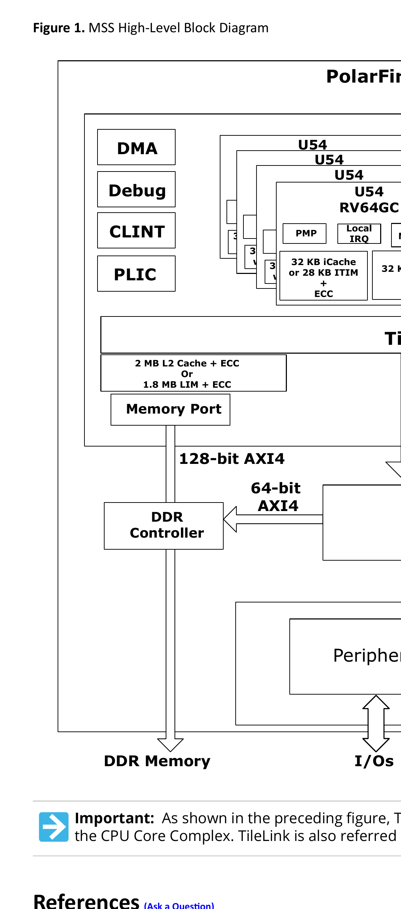

# Introduction

The PolarFire® SoC family offers the industry's first RISC-V® based SoC FPGAs. The PolarFire SoC family combines a powerful 64-bit 5x core RISC-V Microprocessor Sub-System (MSS), based on SiFive’s U54-MC family, with the PolarFire FPGA fabric in a single device. Packed with this powerful combination, PolarFire SoC devices offer the scalable features of FPGAs and high-performance of ASICs. Only the FPGA fabric resources vary and the MSS remains the same across PolarFire SoC device variants, making these devices ideal for a variety of applications. PolarFire SoC FPGAs are ideal for running full-fledged Operating Systems (like Linux®) using MSS.

This manual covers the PolarFire SoC MSS architecture and its functional blocks—the CPU Core Complex, AXI Switch, MSS peripherals, Fabric interfaces, and MSS DDR controller. For information about configuring MSS, see Standalone MSS Configurator User Guide for PolarFire SoC. For information about PolarFire SoC software development and tool flow, and MSS booting, see PolarFire SoC Software Development and Tool Flow User Guide.

> **Important:** The AXI protocol standard uses the terminology “Master” and “Slave”. The equivalent Microchip terminology is “Initiator” and “Target”, respectively.

The following figure shows the MSS block at a high-level. For more details, see Figure 2-1.

# References

- For information about MSS simulation, see MSS Simulation User Guide for PolarFire SoC.
- For information about configuring MSS and its peripherals, see Standalone MSS Configurator User Guide for PolarFire SoC.
- For information about PolarFire SoC software development and tool flow, see PolarFire SoC Software Development and Tool Flow User Guide.
- For information about Embedded software development (PolarFire SoC baremetal and Linux sample projects), see PolarFire SoC GitHub.
- For more information about how the MSS communicates with System Controller, see PolarFire Family System Services User Guide.
- For information about how MSS boots and different boot modes, see PolarFire Family Power-Up and Resets User Guide.
- For information about other PolarFire SoC FPGA features, see the PolarFire SoC Documentation web page.

# Table of Contents

- Introduction ........................................................................................................................ 1
- References .......................................................................................................................... 2
- 1. PolarFire SoC MSS Features ....................................................................................... 6
- 2. Detailed Block Diagram ................................................................................................. 7
- 3. Functional Blocks ........................................................................................................... 9
  - 3.1. CPU Core Complex ............................................................................................... 9
  - 3.2. AXI Switch ............................................................................................................ 40
  - 3.3. Fabric Interface Controllers (FICs) ...................................................................... 43
  - 3.4. Memory Protection Unit ...................................................................................... 43
  - 3.5. Segmentation Blocks ............................................................................................ 45
  - 3.6. AXI-to-AHB ........................................................................................................... 46
  - 3.7. AHB-to-APB ........................................................................................................... 46
  - 3.8. Asymmetric Multi-Processing (AMP) APB Bus ................................................... 47
  - 3.9. MSS I/Os .............................................................................................................. 48
  - 3.10. User Crypto Processor ........................................................................................ 49
  - 3.11. MSS DDR Memory Controller ............................................................................ 49
  - 3.12. Peripherals .......................................................................................................... 59
- 4. System Registers ........................................................................................................ 112
- 5. Interrupts ..................................................................................................................... 113
  - 5.1. Interrupt CSRs .................................................................................................... 117
  - 5.2. Supervisor Mode Interrupts ............................................................................... 121
  - 5.3. Interrupt Priorities ............................................................................................... 124
  - 5.4. Interrupt Latency ................................................................................................. 124
  - 5.5. Platform Level Interrupt Controller .................................................................... 125
  - 5.6. Core Local Interrupt Controller .......................................................................... 129
- 6. Fabric Interface Controller ...................................................................................... 131
  - 6.1. Overview ............................................................................................................... 131
  - 6.2. FIC Reset .............................................................................................................. 132
  - 6.3. Timing Diagrams .................................................................................................. 132
  - 6.4. Configuring FICs .................................................................................................. 133
- 7. Boot Process ............................................................................................................... 134
  - 7.1. Boot Modes Fundamentals .................................................................................. 134
- 8. Resets .......................................................................................................................... 144
- 9. Clocking ...................................................................................................................... 145
- 10. MSS Memory Map .................................................................................................... 146
- 11. Appendix A: Acronyms ............................................................................................ 149
- 12. Revision History ...................................................................................................... 152
