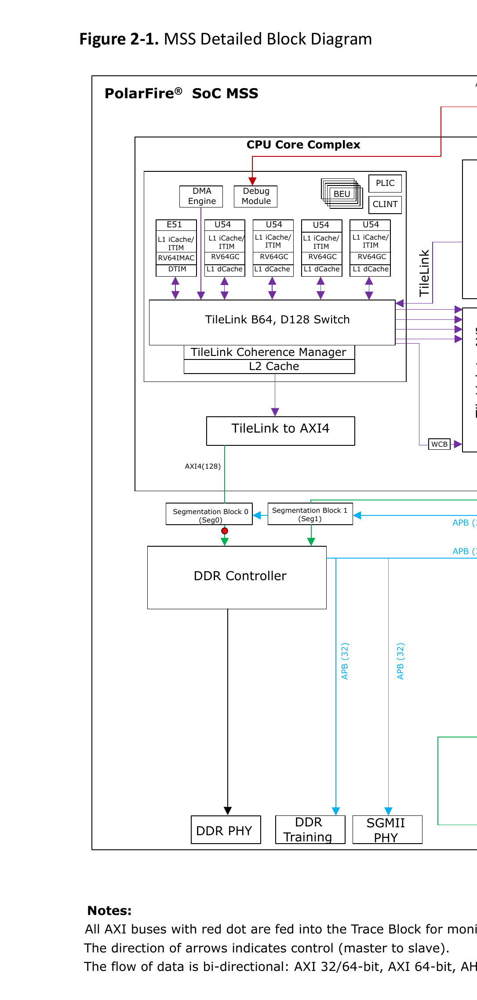

# 2. Detailed Block Diagram

The MSS includes the following blocks:

- CPU Core Complex
- AXI Switch
- Fabric Interface Controllers (FICs)
- Memory Protection Unit
- Segmentation Blocks
- AXI-to-AHB
- AHB-to-APB
- Asymmetric Multi-Processing (AMP) APB Bus
- MSS I/Os
- User Crypto Processor
- MSS DDR Memory Controller
- Peripherals

The following figure shows the functional blocks of the MSS in detail, the data flow from the CPU Core Complex to peripherals and vice versa.

**Notes:**

- All AXI buses with red dot are fed into the Trace Block for monitoring
- The direction of arrows indicates control (master to slave).
- The flow of data is bi-directional: AXI 32/64-bit, AXI 64-bit, AHB 32-bit, APB 32-bit.

**Legend:**

- Purple arrow: Coherence Manager (CM) Link
- Orange arrow: AXI Master
- Green arrow: AXI Slave
- Dark blue arrow: AHB
- Light blue arrow: APB
