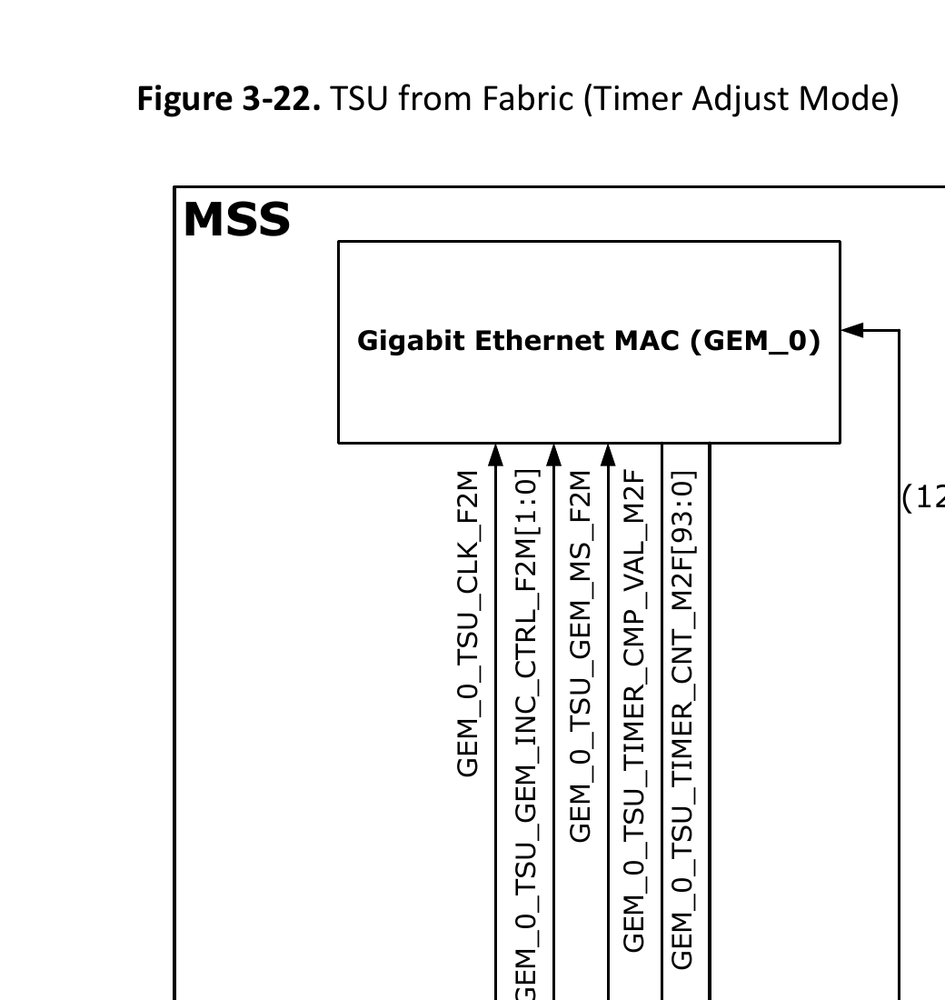
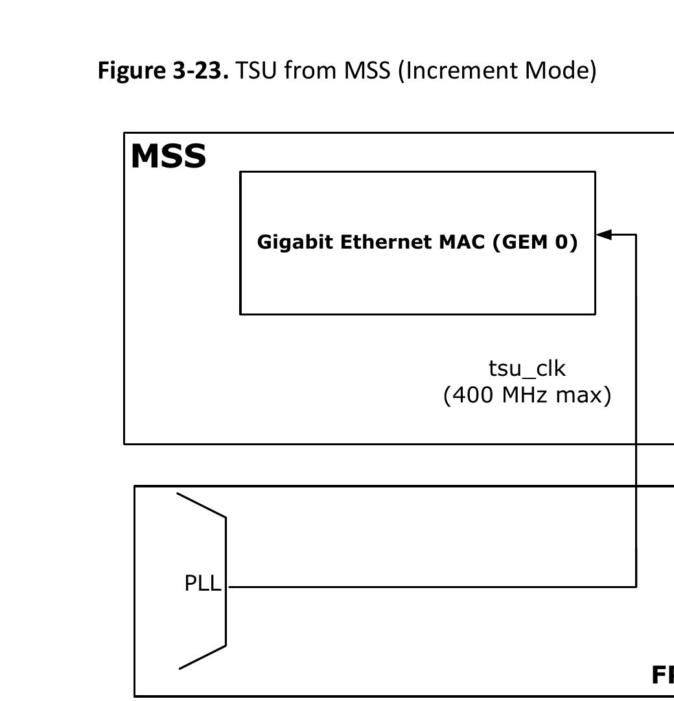
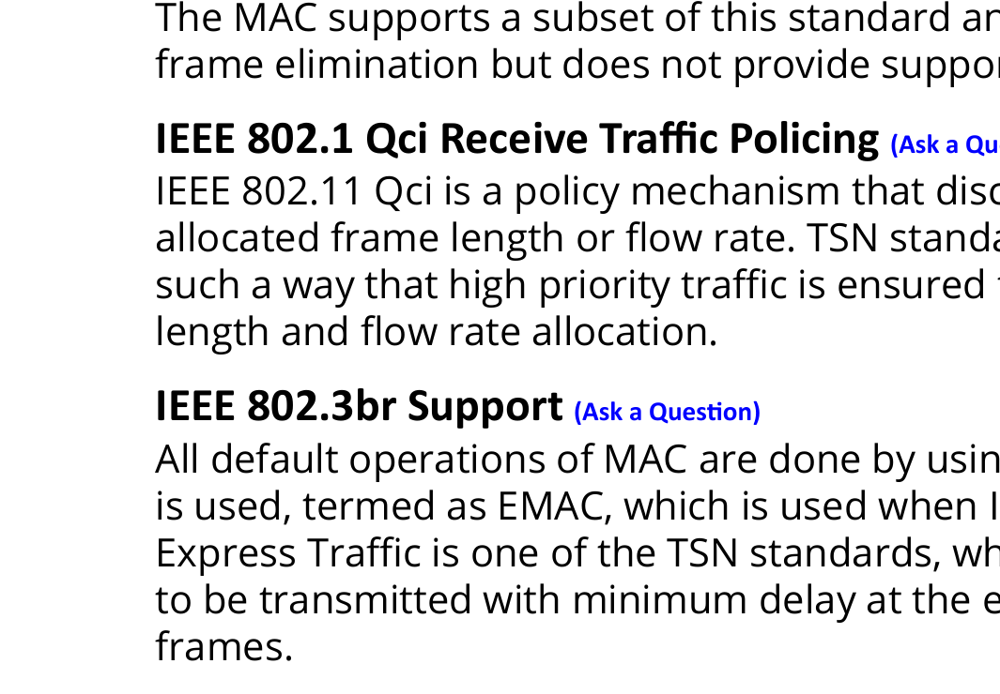

# 3.12.2.4.1. MAC Transmitter

The upper transmit queue base address register at 0x04c8 is used to set the upper 32 bits of the transmit buffer descriptor queue base address. All the descriptors must be located within a region of memory that does not cross a 4 GB region. The actual 32 bits, chosen for the upper bits, are programmed in the upper receive queue base address register at 0x04c8.

To transmit frames, the buffer descriptors must be initialized by writing an appropriate byte address to bits 31:0 in the first word of each descriptor list entry to indicate the location of the data to be transmitted.

The second word of the transmit buffer descriptor is initialized with control information that indicates the length of the frame, whether or not the MAC is to append CRC and whether the buffer is the last buffer in the frame. It also contains the “used” and “wrap” bits. It is very important that the transmit buffer descriptor list contains at least one entry with its “used” bit set. This is because the transmit DMA can read the buffer descriptor list very fast and will loop round retransmitting data when it encounters the wrap bit. When initializing the descriptor list the user needs to add an additional buffer descriptor with its “used” bit set after the buffer descriptors which describe the data to be transmitted.

The following table lists the transmit buffer descriptor entry.

**Table 3-58. Transmit Buffer Descriptor Entry**

| Bit | Function |
| --- | --- |
| Word 0 |  |
| 31:0 | Byte address of the buffer |
| Word 1 |  |
| 31 | Used – must be zero for GEM to read data to the transmit buffer. GEM sets this to one for the first buffer of a frame once it has been successfully transmitted. Software must clear this bit before the buffer can be used again. |
| 30 | Wrap – marks last descriptor in transmit buffer descriptor list. This can be set for any buffer within the frame. |
| 29 | Retry limit exceeded, transmit error detected |
| 28 | Transmit underrun. Occurs when the start of packet data has been written into the FIFO and either the transmit data could not be fetched in time, or when buffers are exhausted. This is not set when the DMA is configured for packet buffer mode. |
| 27 | Transmit frame corruption due to AXI error – set if an error occurs whilst midway through reading transmit frame from the AXI, and RRESP/BRESP errors and buffers exhausted mid frame (if the buffers run out during transmission of a frame then transmission stops, Frame Check Sequence (FCS) shall be bad and tx_er asserted). |
| 26 | Late collision, transmit error detected. Late collisions only force this status bit to be set in gigabit mode. |
| 25:24 | Reserved |
| 23 | Reserved |

**Table 3-58. Transmit Buffer Descriptor Entry (continued)**

| Bit | Function |
| --- | --- |
| 22:20 | Transmit IP/TCP/UDP checksum generation offload errors:<br>- 000 - No Error<br>- 001 - The Packet was identified as a VLAN type, but the header was not fully complete, or had an error in it<br>- 010 - The Packet was identified as a SNAP type, but the header was not fully complete, or had an error in it<br>- 011 - The Packet was not of an IP type, or the IP packet was invalidly short, or the IP was not of type IPv4/IPv6<br>- 100 - The Packet was not identified as VLAN, SNAP, or IP<br>- 101 - Non supported packet fragmentation occurred. For IPv4 packets, the IP checksum was generated and inserted<br>- 110 - Packet type detected was not TCP or UDP. TCP/UDP checksum was therefore not generated. For IPv4 packets, the IP checksum was generated and inserted<br>- 111 - A premature end of packet was detected and the TCP/UDP checksum could not be generated |
| 19:17 | Reserved. Must be set to 3'b000 to disable TSO and UFO |
| 16 | No CRC to be appended by MAC. When set, this implies that the data in the buffers already contains a valid CRC and hence no CRC or padding is to be appended to the current frame by the MAC. This control bit must be set for the first buffer in a frame and is ignored for the subsequent buffers of a frame. This bit must be clear when using the transmit IP/TCP/UDP checksum generation offload, otherwise checksum generation and substitution will not occur. **Note:** This bit must also be cleared when TX Partial Store and Forward mode is active. |
| 15 | Last buffer. When set, this bit indicates the last buffer in the current frame is reached. |
| 14 | Reserved |
| 13:0 | Length of the buffer |

## 3.12.2.4.2. MAC Receiver

The MAC receiver block receives data using MII, GMII, or SGMII interface and stores the data in the RX packet buffer. Using RX DMA controller, data from the RX packet buffer is read and transferred to the memory using AXI interface.

The MAC receive block checks for valid preamble, FCS, alignment, and length, and presents received frames to the MAC address checking block. Firmware can configure GEM to receive jumbo frames up to 10,240 bytes.

The address checker identifies the following:

- Four source or destination specific 48-bit addresses
- Four different types of ID values
- A 64-bit hash register for matching multi-cast and unicast addresses as required.
- Broadcast address of all ones, copy all frames and act on external address matching signals.

Supports offloading of IP, TCP, and UDP checksum calculations (both IPv4 and IPv6 packet types are supported) and can automatically discard frames with a bad checksum. As the MAC supports TSN features, it identifies 802.1CB streams and automatically eliminates duplicate frames. Statistics are provided to report counts of rogue and out-of-order frames, latent errors, and the timer reset events.

Broadcast address of all ones, copy all frames and act on external address matching signals.

During frame reception, if the frame is too long, a bad frame indication is sent to the DMA controller and the receiver logic does not store that frame in the internal DMA buffer. At the end of frame reception, the receive block indicates to the DMA block whether the frame is good or bad. The DMA block recovers the current receive buffer if the frame is bad.

### Receive DMA Buffers

Received frames, optionally including FCS, are written to receive buffers in the AXI memory. The receive buffer depth is 16384 bytes.

The start location of each receive buffer is stored as a list of receive buffer descriptors. The receive buffer queue pointer stores the address of each buffer descriptor. The base address for the receive buffer queue pointer is configured in software using the receive buffer queue base address register at 0x04d4 location. This register is used to set the upper 32 bits of the base address of the descriptor. With 64-bit addressing, there is a restriction that all the descriptors must be located within a region of memory that does not cross a 4 GB region, in other words the upper 32 bits of the 64-bit address must be fixed. This is only true of the descriptors and not the packet data which can be anywhere in the 64-bit address space.

Each receive buffer start location is a word address. The start of the first buffer in a frame can be offset by up to three bytes depending on the value written to bits 14 and 15 of the network configuration register.

The following table lists the receive buffer descriptor entry.

**Table 3-59. Receive Buffer Descriptor Entry**

| Bit | Function |
| --- | --- |
| Word 0 |  |
| 31:2 | Address [31:2] of beginning of buffer |
| 1 | Wrap - marks last descriptor in receive buffer descriptor list. |
| 0 | Ownership - needs to be zero for GEM to write data to the receive buffer. GEM sets this to 1 once it has successfully written a frame to memory. Software has to clear this bit before the buffer can be used again. |
| Word 1 |  |
| 31 | Global all ones broadcast address detected |
| 30 | Multicast hash match |
| 29 | Unicast hash match |
| 28 | External address match. **Note:** If the packet buffer mode and the number of configured specific address filters is greater than four in gem_gxl_defs.v then external address matching is not reported in this bit and instead it is set if there has been a match in the first eight specific address registers. Bit 27 is then used along with bits 26:25 to indicate which register matched. |
| 27 | Indicates a specific address register match found, bit 25 and bit 26 indicates which specific address register causes the match. See description of preceding bit 28. |

**Table 3-59. Receive Buffer Descriptor Entry (continued)**

| Bit | Function |
| --- | --- |
| 26:25 | Specific address register match. Encoded as follows:<br>- 00 - Specific address register 1 match<br>- 01 - Specific address register 2 match<br>- 10 - Specific address register 3 match<br>- 11 - Specific address register 4 match<br>If more than one specific address is matched only one is indicated with priority 4 down to 1. |
| 24 | This bit has a different meaning depending on whether RX checksum offloading is enabled.<br>- With RX checksum offloading disabled: (bit 24 clear in Network Configuration) Type ID register match found, bit 22 and bit 23 indicate which type ID register causes the match.<br>- With RX checksum offloading enabled: (bit 24 set in Network Configuration)<br>&nbsp;&nbsp;- 0 - The frame was not SNAP encoded and/or had a VLAN tag with the CFI bit set.<br>&nbsp;&nbsp;- 1 - The frame was SNAP encoded and had either no VLAN tag or a VLAN tag with the CFI bit not set. |
| 23:22 | This bit has a different meaning depending on whether RX checksum offloading is enabled.<br>- With RX checksum offloading disabled: (bit 24 clear in Network Configuration) Type ID register match. Encoded as follows:<br>&nbsp;&nbsp;- 00 - Type ID register 1 match<br>&nbsp;&nbsp;- 01 - Type ID register 2 match<br>&nbsp;&nbsp;- 10 - Type ID register 3 match<br>&nbsp;&nbsp;- 11 - Type ID register 4 match<br>If more than one Type ID is matched only one is indicated with priority 4 down to 1.<br>- With RX checksum offloading enabled: (bit 24 set in Network Configuration)<br>&nbsp;&nbsp;- 00 - Neither the IP header checksum nor the TCP/UDP checksum was checked.<br>&nbsp;&nbsp;- 01 - The IP header checksum was checked and was correct. Neither the TCP nor UDP checksum was checked.<br>&nbsp;&nbsp;- 10 - Both the IP header and TCP checksum were checked and were correct.<br>&nbsp;&nbsp;- 11 - Both the IP header and UDP checksum were checked and were correct. |
| 21 | VLAN tag detected — type ID of 0x8100. For packets incorporating the stacked VLAN processing feature, this bit will be set if the second VLAN tag received has a type ID of 0x8100. |
| 20 | Priority tag detected — type ID of 0x8100 and null VLAN identifier. For packets incorporating the stacked VLAN processing feature, this bit will be set if the second VLAN tag received has a type ID of 0x8100 and a null VLAN identifier. |

**Table 3-59. Receive Buffer Descriptor Entry (continued)**

| Bit | Function |
| --- | --- |
| 19:17 | When bit 15 (End of frame) and bit 21 (VLAN tag) are set, these bits represent the VLAN priority. When header/data splitting is enabled (through bit 5 of the DMA configuration register, offset 0x10) bit 17 indicates this descriptor is pointing to the last buffer of the header. |
| 16 | This bit has a different meaning depending on the state of bit 13 (report bad FCS in bit 16 of word 1 of the receive buffer descriptor) and bit 5 (header/data splitting) of the DMA Configuration register (offset 0x10). When header/data splitting is enabled and this buffer descriptor (BD) is not the last BD of the frame (as indicated in bit 15 of this BD), this bit will indicate that the BD is pointing to a data buffer containing header bytes. When this BD is the last BD of the frame (as indicated in bit 15 of this BD), and bit 13 of the DMA configuration register is set, this bit represents FCS/CRC error. When this BD is the last BD of the frame (as indicated in bit 15 of this BD), and bit 13 of the DMA configuration register is clear, and the received frame is VLAN tagged, this bit represents the Canonical format indicator (CFI). |
| 15 | End of frame - when set, the buffer contains the end of a frame. If end of frame is not set, then the only valid status bit (unless header/data splitting is enabled) is start of frame (bit 14). If header/data splitting is enabled, then bits 16 and 17 are also valid status bits when this bit is not set. |
| 14 | Start of frame - when set, the buffer contains the start of a frame. If both bits 15 and 14 are set, the buffer contains a whole frame. |
| 13 | This bit has a different meaning depending on whether jumbo frames and ignore FCS mode are enabled. If no mode is enabled, this bit will be zero.<br>- With jumbo frame mode enabled: (bit 3 set in Network Configuration Register) Additional bit for length of frame (bit[13]), that is concatenated with bits[12:0]<br>- With ignore FCS mode enabled and jumbo frames disabled: (bit 26 set in Network Configuration Register and bit 3 clear in Network Configuration Register) This indicates per frame FCS status as follows:<br>&nbsp;&nbsp;- 0 - Frame had good FCS<br>&nbsp;&nbsp;- 1 - Frame had bad FCS, but was copied to memory as ignore FCS enabled |
| 12:0 | When header/data splitting enabled (through bit 5 of the DMA configuration register, offset 0x10) and bit 17 is set (last buffer of header), these bits represent the length of the header in bytes. When bit 15 (End of frame) is set, these bits represent the length of the received frame which may or may not include FCS depending on whether FCS discard mode is enabled.<br>- With FCS discard mode disabled: (bit 17 clear in Network Configuration Register) Least significant 12-bits for length of frame including FCS. If jumbo frames are enabled, these 12-bits are concatenated with bit[13] of the preceding descriptor.<br>- With FCS discard mode enabled: (bit 17 set in Network Configuration Register) Least significant 12-bits for length of frame excluding FCS. If jumbo frames are enabled, these 12-bits are concatenated with bit[13] of the preceding descriptor. |

## 3.12.2.4.3. Register Interface

Control registers drive the MDIO interface, set up DMA activity, start frame transmission, and select modes of operation such as Full-Duplex, Half-Duplex, and 10/100/1000 Mbps operation. The register interface is through APB interface, which connects to the core complex subsystem.

The Statistics register block contains registers for counting various types of an event associated with transmit and receive operations. These registers, along with the status words stored in the receive buffer list, enable the software to generate Network Management Statistics registers.

## 3.12.2.4.4. AXI DMA

The built-in DMA controller is attached to the MAC buffer memories to provide a scatter-gather type capability for packet data storage.

DMA uses the AXI interface for data transfer and uses the APB interface for configuration and monitoring DMA descriptors. DMA uses separate transmit and receive buffers as memories to store the frames to be transmitted or received. It uses separate transmit and receive lists of buffer descriptors, with each descriptor describing a buffer area in the memory. This allows the Ethernet packets to be broken and scattered around the system memory.

TX DMA is responsible for the transmit operations and RX DMA is responsible for the receive operations. TX DMA reads the data from memory, which is connected through the AXI interface and stores data to the transmit packet buffers. RX DMA fetches the data from the receive packet buffers and transfers it to the application memory.

Receive buffer depth is programmable within the range of 64 bytes to 16,320 bytes. The start location for each receive buffer is stored in the memory in a list of receive buffer descriptors, at an address location pointed by the receive buffer queue pointer. The base address for the receive buffer queue pointer is configured using the DMA registers.

Transmit frames can be in the range of 14 bytes to 10,240 bytes long. As a result, it is possible to transmit jumbo frames. The start location for each transmit buffer is stored in a list of transmit buffer descriptors at a location pointed by the transmit buffer queue pointer. The base address for this queue pointer is configured using the DMA registers.

Following are the features of DMA Controller:

- 64-bit data bus width support
- 64-bit address bus width support
- Support up to 16 outstanding AXI transactions. These transactions can cross multiple frame transfers.
- Ability to store multiple frames in the packet buffer resulting in the maximum line rate
- Supports priority queuing
- Supports TCP/IP advanced offloads to reduce CPU overhead

AXI read operations are routed to the AXI read channel and all write operations to the write channel. Both read and write channels may operate simultaneously. Arbitration logic is implemented when multiple requests are active on the same channel. For example, when the transmit and receive DMA request for data for transmission and reception of data at the same time, the receive DMA is granted the bus before the transmit DMA. However, most requests are either receive data writes or transmit data reads both of which can operate in parallel and can execute simultaneously.

## 3.12.2.4.5. MAC Filter

The filter block determines which frames are written to the DMA interface. Filtering is performed on received frames based on the state of the external matching pins, the contents of the specific address, type and hash registers, and the frame’s destination address and the field type.

If bit [25] of the Network Configuration register is not set, a frame is not copied to memory if GEM is transmitting in half-duplex mode at the time a destination address is received.

Ethernet frames are transmitted a byte at a time, least significant bit first. The first six bytes (48 bits) of an Ethernet frame make up the destination address. The first bit of the destination address, which is the LSB of the first byte of the frame, is the group or individual bit. This is one for multicast addresses and zero for unicast. The all ones address is the broadcast address and a special case of multicast.

GEM supports the recognition of specific source or destination addresses. The number of specific source or destination address filters is configurable and can range from zero to 36. Each specific address filter requires two registers:

- Specific Address Register Bottom: Stores the first four bytes of the compared source or destination address.
- Specific Address Register Top: Contains the last two bytes of this address, a control bit to select between source or destination address filtering and a 6-bit byte mask field to allow the user to mask bytes during the comparison.

The first filter (Filter 1) is slightly different from all other filters in that there is no byte mask. Instead address comparison against individual bits of specific address register 1 can be masked using the unique specific address mask register. The addresses stored in all filters can be specific (unicast), group (multicast), local or universal.

GEM is configured to have four specific address filters. Each filter is configured to contain a MAC address, which is specified to be compared against the Source Address (SA) or Destination Address (DA) of each received frame. There is also a mask field to allow certain bytes of the address that are not to be included in the comparison. If the filtering matches for a specific frame, then it is passed on to the DMA memory. Otherwise, the frame is dropped.

The destination or source address of received frames is compared against the data stored in the specific address registers once they have been activated. The addresses are deactivated at reset or when their corresponding specific address register bottom is written. They are activated when specific address register top is written. If a received frame address matches an active address, the frame is written to the external FIFO interface and, if used, to the DMA interface.

Frames can be filtered using the type ID field for matching. Four type ID registers exist in the register address space and each can be enabled for matching by writing a one to the MSB (bit [31]) of the respective register. When a frame is received, the matching is implemented as an OR function of the various types of match.

The contents of each type ID registers (when enabled) are compared against the length/type ID of the frame being received (for example, bytes 13 and 14 in non-VLAN and non-SNAP encapsulated frames) and are copied to memory if a match is found. The encoded type ID match bits (Word 0, Bit 22 and Bit 23) in the receive buffer descriptor status are set, indicating which type ID register generated the match, if the receive checksum offload is disabled. The reset state of the type ID registers is zero; hence, each is initially disabled.

The following example illustrates the use of the address and type ID match registers for a MAC address of 21:43:65:87:A9:CB.

**Table 3-60. Address and Type ID Match Register (Example)**

| Field | Value Checked |
| --- | --- |
| Preamble | 55 |
| SFD | D5 |
| DA (Octet 0 - LSB) | 21 |
| DA (Octet 1) | 43 |
| DA (Octet 2) | 65 |
| DA (Octet 3) | 87 |
| DA (Octet 4) | A9 |
| DA (Octet 5 - MSB) | CB |
| SA (LSB) | 00¹ |
| SA | 00¹ |
| SA | 00¹ |
| SA | 00¹ |
| SA | 00¹ |
| SA (MSB) | 0 |
| Type ID (MSB) | 43 |
| Type ID (LSB) | 21 |

**Note:**

1. Contains the address of the transmitting device.

The sequence in the preceding table shows the beginning of an Ethernet frame. Byte order of transmission is from top to bottom, as shown. For a successful match to specific address 1, the following address matching registers must be set up:

- Specific address 1 bottom (address 0x088): 0x87654321
- Specific address 1 top (address 0x08C): 0x0000CBA9

### Broadcast Address

Frames with the broadcast address of 0xFFFFFFFFFFFF are stored to memory if the "no broadcast" bit in the network configuration register is set to zero.

### Hash Addressing

The hash address register is 64-bit long and takes up two locations in the memory map. The least significant bits are stored in hash register bottom and the most significant bits in hash register top.

The unicast hash enable and the multicast hash enable bits in the network configuration register enable the reception of hash matched frames. The destination address is reduced to a 6-bit index into the 6-bit hash register using the following hash function. The hash function is an XOR of every sixth bit of the destination address.

```text
hash_index[05] = da[05] ^ da[11] ^ da[17] ^ da[23] ^ da[29] ^ da[35] ^ da[41] ^ da[47]
hash_index[04] = da[04] ^ da[10] ^ da[16] ^ da[22] ^ da[28] ^ da[34] ^ da[40] ^ da[46]
hash_index[03] = da[03] ^ da[09] ^ da[15] ^ da[21] ^ da[27] ^ da[33] ^ da[39] ^ da[45]
hash_index[02] = da[02] ^ da[08] ^ da[14] ^ da[20] ^ da[26] ^ da[32] ^ da[38] ^ da[44]
hash_index[01] = da[01] ^ da[07] ^ da[13] ^ da[19] ^ da[25] ^ da[31] ^ da[37] ^ da[43]
hash_index[00] = da[00] ^ da[06] ^ da[12] ^ da[18] ^ da[24] ^ da[30] ^ da[36] ^ da[42]
```

da[0] represents the least significant bit of the first byte received, that is, the multicast/unicast indicator, and da[47] represents the most significant bit of the last byte received.

If the hash index points to a bit that is set in the hash register, then the frame will be matched according to whether the frame is multicast or unicast.

A multicast match is signaled if the multicast hash enable bit is set, da[0] is logic 1 and the hash index points to a bit set in the hash register.

A unicast match is signaled if the unicast hash enable bit is set, da[0] is logic 0 and the hash index points to a bit set in the hash register.

To receive all multicast frames, the hash register must be set with all ones and the multicast hash enable bit must be set in the network configuration register.

### Copy All Frames (or Promiscuous Mode)

If the "copy all frames" bit is set in the Network Configuration register, all frames (except those that are too long, too short, have FCS errors or have rx_er asserted during reception) are copied to memory. Frames with FCS errors are copied if bit [26] is set in the network configuration register.

### Disable Copy of Pause Frames

Pause frames can be prevented from being written to memory by setting the disable copying of pause frames control bit [23] in the Network Configuration register. When set, pause frames are not copied to memory regardless of the "copy all frames" bit, whether a hash match is found, a type ID match is identified, or a destination address match is found.

### VLAN Support

The following table shows an Ethernet encoded 802.1Q VLAN tag.

**Table 3-61. VLAN Tag**

| TPID (Tag Protocol Identifier) 16 Bits | TCI (Tag Control Information) 16 Bits |
| --- | --- |
| 0x8100 | First 3 bits priority, then CFI bit, last 12 bits VID |

The VLAN tag is inserted at the 13th byte of the frame, adding an extra four bytes to the frame. To support these extra four bytes, GEM can accept frame lengths up to 1536 bytes by setting bit [8] in the Network Configuration register.

If the VID (VLAN identifier) is null (0x000), this indicates a priority-tagged frame.

The following bits in the receive buffer descriptor status word give information about VLAN tagged frames:

- Bit [21] set if receive frame is VLAN tagged (type ID of 0x8100).
- Bit [20] set if receive frame is priority tagged (type ID of 0x8100 and null VID). (If bit [20] is set bit [21] is also set.)
- Bit [19], [18] and [17] set to priority if bit [21] is set.
- Bit [16] set to CFI if bit [21] is set.

GEM can be configured to reject all frames except VLAN tagged frames by setting the discard non-VLAN frames bit in the Network Configuration register.

## 3.12.2.4.6. Time Stamping Unit

TSU implements a timer, which counts the time in seconds and nanoseconds format. This block is supplied with tsu_clk, which ranges from 5 MHz to 400 MHz. The timer is implemented as a 94-bit register as follows.

- The upper 48 bits counts seconds
- The next 30 bits counts nanoseconds
- The lower 16 bits counts sub nanoseconds

**Note:** sub nanoseconds is a time-interval measurement unit which is shorter than nanoseconds.

The timer increments at each tsu_clk period and an interrupt is generated in the seconds increment. The timer value can be read, written, and adjusted through the APB interface.

There are two modes of operation:

- Timer Adjust Mode
- Increment Mode

### Timer Adjust Mode

In Timer Adjust mode, the tsu_clk is supplied from the FPGA fabric. The maximum clock frequency is 125 MHz. There are several signals, synchronous to tsu_clk output by the MAC.

In this mode, the timer operation is also controlled from the fabric by input signals called gem_tsu_inc_ctrl [1:0] along with gem_tsu_ms.

When the gem_tsu_inc_ctrl [1:0] is set to:

- 2b’11 – Timer register increments as normal
- 2b’01 – Timer register increments by an additional nanosecond
- 2b’10 – Timer increments by a nanosecond less
- 2b’00:
  - When the gem_tsu_ms is set to: logic 1, the nanoseconds timer register is cleared and the seconds timer register is incremented with each clock cycle.
  - When the gem_tsu_ms is set to: logic 0, the timer register increments as normal, but the timer value is copied to the Sync Strobe register.

The TSU timer count value can be compared to a programmable comparison value. For the comparison, the 48 bits of the seconds value and the upper 22 bits of the nanoseconds value are used. The timer_cmp_val signal is output from the core to indicate when the TSU timer value is equal to the comparison value stored in the timer comparison value registers.

The following diagram shows TSU from fabric in Timer Adjust mode.



### Increment Mode

In the Increment mode, the tsu_clk is supplied either from an external reference clock or from the FPGA fabric. The maximum clock frequency is 400 MHz. In this mode, the timer signals interfacing the FPGA fabric are gated off.

The following diagram shows the TSU from MSS in Increment Mode.



## 3.12.2.4.7. IEEE 1588 Implementation

IEEE 1588 is a standard for precision time synchronization in local area networks. It works with the exchange of special PTP frames. The PTP messages can be transported over IEEE 802.3/Ethernet, over Internet Protocol Version 4 (IPv4) or over Internet Protocol Version 6 (IPv6). GEM detects when the PTP event messages: sync, delay_req, pdelay_req, and pdelay_resp are transmitted and received. GEM asserts various strobe signals for different PTP event messages.

GEM supports the following functionalities:

- Identifying PTP frames
- Extracting timestamp information out of received PTP frames
- Inserting timestamp information into received data frames, before passing to buffer memory
- Inserting timestamp information into transmitted data frames
- Allowing control of TSU either through MSS or FPGA fabric

GEM samples the TSU timer value when the TX or RX SOF event of the frame passes the MII/GMII boundary. This event is an existing signal synchronous to MAC TX/RX clock domains. The MAC uses the sampled timestamp to insert the timestamp into transmitted PTP sync frames (if one step sync feature is enabled) or to pass to the register block to capture the timestamp in APB accessible registers, or to pass to the DMA to insert into TX or RX descriptors. For each of these, the SOF event, which is captured in the tx_clk and rx_clk domains respectively, is synchronized to the tsu_clk domain and the resulting signal is used to sample the TSU count value.

There is a difference between IEEE 802.1AS and IEEE 1588. The difference is, IEEE 802.1AS uses the Ethernet multi-cast address 0180C200000E for sync frame recognition whereas IEEE 1588 does not. GEM is designed to recognize sync frames with both 802.1AS and 1588 addresses and so can support both 1588 and 802.1AS frame recognition simultaneously.

### PTP Strobes

There are a number of strobe signals from the GEM to the FPGA fabric. These signals indicate the transmission/reception of various PTP frames. The following table lists these signals.

**Table 3-62. PTP Strobe Signals**

| Signal Name | Description |
| --- | --- |
| DELAY_REQ_RX | Asserted when the PTP RX delay request is detected. |
| DELAY_REQ_TX | Asserted when the PTP TX delay request is detected. |
| PDELAY_REQ_RX | Asserted when the PTP PDELAY RX request is detected. |
| PDELAY_REQ_TX | Asserted when the PTP PDELAY TX request is detected. |
| PDELAY_RESP_RX | Asserted when the PTP PDELAY RX response request is detected. |
| PDELAY_RESP_TX | Asserted when the PTP PDELAY TX response request is detected. |
| SOF_RX | Asserted on SFD, de-asserted at EOF. |
| SOF_TX | Asserted on SFD, de-asserted at EOF. |
| SYNC_FRAME_RX | Asserted when the SYNC_FRAME RX response request is detected. |
| SYNC_FRAME_TX | Asserted when the SYNC_FRAME TX response request is detected. |

### PTP Strobe Usage (GMII)

When GEM is configured in the GMII/MII mode, transmit PTP strobes are synchronous to mac_tx_clk and receive PTP strobes are synchronous to mac_rx_clk. GEM sources these clocks from the fabric.

### PTP Strobe Usage (SGMII)

When GEM is configured in the SGMII mode, the PTP strobes must be considered asynchronous because the Tx and Rx clocks are not available in the FPGA fabric. Hence, the strobe signals must be synchronized with a local clock in the fabric before being used.

## 3.12.2.4.8. Time Sensitive Networking

GEM includes the following key TSN functionalities among others:

- IEEE 802.1 Qav Support – Credit based Shaping
- IEEE 802.1 Qbv – Enhancement for Scheduled Traffic
- IEEE 802.1 CB Support
- IEEE 802.1 Qci Receive Traffic Policing
- IEEE 802.3br Support

### IEEE 802.1 Qav Support – Credit based Shaping

A credit-based shaping algorithm is available on the two highest priority active queues and is defined in IEEE 802.1Qav Forwarding and Queuing Enhancements for Time-Sensitive Streams. Traffic shaping is enabled through the register configuration. Queuing can be handled using any of the following methods.

- Fixed priority
- Deficit Weighted Round Robin (DWRR)
- Enhanced transmission selection

Selection of the queuing method is done through register configuration. The internal registers of the GEM are described in Register Address Map.

### IEEE 802.1 Qbv – Enhancement for Scheduled Traffic

IEEE 802.1 Qbv is a TSN standard for enhancement for scheduled traffic and specifies time aware queue-draining procedures based on the timing derived from IEEE 802.1 AS. It adds transmission gates to the eight priority queues, which allow low priority queues to be shut down at specific times to allow higher priority queues immediate access to the network at specific times.

GEM supports IEEE 802.1Qbv by allowing time-aware control of individual transmit queues. GEM has the ability to enable and disable transmission on a particular queue on a periodic basis with the ON or OFF cycling, starting at a specified TSU clock time.

### IEEE 802.1 CB Support

IEEE 802.1CB “Frame Replication and Elimination for Reliability” is one of the Time Sensitive Networking (TSN) standards. Using Frame Replication and Elimination for Reliability (FRER) within a network increases the probability that a given packet is delivered using multi-path paths through the network.

The MAC supports a subset of this standard and provides the capability for stream identification and frame elimination but does not provide support for the replication of frames.

### IEEE 802.1 Qci Receive Traffic Policing

IEEE 802.11 Qci is a policy mechanism that discards frames in receive (ingress) if they exceed their allocated frame length or flow rate. TSN standards enable provisioning the resources in a network in such a way that high priority traffic is ensured to get through as long as it does not exceed its frame length and flow rate allocation.

### IEEE 802.3br Support

All default operations of MAC are done by using PMAC. One more MAC, which is identical to PMAC is used, termed as EMAC, which is used when IEEE 802.3br is configured. IEEE 802.3br Interspersing Express Traffic is one of the TSN standards, which defines a mechanism to allow an express frame to be transmitted with minimum delay at the expense of delaying completion of normal priority frames.

This standard has been implemented by instantiating two separate MAC modules with related DMA, a MAC Merge Sub Layer (MMSL) and an AXI arbiter. One MAC is termed the express or eMAC and the other is a pre-emptable or pMAC. The eMAC is designed to carry time sensitive traffic, which must be delivered within a known time.



## 3.12.2.4.9. PHY Interface

GEM can be configured to support the SGMII or the GMII/MII PHY. When using SGMII, the PCS block of that GEM is used.

### Physical Coding Sublayer

A PCS is incorporated for 1000BASE-X operation which includes 8b/10b encoder, decoder, and the Auto Negotiation module. This interface is connected to I/O BANK 5.

### GMII / MII Interface

A GMII/MII is interfaced between each MAC and the FPGA fabric, to provide flexibility to the user. It allows the following:

- Perform customized manipulation of data on-the-fly
- 8-bit parallel data lines are used for data transfer.
- In 10/100 Mbps mode txd[3:0] is used, txd[7:4] is tied to Logic 0 while transmission. rxd[3:0] is used, rxd[7:4] is tied to Logic 0 during reception of data.
- In 1000 Mbps mode, all txd[7:0] and rxd[7:0] bits are used.

### SGMII

GEM includes the SGMII functional block, which provides the SGMII interface between GEM and Ethernet PHY. The SGMII block provides the following functionalities:

- Clock Domain Recovery (CDR) of received 125 MHz clock
- Serializing or De-serializing
- PLL for synthesis of a 125 MHz transmit clock

The SGMII block routes the data to the PHY through the dedicated I/O BANK 5.

### PHY Management Interface

GEM includes an MDIO interface, which can be routed through the MSSIO or the FPGA I/Os. The MDIO interface is provided to allow GEM to access the PHY’s management registers. This interface is controlled by the PHY management register. Writing to this register causes a PHY management frame to be sent to the PHY over the MDIO interface. PHY management frames are used to either write or read from PHY’s control and STATUS registers.

If desired, however, the user can just bring out one management interface (and not use the second) as it is possible to control multiple PHYs through one interface. Management Data Clock (MDC) must not toggle faster than 2.5 MHz (minimum period of 400 ns), as defined by the IEEE 802.3 standard. MDC is generated by dividing processor clock (pclk). A register configuration determines by how much pclk must be divided to produce MDC.

## 3.12.2.5. Register Address Map

GEM is configured using the following internal registers.

**Table 3-63. Register Address Map**

| Address Offset (Hex) | Register Type | Width |
| --- | --- | --- |
| MAC Registers or Pre-emptable MAC Registers |  |  |
| 0x0000 | Control and STATUS | 32 |
| 0x0100 | Statistics | 32 |
| 0x01BC | Time Stamp Unit | 32 |
| 0x0200 | Physical Coding Sublayer | 32 |
| 0x0260 | Miscellaneous | 32 |
| 0x0300 | Extended Filter | 32 |
| 0x0400 | Priority Queue and Screening | 32 |
| 0x0800 | Time Sensitive Networking | 32 |
| 0x0F00 | MAC Merge Sublayer | 32 |
| eMAC Registers |  |  |
| 0x1000 to 0x1FFF | eMAC | 32 |

For more information about registers, see PolarFire SoC Device Register Map.
