# 3.12.3. CAN Controller

PolarFire SoC FPGAs contain an integrated control area network (CAN) peripheral. It is an APB slave on the MSS AMBA interconnect. A master such as the MSS Core Complex or a master in the FPGA fabric configures the CAN controller through the APB slave interface.

The CAN controller in the PolarFire SoC FPGAs supports the concept of mailboxes and contains 32 receive buffers. Each buffer has its own message filter and 32 transmit buffers with prioritized arbitration scheme. For optimal support of HLP such as DeviceNet, the message filter also covers the first two data bytes of the message payload. A block diagram of the CAN controller is shown in Figure 3-25. Transmit and receive message buffers are SECDED through the error detection and correction (EDAC) controller.

To remove the requirement of APB clock in multiples of 8 MHz, a separate MSS CAN clock is provided and a clock domain crossing (CDC) logic is added from the APB bus. The CDC logic uses toggle synchronizers and there is no restriction on the APB clock relative to the CAN clock.

The CAN clock is derived from MSS PLL output. The MSS CAN clock frequency is based on the MSS PLL clock frequency. The supported frequencies in MHz are 8, 16, 24, 32, 40, 48, 56, 64, 72, and 80.

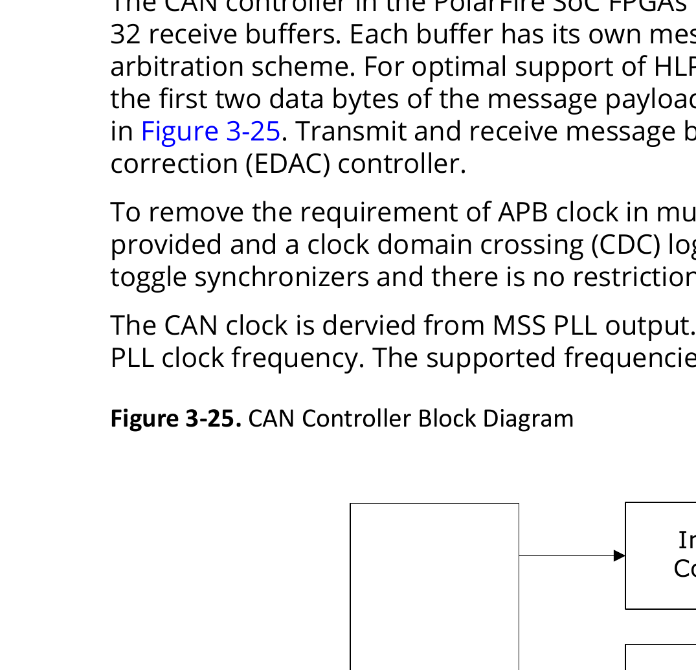

## 3.12.3.1. Features

CAN controller supports the following features:

### Compliance

- Full CAN 2.0B compliant
- Conforms to ISO 11898-1
- Maximum baud rate of 1 Mbps with 8 MHz CAN clock

### APB

- APB 3.0 compliant
- APB interface has clock-domain-crossing to CAN logic, allowing APB to operate at any frequency.

### Receive Path

- 32 receive (Rx) buffers
- Each buffer has its own message filter
- Message filter covers: ID, IDE, remote transmission request (RTR), data byte 1, and data byte 2
- Message buffers can be linked together to build a bigger message array
- Automatic RTR response handler with optional generation of RTR interrupt

### Transmit Path

- 32 transmit (Tx) message holding registers with programmable priority arbitration
- Message abort command
- Single-shot transmission (SST); no automatic retransmission upon error or arbitration loss

### System Bus Interface

- AMBA 3 APB Interface
- Full synchronous zero wait-states interface
- Status and configuration interface

### Programmable Interrupt Controller

- Local interrupt controller covering message and CAN error sources

### Test and Debugging Support

- Listen Only mode
- Internal Loopback mode
- External Loopback mode
- SRAM Test mode
- Error Capture register
- Provides option to either: show current bit position within CAN message
- Provides option to either: show bit position and type of last captured CAN error

### SRAM Based Message Buffers

- Optimized for low gate-count implementation
- Single port, synchronous memory based
- 100% synchronous design

## 3.12.3.1.1. EDAC

An internal 256 x 32 RAM in the CAN controller is protected with EDAC. EDAC configurations and error counters related to the CAN are maintained in MSS system registers. For more information about CAN EDAC registers, see PolarFire SoC Device Register Map.

After power-up, the internal SRAM is not initialized and any READ to the memory location results in an ECC error if EDAC is enabled. To initialize the SRAM, you can put the CAN controller into SRAM Test mode, initialize the SRAM, and enable the EDAC. If SECDED is enabled, it is recommended that the CAN controller must be put into SRAM Test mode and the RAM initialized with user defined known data before operation so that a future read or an uninitialized address does not trigger a SECDED error.

## 3.12.3.1.2. Reset

The CAN controller resets on power-up and is held in Reset until enabled in the SOFT_RESET_CR register. The CAN controller can be Reset by writing to CAN0 or CAN1 of the SOFT_RESET_CR register. The SOFT_RESET_CR register is located in the pfsoc_mss_top_sysreg block.

## 3.12.3.2. Functional Description

### 3.12.3.2.1. CAN Controller Interface Signals

The external interface signals connecting the PolarFire SoC FPGA to an off-chip CAN transceiver are listed in the following table.

**Table 3-64. CAN BUS Interface**

| Signal Name | Direction | Description |
| --- | --- | --- |
| canclk | Input | CAN Clock. |
| RX | Input | CAN bus receive signal. This signal connects to the receiver bus of the external transceiver. |
| TX | Output | CAN bus transmit signal. This signal connects to the external transceiver. |
| TX_EN_N | Output | External driver enable control signal. This signal is used to enable or disable an external CAN transceiver. TX_EN_N is asserted when the CAN controller is stopped or if the CAN state is bus-off (shut down completely). The CAN transmit enable TX_EN_N signal provided through the I/O MUX to the I/O pads are active-low and the CAN transmit enable provided to the fabric is active-high. |

When enabled, CAN ports are configured to connect to multi-standard I/Os (MSIOs) by default. CAN signals can also be configured to interface with the FPGA fabric and the MSS general purpose inputs/outputs (GPIOs).

**Note:** The MSIOs allocated to the CAN instance are shared with other MSS peripherals. These shared I/Os are available to connect to the MSS GPIOs and other peripherals when the CAN instance is disabled or if the CAN instance ports are only connected to the FPGA fabric.

### 3.12.3.2.2. Transmit Procedures

The CAN controller provides 32 transmit message holding buffers. An internal priority arbiter selects the message according to the chosen arbitration scheme. Upon transmission of a message or message arbitration loss, the priority arbiter re-evaluates the message priority of the next message. The following figure gives an overall view of the transmit message buffers.

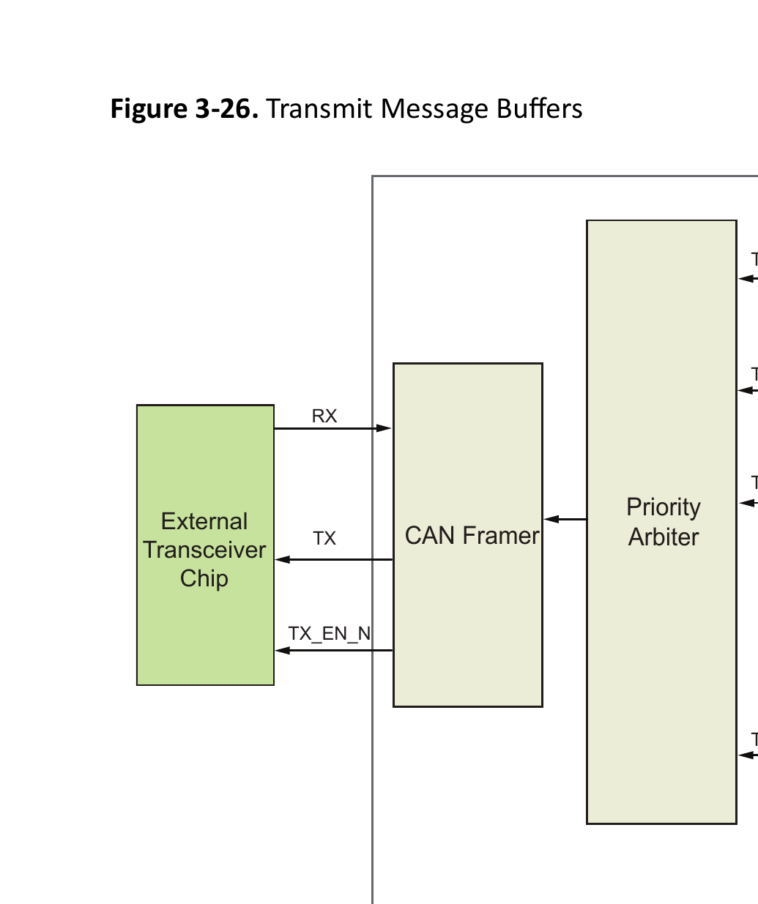

Two types of message priority arbitration are supported. The type of arbitration is selected using the CAN_CONFIG configuration register. Following are the arbitration types:

- Round Robin: Buffers are served in a defined order: 0-1-2... 31-0-1... A particular buffer is only selected if its TxReq flag is set. This scheme guarantees that all buffers receive the same probability to send a message.
- Fixed Priority: Buffer 0 has the highest priority. This way it is possible to designate buffer 0 as the buffer for error messages and it is guaranteed that they are sent first.

**Note:** RTR message requests are served before transmit message buffers are handled. For example, RTRreq0, RTRreq31, TxMessage0, TxMessage1, and TxMessage31.

#### Procedure for Sending a Message

1. Write message into an empty transmit message holding buffer. An empty buffer is indicated by the TxReq (Bit 0 of TX_MSG#_CTRL_CMD register) that is equal to zero.
2. Request transmission by setting the respective TxReq flag to 1.
3. The TxReq flag remains set as long as the message transmit request is pending. The content of the message buffer must not be changed while the TxReq flag is set.
4. The internal message priority arbiter selects the message according to the chosen arbitration scheme.
5. Once the message is transmitted, the TxReq flag is set to zero and the TX_MSG (Bit 11 of the INT_STATUS register) interrupt status bit is asserted.

#### Remove a Message from a Transmit Holding Register

A message can be removed from the transmit holding buffer by asserting the TxAbort (Bit 1 if TX_MSG#_CTRL_CMD register) flag. The content of a particular transmit message buffer can be removed by setting TxAbort to 1 to request message removal. This flag remains set as long as the message abort request is pending. It is cleared when either the message wins arbitration (TX_MSG interrupt active) or the message is removed (TX_MSG interrupt inactive).

#### Single-Shot Transmission

Single-shot transmission (SST) mode is used in systems where the re-transmission of a CAN message due to an arbitration loss or a bus error must be prevented. An SST request is set by asserting TxReq and TxAbort at the same time. Upon a successful message transmission, both flags are cleared.

If an arbitration loss or if a bus error happens during the transmission, the TxReq and TxAbort flags are cleared when the message is removed or when the message wins arbitration. At the same time, the SST_FAILURE interrupt is asserted.

### 3.12.3.2.3. Receive Procedures

The CAN controller provides 32 individual receive message buffers. Each one has its own message filter mask. Automatic reply to RTR messages is supported. If a message is accepted in a receive buffer, its MsgAv flag is set. The message remains valid as long as MsgAv flag is set. The master CPU has to reset the MsgAv flag to enable receipt of a new message. The following figure shows the overall block diagram of the receive message buffers.

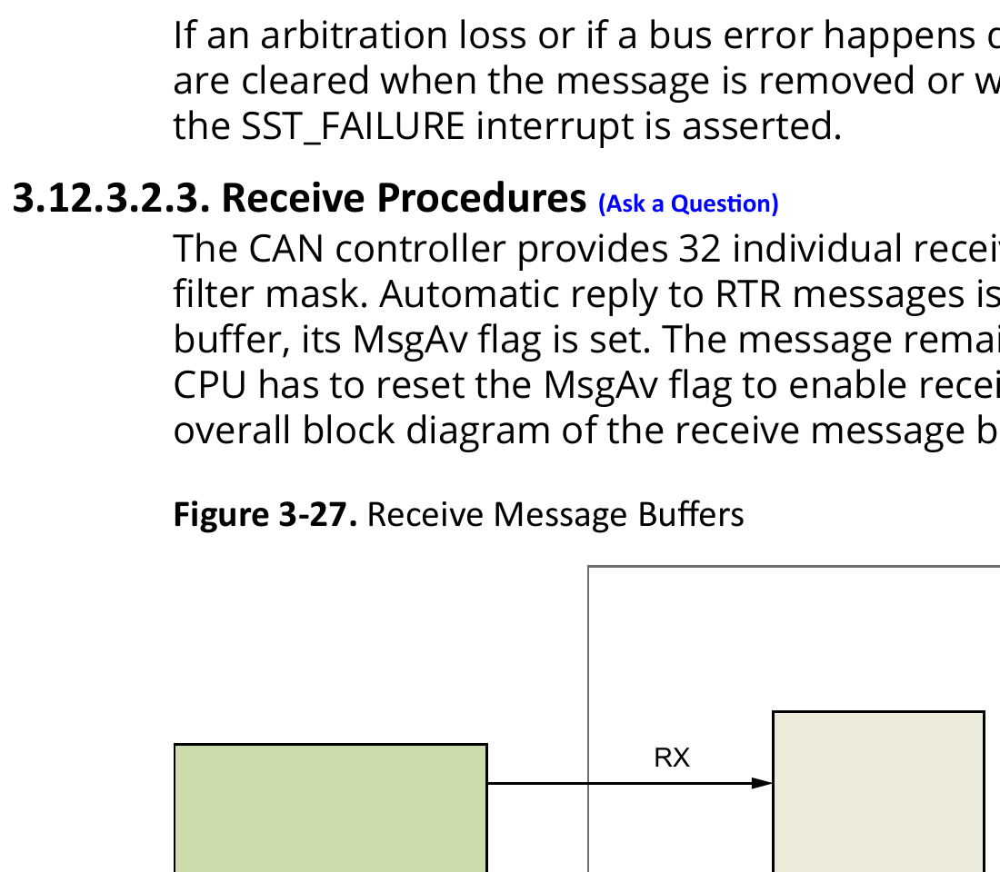

#### Received Message Processing

After a new message is received, the receive message handler searches all receive buffers, starting from the receive message0 until it finds a valid buffer. A valid buffer is indicated by:

- Receive buffer is enabled (indicated by RxBufferEbl = 1)
- Acceptance filter of receive buffer matches incoming message

If the receive message handler finds a valid buffer that is empty, then the message is stored and the MsgAv flag of this buffer is set to 1. If the RxIntEbl flag is set, then the RX_MSG flag of the interrupt controller is asserted.

If the receive buffer already contains a message indicated by MsgAv = 1 and the link flag is not set, then the RX_MSG_LOSS interrupt flag is asserted. Refer to Receive Buffer Linking.

If an incoming message has its RTR flag set and the RTR reply flag of the matching buffer is set, then the message is not stored but an RTR auto-reply request is issued. Refer to RTR Auto-Reply and the RX_MSG0_CTRL_CMD register for more details.

**Note:** In case of an Extended frame, the received message ID is stored in [31:3] bits of RX ID (RX_MSGn_ID) register. In case of a Standard frame, the message ID is stored in [31:21] bits of RX ID (RX_MSGn_ID) register. Both message identifier (Standard frame and Extended frame) is stored at different bit position of RX ID (RX_MSGn_ID) register.

#### Acceptance Filter

Each receive buffer has its own acceptance filter that is used to filter incoming messages. An acceptance filter consists of acceptance mask register (AMR) and acceptance code register (ACR) pair. The AMR defines which bits of the incoming CAN message match the corresponding ACR bits.

The following message fields are covered:

- ID
- IDE
- RTR
- Data byte 1 and data byte 2

**Note:** Some CAN HLPs such as Smart Distributed System (SDS) or DeviceNet carry additional protocol related information in the first or first and second data bytes that are used for message acceptance and selection. Having the capability to filter these fields provides a more efficient implementation of the protocol stack running on the processor.

The AMR register defines whether the incoming bit is checked against the ACR register. The incoming bit is checked against the respective ACR when the AMR register is 0. The message is not accepted when the incoming bit does not match the respective ACR flag. When the AMR register is 1, the incoming bit is a “don’t care”.

#### RTR Auto-Reply

The CAN controller supports automatic answering of RTR message requests. All 32 receive buffers support this feature. If an RTR message is accepted in a receive buffer where the RTRreply flag is set, then this buffer automatically replies to this message with the content of this receive buffer. The RTRreply pending flag is set when the RTR message request is received. It is cleared when the message is sent or when the message buffer is disabled. To abort a pending RTRreply message, use the RTRabort command.

If the RTR auto-reply option is selected, the RTR sent (RTRS) flag is asserted when the RTR auto-reply message is successfully sent. It is cleared by writing “1” to it.

An RTR message interrupt is generated, if the MsgAv_RTRS flag and RxIntEbl are set. This interrupt is cleared by clearing the RTRS flag.

#### Receive Buffer Linking

Several receive buffers can be linked together to form a receive buffer array which acts almost like a receive FIFO. For a set of receive buffers to be linked together, the following conditions must be met:

- All buffers of the same array must have the same message filter setting (AMR and ACR are identical).
- The last buffer of an array may not have its link flag set.

When a receive buffer already contains a message (MsgAv = 1) and a new message arrives for this buffer, this message is discarded (RX_MSG_LOSS Interrupt). To avoid this situation, several receive buffers can be linked together. When the CAN controller receives a new message, the receive message handler searches for a valid receive buffer. If one is found that is already full (MsgAv = 1) and the link flag is set (LF = 1); the search for a valid receive buffer continues. If no other buffer is found, the RX_MSG_LOSS interrupt is set and the message is discarded.

It is possible to build several message arrays. Each of these arrays must use the same AMR and ACR.

**Note:** The receive buffer locations do not need to be contiguous.

## 3.12.3.3. Register Map

For information about CAN Controller register map, see PolarFire SoC Device Register Map.

## 3.12.4. eNVM Controller

PolarFire SoC FPGA devices include one embedded non-volatile memory (eNVM) block size of 128 KB. The eNVM controller interfaces the eNVM block to the AMBA interconnect.

### 3.12.4.1. Features

- SECDED protected
- High Data Retention Time
- 32-bit data input and 64-bit data output

### 3.12.4.2. Functional Description

The eNVM controller implements a AHB interface to the eNVM R and C interfaces. The C-Bus (32-bit) is used for programming operations and the R-Bus (64-bit) for read operations.

The eNVM controller operates at the AHB clock, and generates a slower clock for the eNVM whose maximum clock rate is 26.3 MHz. This is achieved by creating a clock pulse that is multiple of the master clock that supports an NVM access time of up to 80 ns.

To minimize clock synchronization latency, the AHB controller only generates an eNVM clock when it needs access or the eNVM requests a clock. This allows the AHB controller to send the address to the eNVM as soon as it is ready as it can restart the clock at any AHB clock cycle.

#### 3.12.4.2.1. Data Retention Time

The following table shows the retention time of the eNVM with respect to the junction temperature.

**Table 3-65. Data Retention Time**

| Junction Temperature | Data Retention | Write Cycles |
| --- | --- | --- |
| 110 °C | 10 years | 10000 |
| 125 °C | 4 years | 1000 |

#### 3.12.4.2.2. eNVM Access Time Speed

See the Embedded NVM (eNVM) Characteristics section from PolarFire SoC FPGA Datasheet for eNVM Maximum Read Frequency and eNVM Page Programming Time.

#### 3.12.4.2.3. R-Bus Access

The AHB controller interfaces the 32-bit AHB bus to the 64-bit R (Read) interface on the eNVM. The controller always reads 64-bits from the eNVM and stores the data in case there is a subsequent read requests data from the same 64-bit location.

When an AHB read request is made, the controller checks whether the data for the requested address is held in the buffer and returns the data.

#### 3.12.4.2.4. C-Bus Access

The AHB controller simply maps the AHB read/write operations directly to the C-Bus signals. The controller stalls write operations until the eNVM indicates that it is ready (c_grant asserted) and then asserts HREADY, this releases the MSS Core Complex Processor while the eNVM completes any required operations. If a second operation is requested, it is stalled until the eNVM re-asserts the c_grant signal.

#### 3.12.4.2.5. eNVM Address and Segments

The eNVM consists of four segments mapped into a contiguous 128 KB address space as listed in Table 3-66. The C-Bus provides eNVM configuration, read/write capability. The R-Bus allows reading of the eNVM over AHB. For more information about the C-Bus configuration registers, see PolarFire SoC Device Register Map.

**Table 3-66. eNVM Segments and Addresses**

| Bus | Size | Access | Offset | Description | Address |
| --- | --- | --- | --- | --- | --- |
| C-Bus | 512 Bytes | RW | 0x00000000 | Configuration | 0x2020000 |
| R-Bus | 128 K Bytes | 8K | RO | 0x00000000 | Sector 2 | 0x2022000 |
| R-Bus | 128 K Bytes | 56K | RO | 0x00002000 | Sector 0 | 0x20222000 |
| R-Bus | 128 K Bytes | 56K | RO | 0x00010000 | Sector 1 | 0x20230000 |
| R-Bus | 128 K Bytes | 8K | RO | 0x0001E000 | Sector 3 | 0x2023E000 |

#### 3.12.4.2.6. eNVM Access Capabilities

The eNVM is an optional boot ROM for the MSS. For the MSS boot process, eNVM is used to store a baremetal application or a Zero Stage Boot Loader (ZSBL). The eNVM programming is executed during the device programming through JTAG. The eNVM read access is available to the System Controller to support MSS boot. The MSS CPU Core Complex can read eNVM through the R-Bus. However, CPU Core Complex eNVM write is not supported.

For more information about how the eNVM is used for booting MSS, see Boot Modes Fundamentals page.

### 3.12.4.3. Register Map

For information about eNVM register map, see PolarFire SoC Device Register Map.

## 3.12.5. Quad SPI with XIP

Quad Serial Peripheral Interface (QSPI) is a synchronous serial data protocol that enables the microprocessor and peripheral devices to communicate with each other. The QSPI controller is an AHB slave in the PolarFire SoC FPGA that provides a serial interface compliant with the Motorola SPI format. QSPI with execute in place (XIP) support allows a processor to directly boot rather than moving the SPI content to SRAM before execution.

### 3.12.5.1. Features

Quad SPI supports the following features:

- Master only operation with SPI data-rate
  - Programmable SPI clock—HCLK/2, HCLK/4, or HCLK/6
  - Maximum data-rate is HCLK/2
- FIFOs
  - Transmit and Receive FIFO
  - 16-byte transmit FIFO depth
  - 32-byte receive FIFO depth
  - AHB interface transfers up to four bytes at a time
- SPI Protocol
  - Master operation
  - Motorola SPI supported
  - Slave Select operation in idle cycles configurable
  - Extended SPI operation (1, 2, and 4-bit)
  - QSPI operation (4-bit operation)
  - BSPI operation (2-bit operation)
  - Execute in place (XIP)
  - Three or four-byte SPI address.
- 8-bit frames directly
- Back-to-back frame operation supports greater than 8-bit frames
- Up to 4 GB Transfer (2 × 32 bytes)
- Processor overhead reduction
  - SPI Flash command/data packets with automatic data generation and discard function
- Direct Mode
  - Allows a CPU to directly control the SPI interface pins.

### 3.12.5.2. Functional Description

The QSPI controller supports only Master mode operation. The Master mode operation runs directly off the controller clock (HCLK) and supports SPI transfer rates at the HCLK/2 frequency and slower.

The SPI peripherals consist mainly of the following components.

- Transmit and receive FIFOs
- Configuration and control logic

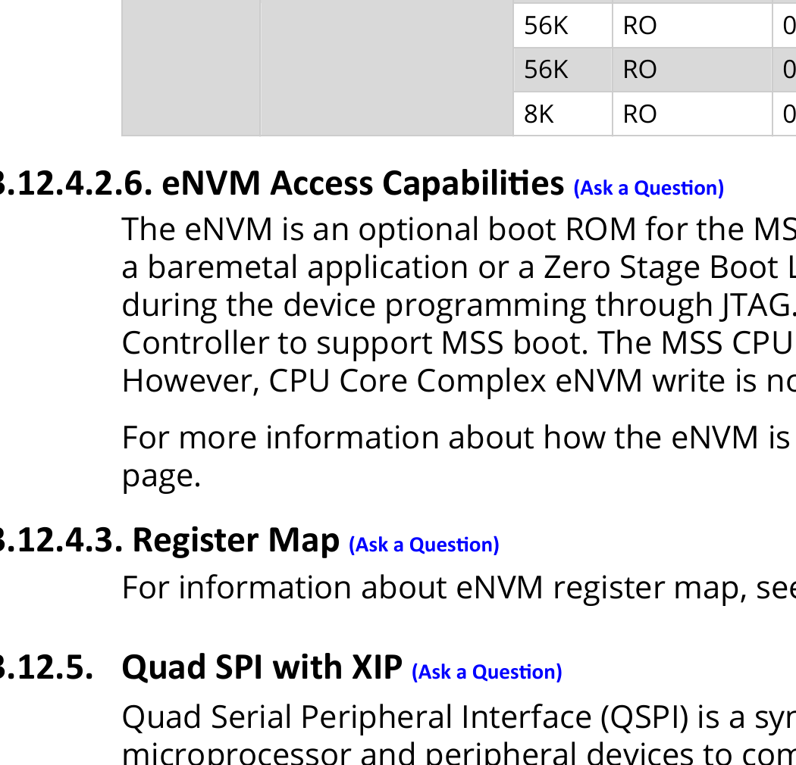

#### 3.12.5.2.1. Transmit and Receive FIFOs

The QSPI controller embeds two FIFOs for receive and transmit, as shown in Figure 3-28. These FIFOs are accessible through ReceiveData and TransmitData registers. Writing to the TransmitData register causes the data to be written to the transmit FIFO. This is emptied by the transmit logic. Similarly, reading from the ReceiveData register causes the data to be read from the receive FIFO.

#### 3.12.5.2.2. Configuration and Control Logic

The SPI peripheral is configured for master-only operation. The type of data transfer protocol can be configured by using the QSPIMODE0 and QSPIMODE21 bits of the CONTROL register. The control logic monitors the number of data frames to be sent or received and enables the XIP mode when the data frame transmission or reception is completed. During data frames transmission/reception, if a transmit under-run error or receive overflow error is detected, the STATUS Register is updated.

#### 3.12.5.3. XIP Operation

Execute in place (XIP) allows a processor to directly boot from the QSPI device rather than moving the SPI content to SRAM before execution. A system Configuration bit (XIP bit in CONTROL register) is used to set the controller in XIP mode.

When QSPI is in XIP mode, all AHB reads simply return the 32-bit data value associated with the requested address. Each access to the QSPI device requires a 3-byte or 4-byte address transfers, a 3-byte IDLE period and 4-byte data transfer. Assuming the SPI clock is ¼ of the AHB clock, then this requires approximately 80 clock cycles per 32-bit read cycle. In XIP mode, data is returned directly to the AHB bus in response to an AHB read, data is not read from the FIFOs. The QSPI device stays in XIP mode as long as the Xb bit is zero.

In XIP mode, AHB write cycles access the core registers allowing the values to change, although the registers cannot be read when in XIP mode.

In the application, the XIP mode is not enabled at Reset as the CPUs are initially booted by system controller and the boot code can initialize the normal QSPI configuration registers.

To exit XIP mode, the firmware must clear the XIP bit in the CONTROL register, at this time it should not be executing from the QSPI device. When this bit is written to zero, the QSPI core returns to Normal mode and the reads access the core registers.

#### 3.12.5.4. Register Map

When in XIP mode, only writes can be performed to the registers, read operations return the SPI contents. For information about QSPI XIP register map, see PolarFire SoC Device Register Map.

## 3.12.6. MMUART

Multi-mode universal asynchronous/synchronous receiver/transmitter (MMUART) performs serial-to-parallel conversion on data originating from modems or other serial devices, and performs parallel-to-serial conversion on data from the MSS Core Complex processor or fabric master to these devices. PolarFire SoC FPGAs contain five identical MMUART peripherals in the microprocessor subsystem (MMUART_0, MMUART_1, MMUART_2, MMUART_3, and MMUART_4).

### 3.12.6.1. Features

MMUART supports the following features:

- Asynchronous and synchronous operations
- Full programmable serial interface characteristics
  - Data width is programmable to 5, 6, 7, or 8 bits
  - Even, odd, or no-parity bit generation/detection
  - 1, 1½, and 2 stop bit generation
- 9-bit address flag capability used for multi-drop addressing topologies
- Separate transmit (Tx) and receive (Rx) FIFOs to reduce processor interrupt service loading
- Single-wire Half-Duplex mode in which Tx pad can be used for bidirectional data transfer
- Local Interconnect Network (LIN) header detection and auto-baud rate calculation
- Communication with ISO 7816 smart cards
- Fractional baud rate capability
- Return to Zero Inverted (RZI) mod/demod blocks that allow infrared data association (IrDA) and serial infrared (SIR) communications
- The MSb or the LSb is the first bit while sending or receiving data

### 3.12.6.2. Functional Description

The functional block diagram of MMUART is shown in Figure 3-29. The main components of MMUART include Transmit and Receive FIFOs (TX FIFO and RX FIFO), Baud Rate Generator (BRG), input filters, LIN Header Detection and Auto Baud Rate Calculation block, RZI modulator and demodulator, and interrupt controller.

While transmitting data, the parallel data is written to TX FIFO of the MMUART to transmit in serial form. While receiving data to RX FIFO, the MMUART transforms the serial input data into parallel form to facilitate reading by the processor.

The Baud Rate Generator contains free-running counters and utilizes the asynchronous and synchronous baud rate generation circuits. The input filters in MMUART suppress the noise and spikes of incoming clock signals and serial input data based on the filter length. The RZI modulation/demodulation blocks are intended to allow for IrDA serial infrared (SIR) communications.

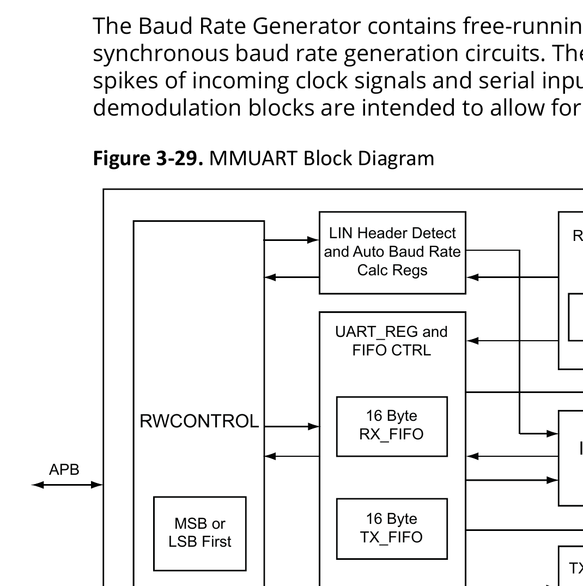

### 3.12.6.3. Register Map

The base addresses and register descriptions of MMUART_0, MMUART_1, MMUART_2, MMUART_3, and MMUART_4 are listed in PolarFire SoC Device Register Map.

## 3.12.7. SPI Controller

Serial peripheral interface (SPI) is a synchronous serial data protocol that enables the microprocessor and peripheral devices to communicate with each other. The SPI controller is an APB slave in the PolarFire SoC FPGA that provides a serial interface compliant with the Motorola SPI, Texas Instruments synchronous serial, and National Semiconductor MICROWIRE™ formats. In addition, SPI supports interfacing with large SPI Flash and EEPROM devices and a hardware-based slave protocol engine. PolarFire SoC FPGAs contain two identical SPI controllers SPI_0 and SPI_1 in the microprocessor subsystem.

### 3.12.7.1. Features

SPI peripherals support the following features:

- Master and Slave modes
- Configurable Slave Select operation
- Configurable clock polarity
- Separate transmit (Tx) and receive (Rx) FIFOs to reduce interrupt service loading

### 3.12.7.2. Functional Description

The SPI controller supports Master and Slave modes of an operation.

- In Master mode, the SPI generates SPI_X_CLK, selects a slave using SPI_X_SS, transmits the data on SPI_X_DO, and receives the data on SPI_X_DI.
- In Slave mode, the SPI is selected by SPI_X_SS. The SPI receives a clock on SPI_X_CLK and incoming data on SPI_X_DI.

The SPI peripherals consist mainly of the following components (see Figure 3-30).

- Transmit and receive FIFOs
- Configuration and control logic
- SPI clock generator

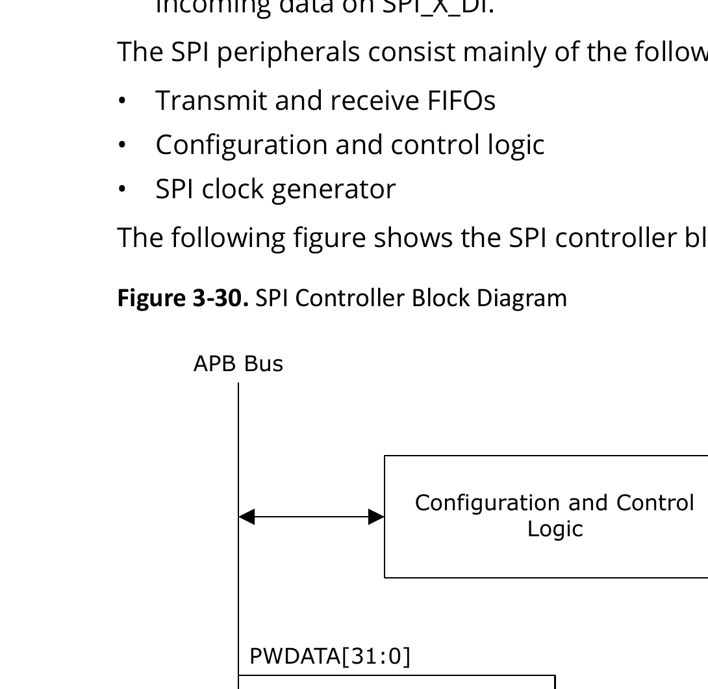

**Notes:**

- The SPI_X_DO, SPI_X_DI, SPI_X_SS, and SPI_X_CLK signals are available to the FPGA fabric.
- SPI_X_DOE_N is accessible through the SPI control register.
- SPI_X_INT is sent to the MSS Core Complex.

**Note:** X is used as a place holder for 0 or 1 in the register and signal descriptions. It indicates SPI_0 (on the APB_0 bus) or SPI_1 (on the APB_1 bus).

#### 3.12.7.2.1. Transmit and Receive FIFOs

The SPI controller embeds two 4 × 32 (depth × width) FIFOs for receive and transmit, as shown in Figure 3-30. These FIFOs are accessible through RX data and TX data registers. Writing to the TX data register causes the data to be written to the transmit FIFO. This is emptied by the transmit logic. Similarly, reading from the RX data register causes the data to be read from the receive FIFO.

#### 3.12.7.2.2. Configuration and Control Logic

The SPI peripheral can be configured for Master or Slave mode by using the Mode bit of the SPI CONTROL register. This type of data transfer protocol can be configured by using the TRANSFRTL bit of the SPI CONTROL register. The control logic monitors the number of data frames to be sent or received and enables the interrupts when the data frame transmission or reception is completed. During data frames transmission or reception, if a transmit under-run error or receive overflow error is detected, the STATUS Register is updated.

#### 3.12.7.2.3. SPI Clock Generator

In Master mode, the SPI clock generator generates the serial programmable clock from the APB clock.

#### 3.12.7.3. Register Map

The base addresses and register descriptions of SPI_0 and SPI_1 are listed in PolarFire SoC Device Register Map.

## 3.12.8. I2C

Philips Inter-Integrated Circuit (I2C) is a two-wire serial bus interface that provides data transfer between many devices. PolarFire SoC FPGAs contain two identical I2C peripherals in the microprocessor subsystem (I2C_0 and I2C_1), that provide a mechanism for serial communication between the PolarFire SoC FPGA and the external I2C compliant devices.

PolarFire I2C peripherals support the following protocols:

- I2C protocol as per v2.1 specification
- SMBus protocol as per v2.0 specification
- PMBus protocol as per v1.1 specification

### 3.12.8.1. Features

I2C peripherals support the following features:

- Master and Slave modes
- 7-bit addressing format and data transfers up to 100 Kbit/s in Standard mode and up to 400 Kbit/s in Fast mode
- Multi-master collision detection and arbitration
- Own slave address and general call address detection
- Second slave address detection
- System management bus (SMBus) time-out and real-time idle condition counters
- Optional SMBus signals, SMBSUS_N, and SMBALERT_N, which are controlled through the APB interface
- Input glitch or spike filters

The I2C peripherals are connected to the AMBA interconnect through the advanced peripheral bus (APB) interfaces.

### 3.12.8.2. Functional Description

The I2C peripherals consist mainly of the following components (see Figure 3-31).

- Input Glitch Filter
- Arbitration and Synchronization Logic
- Address Comparator
- Serial Clock Generator

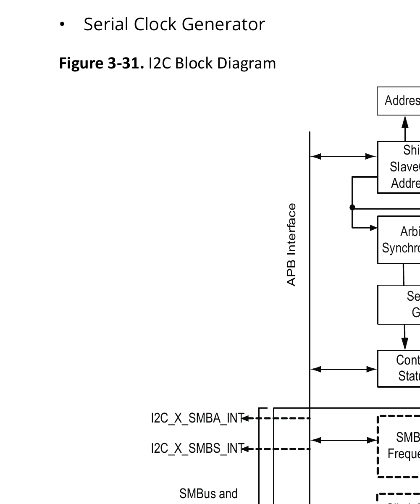

> Tip: MSS I2C ports can be connected to Fabric I/Os by routing them through fabric with appropriate BIBUF fabric logic to make them bidirectional.

#### 3.12.8.2.1. Input Glitch Filter

The I2C Fast mode (400 Kbit/s) specification states that glitches 50 ns or less must be filtered out of the incoming clock and data lines. The input glitch filter performs this function by filtering glitches on incoming clock and data signals. Glitches shorter than the glitch filter length are filtered out. The glitch filter length is defined in terms of APB interface clock cycles and configurable from 3 to 21 APB interface clock cycles. Input signals are synchronized with the internal APB interface clock.

#### 3.12.8.2.2. Arbitration and Synchronization Logic

In Master mode, the arbitration logic monitors the data line. If any other device on the bus drives the data line Low, the I2C peripheral immediately changes from Master-Transmitter mode to Slave-Receiver mode. The synchronization logic synchronizes the serial clock generator block with the transmitted clock pulses coming from another master device.

The arbitration and synchronization logic implements the time-out requirements as per the SMBus specification version 2.0.

#### 3.12.8.2.3. Address Comparator

When a master transmits a slave address on the bus, the address comparator checks the 7-bit slave address with its own slave address. If the transmitted slave address does not match, the address comparator compares the first received byte with the general call address (0x00). If the address matches, the STATUS Register is updated. The general call address is used to address each device connected to the I2C bus.

#### 3.12.8.2.4. Serial Clock Generator

In Master mode, the serial clock generator generates the serial clock line (SCL). The clock generator is switched OFF when I2C is in Slave mode.

MSS I2C uses APB clock to generate the serial clock. See the MSS_I2C_init() function in the MSS I2C Driver. This driver provides access to the I2C : I2C0_CTRL control register, which configures I2C serial clock using the provided divider value to generate the serial clock from the APB clock. For more information about I2C : I2C0_CTRL control register, see PolarFire SoC Register Map.

### 3.12.8.3. Register Map

The base addresses and register descriptions of I2C_0 and I2C_1 are listed in PolarFire SoC Device Register Map.

## 3.12.9. GPIO

The microprocessor subsystem (MSS) general purpose input/output (GPIO) block is an advanced peripheral bus (APB) slave that provides access to 32 GPIOs. MSS Masters and fabric Masters can access the MSS GPIO block through the AMBA interconnect. PolarFire SoC FPGAs contain three identical GPIO blocks in the microprocessor subsystem (GPIO_0, GPIO_1, and GPIO_2).

### 3.12.9.1. Features

MSS GPIO supports the following features:

- GPIO_0 drives up to 14 MSIOs
- GPIO_1 drives up to 24 MSIOs
- GPIO_2 drives up to 32 device IOs through the FPGA fabric.
- 32 individually configurable GPIOs
- Each GPIO is dynamically programmable as an input, output, or bidirectional I/O.
- Each GPIO can be configured as an interrupt source to the MSS processor in Input mode
- The GPIOs can be selectively reset by either the Hard Reset (Power-on Reset, User Reset from the fabric) or the Soft Reset from the SYSREG block

### 3.12.9.2. Functional Description

Figure 3-32 shows the internal architecture of the MSS GPIO block. GPIOs and MSS peripherals, such as MMUART, SPI, and I2C, can be routed to MSIO pads or to the FPGA fabric through I/O multiplexers (MUXes), as shown in the figure.

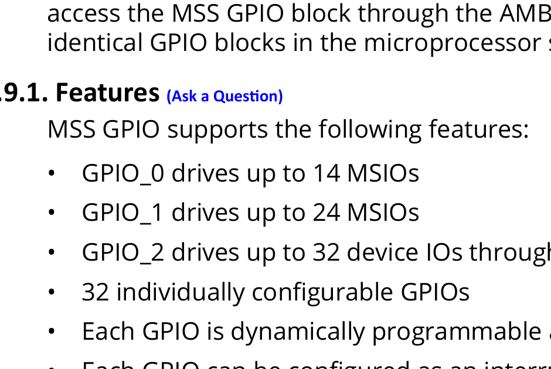

The MSS GPIO block contains the following:

- 32-bit input register (GPIO_IN), which holds the input values
- 32-bit output register (GPIO_OUT), which holds the output values
- 32-bit interrupt register (GPIO_INTR), which holds the interrupt state
- 32 configuration registers (GPIO_X_CONFIG), one register for each GPIO

When a GPIO is configured in Input mode, the GPIO input is passed through two flip-flop synchronizer and latched into the GPIO_IN register. The GPIO_IN register value is read through the APB bus and is accessible to the processor or fabric master. The inputs to GPIO0 and GPIO1 are from MSIOs. The inputs to GPIO2 are from the fabric.

The GPIO_IN register output can also be used as an interrupt to the processor. This can be configured as an edge triggered (on rising edge, falling edge, or both edges) or as a level sensitive (active-low or active-high) interrupt. The interrupt is latched in the GPIO_INTR register and is accessible through the APB bus.

In Edge-sensitive mode, GPIO_INTR register is cleared either by disabling the interrupt or writing a Logic 1 through the APB interface. If an edge and GPIO_INTR clearing through the APB occurs simultaneously, the edge has higher priority.

When the GPIO is configured in an Output mode, the output value can be configured using the APB bus and is accessible to the processor or fabric Master. GPIO0 and GPIO1 outputs are available to MSIOs. GPIO2 outputs are available to the fabric.

**Figure 3-33. MSS GPIO Block Diagram**

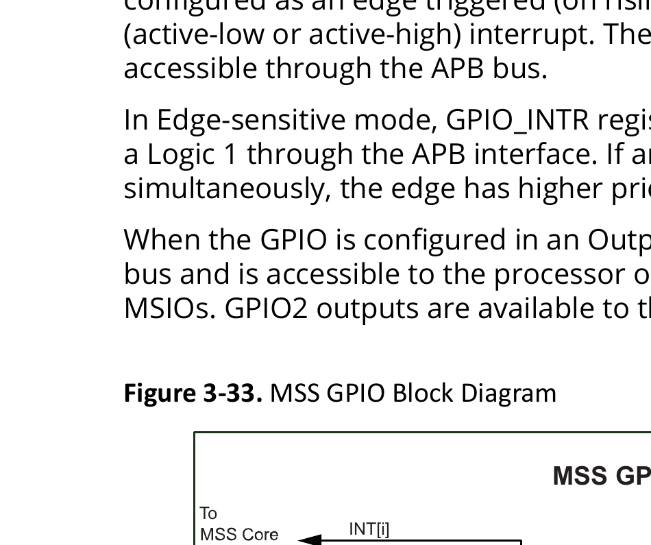

### 3.12.9.3. Register Map

The base addresses and register descriptions of GPIO_0, GPIO_1, and GPIO_2 are listed in PolarFire SoC Device Register Map.

## 3.12.10. Real-time Counter (RTC)

The PolarFire SoC FPGA real-time counter (RTC) keeps track of seconds, minutes, hours, days, weeks, and years.

### 3.12.10.1. Features

It has two modes of operation:

- Real-time Calendar: Counts seconds, minutes, hours, days, week, months, and years
- Binary Counter: Consecutively counts from 0 to 2^43 - 1

The RTC is connected to the main MSS AMBA interconnect through an APB interface.

### 3.12.10.2. Functional Description

The RTC architecture and its components are as follows:

- Prescaler
- RTC Counter
- Alarm Wake-up Comparator

**Figure 3-34. RTC Block Diagram**

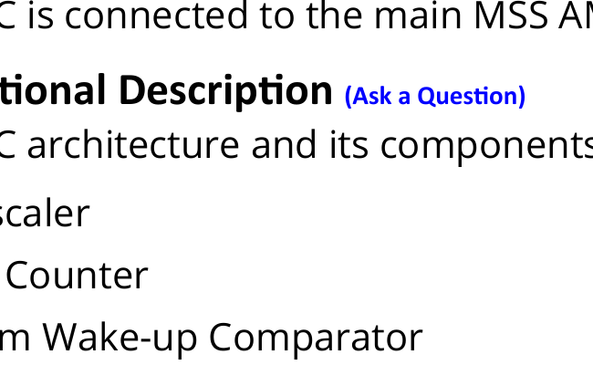

#### 3.12.10.2.1. Prescaler

The prescaler divides the input frequency to create a time-based strobe (typically 1 Hz) for the calendar counter. The Alarm and Compare Registers, in conjunction with the calendar counter, facilitate time-matched events.

To properly operate in Calendar mode, (Clock mode: 1), the 26-bit prescaler must be programmed to generate a 1 Hz strobe to the RTC. In Binary mode, (Clock mode: 0), the prescaler can be programmed as required in the application.

#### 3.12.10.2.2. RTC Counter

The RTC counter keeps track of seconds, minutes, hours, days, weeks, and years when in Calendar mode, and for this purpose it requires a 43-bit counter. When counting in Binary mode, the 43-bit register is treated as a linear up counter.

The following table lists the details of Calendar mode and Binary mode.

**Table 3-67. Calendar Counter Description**

| Function | Number of Bits | Range |  | Reset Value |  |
| --- | --- | --- | --- | --- | --- |
|  |  | Calendar Mode | Binary Mode | Calendar Mode | Binary Mode |
| Second | 6 | 0–59 | 0–63 | 0 | 0 |
| Minute | 6 | 0–59 | 0–63 | 0 | 0 |
| Hour | 5 | 0–23 | 0–31 | 0 | 0 |
| Day | 5 | 1–31 (auto adjust by month and year) | 0–31 | 1 | 0 |
| Month | 4 | 1–12 | 0–15 | 1 | 0 |
| Year | 8 | 0–255 Year 2000 to 2255 | 0–255 | 0 (year 2000) | 0 |
| Weekday | 3 | 1–7 | 0–7 | 7 | 0 |
| Week | 6 | 1–52 | 0–63 | 1 | 0 |

The long-term accuracy of the RTC depends on the accuracy of the external reference frequency. For example, if the external reference frequency is 124.988277868 MHz rather than 125 MHz, the RTC loses approximately 8 seconds over 24 hours. The deviation is calculated by the following equations.

The user must calculate the clock ticks deviation per 24 hours using the following equation.

`C_td24 = (E_ct24 - A_ct24)`

where:

- `C_td24` denotes the clock ticks deviation per 24 hours.
- `E_ct24` denotes the expected clock ticks per 24 hours, which is based on the ideal external frequency of 125 MHz. This can be calculated as follows:

  `(E_tps × 24 × 60 × 60) = 10800000000000.00`

  `E_tps` denotes the number of expected clock ticks per second based on the ideal external frequency. It is 125000000 (125 × 1000000).

- `A_ct24` denotes the actual clock ticks per 24 hours, which is based on the actual external frequency. In this example, it is 124.988277868 MHz. `A_ct24` can be calculated as follows:

  `(A_tps × 24 × 60 × 60) = 10798987210560.00`

  `A_tps` denotes the actual clock ticks per second based on the actual external frequency. In this example, it is 124988277.9 (124.9882779 × 1000000).

Therefore,

`C_td24 = 10800000000000.00 − 10798987210560.00 = 1012789440`

Based on the preceding calculations, the number of seconds lost in 24 hours can be calculated as follows:

`N_s = C_td24 / E_tps = 1012789440 / 125000000 = 8.10231552`

Where, `N_s` denotes the number of seconds lost in 24 hours.

#### 3.12.10.2.3. Alarm Wake-up Comparator

The RTC has two modes of operation, selectable through the clock_mode bit.

In Calendar mode, the RTC counts seconds, minutes, hours, days, month, years, weekdays, and weeks. In Binary mode, the RTC consecutively counts from 0 all the way to 2^43 - 1. In both the modes, the alarm event generation logic simply compares the content of the Alarm register with that of the RTC; when they are equal, the RTC_MATCH output is asserted.

### 3.12.10.3. Register Map

The base address and register description of RTC is listed in PolarFire SoC Device Register Map.

## 3.12.11. Timer

The PolarFire SoC FPGA system Timer (hereinafter referred as Timer) consists of two programmable 32-bit decrementing counters that generate interrupts to the processor and FPGA fabric.

### 3.12.11.1. Features

The timer supports the following features:

- Two count modes: One-shot and Periodic
- Decrementing 32-bit counters
- Two 32-bit timers can be concatenated to create a 64-bit timer
- Option to enable or disable the interrupt requests when timer reaches zero
- Controls to start, stop, and Reset the Timer

### 3.12.11.2. Functional Description

The Timer is an APB slave that provides two programmable, interrupt generating, 32-bit decrementing counters, as shown in the following figure. The counters generate the interrupts TIMER1INT and TIMER2INT on reaching zero.

**Figure 3-35. Timer Block Diagram**

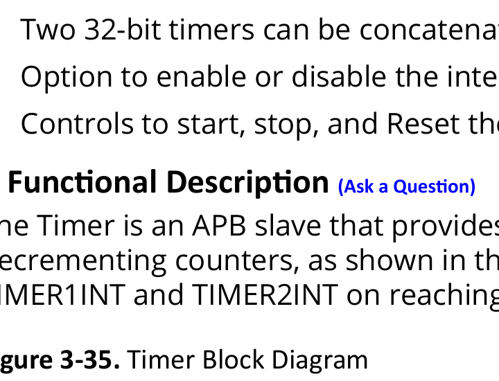

The Timer has an APB interface through which the processor can access various CONTROL and STATUS registers to control and monitor the operation of the Timer.

### 3.12.11.3. Register Map

The base address and register description of the timer is listed in PolarFire SoC Device Register Map.

## 3.12.12. Watchdog

The watchdog timer is an advanced peripheral bus (APB) slave that guards against the system crashes requiring regular service by the processor or by a bus master in the FPGA fabric. PolarFire SoC FPGAs contain five identical watchdog timers in the microprocessor subsystem (watchdog_0, watchdog_1, watchdog_2, watchdog_3, and watchdog_4). Watchdog_0 is associated with the E51 core and is the only one out of the five MSS watchdogs capable of resetting the MSS when it triggers. Each of the other four watchdogs is maintained by a dedicated U54 core and is only capable of interrupting the E51 upon triggering.

### 3.12.12.1. Features

The watchdog timer supports following features:

- A 32-bit timer counts down from a preset value to zero, then performs one of the following user-configurable operations: If the counter is not refreshed, it times out and either causes a system reset or generates an interrupt to the processor.
- The watchdog timer counter is halted when the processor enters the Debug state.
- The watchdog timer can be configured to generate a wake-up interrupt when the processor is in WFI mode.

The watchdog timer is connected to the MSS AMBA interconnect through the APB interface.

### 3.12.12.2. Functional Description

The watchdog timer consists of following components (as shown in the following figure):

- APB Interface
- 32-Bit Counter
- Timeout Detection

**Figure 3-36. WatchDog Block Diagram**

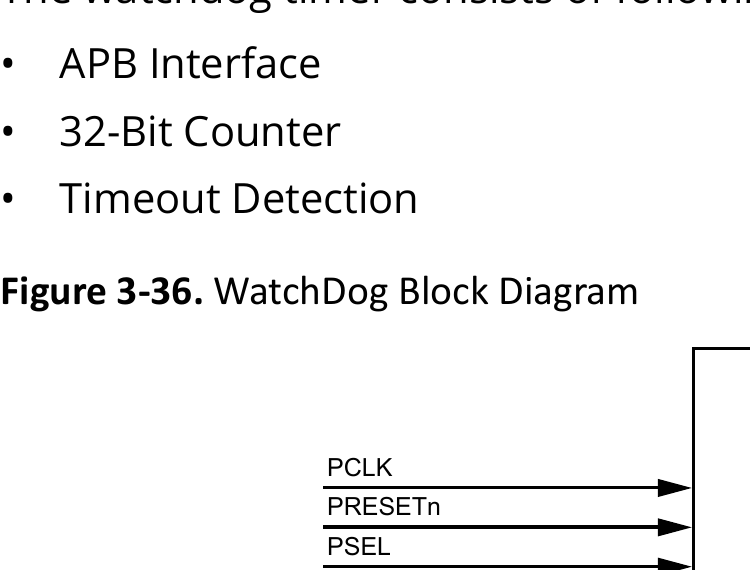

#### 3.12.12.2.1. APB Interface

The watchdog timer has an APB interface through which the processor can access various CONTROL and STATUS registers to control and monitor its operation. The APB interface is clocked by the PCLK clock signal.

#### 3.12.12.2.2. 32-Bit Counter

The operation of the watchdog timer is based on a 32-bit down counter that must be refreshed at regular intervals by the processor. If not refreshed, the counter will time-out. In normal operation, the generation of a Reset or time-out interrupt by the watchdog timer does not occur because the watchdog timer counter is refreshed on a regular basis.

The MSS watchdogs are not enabled initially when the MSS comes out of Reset. When the device is powered up, the watchdog timer is enabled with the timeout period set to approximately 10.47 seconds (if VDD = 1.2 V).

#### 3.12.12.2.3. Timeout Detection

A control bit in the WDOG_CONTROL register is used to determine whether the watchdog timer generates a Reset or an interrupt if a counter time-out occurs. The default setting is Reset generation on time-out. When interrupt generation is selected, the WDOGTIMEOUTINT output is asserted on time-out and remains asserted until the interrupt is cleared. When Reset generation is selected, the watchdog timer does not directly generate the system Reset signal. Instead, when the counter reaches zero, the watchdog timer generates a pulse on the WDOGTIMEOUT output, and this is routed to the Reset controller to cause it to assert the necessary Reset signals.

**Note:** Only watchdog_0 can reset the MSS. The other watchdogs can only generate interrupts to the E51 core.

### 3.12.12.3. Register Map

The base addresses and register descriptions of watchdog timers are listed in PolarFire SoC Device Register Map.

## 3.12.13. Universal Serial Bus OTG Controller

Universal serial bus (USB) is an industry standard that defines cables, connectors, and serial communication protocol used in a bus for connection, communication, and power supply between electronic devices. PolarFire SoC FPGA device contains a USB On-The-Go (OTG) controller as part of the microprocessor subsystem (MSS). USB OTG controller provides a mechanism for the USB communication between the PolarFire SoC FPGA and external USB host/USB device/USB OTG protocol compliant devices.

### 3.12.13.1. Features

USB OTG controller supports the following features:

- Operates as a USB host in a point-to-point or multi-point communication with other USB devices
- Operates as a USB peripheral with other USB hosts
- Compliant with the USB 2.0 standard and includes OTG supplement
- Supports USB 2.0 speeds:
  - High speed (480 Mbps)
  - Full speed (12 Mbps)
- Supports session request protocol (SRP) and host negotiation protocol (HNP)
- Supports suspend and resume signaling
- Supports multi-point capabilities
- Supports four direct memory access (DMA) channels for data transfers
- Supports high bandwidth isochronous (ISO) pipe enabled endpoints
- Hardware selectable option for 8-bit/4-bit Low Pin Count Interface (LPI)
- Supports ULPI hardware interface to external USB physical layer (PHY)
- Soft connect/disconnect
- Configurable for up to five transmit endpoints (TX EP) and up to five receive endpoints (RX EP), including control endpoint (EP0)
- Offers dynamic allocation of endpoints, to maximize the number of devices supported
- Internal memory of 8 KB with support for dynamic allocation to each endpoint
- Performs all USB 2.0 transaction scheduling in hardware
- Supports link power management
- SECDED protection on the internal USB memory with the following features:
  - Generates interrupts on 1-bit or 2-bit errors; these interrupts can be masked
  - Corrects 1-bit errors
  - Counts the number of 1-bit and 2-bit errors

For more information on USB 2.0 and OTG protocol specifications, see the following web pages:

- www.usb.org/developers/docs/
- www.usb.org/developers/onthego/

The USB OTG controller can function as an AHB master for DMA data transfers and as an AHB slave for configuring the USB OTG controller from the masters processor or from the FPGA fabric logic.

The USB OTG controller can function as one of the following:

- A high speed or a full speed peripheral USB device attached to a conventional USB host (such as a PC)
- A point-to-point or multi-point USB host
- An OTG device that can dynamically switch roles between the host and the device

In all cases (USB host, USB device, or USB OTG), USB OTG controller supports control, bulk, ISO, and interrupt transactions in all three modes.

### 3.12.13.2. Functional Description

The following block diagram highlights the main blocks in the USB OTG controller. The USB OTG controller is interfaced through the AMBA interconnect in the MSS. The USB OTG controller provides an ULPI interface to connect to the external PHY. Following are the main component blocks in the USB OTG controller:

- AHB Master and Slave Interfaces
- CPU Interface
- Endpoints (EP) Control Logic and RAM Control Logic
- Packet Encoding, Decoding, and CRC Block
- PHY Interfaces

**Figure 3-37. USB OTG Controller**

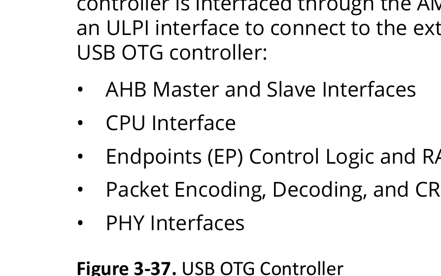

#### 3.12.13.2.1. AHB Master and Slave Interfaces

The USB OTG controller functions as both AHB master and AHB slave on the AMBA interconnect. The AHB master interface is used by the DMA engine, which is built into the USB OTG controller, for data transfer between memory in the USB OTG controller and the system memory. The AHB slave interface is used by other masters, such as the processor or Fabric masters in the FPGA fabric, to configure registers in the USB OTG controller.

#### 3.12.13.2.2. CPU Interface

USB OTG controller send interrupts to the processor using the CPU interface. The USB OTG controller send interrupts for the following events:

- When packets are transmitted or received
- When the USB OTG controller enters Suspend mode
- When USB OTG controller resumes from Suspend mode

The CPU interface block contains the common configuration registers and the interrupt control logic for configuring the OTG controller.

#### 3.12.13.2.3. Endpoints (EP) Control Logic and RAM Control Logic

These two blocks constitute buffer management for the data buffers in Host mode and in Device mode. This block manages endpoint buffers and their properties, called pipes, which are defined by control, bulk, interrupt, and ISO data transfers. Data buffers in Device mode (endpoints) and in Host mode are supported by the SECDED block, which automatically takes care of single-bit error correction and dual-bit error detection. This SECDED block maintains the counters for the number of single-bit corrections made and the number of detections of dual-bit errors. The SECDED block is provided with the interrupt generation logic. If enabled, this block generates the corresponding interrupts to the processor.

#### 3.12.13.2.4. Packet Encoding, Decoding, and CRC Block

This block generates the CRC for packets to be transmitted and checks the CRC on received packets. This block generates the headers for the packets to be transmitted and decodes the headers on received packets. There is a CRC 16-bit for the data packets and a 5-bit CRC for control and status packets.

#### 3.12.13.2.5. PHY Interfaces

The USB OTG controller supports Universal Low Pin Count Interface (ULPI) at the link side. For ULPI interface, the I/Os are routed through the MSS onto multi-standard I/Os (MSIOs).

### 3.12.13.3. Register Map

For information about USB OTG controller register map, see PolarFire SoC Device Register Map.

## 3.12.14. eMMC SD/SDIO

The PolarFire SoC contains an eMMC/SD host controller and PHY. The MSS is capable of supporting multiple eMMC/SD standards.

### 3.12.14.1. Features

eMMC and SD/SDIO supports the following features:

- eMMC Standards
  - Default Speed (or Standard Speed)
  - High Speed
  - High Speed DDR
  - High Speed 200
  - High Speed 400
  - High Speed 400 Enhanced Strobe (ES)

> Important: Standard Speed, High Speed, and HS200 speed modes support Single Data Rate (SDR) signaling. High Speed DDR, HS400, and HS400 ES speed modes support Double Data Rate (DDR) signaling.

- SD Card Standards
  - Default Speed (DS)
  - Low Speed
  - Full Speed
  - High Speed
  - UHS-I SDR12
  - UHS-I SDR25
  - UHS-I SDR50
  - UHS-I SDR104
  - UHS-I DDR50
- Non-Supported SD Card Standards
  - UHS-II
- Integrated DMA engines for data transfers

> Important: The DDR50 speed mode supports Double Data Rate (DDR) signaling. The following speed modes support Single Data Rate (SDR) signaling.
>
> - SDR104
> - SDR50
> - SDR25
> - SDR12
> - High Speed
> - Default Speed
> - Full Speed

### 3.12.14.2. Functional Description

The eMMC/SD controller interfaces to the MSSIO through an IOMUX block. Depending on the interface standard, the user may decide to only connect a subset of data lines to I/Os. However, it is not possible to connect the eMMC/SD controller to the FPGA fabric. The eMMC/SD controller supports two DMA modes—SDMA and ADMA2. The DMA supports 64-bit and 32-bit addressing modes. The DMA mode for current transfer is selected through SRS10.DMASEL register and can be different for each consecutive data transfer. The Host driver can change DMA mode when neither the Write Transfer Active (SRS09.WTA) nor the Read Transfer Active (SRS09.RTA) status bit are set.

#### 3.12.14.2.1. Integrated DMA

The SD Host controller supports two DMA modes:

- SDMA: Uses the (simple/single-operation) DMA algorithm for data transfers.
- ADMA2: Uses Advanced DMA2 algorithm for data transfers.

The following table shows how to select the DMA engine and Addressing mode by setting SRS10.DMASEL, SRS15.HV4E and SRS16.A64S register fields.

**Table 3-68. DMA Mode**

| SRS10.DMASEL | SRS15.HV4E | SRS16.A64S | DMA Mode |
| --- | --- | --- | --- |
| 0 | 0 | 0 | SDMA 32-bit |
|  |  | 1 | Reserved |
|  | 1 | 0 | SDMA 32-bit |
|  |  | 1 | SDMA 64-bit |
| 1 | 0 | 0 | Reserved |
|  |  | 1 | Reserved |
|  | 1 | 0 | Reserved |
|  |  | 1 | Reserved |
| 2 | 0 | 0 | ADMA2 32-bit |
|  |  | 1 | Reserved |
|  | 1 | 0 | ADMA2 32-bit |
|  |  | 1 | ADMA2 64-bit |
| 3 | 0 | 0 | Reserved |
|  |  | 1 | ADMA2 64-bit |
|  | 1 | 0 | Reserved |
|  |  | 1 | Reserved |

The DMA transfer in each mode can be stopped by setting Stop at the Block Gap Request bit (SRS10.SBGR). The DMA transfers can be restarted only by setting Continue Request bit (SRS10.CREQ). If an error occurs, the Host Driver can abort the DMA transfer in each mode by setting Software Reset for DAT Line (SRS11.SRDAT) and issuing Abort command (if a multiple block transfer is executing).

SDMA

The Simple (single-operation) DMA mode uses SD Host registers to describe the data transfer. The SDMA System Address (SRS00.SAAR or SRS22.DMASA1 / SRS23.DMASA2) register defines the base address of the data block. The length of the data transfer is defined by the Block Count (SRS01.BCCT) and Transfer Block Size (SRS01.TBS) values. There is no limitation on the SDMA System Address value the data block can start at any address. The SDMA engine waits at every boundary specified in the SDMA Buffer Boundary (SRS01.SDMABB) register.

When the buffer boundary is reached, the SD Host Controller stops the current transfer and generates the DMA interrupt. Software needs to update the SDMA System Address register to continue the transfer.

When the SDMA engine stops at the buffer boundary, the SDMA System Address register points the next system address of the next data position to be transferred. The SDMA engine restarts the transfer when the uppermost byte of the SDMA System Address register is written.

**Figure 3-38. SDMA Block Diagram**

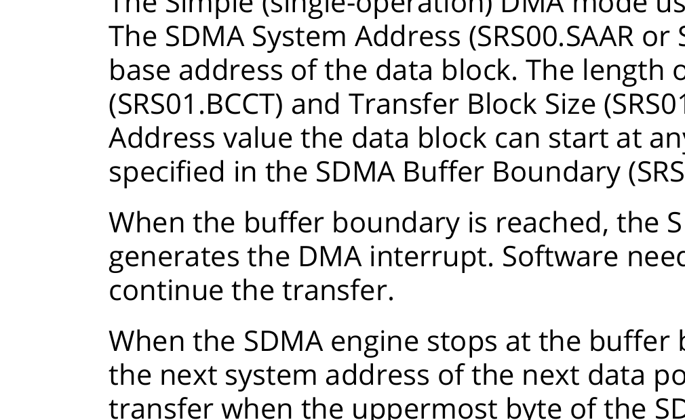

ADMA2

The Advanced DMA Mode Version 2 (ADMA2) uses the Descriptors List to describe data transfers. The SD Host registers only define the base address of the Descriptors List. The base addresses and sizes of the data pages are defined inside the descriptors. The SD Host supports ADMA2 in 64-bit or 32-bit Addressing mode.

When in ADMA2 mode, the SD Host transfers data from the data pages. Page is a block of valid data that is defined by a single ADMA2 descriptor. Each ADMA2 descriptor can define only one data page. The starting address of the data page must be aligned to the 4 byte boundary (the 2 LSbs set to 0) in 32-bit Addressing mode, and to the 8 byte boundary (the 3 LSbs set to 0) in 64-bit Addressing mode. The size of each data page is arbitrary and it depends on neither the previous nor the successive page size. It can also be different from the SD card transfer block size (SRS01.TBS).

**Figure 3-39. ADMA2 Block Diagram**

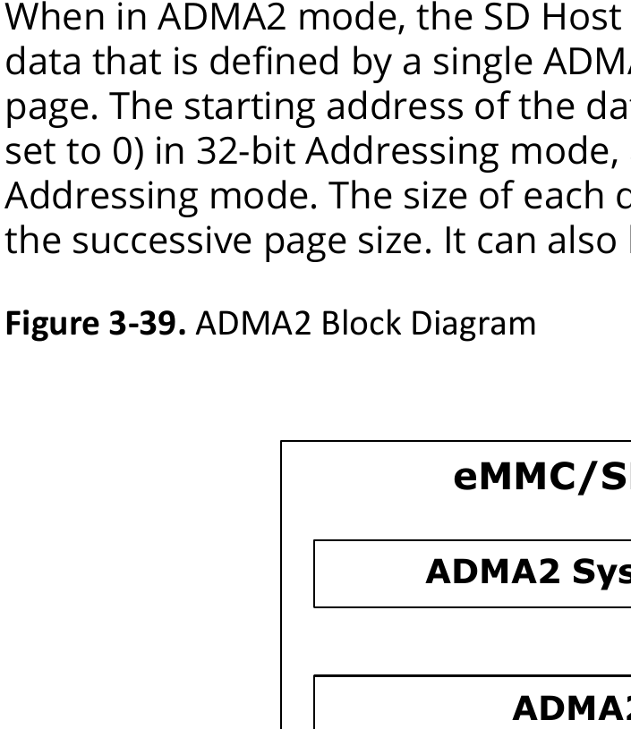

The ADMA2 engine transfers are configured in a Descriptor List. The base address of the list is set in the ADMA System Address register (SRS22.DMASA1, SRS23.DMASA2), regardless of whether it is a read or write transfer. The ADMA2 Descriptor List consists of a number of 64-bit / 96-bit / 128-bit descriptors of different functions. Each descriptor can:

- Perform transfer of a data page of specified size
- Link next descriptor address to an arbitrary memory location

**Table 3-69. ADMA2 Descriptor Fields**

| Bit | Symbol | Description |
| --- | --- | --- |
| [95:32]/[63:32] | ADDRESS | The field contains data page address or next Descriptor List address depending on the descriptor type. When the descriptor is type TRAN, the field contains the page address. When the descriptor type is LINK, the field contains address for the next Descriptor List. |
| [31:16] | LENGTH | The field contains data page length in bytes. If this field is 0, the page length is 64 Kbytes. |
| [5:4] | ACT | The field defines the type of the descriptor. 2'b00 (NOP) – no operation, go to next descriptor on the list 2'b01 (Reserved) – behavior identical to NOP 2'b10 (TRAN) – transfer data from the pointed page and go to the next descriptor on the list 2'b11 (LINK) – go to the next Descriptor List pointed by ADDRESS field of this descriptor. |
| 2 | INT | When this bit is set, the DMA Interrupt (SRS12.DMAINT) is generated when the ADMA2 engine completes processing of the descriptor. |
| 1 | END | When this bit is set, it signals termination of the transfer and generates Transfer Complete Interrupt when this transfer is completed. |
| 0 | VAL | When this bit is set, it indicates the valid descriptor on a list. When this bit is cleared, the ADMA Error Interrupt is generated and the ADMA2 engine stops processing the Descriptor List. This bit prevents ADMA2 engine runaway due to improper descriptors. |

### 3.12.14.3. eMMC/SD Controller External Signals

The following table lists the eMMC/SD Controller external and optional signals, respectively. These signals enhance the management and operation of the eMMC and SD card controller.

**Table 3-70. eMMC/SD External Signals**

| Signal | Function | Description |
| --- | --- | --- |
| SD_WP (SD Write Protect) | Indicates whether the SD card is write-protected. | - Connected to a switch on the SD card socket. - Activated when the write-protect mechanism on the SD card is in the locked position. - A high signal indicates that the SD card is write-protected, preventing write operations. |
| SD_POW (SD Power) | Controls the power supply to the SD card. | - Enables the host controller to turn the power on or off for the SD card. - Helps in power management when the SD card is not in use. |
| SD_VOLT_SEL (SD Voltage Select) | Selects the operating voltage for the SD card. | - Allows switching between different voltage levels required by the SD card (for example, 1.8V and 3.3V). - Ensures compatibility with various SD card use cases. |
| SD_VOLT_EN (SD Voltage Enable) | Enables or disables the voltage supply to the SD card. | - Works in conjunction with SD_VOLT_SEL. - Ensures the correct voltage is supplied to the SD card when enabled. |
| SD_VOLT_CMD_DIR (SD Voltage Command Direction) | Controls the direction of the command signals to the SD card. | Manages the communication direction (input/output) for command signals between the host controller and the SD card. |
| SD_VOLT_DIR_0 (SD Voltage Direction 0) | Controls the direction of data signals to the SD card. | Manages the data flow direction (input/output) for data signals between the host controller and the SD card. |
| SD_VOLT_DIR_1_3 (SD Voltage Direction 1 to 3) | Controls the direction of additional data signals to the SD card. | - Similar to SD_VOLT_DIR_0 but used for additional data lines. - Ensures proper data flow direction for multi-bit data transfers. |

**Table 3-71. eMMC/SD Controller Optional Signals**

| Signal | Function | Description |
| --- | --- | --- |
| SD_CLE (SD Card Lock Enable) | Controls the lock mechanism of the SD card. | - Used to enable or disable the lock mechanism of the SD card. - Prevents the SD card from being removed or tampered with while in use. |
| SD_LED (SD Card Activity LED) | Indicates the activity status of the SD card. | - Drives an LED to show the activity status of the SD card. - Blinks or stays on during read/write operations to provide a visual indication of ongoing processes. |
| SD_VOLT_0 (SD Voltage Level 0) | Represents a specific voltage level for the SD card. | - Sets or indicates a specific voltage level for the SD card. - Works with other voltage level signals to ensure correct operating voltage. |
| SD_VOLT_1 (SD Voltage Level 1) | Represents another specific voltage level for the SD card. | Similar to SD_VOLT_0, used for managing the voltage requirements of the SD card. |
| SD_VOLT_2 (SD Voltage Level 2) | Represents yet another specific voltage level for the SD card. | Ensures the SD card operates at the correct voltage level as required. |

### 3.12.14.4. Register Map

For information about eMMC/SD register map, see PolarFire SoC Device Register Map.

## 3.12.15. FRQ Meter

The PolarFire SoC FPGA has a frequency meter (FRQ meter) interfaced to the APB bus within the controller. The frequency meter can be configured to Time mode or Frequency mode. Time mode allows measurement such as PLL lock time, Frequency mode allows measurement of the internal oscillator frequencies.

### 3.12.15.1. Features

The FRQ meter supports the following features:

- Number of counters and clock inputs configurable
  - Configurable for one to eight counters
  - Configurable for one to eight inputs per counter
  - Allows up to 64 clock inputs
- APB Interface
  - Supports byte operation
  - Supports single cycle operations for non-APB interfacing
- Reference clock
  - Reference clock selectable from JTAG or MSS Reference Clock Input Source (100 MHz or 125MHz)
- Dual Mode operation
  - Frequency mode allows measurement of frequency
  - Time mode allows measurement of a time, for example PLL lock time
- Maximum input frequency
  - Driven by synthesis constraints
  - The counter supports up to 625 MHz of operation

Following are list of clocks that can be measured using FRQ meter:

- MSS reference clock
- MSS CPU cores clock
- MSS AXI clock
- MSS AHB/APB clock
- MSS Peripheral clocks

### 3.12.15.2. Functional Description

Figure 3-40 shows the block diagram of FRQ meter. To measure the frequency, a known clock is applied as a reference clock input. The input clock to be measured is applied to the channel counters. The FSM resets all the counters and enables the channel counters for a predefined duration generated from the reference counter. Now, the clock frequency can be calculated by reading the channel counters. For example, the reference counter is set to 10,000 and reference frequency is 50 MHz, if the channel counters return 20,000, the measured clock is 100 MHz (20000 × (50 / 10000)).

To measure time, a known clock is applied to the reference clock input, this is multiplexed to the channel counters. The FSM resets all the counters and then enables the channel counters. When the external “enable” signal is active, the channel counter increments and stops all the channel counters. The time can be calculated by reading the channel counters. For example, the reference frequency is 50 MHz, if the channel counter returns 20,000, the measured time is 400,000 ns.

**Figure 3-40. FRQ Meter Block Diagram**

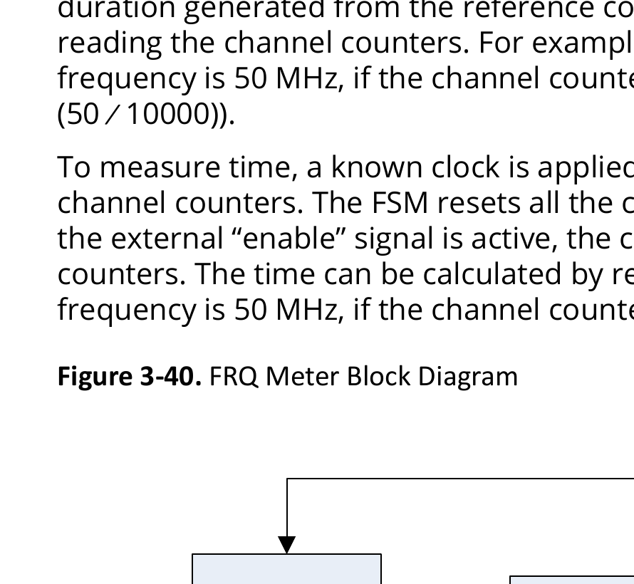

#### 3.12.15.2.1. Measurable Clocks

The measurable clocks can be selected from a group of channels. Each group has 8 channels with corresponding COUNTx register (x takes values from 0 to 7). The following table provides a list of all the measurable clocks in PolarFire SoC devices. Groups and channels, that are not listed in the following table, are not implemented. For more information on MSS clocks, see PolarFire Family Clocking Resources User Guide.

**Table 3-72. Measurable Clocks**

| Clock Name | Description | Channel / Group |
| --- | --- | --- |
| clk_cpu | MSS CPU cores | 0 / B |
| clk_axi | MSS AXI clock | 1 / B |
| clk_ahb | MSS AHB and APB | 2 / B |
| clk_reference | REFCLK for MSS PLL | 3 / B |
| clk_dfi | DDR PHY interface | 4 / B |
| clk_in_mac_tx | MSS MAC transmit | 0 / C |
| clk_in_mac_tsu | MSS MAC timestamp | 1 / C |
| clk_in_mac0_rx | GEM0 MAC receive synchronization | 2 / C |
| clk_in_mac1_rx | GEM1 MAC receive synchronization | 3 / C |
| sgmii_clk0_c_out | Test clock from SGMII DLL | 4 / C |
| clk_in_crypto | Cryptoprocessor clock in MSS mode | 0 / D |
| clk_in_usb | MSS USB controller | 1 / D |
| clk_in_emmc | MSS eMMC/SD/SDIO controller | 2 / D |
| clk_in_can (_clk) | MSS CAN controller | 3 / D |
| sgmii_pll_clkout_0 | SGMII PLL clock of frequency 625 MHz with phase 0 used to Clock and Data Recovery | 0 / E |
| sgmii_pll_clkout_1 | SGMII PLL clock of frequency 625 MHz with phase 90 used to Clock and Data Recovery | 1 / E |
| sgmii_pll_clkout_2 | SGMII PLL clock of frequency 625 MHz with phase 180 used to Clock and Data Recovery | 2 / E |
| sgmii_pll_clkout_3 | SGMII PLL clock of frequency 625 MHz with phase 270 used to Clock and Data Recovery | 3 / E |
| sgmii_dll_clk_out0 | SGMII DLL output | 4 / E |
| fab_mac0_tsu_clk | Timestamp clock sourced from fabric for GEM0 MAC | 2 / F |
| fab_mac1_tsu_clk | Timestamp clock sourced from fabric for GEM1 MAC | 3 / F |

The clocks mentioned in the preceding table can be measured by configuring the registers of the FRQ Meter. See the FRQMETER register map in the PolarFire SoC Device Register Map.

Use the following steps to measure the frequency:

1. Set the main clock selection register `FRQMETER : CLKSEL` as follows:
   a. Select the group using clock selection register bit fields `FRQMETER : CLKSEL[2:0]`, F, E, D, C, B. These groups in descending order control the MUXing to the COUNTx registers. Each group has 8 channels with dedicated COUNTx register.
   b. The next bit field `FRQMETER : CLKSEL[4]` controls the reference clock input source and is defaulted to the system controller’s dedicated JTAG controller TCK (bit field value = “0”). An alternate reference is the MSS PLL reference clock (bit field value = “1”), which is 100 or 125 MHz based on the user selection in the PolarFire SoC MSS Configurator.
   c. Select the channel that drives the clock monitor output 0 to 7 using clock selection register bit fields `FRQMETER : CLKSEL[10:8]`.
2. Enable the clock monitor output using clock selection register bit field `FRQMETER : CLKSEL[11]`.
3. Set the run time reference clock cycles in the register `FRQMETER : RUNTIME`. By default, this is set to a value of 10000. This value is used as a reference while calculating the frequency. This value specifies the number of run time clock cycles for which the time and frequency must be measured.
4. The `FRQMETER : MODE` selects the measurement method. There are 3 options of operation for each individual channel between 7 – 0, using bits [15:0]. The settings are disabled “00”, Frequency Mode “01”, Time Mode “11”, Reserved “10”. If the value “10” (Reserved) is selected, the clock measurement returns zero. For description of the modes, see PolarFire SoC Device Register Map.
5. The `FRQMETER : CONTROL[0]` register bit starts the clock measurements with a “1” and transitions to “0” when the measurement is complete. This bit must be activated for each measurement.
6. Once the measurement is complete by reading `FRQMETER : CONTROL[0]`, read the register `FRQMETER : COUNTx(s)`. The COUNTx registers correspond to configured channel mode and group that were set earlier. The COUNTx register holds the measured mode value for that channel with respect to the reference clock.

Follow these steps to see the FRQMETER peripheral drivers:

1. Go to GitHub.
2. Browse to `mpfs_hal/common/nwc`.
3. The Frequency Meter (FRQMETER) bare metal driver is defined in `mss_cfm.c` and `mss_cfm.h` files.
4. To see the usage of Frequency Meter driver, follow these steps:
   a. Go to Bare Metal Examples.
   b. Browse to `driver-examples/mss/mpfs-hal/mpfs-hal-ddr-demo/src/application/hart0`
   c. See the `display_clocks()` function in the `e51.c` file.

### 3.12.15.3. Register Map

For information about FRQ meter register map, see PolarFire SoC Device Register Map.

## 3.12.16. M2F Interrupt Controller

The M2F interrupt controller block facilitates the generation of the interrupt signals between the MSS and the fabric. This block is used to route MSS interrupts to the fabric and fabric interrupts to the MSS. The M2F interrupt controller module has an APB slave interface that can be used to configure interrupt processing. Some of the MSS interrupts can be used as potential interrupt sources to the FPGA fabric.

### 3.12.16.1. Features

The M2F Interrupt Controller supports the following features:

- 43 interrupts from the MSS as inputs
- 16 individually configurable MSS to fabric interrupt ports (MSS_INT_M2F[15:0])
- 64 individually configurable fabric to MSS interrupt ports (MSS_INT_F2M[63:0])

### 3.12.16.2. Functional Description

M2F controller has 43 interrupt lines from the MSS interrupt sources. These MSS interrupts are combined to produce 16 MSS to Fabric interrupts (MSS_INT_M2F[15:0]). These interrupts are level sensitive with active-high polarity. The following figure shows the block diagram of M2F interrupt controller.

**Figure 3-41. M2F Interrupt Controller Block Diagram**

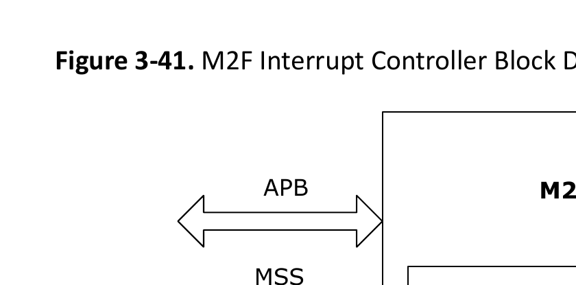

The peripherals driving the M2F interrupt source inputs must ensure that their interrupts remain asserted until peripherals are serviced.

As shown in the preceding figure, MSS_INT_F2M[63:0] interrupts are from fabric to MSS.

- These are level-triggered interrupts (active-high).
- The assert time should be more than Platform Level Interrupt Controller (PLIC) clock frequency.
- If these interrupts are enabled and the interrupt handler is assigned, whenever the interrupt occurs, the interrupt handler is executed.
- In the interrupt handler, the user can read the status and clear the interrupt through APB interface in the PLIC register map. The fabric interrupt source can be cleared through APB/AXI interface.

### 3.12.16.3. Register Map

For information about M2F Interrupt Controller register map, see PolarFire SoC Device Register Map.
