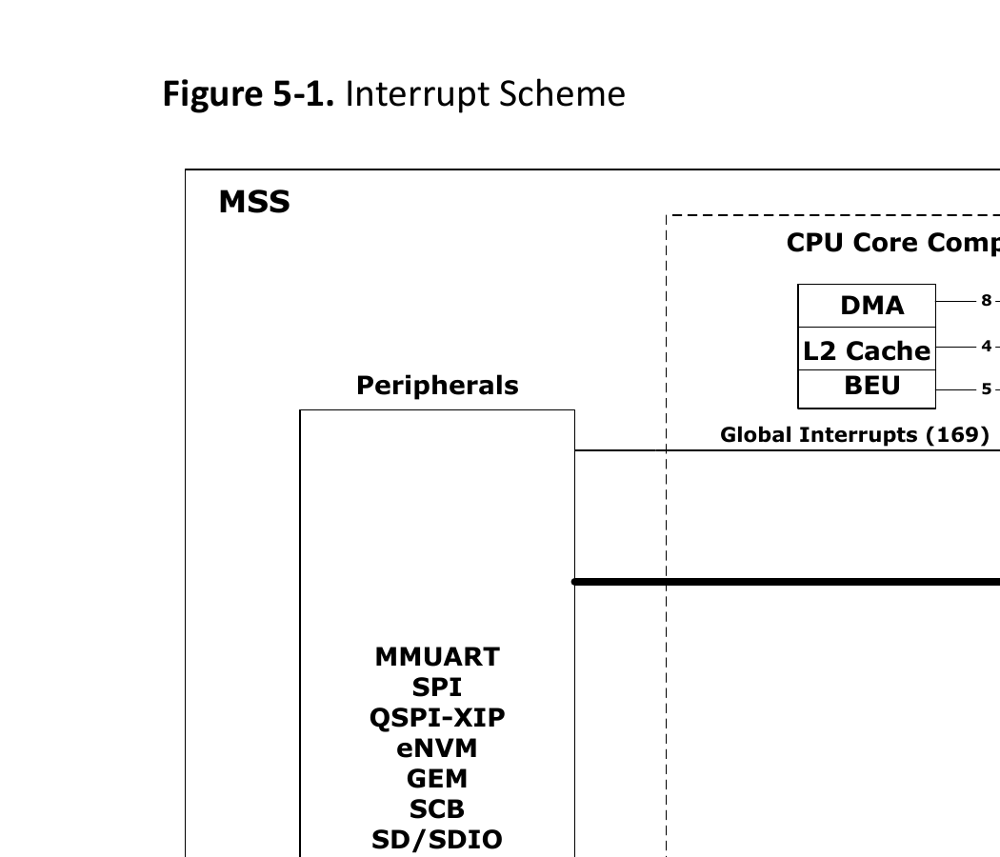

# 5. Interrupts

Each processor core supports Local and Global Interrupts. 48 interrupts from peripherals are directly connected as Local interrupts to each processor core. Local interrupts are handled faster than the Global interrupts. The Core Local Interrupt Controller (CLINT) block generates Software and Timer Interrupts which are also Local interrupts.

169 interrupts from peripherals and 16 interrupts from the CPU Core Complex blocks—DMA Engine, BEU, and L2 Cache are connected to the Platform-Level Interrupt Controller (PLIC) as Global interrupts. The PLIC asserts Global interrupts to a specific processor core. The user can configure the PLIC registers to perform the following:

- Enable the required Global interrupts
- Route the interrupt to a specific core
- Assign priority to those interrupts
- Assign priority threshold levels

> Important: Priority threshold levels isolate interrupt handling among processor cores.

Some application critical Global interrupts can also be routed as Local interrupts. All interrupts are synchronized with the AXI/CPU clock domain for relaxed timing requirements. For a Hart, the latency of Global interrupts increases with the ratio of the core clock frequency to the clock frequency.

The following figure shows the interrupt scheme of the MSS.

**Figure 5-1. Interrupt Scheme**

Table 5-1 lists the Local and Global interrupts implemented in the MSS.

For Example:

- The spi0 interrupt signal is a Global interrupt because it is not connected to any Hart as a Local interrupt. This interrupt signal is connected to the PLIC.
- The mac0_int interrupt signal is a Local interrupt to Hart1 and Hart2. It can also be enabled as a Global interrupt through the PLIC to Hart0, Hart3, and Hart4.

**Table 5-1. Routing of Interrupts to Processor Cores**

| Interrupt | Width | Global_int | IRQ | Hart0 | Hart1 | Hart2 | Hart3 | Hart4 | M2F-Vect | M2F-Int | U54-Mask |
| --- | --- | --- | --- | --- | --- | --- | --- | --- | --- | --- | --- |
| MSS_INT_F2M[63:32] | 32 | [168:137] | [181:150] | [47:16] | — | — | — | — | — | — | — |
| MSS_INT_F2M[31:0] | 32 | [136:105] | [149:118] | — | [47:16] | [47:16] | [47:16] | [47:16] | — | — | MASKED |
| gpio0/2 | 14 | [13:0] | [26:13] | — | — | — | — | — | [13:0] | 0 | — |
| gpio1/2 | 24 | [37:14] | [50:27] | — | — | — | — | — | [37:14] | 0 | — |
| gpio0_non_direct | 1 | 38 | 51 | — | — | — | — | — | 38 | 0 | — |
| gpio1_non_direct | 1 | 39 | 52 | — | — | — | — | — | 39 | 0 | — |
| gpio2_non_direct | 1 | 40 | 53 | — | — | — | — | — | 40 | 0 | — |
| spi0 | 1 | 41 | 54 | — | — | — | — | — | 41 | 1 | — |
| spi1 | 1 | 42 | 55 | — | — | — | — | — | 42 | 1 | — |
| can0 | 1 | 43 | 56 | — | — | — | — | — | 43 | 1 | — |
| can1 | 1 | 44 | 57 | — | — | — | — | — | 44 | 1 | — |
| i2c0_main | 1 | 45 | 58 | — | — | — | — | — | 45 | 2 | — |
| i2c0_alert | 1 | 46 | 59 | — | — | — | — | — | 46 | 2 | — |
| i2c0_sus | 1 | 47 | 60 | — | — | — | — | — | 47 | 2 | — |
| i2c1_main | 1 | 48 | 61 | — | — | — | — | — | 48 | 2 | — |
| i2c1_alert | 1 | 49 | 62 | — | — | — | — | — | 49 | 2 | — |
| i2c1_sus | 1 | 50 | 63 | — | — | — | — | — | 50 | 2 | — |
| mac0_int | 1 | 51 | 64 | — | 8 | 8 | — | — | 51 | 3 | MASKED |
| mac0_queue1 | 1 | 52 | 65 | — | 7 | 7 | — | — | 52 | 3 | MASKED |
| mac0_queue2 | 1 | 53 | 66 | — | 6 | 6 | — | — | 53 | 3 | MASKED |
| mac0_queue3 | 1 | 54 | 67 | — | 5 | 5 | — | — | 54 | 3 | MASKED |
| mac0_emac | 1 | 55 | 68 | — | 4 | 4 | — | — | 55 | 3 | MASKED |
| mac0_mmsl | 1 | 56 | 69 | — | 3 | 3 | — | — | 56 | 3 | MASKED |
| mac1_int | 1 | 57 | 70 | — | — | — | 8 | 8 | 57 | 4 | MASKED |
| mac1_queue1 | 1 | 58 | 71 | — | — | — | 7 | 7 | 58 | 4 | MASKED |
| mac1_queue2 | 1 | 59 | 72 | — | — | — | 6 | 6 | 59 | 4 | MASKED |
| mac1_queue3 | 1 | 60 | 73 | — | — | — | 5 | 5 | 60 | 4 | MASKED |
| mac1_emac | 1 | 61 | 74 | — | — | — | 4 | 4 | 61 | 4 | MASKED |
| mac1_mmsl | 1 | 62 | 75 | — | — | — | 3 | 3 | 62 | 4 | MASKED |
| ddrc_train | 1 | 63 | 76 | — | — | — | — | — | 63 | 9 | — |
| scb_interrupt | 1 | 64 | 77 | 15 | — | — | — | — | 64 | 7 | — |
| peripheral_ecc_error^1 | 1 | 65 | 78 | 14 | — | — | — | — | 65 | 6 | — |
| peripheral_ecc_correct^1 | 1 | 66 | 79 | 13 | — | — | — | — | 66 | 6 | — |
| rtc_wakeup | 1 | 67 | 80 | — | — | — | — | — | 67 | 11 | — |
| rtc_match | 1 | 68 | 81 | — | — | — | — | — | 68 | 11 | — |
| timer1 | 1 | 69 | 82 | — | — | — | — | — | 69 | 12 | — |
| timer2 | 1 | 70 | 83 | — | — | — | — | — | 70 | 12 | — |
| envm | 1 | 71 | 84 | 12 | — | — | — | — | 71 | 13 | — |
| qspi | 1 | 72 | 85 | — | — | — | — | — | 72 | 13 | — |
| usb_dma | 1 | 73 | 86 | — | — | — | — | — | 73 | 14 | — |
| usb_mc | 1 | 74 | 87 | — | — | — | — | — | 74 | 14 | — |
| mmc_main | 1 | 75 | 88 | — | — | — | — | — | 75 | 15 | — |
| mmc_wakeup | 1 | 76 | 89 | — | — | — | — | — | 76 | 15 | — |
| mmuart0 | 1 | 77 | 90 | 11 | — | — | — | — | 77 | 1 | — |
| mmuart1 | 1 | 78 | 91 | — | 11 | — | — | — | 78 | 1 | — |
| mmuart2 | 1 | 79 | 92 | — | — | 11 | — | — | 79 | 1 | — |
| mmuart3 | 1 | 80 | 93 | — | — | — | 11 | — | 80 | 1 | — |
| mmuart4 | 1 | 81 | 94 | — | — | — | — | 11 | 81 | 1 | — |
| wdog0_mvrp | 1 | 87 | 100 | 10 | — | — | — | — | 87 | 5 | — |
| wdog1_mvrp | 1 | 88 | 101 | — | 10 | — | — | — | 88 | 5 | — |
| wdog2_mvrp | 1 | 89 | 102 | — | — | 10 | — | — | 89 | 5 | — |
| wdog3_mvrp | 1 | 90 | 103 | — | — | — | 10 | — | 90 | 5 | — |
| wdog4_mvrp | 1 | 91 | 104 | — | — | — | — | 10 | 91 | 5 | — |
| wdog0_tout | 1 | 92 | 105 | 9 | — | — | — | — | 92 | 5 | — |
| wdog1_tout | 1 | 93 | 106 | 8 | 9 | — | — | — | 93 | 5 | — |
| wdog2_tout | 1 | 94 | 107 | 7 | — | 9 | — | — | 94 | 5 | — |
| wdog3_tout | 1 | 95 | 108 | 6 | — | — | 9 | — | 95 | 5 | — |
| wdog4_tout | 1 | 96 | 109 | 5 | — | — | — | 9 | 96 | 5 | — |
| g5c_devrst | 1 | 82 | 95 | 4 | — | — | — | — | 82 | 10 | — |
| g5c_message | 1 | 83 | 96 | 3 | — | — | — | — | 83 | 8 | — |
| usoc_vc_interrupt | 1 | 84 | 97 | 2 | — | — | — | — | 84 | 11 | — |
| usoc_smb_interrupt | 1 | 85 | 98 | 1 | — | — | — | — | 85 | 11 | — |
| pll_event | 1 | 86 | 99 | 0 | — | — | — | — | 86 | 6 | — |
| mpu_fail | 1 | 86 | 99 | 0 | — | — | — | — | 86 | 6 | — |
| decode_error | 1 | 86 | 99 | 0 | — | — | — | — | 86 | 6 | — |
| lp_state_enter | 1 | 86 | 99 | 0 | — | — | — | — | 86 | 6 | — |
| lp_state_exit | 1 | 86 | 99 | 0 | — | — | — | — | 86 | 6 | — |
| ff_start | 1 | 86 | 99 | 0 | — | — | — | — | 86 | 6 | — |
| ff_end | 1 | 86 | 99 | 0 | — | — | — | — | 86 | 6 | — |
| fpga_on | 1 | 86 | 99 | 0 | — | — | — | — | 86 | 6 | — |
| fpga_off | 1 | 86 | 99 | 0 | — | — | — | — | 86 | 6 | — |
| scb_error | 1 | 86 | 99 | 0 | — | — | — | — | 86 | 6 | — |
| scb_fault | 1 | 86 | 99 | 0 | — | — | — | — | 86 | 6 | — |
| mesh_fail | 1 | 86 | 99 | 0 | — | — | — | — | 86 | 6 | — |
| io_bank_b2_on | 1 | 86 | 99 | 0 | — | — | — | — | 86 | 6 | — |
| io_bank_b4_on | 1 | 86 | 99 | 0 | — | — | — | — | 86 | 6 | — |
| io_bank_b5_on | 1 | 86 | 99 | 0 | — | — | — | — | 86 | 6 | — |
| io_bank_b6_on | 1 | 86 | 99 | 0 | — | — | — | — | 86 | 6 | — |
| io_bank_b2_off | 1 | 86 | 99 | 0 | — | — | — | — | 86 | 6 | — |
| io_bank_b4_off | 1 | 86 | 99 | 0 | — | — | — | — | 86 | 6 | — |
| io_bank_b5_off | 1 | 86 | 99 | 0 | — | — | — | — | 86 | 6 | — |
| io_bank_b6_off | 1 | 86 | 99 | 0 | — | — | — | — | 86 | 6 | — |
| g5c_mss_spi | 1 | 97 | 110 | — | — | — | — | — | 97 | 13 | — |
| volt_temp_alarm | 1 | 98 | 111 | — | — | — | — | — | 98 | No | — |
| athena_complete | 1 | 99 | 112 | — | — | — | — | — | NA | No | — |
| athena_alarm | 1 | 100 | 113 | — | — | — | — | — | NA | No | — |
| athena_buserror | 1 | 101 | 114 | — | — | — | — | — | NA | No | — |
| usoc_axic_us | 1 | 102 | 115 | — | — | — | — | — | 102 | 11 | — |

| usoc_axic_ds | 1 | 103 | 116 | — | — | — | — | — | 103 | 11 | — |
| reserved/spare | 11 | [104] | [117] | 0 | 7 | 7 | 7 | 7 | NA | — | — |

> Note:
> 1. The peripheral_ecc_error and peripheral_ecc_correct interrupts are driven by the EDAC_SR register. To implement ECC for peripherals, ECC interrupts are enabled individually by writing to the EDAC_INTEN_CR register. ECC interrupts are cleared by writing to the EDAC_SR register. ECC error count is available in EDAC_CNT_[peripheral] registers. For more information about these registers, see the PFSOC_MSS_TOP_SYSREG in PolarFire SoC Device Register Map.

To enable all Local interrupts on the U54_1 core, set the FAB_INTEN_U54_1 register using the SYSREG->FAB_INTEN_U54_1 = 0xffffffff; instruction. This instruction enables all MSS_INT_F2M[31:0] interrupts to interrupt U54_1 directly. Similarly, enable the Local interrupts on U54_2, U54_3, and U54_4 cores.

By default, all Local interrupts MSS_INT_F2M[63:32] are enabled on the E51 core.

## 5.1. Interrupt CSRs

When a Hart receives an interrupt, the following events are executed:

1. The value of `mstatus.MIE` field is copied into `mstatus.MPIE`, then `mstatus.MIE` is cleared, effectively disabling interrupts.
2. The current value in the program counter (PC) is copied to the `mepc` register, and then PC is set to the value of `mtvec`. If vectored interrupts are enabled, PC is set to `mtvec.BASE + 4 × exception code`.
3. The Privilege mode prior to the interrupt is encoded in `mstatus.MPP`.
4. At this point, control is handed over to the software in the interrupt handler with interrupts disabled.

Interrupts can be re-enabled by explicitly setting `mstatus.MIE`, or by executing the `MRET` instruction to exit the handler. When the `MRET` instruction is executed:

1. The Privilege mode is set to the value encoded in `mstatus.MPP`.
2. The value of `mstatus.MPIE` is copied to `mstatus.MIE`.
3. The PC is set to the value of `mepc`.
4. At this point, control is handed over to software.

The Interrupt CSRs are described in the following sections. This document only describes the implementation of interrupt CSRs specific to CPU Core Complex. For a complete description of RISC-V interrupt behavior and how to access CSRs, see The RISC-V Instruction Set Manual, Volume II: Privileged Architecture, Version 1.10.

### 5.1.1. Machine STATUS Register (mstatus)

The `mstatus` register tracks and controls the current operating state of a Hart and tracks whether interrupts are enabled or not. Interrupts are enabled by setting the MIE bit and by enabling the required individual interrupt in the `mie` register described in the next section.

The `mstatus` register description related to interrupts is provided in Table 5-2. The `mstatus` register also contains fields unrelated to interrupts. For a complete description of the `mstatus` register, see The RISC-V Instruction Set Manual, Volume II: Privileged Architecture, Version 1.10.

**Table 5-2. Machine Status Register (mstatus)**

| Bits | Field Name | Attributes | Description |
| --- | --- | --- | --- |
| 0 | Reserved | WPRI | — |
| 1 | SIE | RW | Supervisor Interrupt Enable |
| 2 | Reserved | WPRI | — |
| 3 | MIE | RW | Machine Interrupt Enable |
| 4 | Reserved | WPRI | — |
| 5 | SPIE | RW | Supervisor Previous Interrupt Enable |
| 6 | Reserved | WPRI | — |
| 7 | MPIE | RW | Machine Previous Interrupt Enable |
| 8 | SPP | RW | Supervisor Previous Privilege Mode |
| [10:9] | Reserved | WPRI | — |
| [12:11] | MPP | RW | Machine Previous Privilege Mode |

### 5.1.2. Machine Interrupt Enable Register (mie)

Individual interrupts are enabled by setting the appropriate bit in the `mie` register described in the following table.

**Table 5-3. Machine Interrupt Enable Register (mie)**

| Bits | Field Name | Attributes | Description |
| --- | --- | --- | --- |
| 0 | Reserved | WIRI | — |
| 1 | SSIE | RW | Supervisor Software Interrupt Enable |
| 2 | Reserved | WIRI | — |
| 3 | MSIE | RW | Machine Software Interrupt Enable |
| 4 | Reserved | WIRI | — |
| 5 | STIE | RW | Supervisor Timer Interrupt Enable |
| 6 | Reserved | WIRI | — |
| 7 | MTIE | RW | Machine Timer Interrupt Enable |
| 8 | Reserved | WIRI | — |
| 9 | SEIE | RW | Supervisor Global Interrupt Enable |
| 10 | Reserved | WIRI | — |
| 11 | MEIE | RW | Machine Global Interrupt Enable |
| [15:12] | Reserved | WIRI | — |
| 16 | LIE0 | RW | Local Interrupt 0 Enable |
| 17 | LIE1 | RW | Local Interrupt 1 Enable |
| 18 | LIE2 | RW | Local Interrupt 2 Enable |
| … | … | … | … |
| 63 | LIE47 | RW | Local Interrupt 47 Enable |

### 5.1.3. Machine Interrupt Pending Register (mip)

The machine interrupt pending (`mip`) register specifies interrupts which are currently pending.

**Table 5-4. Machine Interrupt Pending Register (mip)**

| Bits | Field Name | Attributes | Description |
| --- | --- | --- | --- |
| 0 | Reserved | WPRI | — |
| 1 | SSIP | RW | Supervisor Software Interrupt Pending |
| 2 | Reserved | WPRI | — |
| 3 | MSIP | RO | Machine Software Interrupt Pending |

**Table 5-4. Machine Interrupt Pending Register (mip) (continued)**

| Bits | Field Name | Attributes | Description |
| --- | --- | --- | --- |
| 4 | Reserved | WPRI | — |
| 5 | STIP | RW | Supervisor Timer Interrupt Pending |
| 6 | Reserved | WPRI | — |
| 7 | MTIP | RO | Machine Timer Interrupt Pending |
| 8 | Reserved | WPRI | — |
| 9 | SEIP | RW | Supervisor Global Interrupt Pending |
| 10 | Reserved | WPRI | — |
| 11 | MEIP | RO | Machine Global Interrupt Pending |
| [15:12] | Reserved | WPRI | — |
| 16 | LIP0 | RO | Local Interrupt 0 Pending |
| 17 | LIP1 | RO | Local Interrupt 1 Pending |
| 18 | LIP2 | RO | Local Interrupt 2 Pending |
| … | … | … | … |
| 63 | LIP47 | RO | Local Interrupt 47 Pending |

### 5.1.4. Machine Cause Register (mcause)

When a trap is taken in the Machine mode, `mcause` is written with a code indicating the event that caused the trap. When the event that caused the trap is an interrupt, the most significant bit (MSb) of `mcause` is set to 1, and the least significant bits (LSb) indicate the interrupt number, using the same encoding as the bit positions in `mip`. For example, a Machine Timer Interrupt causes `mcause` to be set to `0x8000_0000_0000_0007`. `mcause` is also used to indicate the cause of synchronous exceptions, in which case the MSb of `mcause` is set to 0. This section provides the `mcause` register description and a list of synchronous Exception codes.

**Table 5-5. Machine Cause Register**

| Bits | Field Name | Attributes | Description |
| --- | --- | --- | --- |
| [62:0] | Exception Code | WLRL | A code identifying the last exception. See Table 5-6 |
| 63 | Interrupt | WLRL | 1 if the trap was caused by an interrupt; 0 otherwise. |

**Table 5-6. Interrupt Exception Codes**

| Interrupt | Exception Code | Description |
| --- | --- | --- |
| 1 | 0 | Reserved |
| 1 | 1 | Supervisor software interrupt |
| 1 | 2 | Reserved |
| 1 | 3 | Machine software interrupt |
| 1 | 4 | Reserved |
| 1 | 5 | Supervisor timer interrupt |
| 1 | 6 | Reserved |
| 1 | 7 | Machine timer interrupt |
| 1 | 8 | Reserved |
| 1 | 9 | Supervisor Global interrupt |
| 1 | 10 | Reserved |
| 1 | 11 | Machine Global interrupt |
| 1 | 12-15 | Reserved |

**Table 5-6. Interrupt Exception Codes (continued)**

| Interrupt | Exception Code | Description |
| --- | --- | --- |
| 1 | 16 | Local Interrupt 0 |
| 1 | 17 | Local Interrupt 1 |
| 1 | 18-62 | ... |
| 1 | 63 | Local Interrupt 47 |
| 0 | 0 | Instruction address misaligned |
| 0 | 1 | Instruction access fault |
| 0 | 2 | Illegal Instruction |
| 0 | 3 | Breakpoint |
| 0 | 4 | Load address misaligned |
| 0 | 5 | Load access fault |
| 0 | 6 | Store/AMO address misaligned |
| 0 | 7 | Store/AMO access fault |
| 0 | 8 | Environment call from U-mode |
| 0 | 9 | Environment call from S-mode |
| 0 | 10 | Reserved |
| 0 | 11 | Environment call from M-mode |
| 0 | 12 | Instruction page fault |
| 0 | 13 | Load page fault |
| 0 | 14 | Reserved |
| 0 | 15 | Store/AMO page fault |
| 0 | 16-31 | Reserved |

### 5.1.5. Machine Trap Vector Register (mtvec)

By default, all interrupts trap to a single address defined in the `mtvec` register. The interrupt handler must read `mcause` and handle the trap accordingly. The CPU Core Complex supports interrupt vectoring for defining an interrupt handler for each interrupt defined in `mie`. Interrupt vectoring enables all local interrupts to trap to exclusive interrupt handlers. With vectoring enabled, all global interrupts trap to a single global interrupt vector. Vectored interrupts are enabled when the MODE field of the `mtvec` register is set to 1. The following table lists the `mtvec` register description.

**Table 5-7. Machine Trap Vector Register (mtvec)**

| Bits | Field Name | Attributes | Description |
| --- | --- | --- | --- |
| [1:0] | MODE | WARL | MODE determines whether or not interrupt vectoring is enabled. The field encoding of `mtvec.MODE` is as follows: 0: (Direct) All exceptions set PC to BASE 1: (Vectored) Asynchronous interrupts set PC to BASE + 4 × cause ≥2: Reserved |
| [63:2] | BASE[63:2]^1 | WARL | Interrupt Vector Base Address. Must be aligned on a 256-byte boundary when MODE = 1. |

1. BASE[1:0] is not present in this register and is implicitly 0.

If vectored interrupts are disabled (`mtvec.MODE = 0`), all interrupts trap to the `mtvec.BASE` address. If vectored interrupts are enabled (`mtvec.MODE = 1`), interrupts set the PC to `mtvec.BASE + 4 × exception code`. For example, if a machine timer interrupt is taken, the PC is set to `mtvec.BASE + 0x1C`. The trap vector table is populated with jump instructions to transfer control to interrupt-specific trap handlers. In Vectored Interrupt mode, BASE must be 256-byte aligned. All machine Global interrupts are mapped to exception code of 11. Thus, when interrupt vectoring is enabled, the PC is set to address `mtvec.BASE + 0x2C` for any Global interrupt. See the interrupt exception codes table in Machine Cause Register (mcause).

## 5.2. Supervisor Mode Interrupts

For improved performance, the CPU Core Complex includes interrupt and exception delegation CSRs to direct the required interrupts and exceptions to Supervisor mode. This capability is enabled by `mideleg` and `medeleg` CSRs. Supervisor interrupts and exceptions can be managed through supervisor interrupt CSRs `stvec`, `sip`, `sie`, and `scause`. Machine mode software can also directly write to the `sip` register to pend an interrupt to Supervisor mode. A typical use case is the timer and software interrupts, which may have to be handled in both Machine and Supervisor modes. For more information about RISC-V supervisor interrupts, see The RISC-V Instruction Set Manual, Volume II: Privileged Architecture, Version 1.10.

By setting the corresponding bits in the `mideleg` and `medeleg` CSRs, the Machine mode software can delegate the required interrupts and exceptions to Supervisor mode. Once a delegated trap is asserted, `mcause` is copied into `scause` and `mepc` is copied into `sepc`, and then, the Hart traps to the `stvec` address in Supervisor mode. Local interrupts can not be delegated to Supervisor mode. The register description of the delegation and supervisor CSRs are described in the following sections.

### 5.2.1. Machine Interrupt Delegation Register (mideleg)

The register description of the `mideleg` register is provided in the following table.

**Table 5-8. Machine Interrupt Delegation Register (mideleg)**

| Bits | Attributes | Description |
| --- | --- | --- |
| 0 | WARL | Reserved |
| 1 | WARL | Supervisor software interrupt |
| [4:2] | WARL | Reserved |
| 5 | WARL | Supervisor timer interrupt |
| [8:6] | WARL | Reserved |
| 9 | WARL | Supervisor external interrupt |
| [63:10] | WARL | Reserved |

### 5.2.2. Machine Exception Delegation Register (medeleg)

The register description of the `medeleg` register is provided in the following table.

**Table 5-9. Machine Exception Delegation Register (medeleg)**

| Bits | Attributes | Description |
| --- | --- | --- |
| 0 | WARL | Instruction address misaligned |
| 1 | WARL | Instruction access fault |
| 2 | WARL | Illegal Instruction |
| 3 | WARL | Breakpoint |
| 4 | WARL | Load address misaligned |
| 5 | WARL | Load access fault |
| 6 | WARL | Store/AMO address misaligned |
| 7 | WARL | Store/AMO access fault |
| 8 | WARL | Environment call from U-mode |
| 9 | WARL | Environment call from S-mode |
| [11:10] | WARL | Reserved |
| 12 | WARL | Instruction page fault |
| 13 | WARL | Load page fault |
| 14 | WARL | Reserved |
| 15 | WARL | Store/AMO page fault exception |
| [63:16] | WARL | Reserved |

### 5.2.3. Supervisor STATUS Register (sstatus)

`sstatus` is a restricted view of `mstatus` described in Machine STATUS Register (mstatus). Changes made to `sstatus` are reflected in `mstatus` and vice-versa but the Machine mode fields are not visible in `sstatus`. `sstatus` also contains fields unrelated to interrupts, those fields are not covered in this document. The `sstatus` fields related to interrupts are described in Table 5-10.

**Table 5-10. Supervisor STATUS Register (sstatus)**

| Bits | Field Name | Attributes | Description |
| --- | --- | --- | --- |
| 0 | Reserved | WPRI | — |
| 1 | SIE | RW | Supervisor Interrupt Enable |
| [4:2] | Reserved | WPRI | — |
| 5 | SPIE | RW | Supervisor Previous Interrupt Enable |
| [7:6] | Reserved | WPRI | — |
| 8 | SPP | RW | Supervisor Previous Privilege Mode |
| [12:9] | Reserved | WPRI | — |

Supervisor interrupts are enabled by setting the SIE bit in `sstatus` and by enabling the required individual supervisor interrupt in the `sie` register described in the following section.

### 5.2.4. Supervisor Interrupt Enable Register (sie)

The required supervisor interrupt (software, timer, and external interrupt) can be enabled by setting the appropriate bit in the `sie` register described in the following table.

**Table 5-11. Supervisor Interrupt Enable Register (sie)**

| Bits | Field Name | Attributes | Description |
| --- | --- | --- | --- |
| 0 | Reserved | WIRI | — |
| 1 | SSIE | RW | Supervisor Software Interrupt Enable |
| [4:2] | Reserved | WIRI | — |
| 5 | STIE | RW | Supervisor Timer Interrupt Enable |
| [8:6] | Reserved | WIRI | — |
| 9 | SEIE | RW | Supervisor External Interrupt Enable |
| [63:10] | Reserved | WIRI | — |

### 5.2.5. Supervisor Interrupt Pending (sip)

The supervisor interrupt pending (`sip`) register indicates the interrupts that are currently pending.

**Table 5-12. Supervisor Interrupt Pending Register (sip)**

| Bits | Field Name | Attributes | Description |
| --- | --- | --- | --- |
| 0 | Reserved | WPRI | — |
| 1 | SSIP | RW | Supervisor Software Interrupt Pending |
| [4:2] | Reserved | WPRI | — |
| 5 | STIP | RW | Supervisor Timer Interrupt Pending |
| [8:6] | Reserved | WPRI | — |
| 9 | SEIP | RW | Supervisor External Interrupt Pending |
| [63:10] | Reserved | WPRI | — |

### 5.2.6. Supervisor Cause Register (scause)

When a trap is received in Supervisor mode, `scause` is written with a code indicating the event that caused the trap. When the event is an interrupt, the most significant bit (MSb) of `scause` is set to 1, and the least significant bits (LSb) indicate the interrupt number, using the same encoding as the bit positions in `sip`. For example, a Supervisor Timer interrupt causes `scause` to be set to `0x8000_0000_0000_0005`. `scause` is also used to indicate the cause of synchronous exceptions, if the MSb of `scause` is set to 0.

**Table 5-13. Supervisor Cause Register (scause)**

| Bits | Field Name | Attributes | Description |
| --- | --- | --- | --- |
| [62:0] | Exception Code | WLRL | A code identifying the last exception. Supervisor Interrupt Exception codes are listed in Table 5-14. |
| 63 | Interrupt | WARL | 1 if the trap was caused by an interrupt; 0 otherwise. |

**Table 5-14. Supervisor Interrupt Exception Codes**

| Interrupt | Exception Code | Description |
| --- | --- | --- |
| 1 | 0 | Reserved |
| 1 | 1 | Supervisor software interrupt |
| 1 | 2-4 | Reserved |
| 1 | 5 | Supervisor timer interrupt |
| 1 | 6-8 | Reserved |
| 1 | 9 | Supervisor external interrupt |
| 1 | ≥10 | Reserved |
| 0 | 0 | Instruction address misaligned |
| 0 | 1 | Instruction access fault |
| 0 | 2 | Illegal instruction |
| 0 | 3 | Breakpoint |
| 0 | 4 | Reserved |
| 0 | 5 | Load access fault |
| 0 | 6 | Store/AMO address misaligned |
| 0 | 7 | Store/AMO access fault |
| 0 | 8 | Environment call from U-mode |
| 0 | 9-11 | Reserved |
| 0 | 12 | Instruction page fault |
| 0 | 13 | Load page fault |
| 0 | 14 | Reserved |
| 0 | 15 | Store/AMO page fault |
| 0 | ≥16 | Reserved |

### 5.2.7. Supervisor Trap Vector (stvec)

By default, all interrupts defined in `sie` trap to a single address defined in the `stvec` register. The interrupt handler must read `scause` and handle the interrupt accordingly. The CPU Core Complex supports interrupt vectors, which enables each interrupt to trap to its own specific interrupt handler. Vectored interrupts can be enabled by setting the `stvec.MODE` field to 1.

**Table 5-15. Supervisor Trap Vector Register (stvec)**

| Bits | Field Name | Attributes | Description |
| --- | --- | --- | --- |
| [1:0] | MODE | WARL | MODE determines whether or not interrupt vectoring is enabled. The field encoding of `stvec.MODE` is as follows: 0: (Direct) All exceptions set PC to BASE 1: (Vectored) Asynchronous interrupts set PC to: BASE + 4 × cause. ≥2: Reserved |
| [63:2] | BASE[63:2] | WARL | Interrupt Vector Base Address. Must be aligned on a 128-byte boundary when MODE=1. <strong>Note:</strong> BASE [1:0] is not present in this register and is implicitly 0. |

If vectored interrupts are disabled (`stvec.MODE=0`), all interrupts trap to the `stvec.BASE` address. If vectored interrupts are enabled (`stvec.MODE=1`), interrupts set the PC to `stvec.BASE + 4 × exception code`. For example, if a supervisor timer interrupt is taken, the PC is set to `stvec.BASE + 0x14`. Typically, the trap vector table is populated with jump instructions to transfer control to interrupt-specific trap handlers. In Vectored Interrupt mode, BASE must be 128-byte aligned.

All supervisor Global interrupts are mapped to exception code of 9. Thus, when interrupt vectoring is enabled, the PC is set to address `stvec.BASE + 0x24` for any global interrupt. See the supervisor interrupt exception codes in Table 5-14.

## 5.3. Interrupt Priorities

Local interrupts have higher priority than Global interrupts. If a Local and Global interrupt arrive in the same cycle, the Local interrupt is handled if enabled. Priorities of Local interrupts are determined by the Local interrupt ID, Local Interrupt 47 being the highest priority. For example, if Local Interrupt 47 and 6 arrive in the same cycle, Local Interrupt 47 is handled.

Exception code of the Local Interrupt 47 is also the highest and occupies the last slot in the interrupt vector table. This unique position in the vector table allows the interrupt handler of the Local Interrupt 47 to be placed in-line instead of a jump instruction. The jump instruction is required for other interrupts when operating in Vectored mode. Hence, Local Interrupt 47 must be used for the most critical interrupt in the system.

CPU Core Complex interrupts are prioritized in the following decreasing order of priority:

- Local Interrupt 47 to 0
- Machine Global interrupts
- Machine software interrupts
- Machine timer interrupts
- Supervisor Global interrupts
- Supervisor software interrupts
- Supervisor timer interrupts

Individual priorities of Global interrupts are determined by the PLIC, see Platform Level Interrupt Controller.

## 5.4. Interrupt Latency

Interrupt latency is four cycles and depends on the numbers of cycles it takes from the signaling of the interrupt to the first instruction fetch of the handler. Global interrupts routed through the PLIC incur an additional latency of three cycles, where the PLIC is clocked by the user_clock. If interrupt handler is cached or located in ITIM, the total latency (cycles) of a Global interrupt is `4 + 3 × [(core_clock (Hz)/user_clock (Hz)]`.

Additional latency from a peripheral source is not included. Moreover, the Hart does not ignore an arithmetic instruction like “Divide” that is in the execution pipeline. Hence, if an interrupt handler tries to use a register which is the destination register of a divide instruction, the pipeline stalls until the completion of the divide instruction.

## 5.5. Platform Level Interrupt Controller

The PLIC supports 186 Global interrupts with 7 priority levels and complies with The RISC-V Instruction Set Manual, Volume II: Privileged Architecture, Version 1.10.

### 5.5.1. PLIC Memory Map

The PLIC memory map is designed for naturally aligned 32-bit memory accesses.

**Table 5-16. PLIC Memory Map**

| Address | Width | Attributes | Description | Notes |
| --- | --- | --- | --- | --- |
| 0x0C00_0000 | 4B | RW | Reserved |  |
| 0x0C00_0004 | 4B | RW | source 1 priority |  |
| 0x0C00_0008 | 4B | RW | source 2 priority | See Table 5-18. |
| ... |  |  | ... |  |
| 0x0C00_02D0 |  |  | source 186 priority |  |
| 0xC00_02D4 | — | — | Reserved | — |
| ... |  |  |  |  |
| 0x0C00_0FFF |  |  |  |  |
| 0x0C00_1000 | 4B | RO | Start of pending array |  |
| ... | ... | ... | ... | See Table 5-19. |
| 0x0C00_1014 | 4B | RO | Last word of pending array |  |
| 0x0C00_1018 | — | — | Reserved | — |
| ... |  |  |  |  |
| 0x0C00_1FFF |  |  |  |  |
| 0x0C00_2000 | 4B | RW | Start of Hart 0 M-mode enables | See Table 5-21. |
| ... | ... | ... | ... | ... |
| 0x0C00_2014 | 4B | RW | End of Hart 0 M-mode enables |  |
| 0x0C00_2018 | — | — | Reserved | — |
| ... |  |  |  |  |
| 0x0C00_207F |  |  |  |  |

| Address | Width | Attributes | Description | Notes |
| --- | --- | --- | --- | --- |
| 0x0C00_2080 | 4B | RW | Hart 1 M-mode enables |  |
| ... | ... | ... | ... |  |
| 0x0C00_2094 | 4B | RW | End of Hart 1 M-mode enables |  |
| 0x0C00_2100 | 4B | RW | Hart 1 S-mode enables |  |
| ... | ... | ... | ... |  |
| 0x0C00_2114 | 4B | RW | End of Hart 1 S-mode enables |  |
| 0x0C00_2180 | 4B | RW | Hart 2 M-mode enables |  |
| ... | ... | ... | ... |  |
| 0x0C00_2194 | 4B | RW | End of Hart 2 M-mode enables |  |
| 0x0C00_2200 | 4B | RW | Hart 2 S-mode enables |  |
| ... | ... | ... | ... |  |
| 0x0C00_2214 | 4B | RW | End of Hart 2 S-mode enables |  |
| 0x0C00_2280 | 4B | RW | Hart 3 M-mode enables |  |
| ... | ... | ... | ... |  |
| 0x0C00_2294 | 4B | RW | End of Hart 3 M-mode enables |  |
| 0x0C00_2300 | 4B | RW | Hart 3 S-mode enables |  |
| ... | ... | ... | ... |  |
| 0x0C00_2314 | 4B | RW | End of Hart 3 S-mode enables |  |
| 0x0C00_2380 | 4B | RW | Hart 4 M-mode enables |  |
| ... | ... | ... | ... |  |
| 0x0C00_2394 | 4B | RW | End of Hart 4 M-mode enables |  |
| 0x0C00_2400 | 4B | RW | Hart 4 S-mode enables |  |
| ... | ... | ... | ... |  |
| 0x0C00_2414 | 4B | RW | End of Hart 4 S-mode enables |  |
| 0x0C00_2480 | — | — | Reserved |  |
| ... |  |  |  |  |
| 0x0C1F_FFFF |  |  |  |  |
| 0x0C20_0000 | 4B | RW | Hart 0 M-mode priority threshold | See Table 5-23 and Table 5-24. |
| 0x0C20_0004 | 4B | RW | Hart 0 M-mode claim/complete |  |
| 0x0C20_1000 | 4B | RW | Hart 1 M-mode priority threshold |  |
| 0x0C20_1004 | 4B | RW | Hart 1 M-mode claim/complete |  |
| 0x0C20_2000 | 4B | RW | Hart 1 S-mode priority threshold |  |
| 0x0C20_2004 | 4B | RW | Hart 1 S-mode claim/complete |  |
| 0x0C20_3000 | 4B | RW | Hart 2 M-mode priority threshold |  |
| 0x0C20_3004 | 4B | RW | Hart 2 M-mode claim/complete |  |
| 0x0C20_4000 | 4B | RW | Hart 2 S-mode priority threshold |  |
| 0x0C20_4004 | 4B | RW | Hart 2 S-mode claim/complete |  |
| 0x0C20_5000 | 4B | RW | Hart 3 M-mode priority threshold |  |
| 0x0C20_5004 | 4B | RW | Hart 3 M-mode claim/complete |  |
| 0x0C20_6000 | 4B | RW | Hart 3 S-mode priority threshold | — |
| 0x0C20_6004 | 4B | RW | Hart 3 S-mode claim/complete |  |
| 0x0C20_7000 | 4B | RW | Hart 4 M-mode priority threshold |  |
| 0x0C20_7004 | 4B | RW | Hart 4 M-mode claim/complete |  |
| 0x0C20_8000 | 4B | RW | Hart 4 S-mode priority threshold |  |
| 0x0C20_8004 | 4B | RW | Hart 4 S-mode claim/complete |  |

### 5.5.2. Interrupt Sources

The CPU Core Complex exposes 186 Global interrupt signals, these signals are connected to the PLIC. The mapping of these interrupt signals to their corresponding PLIC ID’s is provided in the following table.

**Table 5-17. PLIC Interrupt ID Mapping**

| IRQ | Peripheral | Description |
| --- | --- | --- |
| 1 | L2 Cache Controller | Signals when a metadata correction event occurs |
| 2 | L2 Cache Controller | Signals when an uncorrectable metadata event occurs |
| 3 | L2 Cache Controller | Signals when a data correction event occurs |
| 4 | L2 Cache Controller | Signals when an uncorrectable data event occurs |
| 5 | DMA Controller | Channel 0 Done |
| 6 | DMA Controller | Channel 0 Error |
| 7 | DMA Controller | Channel 1 Done |
| 8 | DMA Controller | Channel 1 Error |
| 9 | DMA Controller | Channel 2 Done |
| 10 | DMA Controller | Channel 2 Error |
| 11 | DMA Controller | Channel 3 Done |
| 12 | DMA Controller | Channel 3 Error |
| [181:13] | Off Core Complex | Connected to global_interrupts signal from MSS peripherals |
| 182 | Bus Error Unit Hart0 | Bus Error Unit described in Bus Error Unit (BEU). |
| 183 | Bus Error Unit Hart1 | Bus Error Unit described in Bus Error Unit (BEU). |
| 184 | Bus Error Unit Hart2 | Bus Error Unit described in Bus Error Unit (BEU). |
| 185 | Bus Error Unit Hart3 | Bus Error Unit described in Bus Error Unit (BEU). |
| 186 | Bus Error Unit Hart4 | Bus Error Unit described in Bus Error Unit (BEU). |

The Global interrupt signals are positive-level triggered. Any unused Global interrupts (inputs) must be tied to logic 0. In the PLIC, Global Interrupt ID 0 means “no interrupt”, therefore, Global interrupts[0] corresponds to PLIC Interrupt ID 1.

### 5.5.3. Interrupt Priorities Register

Each PLIC interrupt source can be assigned a priority by writing to its 32-bit memory-mapped priority register. A priority value of 0 is reserved to mean “never interrupt” and effectively disables the interrupt. Priority 1 is the lowest active priority, and priority 7 is the highest. Ties between global interrupts of the same priority are broken by the Interrupt ID; interrupts with the lowest ID have the highest effective priority. The priority register description is provided in the following table.

**Table 5-18. PLIC Interrupt Priority Register**

| Base Address = 0x0C00_0000 + 4 × Interrupt ID |
| --- |

| Bits | Field Name | Attributes | Reset | Description |
| --- | --- | --- | --- | --- |
| [2:0] | Priority | WARL | X | Sets the priority for a given global interrupt. |
| [31:3] | Reserved | WIRI | X | — |

### 5.5.4. Interrupt Pending Bits

The current status of the interrupt source can be read from the pending bits in the PLIC. The pending bits are organized as 6 words of 32 bits, see Table 5-19 for the register description. The pending bit for interrupt ID N is stored in bit (N mod 32) of word (N=32). The PLIC includes 6 interrupt pending registers, see Table 5-19 for the first register description and Table 5-20 for the sixth register. Bit 0 of word 0, which represents the non-existent interrupt source 0, is hardwired to zero.
