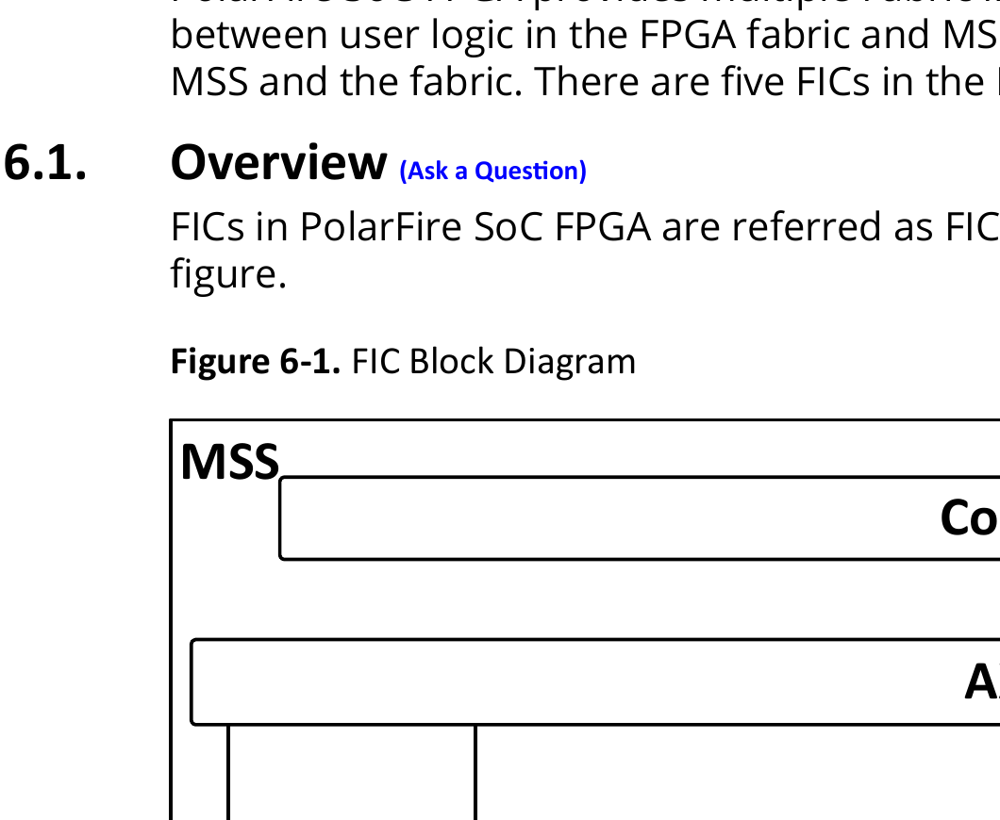
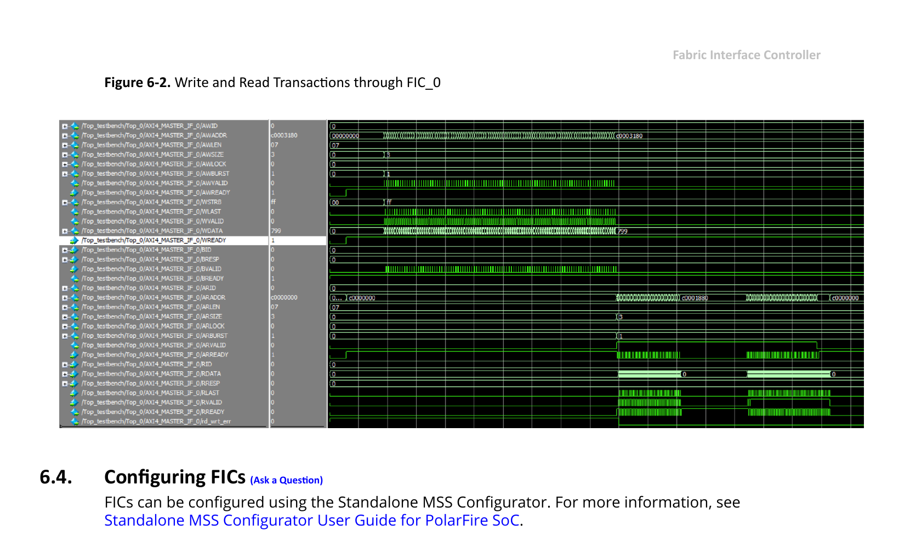

# 6. Fabric Interface Controller

PolarFire SoC FPGA provides multiple Fabric Interface Controllers (FIC) to enable connectivity between user logic in the FPGA fabric and MSS. FIC is part of the MSS and acts as a bridge between MSS and the fabric. There are five FICs in the MSS.

## 6.1. Overview

FICs in PolarFire SoC FPGA are referred as FIC0, FIC1, FIC2, FIC3, and FIC4 as shown in the following figure.

**Figure 6-1. FIC Block Diagram**

There are three 64-bit AXI4 FICs, one 32-bit APB interface FIC, and one 32-bit AHB-Lite interface FIC, see Table 6-1.

**Table 6-1. FICs in PolarFire SoC FPGA**

| FIC Interface | Description |
| --- | --- |
| FIC0 and FIC1 | Provides two 64-bit AXI4 bus interfaces between the MSS and the fabric. Both FIC0 and FIC1 can be mastered by MSS and fabric and can have slaves in MSS and fabric. FIC0 is used for data transfers to/from the fabric. FIC1 is used for data transfers to/from the fabric and PCIe Controller hard block in the FPGA. |
| FIC2 | Provides a single 64-bit AXI4 bus interface between the MSS and the fabric. It is mastered by the fabric and has slaves in the MSS. FIC2 is only used to access non-cached DDR memory through the DDR controller inside the MSS block. |
| FIC3 | Provides a single 32-bit APB bus interface between the MSS and the fabric, it is mastered by the MSS and has slaves in the fabric. It can be used to configure PCIe and XCVR Hard blocks. |
| FIC4 | This FIC is dedicated to interface with the User Crypto Processor. This provides two 32-bit AHB-Lite bus interfaces between the MSS Core Complex and the fabric. One of them is mastered by fabric and the Crypto processor acts as slave. The other is mastered by the DMA controller of the User Crypto Processor and has a slave in the fabric. |

Each FIC can operate on a different clock frequency, defined as a ratio of the MSS main clock. The FIC is a hard block, which also contains a (Delay Locked Loop) DLL, enabling or disabling it will not consume any user logic. If the frequency of the FIC block is greater than or equal to 125 MHz, then the DLL must be enabled for removing clock insertion delay. If the frequency of the FIC block is less than 125 MHz, then the DLL must be bypassed. FICs can be configured independently using the MSS configurator.

## 6.1.1. Address Range

The following table lists the FIC address range in the MSS. FIC0 and FIC1 has two regions, which can be configured using the MSS configurator.

**Table 6-2. FIC Memory Map**

| FIC Interface | No. of Regions | Start Address | End Address | Description |
| --- | --- | --- | --- | --- |
| FIC0 | 2 | 0x60000000 | 0x7FFFFFFF | 512 MB |
| | | 0x20_00000000 | 0x2F_FFFFFFFF | 64 GB |
| FIC1 | 2 | 0x60000000 | 0x7FFFFFFF | 512 MB |
| | | 0x30_00000000 | 0x3F_FFFFFFFF | 64 GB |
| FIC3 | 1 | 0x40000000 | 0x5FFFFFFF | 512 MB |

> **Note:** FIC2 is an AXI4 slave interface from the FPGA fabric to the MSS and does not show up on the MSS memory map. FIC4 is dedicated to the User Crypto Processor and does not show up on the MSS memory map.

## 6.2. FIC Reset

FICs are enabled on system start-up by enabling their clock and reset. Each FIC has a dedicated clock and reset enable bit in the `SUBBLK_CLOCK_CR` and `SOFT_RESET_CR` system registers, respectively. These system register definitions and their offsets are described in the PolarFire SoC Device Register Map.

## 6.3. Timing Diagrams

The following figure shows the simulation of write and read transactions to non-cached DDR region through FIC_0. FIC_0 operates at 250 MHz in this example.

**Figure 6-2. Write and Read Transactions through FIC_0**

## 6.4. Configuring FICs

FICs can be configured using the Standalone MSS Configurator. For more information, see Standalone MSS Configurator User Guide for PolarFire SoC.
