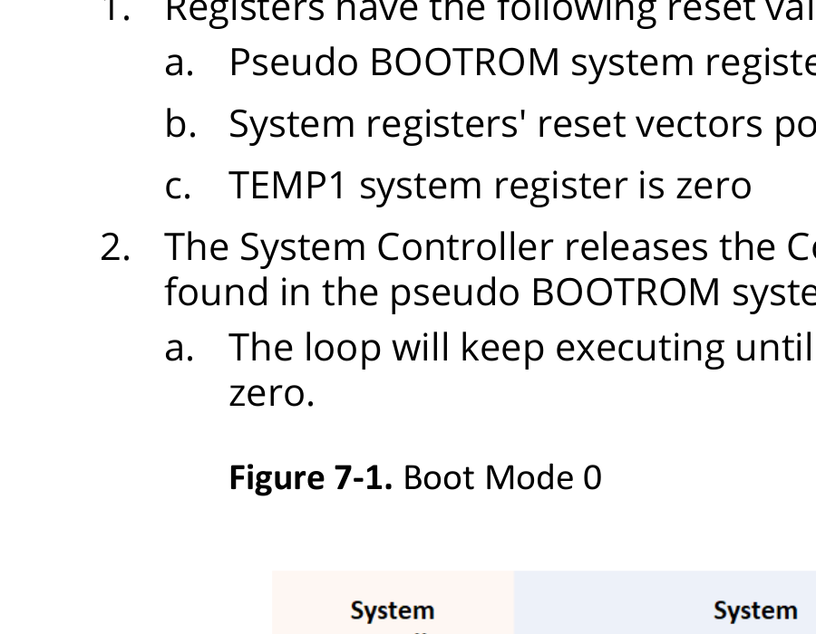
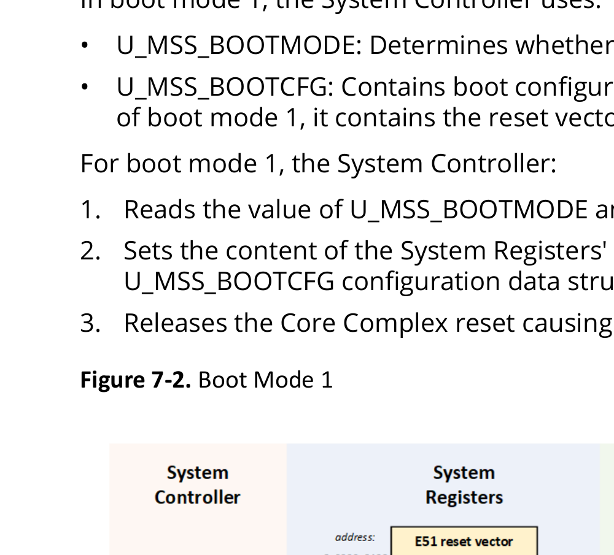
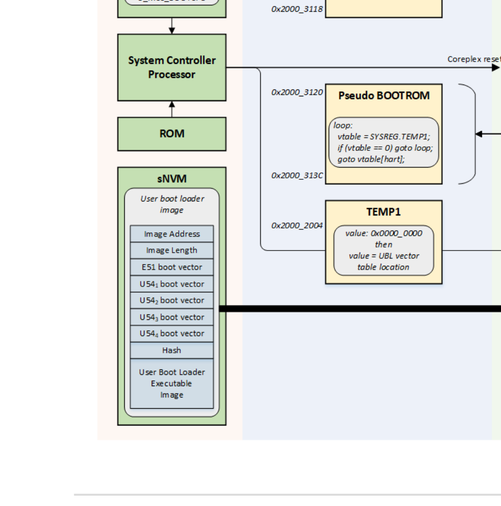
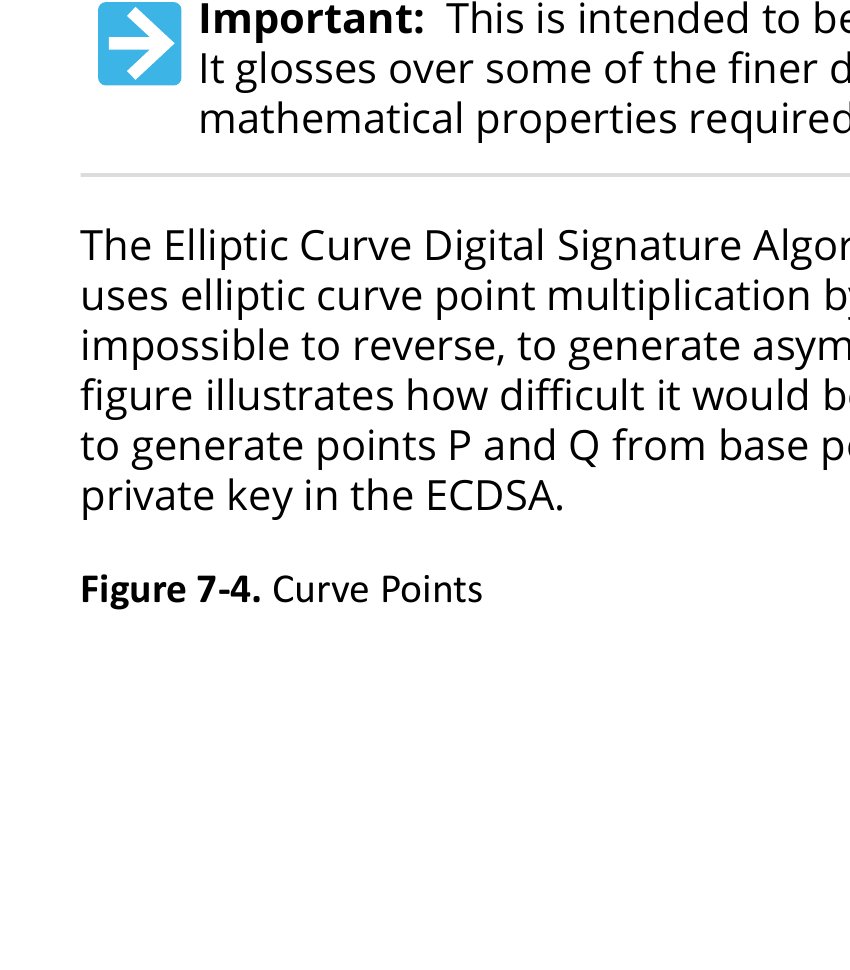
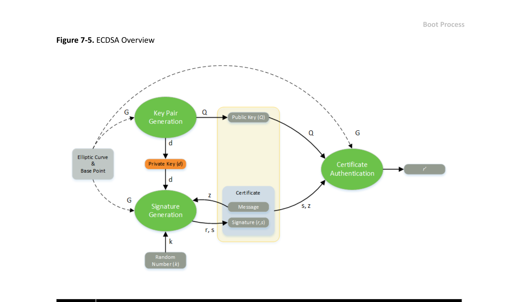
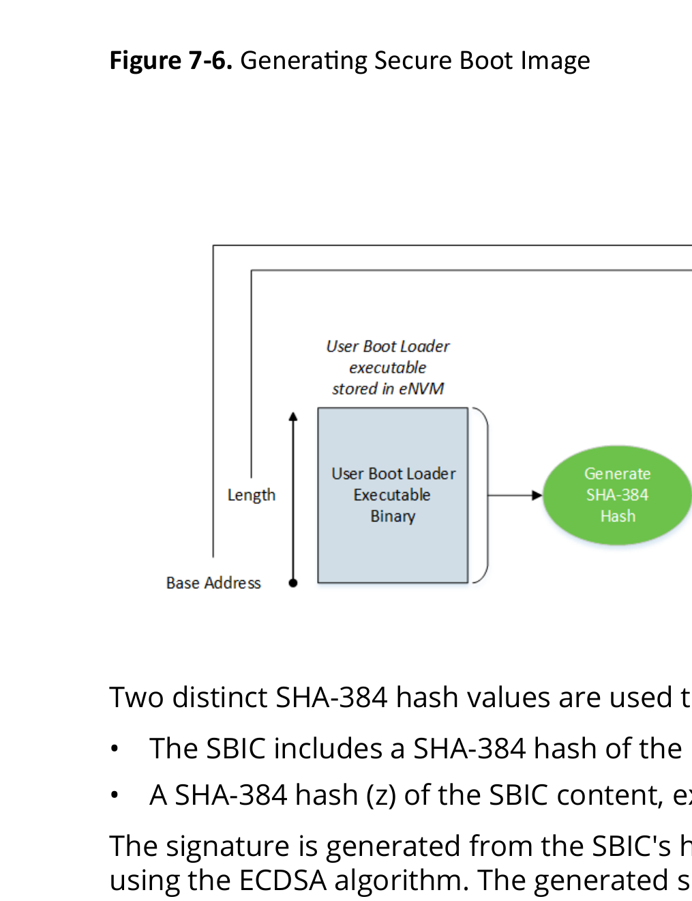
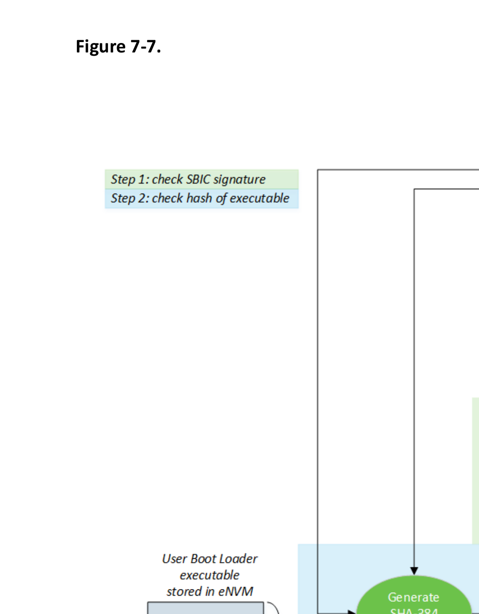

# 7. Boot Process

PolarFire SoC devices include a 128 KB eNVM and 56 KB sNVM for storing the boot code. The MSS supports the following boot modes:

- IDLE boot: In this mode, the MSS boots up from eNVM, ITIM, or L2 cache using a debugger.
- User non-secure boot: In this mode, the MSS boots directly from eNVM or Fabric LSRAMs.
- User secure boot: In this mode, the boot sequence is as follows:
  a. At system startup, the system controller copies the customer boot code from sNVM to E51 DTIM.
  b. After a successful authentication of the eNVM image, the execution jumps to eNVM.
- Factory secure boot: In this mode, the boot sequence is as follows:
  a. At system startup, the system controller copies the default factory boot code from its private memory to E51 DTIM.
  b. After a successful authentication of the eNVM image, the execution jumps to eNVM.

> Important: Secure Boot is available on all PolarFire SoC devices including “S” and “non-S” versions.

For more information about the MSS booting and configuration, see Boot Modes Fundamentals, PolarFire Family Power-Up and Resets User Guide, and PolarFire SoC Software Development and Tool Flow User Guide.

## 7.1. Boot Modes Fundamentals

This section describes the four boot modes of the PolarFire SoC MSS. The System Controller controls the start-up of the CPU Core Complex harts contained within the MSS based on the selected boot mode.

- Boot Mode 0 is used by blank devices or when debugging embedded software where code must not be executed on power-up
- Boot Mode 1 is used where the MSS harts start executing non-secured code from eNVM on power-up
- Boot Mode 2 is intended for implementing user-defined secure boot authentication
- Boot Mode 3 implements Microchip supplied factory secure boot authentication of the eNVM content

### 7.1.1. Boot Mode 0

PolarFire SoC boot mode 0 is used by blank devices or when debugging embedded software where code must not be executed on power-up. Boot mode 0 puts the MSS in a mode where all harts execute a loop waiting for the debugger to connect through JTAG or for the device to be programmed.

Blank devices use boot mode 0. Boot mode 0 can also be useful when debugging low level software through JTAG to prevent the system state from being modified between the system being powered up and the debug session starting.

#### 7.1.1.1. Boot Mode 0 Sequence

On power-up, the PolarFire SoC System Controller starts up and holds the MSS in RESET until it configures the device. It executes ROM code, which configures the Core Complex based on configuration data structures stored in its private Non-Volatile Memory (pNVM).

In boot mode 0, the System Controller only uses the U_MSS_BOOTMODE configuration item stored in pNVM to control the Core Complex boot process: The U_MSS_BOOTMODE configuration item determines whether boot mode 0, 1, 2, or 3 is used.

The boot mode 0 sequence is as follows:

1. Registers have the following reset values:
   a. Pseudo BOOTROM system register is a code loop
   b. System registers' reset vectors point to the base address of the pseudo BOOTROM
   c. TEMP1 system register is zero
2. The System Controller releases the Core Complex reset causing all harts to execute the code found in the pseudo BOOTROM system registers.
   a. The loop will keep executing until the content of the TEMP1 system register remains set to zero.

**Figure 7-1. Boot Mode 0**



b. The Core Complex harts will remain executing the pseudo BOOTROM loop until the debugger sets the hart's program counters to new values.

> Important:
> - The System Controller's pNVM content can only be modified through a programming bitstream. Neither pNVM nor sNVM content are directly accessible from the Core Complex.
> - The MSS/Core Complex default clock configuration is 80 MHz using the SCB clock source.

### 7.1.2. Boot Mode 1

PolarFire SoC boot mode 1 is used where the MSS harts start executing non-secured code from eNVM on power-up.

#### 7.1.2.1. Boot Mode 1 Sequence

On power-up, the PolarFire SoC System Controller starts up and holds the MSS in reset until it has completed configuring the device. It executes ROM code, which configures the Core Complex based on configuration data structures stored in its private Non-Volatile Memory (pNVM).

In boot mode 1, the System Controller uses:

- U_MSS_BOOTMODE: Determines whether boot mode 0, 1, 2, or 3 is used.
- U_MSS_BOOTCFG: Contains boot configuration specific to the requested boot mode. In the case of boot mode 1, it contains the reset vectors for all 5 harts.

For boot mode 1, the System Controller:

1. Reads the value of U_MSS_BOOTMODE and proceeds to the following step if boot mode is 1.
2. Sets the content of the System Registers' reset vector register from the values found in U_MSS_BOOTCFG configuration data structure held in pNVM.
3. Releases the Core Complex reset causing all harts to execute the code found in eNVM.

**Figure 7-2. Boot Mode 1**



> Important:
> - The System Controller's pNVM content can only be modified through a programming bitstream. The pNVM content is not directly accessible from the Core Complex.
> - The System Controller performs a digest check to verify the validity of the boot configuration data while copying. The system controller will set the device to boot mode 0 and also set the boot_fail tamper flag if the re-computed hash of the boot configuration data does not match the computed hash of the user bootloader.
> - The MSS/Core Complex default clock configuration is 80 MHz using the SCB clock source.
> - The System Controller's pNVM and sNVM content can only be modified through a programming bitstream. Neither pNVM nor sNVM content are directly accessible from the Core Complex.
> - The user boot loader image length held in sNVM is the number of 32 bits words of the executable unlike the boot mode 3 SBIC image length which is a byte count.

### 7.1.3. Boot Mode 2

PolarFire SoC boot mode 2 is intended for implementing user-defined secure boot authentication.

#### 7.1.3.1. Boot Mode 2 Sequence

On power-up, the PolarFire SoC System Controller starts up and holds the MSS in reset until it has completed configuring the device. It executes ROM code which configures the Core Complex based on configuration data structures stored in its private Non-Volatile Memory (pNVM).

In boot mode 2, the System Controller uses:

- U_MSS_BOOTMODE: Determines whether boot mode 0, 1, 2, or 3 is used.
- U_MSS_BOOTCFG: Contains boot configuration specific to the requested boot mode. In the case of boot mode 2, it contains the page offset at which the user boot loader image is stored in secure non volatile memory.

The boot mode 2 sequence is as follows:

1. Registers have the following reset values:
   - Pseudo BOOTROM system registers is a code loop.
   - System registers' reset vectors point to the base address of the pseudo BOOTROM
   - TEMP1 system register is zero.
2. The System Controller releases the Core Complex reset:
   - This causes all harts to execute the code found in the pseudo BOOTROM system registers.
   - The loop will keep executing until the content of the TEMP1 system register remains set to zero.
3. The System Controller copies the User Boot Loader (UBL) image from sNVM to on-chip RAM:
   - The location of the UBL image in sNVM is specified in the U_MSS_BOOTCFG
   - The target address where the UBL is to be copied within on-chip RAM is found at the top of the UBL image.
   - The length to copy is also found at the top of the UBL image
4. The System Controller sets the value of the TEMP1 System Register to the address of the UBL vector table within on-chip RAM:
   - This results in the Core Complex harts executing the user boot loader.

The user boot loader typically authenticates the content of the eNVM before executing it.

**Figure 7-3. Boot Mode 2**



### 7.1.4. Boot Mode 3

Secure boot mode 3 implements Microchip supplied factory secure boot authentication of the eNVM content. It uses the Elliptic Curve Digital Signature Algorithm (ECDSA) to authenticate the signature of a Secure Boot Image Certificate (SBIC) as part of booting the system. The PolarFire SoC RISC-V monitor and application processors will not be started and a tamper signaled to the FPGA fabric if authentication fails.

Secure boot mode 3 only supports authentication of the eNVM content. No encryption/decryption of the eNVM content is used.

#### 7.1.4.1. Elliptic Curve Digital Signature Algorithm (ECDSA) Refresher

> Important: This is intended to be a very high level algorithm overview of ECDSA. It glosses over some of the finer details and conveniently ignores some of the mathematical properties required by the various actors in this play.

The Elliptic Curve Digital Signature Algorithm (ECDSA) is used to sign and authenticate certificates. It uses elliptic curve point multiplication by a scalar number as a one-way function, which is in practice impossible to reverse, to generate asymmetric key pairs and authenticate messages. The following figure illustrates how difficult it would be to retrieve the scalar value used in the point multiplication to generate points P and Q from base point G. Such a scalar value is used, among other things, as a private key in the ECDSA.

**Figure 7-4. Curve Points**



ECDSA is used to generate a certificate containing a signature for a message using a private key. The associated public key is then used to authenticate the content of the certificate to check that the message has not been tampered with.

All ECDSA steps are performed using a publicly agreed elliptic curve and base point (G) on that curve suitable for this purpose. The base point (G) is used to generate other points on the curve through point multiplication to generate keys and check signatures.

**Figure 7-5. ECDSA Overview**



| Parameter | Description |
| --- | --- |
| curve | Agreed elliptic curve used for signing and authenticating messages. |
| G | Base point on the curve. Used to generate other points on the curve though point multiplication. The value of the base point is known to both the signing and authenticating sides. |
| d | Private key. This is a large integer used in elliptic curve scalar point multiplications. The private key is only known by the signing side. |
| Q | Public key. This is a point on the elliptic curve. It is known to both signing and authenticating sides. |
| k | Secret random scalar number (greater than zero) used to generate the certificate's signature. The value of this random number is only known by the signing side. |
| z | Hash of the message being signed. |
| r | Part of the signature included in the certificate. |
| s | Part of the signature included in the certificate used to reconstruct r'. |
| r' | Value computed from the message's hash during authentication. Should match the signature's r value for authentication to be successful. |

> Important: The NIST P-384 curve is used for boot mode 3 ECDSA.

#### 7.1.4.1.1. Key Pair Generation

The signing side generates a private/public key pair by randomly selecting a number (d) within the order of the agreed upon elliptic curve. The private key (d) is then used in an elliptic curve point multiplication with the base point (G) to produce the public key (Q): Q = d * G. The private key is a scalar number. The public key is a point on the curve.

> Important:
> For mathematical notation: This document uses "." for scalar multiplication and "*" for elliptic curve point multiplication.

#### 7.1.4.1.2. Signature Generation

The ECDSA signature is generated using a secret random number (k). This random number is only known by the signing side. It must be changed every time a new signature is generated to prevent an attacker from retrieving sufficient data to reconstruct the signing private key.

The ECDSA signature is made up of two scalar values (integers): (r) and (s). The value of (r) is the x-axis of the point on the curve computed by point multiplication of the base point (G) by the secret random number (k):

```text
(x,y) = k * G
r = x
```

The (s) part of the signature is computed using the hash (z) of the message to sign, the private key (d) and the secret random number (k):

```text
z = hash of message
s = (z + r.d)k ^-1^
```

The (s) part of the signature is designed such that it can be used to reconstruct the value of (r) using the public key (Q) and the hash of the message (z).

#### 7.1.4.1.3. Certificate Authentication

The certificate authentication is performed using the agreed curve and base point (G) by computing the signature check value (r') from the hash of the message (z), the (s) part of the signature and the public key (Q) using the following equations:

```text
u~1~ = z.s^-1^
u~2~ = r.s^-1^
(x, y) = (u~1~ * G) + (u~2~ * Q)
r' = x
```

The authentication is successful if the computed value (r') matches the (r) value of the certificate's signature.

The magic of ECDSA is the ability of the authenticating side to recompute the same point (P) on the curve using the hash of the message (z), the signature (s) and the public key as the signing side using the random number (k) and the curve's base point (G).

```text
(x,y) = (u~1~ * G) + (u~2~ * Q) = k * G
```

For a more detailed explanation of the correctness of the algorithm, see the ECDSA Wikipedia page.

#### 7.1.4.2. Generating The Secure Boot Image Certificate

The Secure Boot Image Certificate (SBIC) is constructed to contain information allowing to authenticate a User Boot Loader (UBL) located in eNVM. The SBIC contains the address in eNVM and length in bytes of the User Boot Loader alongside the hash value of the UBL's binary.

The SBIC also contains the boot vector addresses from which each PolarFire SoC RISC-V hart will execute from upon successful authentication of the certificate. It also contains options to bind itself to an individual PolarFire SoC device using the device's Device Serial Number (DSN), and the option to revoke the SBIC based on the SBIC's Version field.

**Figure 7-6. Generating Secure Boot Image**



Two distinct SHA-384 hash values are used to authenticate the User Boot Loader:

- The SBIC includes a SHA-384 hash of the User Boot Loader executable binary contained in eNVM.
- A SHA-384 hash (z) of the SBIC content, except the signature, is used to sign the certificate.

The signature is generated from the SBIC's hash (z), the user private key and a random number using the ECDSA algorithm. The generated signature is made up of two parts (r) and (s). Signature part (s) is used during the signature check to recompute the (r) part of the signature using the hash (z) of the SBIC content and the public key (Q). Authentication succeeds if the recomputed (r') matches the (r) part of the SBIC's signature.

**Note:** Private key management is not covered, currently.

#### 7.1.4.3. Boot Mode 3 Sequence: Checking The Secure Boot Image Certificate

Secure boot mode 3 uses the Elliptic Curve Digital Signature Algorithm (ECDSA) to sign a Secure Boot Image Certificate (SBIC). The SBIC is stored in eNVM alongside the executable being booted. The SBIC is authenticated at system boot time. The boot process is stopped and a tamper signal is asserted to the FPGA fabric if the SBIC authentication fails.

Two optional checks can be done by the System Controller before authenticating the SBIC:

- An optional check of the Device Serial Number (DSN) is done if the SBIC's DSN field is non-zero. This option can be used to bind the SBIC to a specific individual PolarFire SoC device.
- An optional certificate revocation check is done if the SBIC's Version field is non-zero. The value of the SBIC's Version field is compared against a revocation threshold value. The system will only boot if the SBIC's Version is greater or equal to the revocation threshold. The revocation threshold is programmed as part of a bitstream. This option can prevent old valid certificates from being used.

The actual ECDSA signature authentication is orchestrated by the system controller if the preceding optional checks were successful. The authentication is done in two steps:

- The System Controller verifies the SBIC signature using the ECDSA algorithm. It uses the (s) part of the signature, the user private key and the hash of the SBIC content to compute (r'). The SBIC is authenticated if the computed (r') value is equal to the (r) part of the SBIC's signature.
- If the SBIC signature authentication is successful, the hash of the User Boot Loader is computed and compared against the hash contained in the SBIC. The computed hash matching the SBIC's hash field indicates that the User Boot Loader has not been tampered with and can be executed.

**Figure 7-7.**



The System Controller causes the RISC-V harts to jump the addresses defined in the SBIC's boot vector fields when authentication is successful. If any authentication step fails, the System Controller signals a tamper to the FPGA fabric and the User Boot Loader is not executed.
